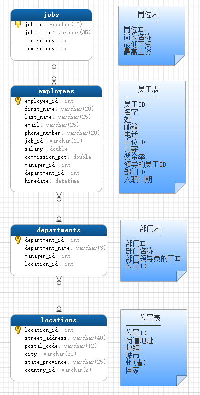

SQL语言
==

# 本次测试练习的表关系模型
[sql 文件](./sql/myemployees.sql)  
  
  


# SQL语句的3种类型
* DML数据操作语言
* DDL数据定义语言
* DCL数据控制语言

## 语法常见规则
* 单引号' 和 双引号"
    * 在标准 SQL 中，字符串使用的是单引号
    * 如果字符串本身也包括单引号，则使用两个单引号（注意，不是双引号，字符串中的双引号不需要另外转义）
        ```text
        ''语言''
        ```
    * MySQL对 SQL 的扩展，允许使用单引号和双引号两种

* 反引号 \`
    ```text
    为了区分MySQL的保留字与普通字符，可以包裹字段、表名、数据库等
    ```
    
    ```mysql
    create database desc; -- 报错 
    create database `desc`; -- 成功
    ```
    **一般我们建表时都会将表名，库名都加上反引号来保证语句的执行度。**

* 库名、表名、字段命名规则
    ```text
    不能包含-，建议只包括小写字母、大写字母、数字、_，且以字母开头

    经测试，特殊字符$也可以，以何种类型字符开头没做要求
    ```


# DQL数据查询语言
```text
Data Query Language
DML数据处理操作语言中的数据查询操作，主要用于查询表数据
```

## 基础查询
<details>
<summary>基础查询</summary>

* 语法
    ```text
    select 查询列表 from 表名;
    
    SELECT *|{[DISTINCT] column|expression [alias],...}
    FROM table;
    
    * | 表示或
    * { }里面有多种情况，使用其中的一种
    * [] 此项为可选
    * 查询列表：表中的字段、常量、表达式、函数
    * 查询的结果是一个虚拟的表格
    ```

* 查询表中的单个字段
    ```mysql
    USE myemployees;
    SELECT salary FROM employees;
    ```

* 查询表中的多个字段
    >SELECT employee_id, first_name, last_name FROM employees;


* 查询表中的所有字段
    * 方式1  
        ```mysql
        SELECT
            `employee_id`,
            `first_name`,
            `last_name`,
            `email`,
            `phone_number`,
            `job_id`,
            `salary`,
            `commission_pct`,
            `manager_id`,
            `department_id`,
            `hiredate`
        FROM
            employees;
        ```
    * 方式2
        >SELECT * FROM employees;


* 查询常量值
    ```mysql
    SELECT 200;
    SELECT '使命必达';
    ```

* 查询表达式
    ```
    支持常规的算术运算符
    + - * / %
    ```
    
    ```mysql
    SELECT 3600 + 24;
    SELECT 'a' + 'baaaaaa';
    ```


* 查询函数
    ```text
    函数与方法的类似，分无参函数、有参函数
    ```

    ```mysql
    SELECT VERSION(); -- 查看mysql版本
    SELECT DATABASE(); -- 查看当前所在的数据库
    SELECT USER(); -- 查看当前连接使用的用户
    ```


* 起别名
    ```text
    功能：相当于对一个字段、函数、一个子句赋值给一个变量(别名)，
    这个变量可以在其他地方引用
    
    * 便于理解
    * 如果查询的字段中有重名的情况，可使用不同别名类区别
    
    注意：
    当别名中有特殊字符（如含空格），别名需要用双引号包起来
    ```

    * 方式1：使用AS 别名
        ```
        SELECT '建国70周年' AS 信息;
        SELECT last_name AS 姓, first_name AS 姓  FROM employees;
        ```
    * 方式2：使用空格 别名
        ```mysql
        SELECT last_name 姓, first_name 姓  FROM employees;
        ```

    * 示例：查询salary，显示结果为out put
        ```text
        SELECT salary AS "out put" FROM employees;
        ```

* DISTINCT去重
    ```mysql
    -- 示例：查询employees表中涉及到的所有部门编号
    SELECT DISTINCT department_id FROM employees;
    ```

* +的作用
    ```text
    mysql中+仅仅是加法运算符
    
    * 当操作数中有字符型时，试图将字符型数值转换成数值型，
    如果转换成功，则转换后值为字符对应的数值，
    如果转换失败，则转换后值0，
    最后用转换后的数值进行做加法运算
    
    注意：NULL与任何数做+运算，结果都为NULL
    
    java中的+作用
    * 运算符：连个操作数的类型都为数值类型
    * 连接符：只要有一个操作数的类型为字符串
    ```

    ```mysql
    SELECT 10 + 9;
    SELECT '90' + 10; -- 结果：100
    # 当操作数为字符型是，试图将字符型数值转换成数值型，如果转换成功，用转换后的数值进行做加法运算
    
    SELECT '10' + '20'; -- 结果：30
    SELECT 'coco' + 123; -- 结果：123
    -- 字符型转换成数值型失败时，其转换值为0
    
    SELECT 'aa' + 'b'; -- 结果: 0
    SELECT NULL + 10; -- 结果：NULL
    ```

</details>

## 条件查询
<details>
<summary>条件查询</summary>

* 语法
    ```text
    select 查询列表
    from 表名
    where 筛选条件;
    ```

### 条件查询分类
* 按条件表达式筛选  

    **比较运算符**
    ```text
    >  <  =  <>  !=  >=  <=  <=> 安全等于
    ```

* 按逻辑表达式筛选
    ```text
    逻辑运算符
    标准: AND    OR    NOT
    兼容: &&     ||    ! 
    ```

* 模糊查询
    ```text
    like '匹配模式'
    between A and B
    in (set)
    is null
    is not null
    ```

### 按条件表达式筛选
* 示例：查询工资>12000的员工信息
    ```mysql
    SELECT
        *
    FROM
        employees
    WHERE salary > 12000;
    ```

* 案例2：查询部门编号不等于90号的员工名和部门编号
    ```mysql
    SELECT last_name, department_id
    FROM employees
    WHERE department_id <> 90;

    -- 
    SELECT last_name, department_id
    FROM employees
    WHERE department_id != 90;
    ```

### 按逻辑表达式筛选
* 案例1：查询工资在10000到20000之间的员工名、工资以及奖金
    ```mysql
    SELECT
        last_name, salary, commission_pct
    FROM
        employees
    WHERE salary >= 10000
        AND salary <= 20000;
    ```

* 案例2：查询部门编号不是在90到110之间，或者工资高于15000的员工信息
    ```mysql
    SELECT * 
    FROM employees
    WHERE NOT (department_id >= 90 AND department_id <= 110)
        OR salary > 15000;
        
    --
    SELECT * 
    FROM employees
    WHERE !(department_id >= 90 && department_id <= 110)
        || salary > 15000;
    ```

### 模糊查询
```
like '匹配模式'

betwenn A AND B
in (set)
is null
is not null
```
* 通配符
    ```text 
    %：0个或多个任意字符
    
    _: 1个任意字符
    ```
* like '匹配模式'  
一般和通配符搭配使用

    * 案例1：查询员工名中包含字符a的员工信息
        ```mysql
        SELECT * 
        FROM employees
        WHERE first_name LIKE '%a%';
        ```

    * 案例2：查询员工名中第三个字符为e，第五个字符为a的员工名和工资
        ```mysql
        SELECT first_name 名, CONCAT(first_name, ' ',last_name) 姓名,salary
        FROM employees
        WHERE first_name LIKE '__e_a%';
        ```

    * 案例3：查询员工姓中第二个字符为_的员工名
        ```mysql
        -- ESCAPE '标识符' 显式指定转义，建议使用这种
        SELECT last_name 
        FROM employees
        WHERE last_name LIKE '_$_%' ESCAPE '$'; -- 指定$右边第一个字符为转义的，$可以用其他字符来标识
        
        
        SELECT last_name 
        FROM employees
        WHERE last_name LIKE '_\_%'; -- 这种转义方式也可以
        ```
    * where子句中使用别名注意事项  
    示例：选择姓名中有字母 a 和 e 的员工姓名
        ```text
        sql是在where后order by前加别名，即生成结果集后加别名，
        where是在生成结果集前的操作，
        order by是生成结果集后的操作，
        因为where要生成结果集，而order by是对结果集的操作。
        如果非要用别名，那么只能用派生表，即先生成别名再where
        
        -- 在where中保用别名会报错，错误代码： 1054, UNKNOWN COLUMN 'fullname' IN 'where clause'
        SELECT CONCAT(first_name, ' ', last_name) AS fullname
        FROM employees
        WHERE fullname LIKE '%a%' AND first_name LIKE '%e%';
        
        -- 正确写法
        SELECT CONCAT(first_name, ' ', last_name) AS 姓名
        FROM employees
        WHERE CONCAT(first_name, ' ', last_name) LIKE '%a%' AND first_name LIKE '%e%';
        ```
* between A and B
    ```
    字段或变量的取值范围在[A, B]闭区间
    A,B都为数值类型
    ```
    * 案例1：查询员工编号在100到120之间的员工信息
        ```mysql
        SELECT * 
        FROM employees
        WHERE employee_id >= 100 AND employee_id <= 120;
        
        -- 与上面的写法等价
        SELECT * 
        FROM employees
        WHERE employee_id BETWEEN 100 AND 120;
        ```


* in (set)
    ```
    判断某字段的值是否在集合set中
    如：in (ele1, ele2, ...)
    注意：
    set表示方式，ele1, ele2,...
    * set集合中的元素类型必须一致或兼容
    * set集合中的元素不支持通配符
    * set里的元素建议不重复
    ```

    * 案例：查询员工的工种编号是 IT_PROG、AD_VP、AD_PRES中的员工名和工种编号
        ```mysql
        SELECT job_id, first_name
        FROM employees
        WHERE job_id = 'IT_PROG'
            OR job_id = 'AD_VP'
            OR job_id = 'AD_PRES';
        
        --
        SELECT job_id, first_name
        FROM employees
        WHERE job_id IN ('IT_PROG', 'AD_VP', 'AD_PRES');
        ```


* is null
    ```text
    =、<>、!=不能判断NULL值
    is null、is not null 可以判断null值
    
    
    注意：没有以下写法
    NOT (IS NULL)
    NOT IS NULL
    
    IS 只能判断NULL 或 NOT NULL
    ```

    * 案例1：查询没有奖金的员工名和奖金率
        ```mysql
        SELECT first_name, commission_pct
        FROM employees 
        WHERE commission_pct IS NULL;
        
        --
        SELECT first_name, commission_pct
        FROM employees 
        WHERE commission_pct IS NOT NULL;
        ```


* <=>安全等于
    ```text
    与=功能类似，但可以用于判断NULL值，不能与NOT NULL组合
    =无法判断NULL值，也不能与NOT NULL组合
    <=> (NOT NULL)  结果等效于 <=> NULL
    ```

    * 案例1：查询没有奖金的员工名和奖金率
        ```
        SELECT first_name, commission_pct
        FROM employees 
        WHERE commission_pct <=> NULL;
        ```

    * 案例2：查询工资为12000的员工信息
        ```mysql
        SELECT * 
        FROM employees 
        WHERE salary <=> 12000;
        ```

* IS NULL与<=>
    ```text
    IS NULL: 只能判断NULL值，可读性较高，建议使用
    <=>: 既可以判断NULL值，也可以判断其他类型的值，可读性低
    ```

</details>

## 排序查询
<details>
<summary>排序查询</summary>

### 排序查询语法
```text
select 查询列表
from 表名
[where 筛选条件]
order by 排序列表 [asc |desc]


特点：
asc: 升序
desc: 降序
不指定排序方式默认为asc升序

* order by 子句可以支持 单个字段、别名、表达式、函数、多个字段
* order by 子句放在查询语句的最后面，除了limit子句
```

* 按单个字段排序
    ```mysql
    SELECT * 
    FROM employees
    ORDER BY salary DESC;
    ```

* 筛选条件过滤后再排序

    **案例：查询部门编号>=90的员工信息，并按员工编号降序**
    ```mysql
    SELECT * 
    FROM employees
    WHERE department_id >= 90
    ORDER BY department_id DESC;
    ```


* 按表达式排序

    **案例：查询员工信息 按年薪降序**
    ```mysql
    SELECT
        *, (
            salary * 12 * (1 + IFNULL(commission_pct, 0))
        ) AS 年薪
    FROM
        employees
    ORDER BY (salary * 12 * (1 + IFNULL(commission_pct, 0))) DESC;
    ```

* 按别名排序

    **案例：查询员工信息 按年薪升序**
    ```mysql
    SELECT
        *, (
            salary * 12 * (1 + IFNULL(commission_pct, 0))
        ) AS 年薪
    FROM
        employees
    ORDER BY 年薪 DESC;
    ```

* 按函数排序
    **案例：查询员工名，并且按名字的长度降序**
    ```mysql
    SELECT first_name, LENGTH(first_name) AS 名字长度
    FROM employees
    ORDER BY LENGTH(first_name) DESC;
    ```


* 按多个字段排序
    ```text
    按多个字段排序时，
    第一个字段为主排序关键字，后面的为次排序关键字
    先按第一个字段指定的排序方式排序，
    当按第一个字段排序好后，第一个字段相同的记录再按第二个字段排序方式排序，
    依此类推
    ```

    **案例：查询员工信息，要求先按工资降序，再按employee_id升序**
    ```mysql
    SELECT *
    FROM employees
    ORDER BY salary DESC, employee_id ASC;
    ```
</details>

## 常见函数
<details>
<summary>常见函数</summary>

### 函数概念
类似于java中的方法，将一组逻辑语句封装在方法体中，对外暴露方法名

### 函数分类
* 单行函数
```text
这里的单行，指输入一行的数据，返回一个值。

如 concat(str1, str2, ...), length(str), ifnull(expr1, expr2)
```
* 分组函数
```text
分组值，指输入一组(多行)的数据，返回一个值。

功能：用于统计，也称统计函数、聚合函数、组函数
如SUM(expr)、AVG(expr)、MAX(expr)、MIN(expr)、COUNT(expr)
```

### 单行函数
* 字符函数
    ```text
    lenght(str) 获取字符串字节长度(在utf8字符集中一个汉字占3个字节, gbk为2字节)
    CONCAT(str1,str2,...) 拼接字符串
    UPPER(str)字符串转大写
    LOWER(str)字符串转小写
    SUBSTR(str,pos)、SUBSTRING(str,pos)
    SUBSTR(str,pos,len)、SUBSTRING(str,pos, len) 截取子字符串
    INSTR(str,substr) 返回子串第一次出现的首地址索引，如果找不到返回0
    TRIM(str) 去掉字符串str首尾的空格
    TRIM(remstr FROM str) 从字符串str中去掉首尾指定的字符remstr
    LPAD(str,len,padstr) 用指定的字符padstr左填充str，保证填充后的字符串长度为len，并返回充后的字符串
    RPAD(str,len,padstr) 用指定的字符padstr右填充str，保证填充后的字符串长度为len，并返回充后的字符串
    REPLACE(str,from_str,to_str) 把字符串str中所有的from_str字符替换成字符to_str
    ```
* 数学函数
    ```text
    ROUND(X) 数X的绝对值做四舍五入运算，精确到个位，符号不变
    ROUND(X,D) 小数X的绝对值做四舍五入运算，精确到第D位小数，符号不变
    CEIL(X) 向上取整，返回>= X的最小整数
    FLOOR(X) 向下取整，返回 <= X的最大整数
    TRUNCATE(X,D) 截断数X小数点后第D位之后所有小数，直接截断(填补0)，不做四舍五入
    MOD(N,M) 取模运算，求余数，数N模以数M
    ```
* 日期、时间函数
    ````text
    NOW()返回服务器当前 日期时间，属于date,也属于time
    CURDATE() 返回服务期系统当前日期，不包括时间
    CURTIME() 返回服务期系统当前时间，不包括日期
    从指定的日期或时间对象中获取年、月、日、时、分、秒，月份名称
    YEAR(date) 从日期date中获取年
    MONTH(date) 从日期date中获取月
    DAY(date) 从日期date中获取日
    HOUR(time) 从时间time中获取时
    MINUTE(time) 从时间time中获取分
    SECOND(time) 从时间time中获取秒
    MONTHNAME(date) 从日期date中获取月份名称
    STR_TO_DATE(str,format) 根据日期格式format将字符创str转成日期，并返回
    DATE_FORMAT(date,format) 格式化date对象，根据日期格式format将日期date转换成字符串，并返回
    DATEDIFF(expr1,expr2) 计算expr1, expr2的天数差值,日期时间expr1 - 日期时间expr2的天数
    ````
* 其他函数
    ```text
    SELECT VERSION(); 查看服务端mysql版本
    SELECT DATABASE(); 查看当前连接的库
    SELECT USER(); 查看当前使用的连接用户
    ```
* 控制函数
    ```text
           IF(expr1,expr2,expr3) 如果逻辑表达式expr1为true,则返回表达式expr2，否则返回表达式expr3
           case用于字段或表达式值枚举处理
           case用于字段或表达式值范围枚举处理
           ```


#### 字符函数
* lenght(str) 获取字符串字节长度(在utf8字符集中一个汉字占3个字节, gbk为2字节)
    ```mysql
    SELECT LENGTH('trip');
    SELECT LENGTH('神功盖世'); -- 长度为：12
    
    SHOW VARIABLES LIKE '%char%'; -- 查看服务端使用的字符集
    ```

* CONCAT(str1,str2,...)拼接字符串
    ```mysql
    SELECT CONCAT(first_name, ' ', last_name) AS 姓名
    FROM employees;
    ```

* UPPER(str)字符串转大写
    >SELECT UPPER('abcdef');

* LOWER(str)字符串转小写
    >SELECT LOWER('Guang Dong');

    **示例：将姓变大写，名变小写，然后拼接**
    ```mysql
    SELECT CONCAT(UPPER(first_name), ' ',LOWER(last_name)) 姓名
    FROM employees
    ```

* 截取子字符串(SUBSTR、SUBSTRING)
    ```text
    字符串的索引从1开始计数
    
    SUBSTR(str,pos) 截取指定str字符串从第pos个字符开始到结尾的子字符串
    SUBSTR(str,pos,len) 截取str字符串从第pos个字符开始，长度为len的子字符串的子字符串
    SUBSTR(str FROM pos) 与SUBSTR(str,pos)功能相同，截取str字符串从第pos个字符开始到结尾的子字符串
    SUBSTR(str FROM pos FOR len) 与SUBSTR(str,pos,len)功能相同，截取str字符串从第pos个字符开始，长度为len的子字符串
    
    SUBSTRING(str,pos) 对应SUBSTR(str,pos)
    SUBSTRING(str,pos,len) 对应SUBSTR(str,pos,len)
    SUBSTRING(str FROM pos) 对应SUBSTR(str FROM pos)
    SUBSTRING(str FROM pos FOR len) 对应SUBSTR(str FROM pos FOR len)
    ```

    **截取从指定索引处后面所有字符**
    >SELECT SUBSTR('习近平致信祝贺大庆油田发现60周年全文', 4) out_put; -- 致信祝贺大庆油田发现60周年全文

    **截取从指定索引处指定字符长度的字符**
    ```mysql
    SELECT SUBSTR('习近平致信祝贺大庆油田发现60周年全文', 4, 2) out_put; -- 致信
    SELECT SUBSTR('abcdef' FROM 2); -- bcdef
    SELECT SUBSTR('abcdef' FROM 2 FOR 3); -- bcd
    
    SELECT SUBSTRING('习近平致信祝贺大庆油田发现60周年全文', 4);
    ```

    **案例：姓名中首字符大写，其他字符小写然后用_拼接，显示出来**
    ```mysql
    SELECT
        CONCAT (
            UPPER(SUBSTR(first_name, 1, 1)),
            LOWER(SUBSTR(first_name, 2)),
            ' ',
            LOWER(last_name)
        )
    FROM
        employees;
      
    -- 方法2
    SELECT
        CONCAT (UPPER(SUBSTR(fname, 1, 1)), LOWER(SUBSTR(fname, 2))) AS 姓名
    FROM
        (SELECT CONCAT (first_name, ' ', last_name) AS fname FROM employees) employees;
    ```

* INSTR(str,substr) 返回子串第一次出现的首地址索引，如果找不到返回0
    ```text
    SQL中，0表示false, 1表示true
    ```
    
    >SELECT INSTR('上海自来水来自海上,山西运煤车煤运西山,自来水', '自来水'); -- 结果：3

* TRIM(str) 去掉字符串str首尾的空格
* TRIM(remstr FROM str) 从字符串str中去掉首尾指定的字符remstr
    ```mysql
    SELECT LENGTH(TRIM('    Good    ')); -- 4
    SELECT TRIM('e' FROM 'eeeeeeee张eee教主eeeeeeeeeeeeeeeeeee'); -- 张eee教主
    ```

* LPAD(str,len,padstr) 用指定的字符padstr左填充str，保证填充后的字符串长度为len，并返回充后的字符串
    ```text
    当len小于str的长度时，会截断右边多余的字符 (保留左边的)
    ```

    ```mysql
    SELECT LPAD('2', 3,'0'); -- '002'
    
    SELECT LPAD('中国海军', 2,'c'); -- '中国'
    ```

* RPAD(str,len,padstr) 用指定的字符padstr右填充str，保证填充后的字符串长度为len，并返回充后的字符串
    ```text
    当len小于str的长度时，会截断右边多余的字符 (保留左边的)
    ```
    
    ```mysql
    SELECT RPAD('中国海军', 12,'c'); -- 中国海军cccccccc
    SELECT RPAD('中国海军', 2,'c'); -- '中国'
    ```

* REPLACE(str,from_str,to_str) 把字符串str中所有的from_str字符替换成字符to_str
    >SELECT REPLACE('周芷若周芷若周芷若周芷若张无忌爱上了周芷若', '周芷若', '赵敏');

#### 数学函数
* ROUND数值做四舍五入运算
    ```text
    ROUND(X) 数X的绝对值做四舍五入运算，精确到个位，符号不变
    ROUND(X,D) 小数X的绝对值做四舍五入运算，精确到第D位小数，符号不变
    ```
    
    ```mysql
    SELECT ROUND(1.55); -- 2
    SELECT ROUND(-1.55); -- 结果：-2
    SELECT ROUND(-3.1415, 3); -- 3.142
    ```

* CEIL(X) 向上取整，返回>= X的最小整数
    ```mysql
    SELECT CEIL(2.11); -- 3
    SELECT CEIL(-2.11); -- -2
    ```

* FLOOR(X) 向下取整，返回 <= X的最大整数
    ```mysql
    SELECT FLOOR(3.11); -- 3
    SELECT FLOOR(-3.11); -- -4
    ```

* TRUNCATE(X,D) 截断数X小数点后第D位之后所有小数，直接截断(填补0)，不做四舍五入
    ```text
    D必须是整数，
    D为0：表示小数点后所以小数截断不要
    D为负数，表示小数点左边D位内的都取0
    ```
    
    ```mysql
    SELECT TRUNCATE(3.333333, 1); -- 3.3
    SELECT TRUNCATE(3.333333, 0); -- 3
    SELECT TRUNCATE(33, 1); -- 33
    SELECT TRUNCATE(3333, -2); -- 3300
    ```

* MOD(N,M) 取模运算，求余数，数N模以数M
    ```text
    MOD(N,M) ==> N - N/M * M
    ```
    
    ```mysql
    SELECT MOD(10, 3); -- 1
    SELECT MOD(10, -3); -- 1
    SELECT MOD(-10, -3); -- -1
    SELECT MOD(-10, 3); -- -1
    SELECT 10 % 3;
    ```
    
* RAND() 返回一个范围在(0.0, 1.0)里的随机小数
    ```mysql
    SELECT RAND();
    ```
    
#### 日期、时间函数
* NOW()返回服务器当前 日期时间，属于date,也属于time
    >SELECT NOW(); -- 2019-09-27 10:31:58

* CURDATE() 返回服务期系统当前日期，不包括时间
    >SELECT CURDATE(); -- 2019-09-27

* CURTIME() 返回服务期系统当前时间，不包括日期
    >SELECT CURTIME(); -- 10:34:07

* 从指定的日期或时间对象中获取年、月、日、时、分、秒，月份名称
    ```text
    now() 获取的日期时间对象，属于date和time类型
    
    YEAR(date) 从日期date中获取年
    MONTH(date) 从日期date中获取月
    DAY(date) 从日期date中获取日
    HOUR(time) 从时间time中获取时
    MINUTE(time) 从时间time中获取分
    SECOND(time) 从时间time中获取秒
    MONTHNAME(date) 从日期date中获取月份名称
    DATEDIFF(expr1,expr2) 日期时间expr1 - 日期时间expr2的天数
    ```
    
    ```mysql
    SET @now=NOW(); -- 设置局部变量，引用变量 @变量名
    SELECT @now;
    
    SELECT YEAR(@now);
    SELECT YEAR(NOW());
    SELECT YEAR('2008-01-10'); -- 2008
    SELECT YEAR('2008/01/10'); -- 2008
    SELECT YEAR('2008.1.10'); -- 2008
    SELECT YEAR(hiredate) AS 年 FROM employees;
    
    --
    SELECT MONTH(NOW()); 
    SELECT MONTH('2019-06-01');
    
    --
    SELECT MONTHNAME(@now); -- September
    
    -- 
    SELECT DAY(NOW());
    
    --
    SELECT HOUR(NOW());
    SELECT HOUR(CURTIME());
    
    --
    SELECT MINUTE(NOW());
    
    --
    SELECT SECOND(NOW());
    SELECT SECOND('12:00:13');
    ```

##### format匹配模式字母定义
格式 |定义 
:--- |:---
%Y |4位的年份
%y |2位的年份
%m |2位的月份(01, 02...11, 12)
%c |自然月份(1, 2...11, 12)
%d |2位的日(01, 02...31)
%H |2位的小时(24小时制)
%h |小时(12小时制)
%i |2位的分钟(01, 02...59)
%s |2位的秒(01, 02...59)


* STR_TO_DATE(str,format) 根据日期格式format将字符创str转成日期，并返回
    >SELECT STR_TO_DATE('1999-12-31', '%Y-%c-%d');

    **示例：查询入职日期为1992-4-3的员工信息**
    ```mysql
    SELECT * 
    FROM employees
    WHERE hiredate = '1992-4-3';
    --
    SELECT * FROM employees
    WHERE hiredate = STR_TO_DATE('4-3 1992', '%c-%d %Y');
    ```

* DATE_FORMAT(date,format) 格式化date对象，根据日期格式format将日期date转换成字符串，并返回
    >SELECT DATE_FORMAT(NOW(), '%Y年%m月%d日'); -- 2019年09月27日

    **查询有奖金的员工名和入职日期(xx月/xx日 xx年)**
    ```mysql
    SELECT first_name, DATE_FORMAT(hiredate, '%m月/%d日 %y年') AS 入职日期
    FROM employees
    WHERE commission_pct IS NOT NULL;
    ```
    
#### 其他函数
* SELECT VERSION(); 查看服务端mysql版本
* SELECT DATABASE(); 查看当前连接的库
* SELECT USER(); 查看当前使用的连接用户

    ```mysql
    SELECT VERSION();
    SELECT DATABASE();
    SELECT USER(); -- root@localhost
    ```

#### 流程分支控制函数
* IF(expr1,expr2,expr3) 如果逻辑表达式expr1为true,则返回表达式expr2，否则返回表达式expr3
    ```text
    功能类似三目运算：expr1 ? expr2 : expr3
    
    expr2,expr3的类型要求相同或能兼容
    ```

    ```mysql
    SELECT IF(2 < 4, '小', '大'); -- 小
    
    SELECT 
        first_name,
        commission_pct,
        IF(commission_pct IS NULL, '无', '有') AS 是否有奖金
    FROM employees;
    ```

* IFNULL(expr1,expr2) 如果表达式expr1为null，则返回expr2, 否则返回expr1
    ```mysql
    SELECT IFNULL(commission_pct, '无奖金')
    FROM employees;
    ```

* case用于字段或表达式值枚举处理
    ```text
    
    功能类似java中的case
    switch(变量或表达式或枚举类) {
        case 常量1:
            语句1;
            break;
        case 常量2:
            语句2;
            break;
        ...
        default:
            语句n;
            break;
    }
    
    
    mysql中的case:
    case 字段或表达式
    when 常量1 then
        返回的值1或语句1
    when 常量2 then
        返回的值2或语句2
    ...
    [else 返回的值n或语句n]
    end
    
    ```

    **案例：查询员工的工资，要求如下：**
    ```text
    部门号=30，显示的工资为1.1倍
    部门号=40，显示的工资为1.2倍
    部门号=50，显示的工资为1.3倍
    其他部门，显示的工资为原工资
    ```

    ```mysql
    SELECT
        department_id,
        salary 原工资,
        CASE department_id
    WHEN 30 THEN
        salary * 1.1
    WHEN 40 THEN
        salary * 1.2
    WHEN 50 THEN
        salary * 1.3
    ELSE salary
    END AS 新工资
    FROM employees;
    ```

* case用于字段或表达式值范围枚举处理
    ```text
    功能类似java中的多重if：
    
    if(逻辑表达式1) {
        语句1;
    } else if(逻辑表达式2) {
        语句2;
    } 
    ...
    else {
        语句n;
    }
    
    
    mysql中:
    case
    when 逻辑表达式1 then 返回的值1或语句1
    when 逻辑表达式2 then 返回的值2或语句2
    ...
    [else 默认返回的值n或语句n]
    end
    ```

    **案例：查询员工的工资的情况**
    ```text
    如果工资>20000,显示A级别
    如果工资>15000,显示B级别
    如果工资>10000，显示C级别
    否则，显示D级别
    ```

    ```mysql
    SELECT 
        salary,
        CASE
    WHEN salary > 20000 THEN
        'A'
    WHEN salary > 15000 THEN
        'B'
    WHEN salary > 10000 THEN
        'C'
    ELSE 'D'
    END AS 级别
    FROM employees;
    ```
</details>

## 分组函数
<details>
<summary>分组函数</summary>

### 分组函数概念与功能
```text
功能：用于统计，有称为聚合函数、统计函数、组函数
输入多个值（多行的值），最后返回一个值，不能与返回多行的组合使用
```

###  分组函数概览与总结
```text
SUM(expr) 求和，
    当统计的数据为空时(没有一条记录)，返回值为NULL
SUM([DISTINCT] expr) 去重后求和

AVG([DISTINCT] expr) 求平均值(或去重后求平均值)，
    当统计的数据为空时(没有一条记录)，返回值为NULL
    
MAX(expr) 求最大值, 
    当统计的数据为空时(没有一条记录)，返回值为NULL
MAX([DISTINCT] expr) 去重后求最大值

MIN(expr) 求最小值，
    当统计的数据为空时(没有一条记录)，返回值为NULL
MIN([DISTINCT] expr) 去重后求最小值

COUNT(expr) 计算非null值的行个数，
    当统计的数据为空时(没有一条记录)，返回值为0
COUNT(DISTINCT expr,[expr...]) 返回列出的字段不全为NULL值的行，再去重的数目, 可以写多个字段，expr不能为*
```

* 特点
    * sum, avg一般用于处理数值型
    * 以上分组函数都忽略所提供字段全为null的记录
    * count(expr)一般用于统计行数
    * 与分组函数一起查询的字段要求是group by后的字段


* 分组函数基本使用
    ```mysql
    SELECT SUM(salary) FROM employees;
    SELECT AVG(salary) FROM employees;
    SELECT MAX(salary) FROM employees;
    SELECT MIN(salary) FROM employees;
    SELECT COUNT(salary) FROM employees;
    
    SELECT
        SUM(salary) AS 和, AVG(salary) 平均值, MAX(salary) 最大值, MIN(salary) 最小值, COUNT(salary) 计数
    FROM
        employees;
      
    --
    SELECT
        SUM(salary) AS 和, AVG(salary) 平均值, MAX(salary) 最大值, MIN(salary) 最小值, COUNT(salary) 计数
    FROM
        employees
    WHERE salary < 0; -- NULL, NULL, NULL, NULL, 0
  
    ```

* 参数支持的类型
    ```mysql
    SELECT SUM(last_name), AVG(last_name) FROM employees; -- 结果：0， 0，结论SUM(expr), AVG(expr)不支持字符型
    SELECT SUM(hiredate), AVG(hiredate) FROM employees; -- 日期、时间无意义
    ```
    
    * max(expr), min(expr)支持可排序的类型，如字符、数值、日期时间等
        ```mysql
        SELECT MAX(last_name), MIN(last_name) FROM employees; -- 支持字符
        SELECT MAX(hiredate), MIN(hiredate) FROM employees; -- 支持日期、时间
        
        SELECT COUNT(commission_pct) FROM employees; -- 35, 值为null的不计算
        SELECT COUNT(last_name) FROM employees;
        SELECT COUNT(*) FROM employees;
        ```

* 忽略所选字段全为NULL值的记录
    ```mysql
    SELECT SUM(commission_pct), AVG(commission_pct), SUM(commission_pct)/35, SUM(commission_pct)/107  FROM employees;
    
    SELECT MAX(commission_pct), MIN(commission_pct) FROM employees;
    
    SELECT COUNT(commission_pct) FROM employees; -- 35
    SELECT commission_pct FROM employees;
    ```

* 都可以和distinct去重搭配
    ```mysql
    SELECT SUM(DISTINCT salary), SUM(salary) FROM employees;
    
    SELECT COUNT(DISTINCT salary), COUNT(salary) FROM employees;
    ```

* count函数详细介绍
    ```mysql
    SELECT COUNT(salary) FROM employees;
    
    SELECT COUNT(*) FROM employees;
    
    SELECT COUNT(1) FROM employees; -- 相当于SELECT *, 1 FROM employees;的每行后加一列值为1，然后统计新加这列值不为null的行数
    
    SELECT COUNT(NULL) FROM employees; -- 0
    ```

    * count(表达式)
    ```mysql
    SELECT COUNT(DISTINCT last_name, department_id)
    FROM employees;
    
    SELECT (salary = 24000) FROM employees;
    
    SELECT COUNT(DISTINCT salary = 24000) FROM employees; -- 结果：2，因为salary要么等于24000，要么不等于
    ```

    * 效率比较
        ```text
        MYISAM存储引擎下，COUNT(*)的效率高，有一个值专门统计行数，直接返回该值
        INNODB存储引擎下，COUNT(*)和COUNT(1)的效率差不多，比COUNT(字段)要高一些
        ```

* 分组函数与字段查询有限制
    ```text
    因为分组函数值返回一个值，不能与多行的结果的组合使用
    ```
    
    **错误写法**
    ```mysql
    SELECT AVG(salary), first_name FROM employees; -- 错误
    ```
</details>

## 分组查询
<details>
<summary>分组查询</summary>

### 分组查询语法
```text
语法：
select 分组函数, 分组字段
from 表名
[where 筛选条件]
group by 分组的字段
[order by 排序的字段];


```

* 分组查询特点
    * 能和分组函数一起出现在select查询列表中的字段必须是group by里的字段，因为group by里的字段与组合函数的结果是一一对应的
    * 筛选分为两类：分组前筛选、分组后筛选
    * 分组可以按单个字段，也可以按多个字段
    * 分组可以搭配排序
    * 分组函数做筛选不能放在where子句中，可以放在having子句中
    * 分组前筛效率高于分组后筛选，一般的，能用分组前筛的，尽量使用分组前筛，提高效率
    
* 分组前筛选 与 分组后筛选比较

分类 |筛选对象 |位置 |连接的关键字 |能否引用字段别名
:--- |:--- |:--- |:--- |:---
分组前筛选 |原始表 |group by前 |where |不能
分组后筛选 |group by后的结果集 |group by后 |having |能


* 简单分组查询
    * 案例1：查询每个部门的员工个数
        ```mysql
        SELECT department_id, COUNT(*) 
        FROM employees
        WHERE department_id IS NOT NULL
        
        GROUP BY department_id;
        ```

    * **案例2：查询每个工种的员工平均工资**
        ```mysql
        SELECT job_id, AVG(salary)
        FROM employees
        GROUP BY job_id;
        ```

    * 案例3：查询每个位置的部门个数
        ```mysql
        SELECT location_id, COUNT(department_id)
        FROM departments
        GROUP BY location_id;
        ```


* 实现分组前的筛选
    * 案例1：查询每个部门中邮箱包含a字符的最高工资
        ```mysql
        SELECT MAX(salary), department_id
        FROM employees
        WHERE email LIKE '%a%'
        GROUP BY department_id;
        ```

    * 案例2：查询每个领导手下有奖金员工的平均工资
        ```mysql
        SELECT AVG(salary), manager_id
        FROM employees
        WHERE commission_pct IS NOT NULL
        GROUP BY manager_id;
        ```
        
* 分组后筛选
    * 案例1：查询哪个部门的员工个数>5
    
        **[1] 查询每个部门的员工个数**
        ```mysql
        SELECT department_id, COUNT(*) AS c
        FROM employees
        GROUP BY department_id;
        ```

        **[2] 筛选上面[1]的结果**
        ```mysql
        SELECT department_id, COUNT(*) AS coun
        FROM employees
        GROUP BY department_id
        HAVING coun > 5; -- 这步在查询完结果，设置完别名后，才执行，所以这里可以引用别名
        ```

    * 案例2：每个工种有奖金的员工的最高工资>12000的工种编号和最高工资
        ```mysql
        SELECT job_id, MAX(salary) AS higth
        FROM employees
        WHERE commission_pct IS NOT NULL
        GROUP BY job_id
        HAVING higth > 12000;
        ```
        
    * 案例3：领导编号>102的每个领导手下的最低工资大于5000的领导编号和最低工资
        ```mysql
        SELECT manager_id, MIN(salary) AS low
        FROM employees
        WHERE manager_id > 102
        GROUP BY manager_id
        HAVING low > 5000;
        ```

* 分组后再筛选，结果指定排序方式
    * 案例：每个工种有奖金的员工的最高工资>6000的工种编号和最高工资,按最高工资升序
        ```mysql
        SELECT job_id, MAX(salary) m
        FROM employees
        WHERE commission_pct IS NOT NULL
        GROUP BY job_id
        HAVING m > 6000
        ORDER BY m ASC;
        ```

* 按多个字段分组
    * 案例：查询每个工种在每个部门的最低工资,并按最低工资降序
        ```mysql
        SELECT job_id, department_id, MIN(salary) AS mi
        FROM employees
        GROUP BY job_id, department_id
        ORDER BY mi DESC;
        
        -- 调换分组的字段顺序结果相同
        SELECT job_id, department_id, MIN(salary) AS mi
        FROM employees
        GROUP BY department_id, job_id
        ORDER BY mi DESC;
        ```
</details>

## 连接查询
<details>
<summary>连接查询</summary>


### 连接查询分类
* 按sql标准发布年份分  
    * SQL-92(SQL2)
        ```text
        仅支持内连接，根据连接条件，查询结果集为能在表1、表2中找到互相对应的记录
        ```
      
    * SQL:1999(SQL3)
        ```text
        推荐使用，功能更强，连接条件与筛选条件分离，可读性更好
        支持 内连接、左外连接、右外连接、全外连接(mysql不支持)、交叉连接
        ```
    * ... ...
    * SQL:2016
        ```text
        最新的sql标准，增加行模式匹配、多态表函数、JSON功能
        ```
* 按功能分类
    * 内连接
        * 等值内连接
        * 非等值内连接
        * 自连内连接
    * 外连接
        * 左外连接
        * 右外连接
        * 全外连接
    * 交叉连接
    
### SQL-92连接语法(仅支持内连接)
补充测试库和表，执行girls.sql脚本，创建girls库及相应的表  
  

#### SQL-92语法
```text
select 查询列表
from 表1 别名1, 表2 别名2
where 连接条件
[and 其它筛选条件]
[group by 分组字段]
[having 分组后筛选条件]
[order by 排序字段或表达式 排序方式]


其中表1、表2可以为同一个表，表示自连接，
注意：起了别名后，原来的表名将不可用


select 查询列表
from 表1 别名1, 表2 别名2, 表3 别名3
where 表1与表2连接条件
and 表2与表3连接条件或者是表1与表3连接条件
[and 其它筛选条件]
[group by 分组字段]
[having 分组后筛选条件]
[order by 排序字段或表达式 排序方式]
```

#### 笛卡尔乘积现象(交叉连接)
```text
表1 有m行，
表2 有n行，
查询结果集= m*n 行，即表1中的每行与表2中的所有行都连接

* 发生原因：没有指定有效的连接条件
* 避免方法：添加有效的连接条件
```

```mysql
USE girls;

SELECT * FROM beauty; -- 12行
SELECT * FROM boys; -- 4行

SELECT beauty.*, boys.*
FROM beauty, boys; -- 48行
```

#### 等值连接
相当于取两表的连接条件相等的交集记录
* 案例1：查询女神名和对应的男神名
    ```mysql
    SELECT NAME, boyName
    FROM beauty, boys
    WHERE beauty.`boyfriend_id` = boys.`id`;
    
    --
    SELECT *
    FROM beauty, boys
    WHERE beauty.`boyfriend_id` = boys.`id`;
    ```

* 案例2：查询员工名和对应的部门名
    ```mysql
    USE myemployees;
    
    SELECT first_name, department_name
    FROM employees, departments
    WHERE employees.`department_id` = departments.`department_id`;
    ```

* 为表起别名
    * 查询员工名、工种号、工种名
        ```mysql
        SELECT first_name, j.job_id, job_title
        FROM employees AS e, jobs AS j
        WHERE e.`job_id` = j.`job_id`;
        ```

    * 两个表的顺序可以调换，结果完全一样
        ```mysql
        SELECT first_name, j.job_id, job_title
        FROM jobs AS j, employees AS e
        WHERE e.`job_id` = j.`job_id`;
        ```    
        
* 可以添加筛选条件
    * 案例：查询有奖金的员工名、部门名
        ```mysql
        SELECT e.first_name, d.department_name, e.commission_pct
        FROM employees e, departments d
        WHERE e.department_id = d.department_id
        AND commission_pct IS NOT NULL;
        ```

    * 案例2：查询城市名中第二个字符为o的部门名和城市名
        ```mysql
        SELECT city, department_name
        FROM locations l, departments d
        WHERE d.location_id = l.location_id
        AND city LIKE '_o%';
        ```

* 可以加分组
    * 案例1：查询每个城市的部门个数
    ```mysql
    SELECT l.city, COUNT(*)
    FROM locations l, departments d
    WHERE l.location_id = d.location_id
    GROUP BY l.city;
    ```

* 案例2：查询每个部门的部门名和部门的领导编号和该部门的最低工资,且该有奖金的
    ```mysql
    SELECT d.department_name, d.manager_id, MIN(e.salary)
    FROM departments d, employees e
    WHERE e.department_id = d.department_id
    AND e.commission_pct IS NOT NULL
    GROUP BY d.department_id;
    ```
 
* 可以加排序
    * 案例：查询每个工种的工种名和员工的个数，并且按员工个数降序
        ```mysql
        SELECT j.job_title, COUNT(*)
        FROM jobs j, employees e
        WHERE j.job_id = e.job_id
        GROUP BY j.job_title
        ORDER BY COUNT(*) DESC;
        ```

* 可以实现三表连接(或更多表)
    * 案例：查询员工名、部门名和所在的城市
        ```mysql
        SELECT e.first_name, d.department_name, l.city
        FROM employees e, departments d, locations l
        WHERE e.department_id = d.department_id
        AND d.location_id = l.location_id
        ```

#### 非等值连接
* 案例1：查询员工的工资和工资级别
    ````mysql
    SELECT e.salary, j.grade_level
    FROM employees e, job_grades j 
    WHERE e.salary >= j.lowest_sal 
    AND e.salary <= j.highest_sal;
    
    --
    SELECT e.salary, j.grade_level
    FROM employees e, job_grades j 
    WHERE e.salary BETWEEN j.lowest_sal AND j.highest_sal;
    ````


#### 自连接(自连内连接)
用于表内有自关联，查询时，这个表需要用到两次或两次以上

* 案例：查询 员工名和上级的名称
    ```mysql
    SELECT e.first_name 员工名, m.first_name 上级名 
    FROM employees e, employees m
    WHERE e.manager_id = m.employee_id;
    ```

### SQL:1999连接语法

#### SQL-92与SQLSQL:1999对比
```text
功能：SQL:1999比SQL-92的多
可读性：因为SQL:1999的连接条件与筛选条件分离，所有可读性更高
```

#### SQL:1999连接语法结构
```text
语法：
select 查询列表
from 表1 别名1
连接类型 join 表2 别名2
on 连接条件
[where 筛选条件]
[group by 分组字段或表达式]
[having 分组后筛选条件]
[order by 排序列表];
```

#### SQL:1999连接类型分类
* 内连接: inner join
    ```text
    筛选出的结果为第一张表与第二张表分别对应的记录
    ```
    * 等值内连接
    * 非等值内连接
    * 自连内连接
* 外连接
    * 左外连接: left [outer] join
    * 右外连接: right [outer] join
    * 全外连接: full [outer] join
        ```text
        mysql不支持,Sqlserver、Oracle、PostgreSQL，mysql用 left outer join +  union  + right outer join代替
        ```
* 交叉连接: cross join
    ```text
    与SQL-92对应的为笛卡尔乘积结果集
    ```

#### 内连接
应用场景：查询的两个表都有的结果

##### SQL:1999内连接语法
```text
select 查询列表
from 表1 别名1 
[inner] join 表2 别名2
on 连接条件
[inner join 表3 on 连接条件];
```

##### SQL:1999内连接分类
* 等值内连接
* 非等值内连接
* 自连接内连接

##### SQL:1999内连特点
* 可以添加筛选、分组、分组后筛选、排序
* inner关键字可以省略，只有join关键字时，表示为内连接
* inner join内连接与sql-92语法中的连接效果是一样的，都是多表的交集
* 查询结果集与两表顺序无关，调换两表的先后顺序查询结果集仍一样

##### 等值内连接
* 案例1.查询员工名、部门名
    ```mysql
    SELECT e.first_name, d.department_name 
    FROM employees e
    INNER JOIN departments d
    ON e.department_id = d.department_id;
    
    --
    SELECT e.first_name, d.department_name
    FROM departments d
    INNER JOIN employees e 
    ON e.department_id = d.department_id;
    ```

* 案例2.查询名字中包含e的员工名和工种名（添加筛选）
    ```mysql
    SELECT
    e.first_name, j.job_title
    FROM employees e
    INNER JOIN jobs j
    ON e.job_id = j.job_id
    WHERE e.first_name LIKE '%e%';
    
    --
    SELECT
    e.first_name, j.job_title
    FROM employees e
    JOIN jobs j
    ON e.job_id = j.job_id
    WHERE e.first_name LIKE '%e%';
    ```

* 案例3.查询部门个数>3的城市名和部门个数（添加分组+筛选）
    ```mysql
    SELECT l.city, COUNT(*) 部门个数
    FROM locations l
    INNER JOIN departments d
    ON l.location_id = d.location_id
    GROUP BY l.city
    HAVING COUNT(*) > 3;
    ```

* 案例4.查询哪个部门的员工个数>3的部门名和员工个数，并按个数降序（添加排序）
    ```mysql
    SELECT d.department_name, COUNT(*) 员工个数
    FROM departments d
    INNER JOIN employees e
    ON d.department_id = e.department_id
    GROUP BY d.department_id
    HAVING 员工个数 > 3
    ORDER BY 员工个数 DESC;
    ```

* 5.查询员工名、部门名、工种名，并按部门名降序（添加三表连接）
```mysql
SELECT e.first_name, d.department_name, j.job_title
FROM employees e
INNER JOIN departments d ON e.department_id = d.department_id
INNER JOIN jobs j ON e.job_id = j.job_id;
```

##### 非等值内连接

* 查询员工的工资级别
    ```mysql
    SELECT e.salary, g.grade_level
    FROM employees e
    INNER JOIN job_grades g
    ON e.salary >= g.lowest_sal AND e.salary <= g.highest_sal;
    
    --
    SELECT e.salary, g.grade_level
    FROM employees e
    INNER JOIN job_grades g
    ON e.salary BETWEEN g.lowest_sal AND g.highest_sal;
    ```

* 查询工资级别的员工个数>20的个数，并且按工资级别降序
```mysql
SELECT COUNT(*) 员工个数, g.grade_level
FROM employees e
INNER JOIN job_grades g
ON e.salary BETWEEN g.lowest_sal AND g.highest_sal
GROUP BY g.grade_level
HAVING COUNT(*) > 20
ORDER BY g.grade_level DESC;
```

##### 自连接(自连内连接)
* 查询员工的名字、上级的名字
    ```mysql
    SELECT e.first_name, e.employee_id, m.first_name AS 上级, e.manager_id
    FROM employees e
    INNER JOIN employees m
    ON e.manager_id = m.employee_id
    ```

* 查询姓名中包含字符k的员工的名字、上级的名字
    ```mysql
    SELECT e.first_name, m.first_name AS 上级
    FROM employees e
    INNER JOIN employees m
    ON e.manager_id = m.employee_id
    WHERE e.first_name LIKE '%k%';
    ```

#### 外连接
应用场景：用于查询再一个表中(主表)有，另一个表(从表)没有对应的记录

##### 外连接特点
* 外连接的查询结果为主表中的所有记录
* 如果从表中有和它匹配的，则显示匹配的值
* 如果从表中没有和它匹配的，则从表该记录所有字段都显示null
* 外连接查询结果 = 内连接结果 + 主表中有而从表中没有匹配的记录
* 左外链接，left join 左边的是主表
* 右外连接，right join 右边的是主表
* 全外连接 = 内连接结果集 + 表1中有但表2中没有的 + 表2中有单表1中没有的 记录  
或 = 表1 left join 表2结果集 + 表1 right join 表2结果集 的并集去重 （这里会出现重叠的集合：表1 inner join 表2）
* 左外连接、右外连接的主表和从表位置不能调换


* 引入：查询男朋友 不在男神表的的女神名
```mysql
USE girls;

SELECT * FROM beauty;

SELECT * FROM boys;


SELECT * 
FROM beauty, boys;

SELECT * 
FROM beauty
WHERE boyfriend_id NOT IN (SELECT id FROM boys);
```


##### 左外连接
```mysql
SELECT *
FROM beauty b
LEFT OUTER JOIN boys bo
ON b.boyfriend_id = bo.id
WHERE bo.id IS NULL;

--
SELECT *
FROM beauty b
LEFT OUTER JOIN boys bo
ON b.boyfriend_id = bo.id
WHERE NOT (bo.id <=> NULL);
```

* 案例1：查询哪个部门没有员工
```mysql
-- 左外连接
USE myemployees;

SELECT d.*, ' <--->', e.*
FROM departments d    
LEFT JOIN employees e
ON d.department_id = e.department_id

WHERE e.employee_id IS NULL;

--
-- 右外连接
SELECT d.*, ' <--->', e.*
FROM  employees e
RIGHT OUTER JOIN departments d
ON e.department_id = d.department_id
WHERE e.employee_id IS NULL;
```

#### 全外连接
##### 全外连接语法
```text
select 查询列表
from 表1 别名1
full outer join 表2 别名2
on 连接条件
```

* 因为mysql不支持全外连接full outer join语法，系列语句执行时报错语法错误
```sql
USE girls;

SELECT *
FROM beauty b
FULL OUTER JOIN boys bo
ON b.boyfriend_id = bo.id;
```

* mysql中全外连接替代方案
    ```text
    -- 全外连接
    select 查询列表
    from 表1 别名1
    full outer join 表2 别名2
    on 连接条件;

    -- 全外连接替代方案，两者的查询结果是一样的
    select 查询列表
    from 表1 别名1
    left outer join 表2 别名2
    on 连接条件
    
    union
  
    select 查询列表
    from 表1 别名1
    right outer join 表2 别名2
    on 连接条件;
  
    ```

    ```mysql
    SELECT * 
    FROM beauty b
    LEFT OUTER JOIN boys bo
    ON b.boyfriend_id = bo.id
    
    UNION
    
    SELECT * 
    FROM beauty b
    RIGHT OUTER JOIN boys bo
    ON b.boyfriend_id = bo.id;
    ```


#### 交叉链接(即笛卡尔乘积)
```mysql
SELECT * 
FROM beauty b
CROSS JOIN boys bo;


-- 效果等效(SQL-92语法)
SELECT *
FROM beauty, boys;
```
</details>

## 子查询
<details>
<summary>子查询</summary>


### 子查询概念
出现在其他语句中的select语句，称为子查询 或 内查询。
在其他语句可以是 select、update、insert、delete、create等语句

外部的查询语句，称为主查询 或 外查询

### 子查询分类
* 按子句出现的位置分
    * select后面
        ```text
        仅仅支持标量子查询
        ```
    * from后面
        ```text
        支持表子查询
        ```
    * where或having后面
        ```text
        标量子查询(结果集只有一行一列)
        列子查询(结果集为多行一列)
        行子查询(结果集一行多列或多行多列，总之一定是大于1列)
        ```
    * exists后面(也叫相关子查询)
        ```text
        表子查询
        ```

* 按结果集的行数列数不同分
    * 标量子查询(结果集只有一行一列)
    * 列子查询(结果集为多行一列)
    * 行子查询(结果集一行多列或多行多列，总之一定是大于1列)
    * 表子查询(结果集一般为多行多列，也可以为任意行任意列)

### where或having后面
```text
支持下列子查询
```
* 标量子查询(结果集只有一行一列)
* 列子查询(结果集为多行一列)
* 行子查询(结果集一行多列)

#### where或having后面子查询特点
* 子查询放在小括号内，即(语句)
* 子查询一般放在条件的右侧
* 标量子查询，一般搭配着单行操作符使用
    >  <  >=  <=  =  <>  <=>

* 列子查询，一般搭配多行操作符使用
    ```text
    in/not in,  any/some,  all
    ```
    * any、some效果一样，表示集合中的任意一个
        ```text
        x < any (set)    <==>    x < max(set)
        
        x > any (set)    <==>    x > min(set)
        ```
    * in (...) 表示括号集合里的任意一个元素
        ```text
        等效于 = any (...)
        等效于 = some (...)
        ```
        
    * not in () 不在括号集合的范围内。即括号集合的范围外的
        ```text
        等效于 <> all (...)
        ```
    * all全部
        ```text
        x < all (set)    <==>    x < min(set)

        x > all (set)    <==>    x > max(set)
        ```
* 子查询的执行优先于主查询执行，因为主查询的条件用到了子查询的结果


#### 标量子查询
* 案例1：谁的工资比 姓Abel 高
    ```mysql
    -- ①查询出Abel的工资
    SELECT salary
    FROM employees
    WHERE last_name = 'Abel' 
    ;
    
    -- ②查询员工信息，满足 salary > ① 的结果
    SELECT *
    FROM employees
    WHERE salary > (
        SELECT salary
        FROM employees
        WHERE last_name = 'Abel'
    );
    ```

* 案例2：返回job_id与141号员工相同，并且salary比143号员工多的员工 姓名，job_id 和工资
    ```mysql
    -- ①查询141号员工的job_id
    SELECT job_id
    FROM employees
    WHERE employee_id = 141
    ;
    
    -- ②查询143号员工的salary
    SELECT salary
    FROM employees
    WHERE employee_id = 143
    ;
    
    -- ③查询姓名,job_id 和工资，满足 job_id = ① 并且 salary > ②
    SELECT CONCAT(first_name, ' ',last_name) 姓名, job_id, salary AS 工资
    FROM employees
    WHERE job_id = (
        SELECT job_id
        FROM employees
        WHERE employee_id = 141
    )
    AND salary > (
        SELECT salary
        FROM employees
        WHERE employee_id = 143
    );
    
    ```

* 案例3：返回公司工资最少的员工的last_name,job_id和salary
    ```mysql
    -- ①查询公司工资最少的salary
    SELECT MIN(salary)
    FROM employees
    ;
    
    -- ②查询员工last_name,job_id和salary，满足 salary = ①
    SELECT last_name, job_id, salary
    FROM employees
    WHERE salary = (
        SELECT MIN(salary)
        FROM employees
    );
    ```

* 案例4：查询最低工资大于50号部门最低工资的部门id和其最低工资
    ```mysql
    -- ①查询id为50的部门的最低工资
    SELECT MIN(salary)
    FROM employees
    WHERE department_id = 50
    ;
    
    -- ②查询部门id，该部门最低工资，满足该部门的最低工资 > ①
    SELECT department_id, MIN(salary)
    FROM employees
    GROUP BY department_id
    HAVING MIN(salary) > (
        SELECT MIN(salary)
        FROM employees
        WHERE department_id = 50
    );
    ```


* 非法使用标量子查询
    ```text
    当子查询无结果返回或返回为空，则主查询也将返回空结果
    一般要求子查询要有结果返回
    ```
    
    ```mysql
    -- 示例
    SELECT department_id, MIN(salary)
    FROM employees
    GROUP BY department_id
    HAVING MIN(salary) > (
        SELECT MIN(salary)
        FROM employees
        WHERE department_id = 350
    );
    ```

#### 列子查询
* 案例1：返回location_id是1400或1700的部门中的所有员工姓名
    ```mysql
    -- 内连接查询方式
    SELECT CONCAT(first_name, ' ', last_name), e.department_id
    FROM employees e
    INNER JOIN departments d
    ON e.department_id = d.department_id
    WHERE d.location_id IN (1400, 1700);
    
    -- 列子查询方式
    -- ①查询location_id是1400或1700的部门编号
    SELECT DISTINCT department_id
    FROM departments
    WHERE location_id IN (1400, 1700)
    ;
    
    -- ②查询员工姓名，满足department_id在①结果集中，即查询出①结果集内所有department_id对应的员工
    SELECT CONCAT(first_name, ' ', last_name), department_id
    FROM employees
    WHERE department_id IN (
        SELECT department_id
        FROM departments
        WHERE location_id IN (1400, 1700)
    );
    
    -- 或
    SELECT CONCAT(first_name, ' ', last_name), department_id
    FROM employees
    WHERE department_id = ANY (
        SELECT department_id
        FROM departments
        WHERE location_id IN (1400, 1700)
    );
    
    
    -- 或
    SELECT CONCAT(first_name, ' ', last_name), department_id
    FROM employees
    WHERE department_id = SOME (
        SELECT department_id
        FROM departments
        WHERE location_id IN (1400, 1700)
    );
    ```

* 案例2：返回location_id不是1400或1700的部门中的所有员工姓名
    ```mysql
    -- ①location_id是1400或1700的部门编号
    SELECT department_id
    FROM departments
    WHERE location_id = 1400
    OR location_id = 1700
    ;
    
    -- ②查询所有员工姓名，满足department_id不在①结果集中
    SELECT CONCAT(first_name, ' ', last_name)
    FROM employees
    WHERE department_id NOT IN (
        SELECT department_id
        FROM departments
        WHERE location_id = 1400
        OR location_id = 1700
    );
    
    -- 或
    SELECT CONCAT(first_name, ' ', last_name)
    FROM employees
    WHERE department_id <> ALL (
        SELECT department_id
        FROM departments
        WHERE location_id = 1400
        OR location_id = 1700
    );
    ```

* 案例3：返回其它工种中比job_id为'IT_PROG'工种任一工资低的员工的员工号、姓名、job_id 以及salary
    ```mysql
    -- ①查询job_id为'IT_PROG'工种的所有员工的工资
    SELECT DISTINCT salary
    FROM employees
    WHERE job_id = 'IT_PROG'
    ;
    
    -- ②查询员工号、姓名、job_id 以及salary，满足job_id不为'IT_PROG'，且salary < ①结果集任意一个。可以转化salary < ①结果集中最大的salary
    SELECT 
        employee_id, 
        CONCAT(first_name, ' ', last_name) AS 姓名,
        job_id,
        salary
    FROM employees
    WHERE job_id != 'IT_PROG'
    AND salary < ANY (
        SELECT DISTINCT salary
        FROM employees
        WHERE job_id = 'IT_PROG'
    );
    
    -- 或
    SELECT 
        employee_id, 
        CONCAT(first_name, ' ', last_name) AS 姓名,
        job_id,
        salary
    FROM employees
    WHERE job_id != 'IT_PROG'
    AND salary < (
        SELECT MAX(salary)
        FROM employees
        WHERE job_id = 'IT_PROG'
    );
    ```


* 案例4：返回其它部门中比job_id为'IT_PROG'部门所有工资都低的员工   的员工号、姓名、job_id 以及salary
    ```mysql
    -- ①查询job_id为'IT_PROG'部门的所有员工工资
    SELECT DISTINCT salary 
    FROM employees
    WHERE job_id = 'IT_PROG'
    ;
    
    -- ②查询员工号、姓名、job_id 以及salary，满足job_id != 'IT_PROG'，且salary < ①结果集中所有的salary。可以转化为salary < ①结果集中最小的salary
    SELECT employee_id, 
        CONCAT(first_name, ' ', last_name),
        job_id,
        salary
    FROM employees
    WHERE job_id <> 'IT_PROG'
    AND salary < ALL (
        SELECT DISTINCT salary 
        FROM employees
        WHERE job_id = 'IT_PROG'
    );
    
    -- 或
    SELECT employee_id, 
        CONCAT(first_name, ' ', last_name),
        job_id,
        salary
    FROM employees
    WHERE job_id <> 'IT_PROG'
    AND salary < (
        SELECT MIN(salary)
        FROM employees
        WHERE job_id = 'IT_PROG'
    );
    ```


#### 行子查询
```text
可以用列表来接收一行多列的子查询结果集
```

* 案例：查询员工编号最小并且工资最高的员工信息
    ```mysql
    SELECT *
    FROM employees
    WHERE (employee_id, salary) = (
        SELECT MIN(employee_id), MAX(salary)
        FROM employees
    );
    
    
    -- 常规查询方法
    -- ①查询最小的员工编号
    SELECT MIN(employee_id)
    FROM employees
    ;
    
    -- ②查询最高的工资
    SELECT MAX(salary)
    FROM employees
    ;
    
    -- ③查询员工信息，满足employee_id = ①，且salary = ②
    SELECT * 
    FROM employees
    WHERE employee_id = (
        SELECT MIN(employee_id)
        FROM employees
    )
    AND salary = (
        SELECT MAX(salary)
        FROM employees
    );
    ```
    
### select后面
```text
仅仅支持标量子查询
```

* 案例1：查询每个部门的员工个数
    ```text
    SELECT DISTINCT d.department_id, (
        SELECT COUNT(*)
        FROM employees e
        WHERE e.department_id = d.department_id
    
    ) 个数
    FROM departments d
    ```


* 案例2：查询员工号=102的部门名
    ```mysql
    -- ①查询员工号=102所在的部门编号
    SELECT department_id
    FROM employees
    WHERE employee_id = 102
    ;
    
    -- ②查询部门名，满足department_id = ①
    SELECT e.department_id, (
        SELECT d.department_name
        FROM departments d
        WHERE e.department_id = d.department_id
    ) AS 部门名
    FROM employees e
    WHERE employee_id = 102;
    ```


### from后面
```text
将子查询结果集充当一张表，要求必须起别名
```

* 案例：查询每个部门的平均工资的工资等级
    ```mysql
    -- ①查询每个部门的平均工资
    SELECT department_id, AVG(salary)
    FROM employees
    GROUP BY department_id
    ;
    
    -- ②把①的结果集与job_grades连接查询，①的结果集做主表，因为有可能没有匹配的等级
    SELECT g.grade_level, t.avg_salary, t.department_id
    FROM job_grades g
    RIGHT OUTER JOIN (
        SELECT department_id, AVG(salary) AS avg_salary
        FROM employees
        GROUP BY department_id
    ) t
    ON t.avg_salary BETWEEN g.lowest_sal AND g.highest_sal;
    ```


### exists后面
```text
功能：用于判断结果集是否存在记录，即是否不为空。返回boolean值(1或0)
是：返回 1
否：返回 0

## 语法
exists (查询语句)
```

* 示例
    ```mysql
    SELECT EXISTS (
        SELECT *
        FROM employees
        WHERE salary < 0 -- 工资 < 0的员工不存在
    ); -- 0
    ```

* 案例1：查询有员工的部门名
    ```mysql
    -- 常规方法
    SELECT d.department_id, d.department_name
    FROM departments d
    WHERE d.department_id = SOME (
        SELECT DISTINCT department_id 
        FROM employees
    );
    
    -- exists方式
    SELECT d.department_id, d.department_name
    FROM departments d
    WHERE EXISTS (
        SELECT *
        FROM employees e
        WHERE e.department_id = d.department_id
    );
    ```

* 案例2：查询没有女朋友的男生信息
    ```mysql
    USE girls;
    
    -- 连接查询方式
    SELECT * 
    FROM boys bo
    LEFT OUTER JOIN beauty b
    ON b.boyfriend_id = bo.id
    WHERE b.id IS NULL;
    
    
    -- in方式
    SELECT *
    FROM boys bo
    WHERE bo.id NOT IN (
        SELECT DISTINCT boyfriend_id
        FROM beauty
    );
    
    
    -- exists方式
    SELECT * 
    FROM boys bo
    WHERE NOT EXISTS (
        SELECT *
        FROM beauty b
        WHERE b.boyfriend_id = bo.id
    );
    ```
</details>

## 分页查询
<details>
<summary>分页查询</summary>

```text
应用场景：当要显示的数据，一页显示不全，需要分页显示，提交分页sql查询请求
```

### 分页查询语法
```text


select 查询列表
from 表
[连接类型 join 表2
on 连接条件
]
where 筛选条件
group by 分组字段
having分组后的筛选条件
order by 排序字段
limit [offset, ] size

## 注意
offset: 起始索引值(起始索引值从0开始)，若省略，默认值为0
size: 要查询的条目个数
offset、size: 都为自然数N常量，不支持表达式或变量
```

### 分页查询特点
* limit 字句放在查询语句的最后
* 分页公式
    ```text
    page: 页数
    size：每页的条目
    
    select 查询列表
    from 表
    limit size * (page - 1), size;
    
    当查询最后一页条数不足size是，有多少条就显示多少条
    ```

### 分页查询案例
* 案例1：查询前5条员工信息
    ```mysql
    SELECT * FROM employees LIMIT 0, 5;
    
    SELECT * FROM employees LIMIT 5;
    ```

* 案例2：查询第11条 - 第25条员工信息
    ```mysql
    SELECT * 
    FROM employees
    LIMIT 10, 15;
    
    --
    SELECT * 
    FROM employees
    LIMIT 100, 15;
    
    -- limit 不支持变量，下面的语句执行时报错
    SET @a = 10;
    
    SELECT * 
    FROM employees
    LIMIT 100, @a;
    ```

* 案例3：查询有奖金，并且工资较高的前10的员工信息
    ```mysql
    SELECT * 
    FROM employees
    WHERE commission_pct IS NOT NULL
    ORDER BY salary DESC
    LIMIT 0, 10;
    ```
</details>

## union联合查询
<details>
<summary>union联合查询</summary>

```text
功能：将多个查询语句的结果集合并成一个结果集
```

### union联合查询语法
```text
查询语句1
union
查询语句2
...
```

### union联合查询语法应用场景
```text
要查询的结果来自多个表，且多个表之间没有直接的连接关系，但查询的信息一致；

作为full outer join全外连接的替代方案
```

### union联合查询特点
* 要求多个查询语句的查询列数是一致的
* 要求多个查询语句的每一列的类型和顺序最好一致
* union关键字默认去重
* union all关键字可以保留重复的记录
* 列表只会显示第一查询语句的

### union联合查询案例
* 案例1：查询部门id > 90或邮箱包含a的员工信息
    ```mysql
    SELECT *
    FROM employees
    WHERE department_id > 90
    OR email LIKE '%a%';
    
    
    -- union联合查询方式
    SELECT * 
    FROM employees
    WHERE department_id > 90 -- 8行
    
    UNION
    
    SELECT * -- 62行
    FROM employees
    WHERE email LIKE '%a%'
    ; -- 联合查询的结果67行
    
    
    -- union联合查询，保留重复记录
    SELECT * 
    FROM employees
    WHERE department_id > 90 -- 8行
    
    UNION ALL
    
    SELECT * -- 62行
    FROM employees
    WHERE email LIKE '%a%'
    ;

    ```

* 案例：查询girls库的beauty表中的姓名、出生日期，以及myemployees库的employees表中的姓名、入职日期，要求姓名显示为同一列，出生日期与入职日期显示为同一列 
    ```mysql
    SELECT `name` 姓名, borndate 日期
    FROM girls.beauty
    
    UNION
    
    SELECT CONCAT(first_name, ' ', last_name), hiredate
    FROM myemployees.employees
    ;
    ```


### full outer join全外连接替代方案
* 查询所有女神有无男朋友和所有男神有无女朋友的详情信息
    ```mysql
    USE girls;
    
    /*
    全外连接查询，奈何mysql不支持
    SELECT *
    FROM beauty b
    FULL OUTER JOIN boys bo
    ON b.boyfriend_id = bo.id;
    */
    
    -- ①查询beauty表与boys表左外连接，此时主表为beauty
    SELECT *
    FROM beauty b
    LEFT OUTER JOIN boys bo
    ON b.boyfriend_id = bo.id
    ;
    
    -- ②查询beauty表与boys表右外连接，此时主表为boys
    SELECT *
    FROM beauty b
    RIGHT OUTER JOIN boys bo
    ON b.boyfriend_id = bo.id
    ;
    
    -- ③用union把①结果集与②结果集合并，并去重(union默认去重)
    SELECT *
    FROM beauty b
    LEFT OUTER JOIN boys bo
    ON b.boyfriend_id = bo.id
    
    UNION
    
    SELECT *
    FROM beauty b
    RIGHT OUTER JOIN boys bo
    ON b.boyfriend_id = bo.id;
    ```

## DQL查询语句总结
* 语法与执行顺序
```text
select 查询列表               ⑦
from 表1 别名1                ①
连接类型 join 表2 别名2       ②
on 连接条件                   ③
where 筛选条件                ④
group by 分组字段列表         ⑤
having 分组后筛选条件         ⑥
order by 排序列表             ⑧
limit 起始条目索引, 条目数    ⑨
;


注意：右边的序号为执行顺序
```
</details>

# DML表数据操作语言
<details>
<summary>DML表数据操作语言</summary>

```text
Data Manipulation Language   
DML都是基于表数据的操作的
```

* 分类
```text
查询(DQL)：select ...      -- 前面有一章介绍DQL
插入：insert
修改：update
删除：delete
```

## [查询语句 (DQL数据查询语言)](#DQL数据查询语言)

## 插入语句
### values多行插入
* 语法
```text
insert into 表名 (列名, ...) values
(值1, ...),
...
(值n, ...);

注意：
值要与列位置对应
```

* 插入的值的类型要与列的类型一致或兼容
    ```mysql
    USE girls;
    
    SELECT * FROM beauty;
    
    INSERT INTO beauty (id, `name`, sex, borndate, phone, photo, boyfriend_id) 
    VALUES (13, '苏路', '女', '1988-01-03', '13544456666', NULL, 2);
    ```

* 不可以为null的列必须指定值。
* 可以为null的列若想插入的值为null，有一下两种方式
    * 方式1：指定值为null，如上示例
    * 方式2：插入列名列表中不指定该列
    ```mysql
    INSERT INTO beauty (id, `name`, sex, phone) 
    VALUES (15, '云朵', '女', '13826966677');
    ```


* 指定的列顺序可以不与表的顺序一样，只要值与列对应即可
    ```mysql
    INSERT INTO beauty (`name`, sex, phone) 
    VALUES ('花姐', '女', '15899888888');
    ```

* 列数与值的个数必须相同
* 省略列名，默认为所有的列，且列的顺序与表中列的顺序一致
    ```mysql
    INSERT INTO beauty 
    VALUES (17, 'K娃', '女', '2005-5-1' ,'18933335555' ,NULL ,NULL);
    ```
    
### set单行插入
* 语法
```text
insert into 表名
set 列名=值, 列2=值2,...
;
```

* 示例
    ```mysql
    INSERT INTO beauty
    SET id=19, `name`='刘涛', phone='13533339999';
    ```

### values多行插入、set单行插入对比
* values多行插入支持多行插入，set单行插入不支持
    ```mysql
    INSERT INTO beauty (`name`, sex, phone)
    VALUES
    ('周笔畅', '女', '110'),
    ('张靓颖', '女', '120'),
    ('降央卓玛', '女', '119')
    ;
    ```

* values多行插入支持子查询，set单行插入不支持
    ```mysql
    INSERT INTO beauty (NAME, sex, phone)
    SELECT '韩雪', '女', '15823326677';
    
    -- vs
    INSERT INTO beauty (NAME, sex, phone)
    SELECT boyName, '男', '12306'
    FROM boys WHERE id < 3;
    ```

## 修改语句
### 修改表数据语法
* 单表修改记录语法
```text
updat 表名
set 列=值, 列2=值2,...
where 筛选条件;
```

* 多表连接修改记录语法
    * sql-92多表连接修改记录语法
        ```text
        update 表1 别名1, 表2 别名2
        set 别名1.列=值, 别名2.列=值2,...
        where 连接条件
        and 筛选条件;
        ```
    * sql:1999多表连接修改记录语法
        ```text
        update 表1 别名1
        [inner |left outer |right outer] join 表2 别名2
        on 连接条件
        set 别名1.列=值, 别名2.列=值2,...
        where 筛选条件; 
        ```


### 单表修改记录示例
* 案例1：修改beauty表中姓唐的女神的电话为15899998888
    ```mysql
    SELECT * FROM beauty;
    
    SELECT * FROM boys;
    
    UPDATE beauty
    SET phone='15899998888'
    WHERE `name` LIKE '张%'
    AND sex = '女';
    ```

* 案例2：修改boys表中id好为2的名称为张飞，魅力值 10
    ```mysql
    UPDATE boys
    SET userCP='10', boyName='张飞' -- 这里的字符'10'会自动转成数值型，也可以指定只为10
    WHERE id = 2;
    ```


### 多表连接修改记录示例
* 案例 1：修改张无忌的女朋友的手机号为12123, 并把张无忌的颜值修改为1000
    ```mysql
    UPDATE boys bo
    INNER JOIN beauty b
    ON b.boyfriend_id = bo.id
    SET b.phone=12123, bo.userCP=1000
    WHERE bo.boyName = '张无忌';
    ```

* 案例2：修改没有男朋友的女神的男朋友编号都为2号，并把2号男神的颜值修改为1000
    ```mysql
    -- 经过分析，beauty表需要为主表
    UPDATE boys bo
    RIGHT OUTER JOIN beauty b
    ON bo.id = b.boyfriend_id
    SET b.boyfriend_id=2
    WHERE bo.id IS NULL; 
    ```

## 删除语句
### delete删除记录语法
* 单表的删除
    ```text
    delete from 表名
    [where 筛选条件];
    
    delete from 表名; 表示删除表的所有记录
    ```
* 多表连接删除
    * sql-92语法删除记录语法
        ```text
        delete 别名1[, 别名2]
        from 表1 别名1, 表2 别名2
        where 连接条件
        and 筛选条件;
        ```
    * sql:1999删除记录语法
        ```text
        delete 别名1[, 别名2]
        from 表1 别名1
        [inner |left outer |right outer] join 表2 别名2
        on 连接条件
        where 筛选条件;
        ```
    * 注意
        ```text
        以上两种语法中，
        [, 别名2]:表示是否要同时删除 别名2对应吧表的记录，不需要就不写。
        也可以值删除表2中的记录: delete 别名2 from ...
        可以用 limit 条目数结合，删除前面多少条记录，但用 limit 条目起始索引, 条目数    会报错
        ```
    
### truncate清空表删除所有记录
```text
例外truncate这个关键还有一个函数功能，TRUNCATE(x, D)是一个用于阶段数值的函数，一般用于小数截断
```

* 语法
    ```text
    truncate table 表名;
    ```

### delete删除记录示例
* 1.单表删除记录
    * 案例：删除手机号以9结尾的女神信息
        ```mysql
        SELECT *
        FROM beauty
        WHERE phone LIKE '%9';
        
        DELETE FROM beauty
        WHERE phone LIKE '%9';
        
        --
        DELETE FROM beauty
        WHERE phone LIKE '%9'
        LIMIT 3; -- 可以执行成功，删除前面3条记录
        
        --
        DELETE FROM beauty
        WHERE phone LIKE '%9'
        LIMIT 0, 3; -- 报语法错误
        ```

* 多变连接删除记录
    * 案例：删除张无忌的女朋友的信息
        ```mysql
        DELETE b
        FROM boys bo
        INNER JOIN beauty b
        ON bo.id = b.boyfriend_id
        WHERE bo.boyName = '张无忌';
        ```
        
    * 案例：删除黄晓明的信息以及他女朋友的信息
        ```mysql
        DELETE bo, b
        FROM boys bo
        INNER JOIN beauty b
        ON bo.id = b.boyfriend_id
        WHERE bo.boyName = '黄晓明';
        ```

### truncate清空表删除所有记录示例
* 案例：清空boys表所有记录
    ```mysql
    TRUNCATE TABLE boys;
    ```

### delete删除记录、truncate清空表删除所有记录对比
1. delete可以加where筛选条件，truncate不能
1. truncate删除记录效率稍微高一些
1. truncate删除所有记录后，AUTO_INCREMENT自增变量值重置为1，再添加记录是，自增列值从1开始  
    delete删除后，AUTO_INCREMENT自增变量值不变，再添加记录时，自增列值从原来的计数开始
1. truncate清空表时没有返回值，delete删除时有返回值
1. truncate清空表不能回滚，释放表的存储空间，delete删除记录可以回滚，执行rollback;即可回滚

* 示例
```mysql
DELETE FROM boys;

INSERT INTO boys (boyName, userCP)
VALUES ('张飞',100),('刘备',100),('关云长',100);

SELECT * FROM boys;


-- vs
TRUNCATE TABLE boys;

INSERT INTO boys (boyName, userCP)
VALUES ('张飞',100),('刘备',100),('关云长',100);

SELECT * FROM boys;
```
</details>


# DDL数据定义语言(库和表的管理)
<details>
<summary>DDL数据定义语言(库和表的管理)</summary>

```text
Data Definition Language
功能：库和表的管理，创建、修改、删除等
```

* DDL库、表管理关键字
```text
创建：create
修改：alter
删除：drop
```

* 库的管理
```text
库的创建、修改、删除
```

* 表的管理
```text
表的创建、修改、删除
```

## 库的管理 
### 库的创建
* 表创建语法
```text
create database [if not exists] 库名;

注意：
数据库管理工具到处的sql文件中，含有版本标注的如：
CREATE DATABASE /*!32312 IF NOT EXISTS*/`girls` /*!40100 DEFAULT CHARACTER SET utf8 */ /*!80016 DEFAULT ENCRYPTION='N' */;

* /*!32312 IF NOT EXISTS*/ 表示mysql版本 >= 3.23.12的才执行这个命令
if you ADD a VERSION number AFTER the "!" CHARACTER, 
the syntax WITHIN the COMMENT IS executed 
only IF the MySQL VERSION IS greater THAN OR equal TO the specified VERSION number

```

* 命名规则
    * 数据库名不得超过30个字符，变量名限制为29个
    * 必须只能包含 A–Z, a–z, 0–9, _共63个字符，实测$等没有限制
    * 不能在对象名的字符间留空格
    * 必须保证你的字段没有和保留字、数据库系统或常用方法冲突
    * 保持相关联的表的字段名和类型的一致性,在命名字段并为其指定数据类型的时候一定要保证一致性
    
* 案例：创建库books
    ```mysql
    CREATE DATABASE IF NOT EXISTS books;
    
    ```

### 库的修改
* 案例：修改数据库名
```mysql
RENAME DATABASE books TO 新库名;
-- 已经被淘汰，此语法仅在5.1.7到5.1.23版本可以用的，但是官方不推荐，会有丢失数据的危险

-- mysql改库名方案1
/*
①停止mysql服务
②找到库对应的服务器本地文件，修改文件名为新库名
③启动mysql服务
*/

--
-- mysql改库名方案2
/*
①创建需要改成新名的数据库
②mysqldum 导出要改名的数据库
③在新建的库中还原数据
④删除原来的旧库（确定是否真的需要）
*/
```

* 更改库的字符集
```mysql
ALTER DATABASE books CHARACTER SET gbk;

SHOW CREATE DATABASE books;
```

### 库的删除
* 库删除语法
```text
drop database [if exists] books;

说明：
[if exists]: 表示如果库存在就删除。即使库不存在也不会报错，只会报警告，如果没有此判断，则会报错
```

* 示例
```mysql
DROP DATABASE IF EXISTS books;
```


## 表的管理
### 表的创建
* 表创建语法
```text
create table 表名 (
    列名1 列类型 [(长度) 约束],
    列名2 列类型 [(长度) 约束],
    ...
    列名n 列类型 [(长度) 约束]
);
```

* 案例：创建book表
    ```mysql
    USE books;
    
    CREATE TABLE book (
        id INT, -- 编号
        `name` VARCHAR (32), -- 书名
        price DOUBLE, -- 价格
        authorId INT, -- 作者ID
        publishDate DATETIME -- 发布让日期
    );
    
    DESC book;
    ```

* 案例：创建author表
    ```mysql
    CREATE TABLE IF NOT EXISTS author (
        id INT,
        `name` VARCHAR (32),
        nation VARCHAR (20)
    );
    
    
    -- 向author、books表中插入数据
    
    INSERT INTO author (id, `name`, nation)
    VALUES (1, 'jean-henri casimir fabre', '法国'),
    (2, '李淼', '中国'),
    (3, '霍金', '英国')
    ;
    
    
    INSERT INTO book VALUES
    (1, '昆虫记', 37.10, 1, '2019-04-01'),
    (2, '给孩子讲宇宙', 26.90, 2, '2017-08-01'),
    (3, '时间简史', 32.40, 3, '2012-01-01')
    ;
    ```

### 表的修改
* 表的修改语法
    ```text
    alter table 表名 add|drop|modify|change column 列名 [列类型 约束];
    ```
* change重命名列名
    ```mysql
    ALTER TABLE book CHANGE COLUMN publishDate pubdate DATETIME;
    
    DESC book;
    ```

* 修改列的类型或约束
    ```mysql
    ALTER TABLE book MODIFY COLUMN pubdate TIMESTAMP;
    ```

* 把name字段的长度修改为64
```mysql
ALTER TABLE book MODIFY COLUMN `name` VARCHAR (64);
```

* 添加新列
```mysql
ALTER TABLE book ADD COLUMN quantity INT; -- 数量
```

* 删除列
```mysql
ALTER TABLE book DROP COLUMN quantity;
```

* 修改表名
    * 语法
        ```
        alter table 表名 rename [to] 新表名;
        ```
    * 示例
        ```mysql
        ALTER TABLE book RENAME TO ebook;
        
        DESC ebook;
        SELECT * FROM ebook;
        ```

### 表的删除
* 表删除语法
```text
drop table [if exists] 表名;

[if exists]: 用法同库的用法
    表示如果表存在就删除，如果不加这个判断，在表不存在的情况下执行删除表语句会报错，加了这个判断则只会报警告
```

* 示例
    ```mysql
    DROP TABLE IF EXISTS ebook;
    ```

### 表的复制
* 只复制表的结构
    * 语法
        ```text
        create table 表名 like 源表;
        ```
        
    * 只复制表的结构示例
        ```mysql
        CREATE TABLE tab_copy LIKE author;
        
        DESC tab_copy;
        
        SELECT * FROM tab_copy;
        ```

* 复制表的结构 + 全部数据
    ```mysql
    CREATE TABLE tab_copy2 AS
    SELECT * FROM author;
    
    SELECT * FROM tab_copy2;
    ```

* 复制表的部分结构 + 部分数据
    ```mysql
    CREATE TABLE tab_copy3
    SELECT id, `name`
    FROM author
    WHERE nation = '中国';
    
    SELECT * FROM tab_copy3;
    ```

* 只复制表的部分结构(部分字段)
    ```mysql
    -- 就是让查询结果集为0条记录
    CREATE TABLE tab_copy4
    SELECT id, `name`
    FROM author
    WHERE 0;
    
    -- 或
    CREATE TABLE tab_copy4
    SELECT id, `name`
    FROM author
    LIMIT 0;
    
    SELECT * FROM tab_copy4;
    ```

## 常见数据类型
### 数据类型分类
* 数值型
    * 整型
    * 小数
        * 浮点型
        * 定点型
* 字符型
    * 较短的文本
        >char 范围[0, 255]、varchar 范围[0-65535]
    * 较长的文本
        >text 范围[1, 2^32 - 1]
    * 较短的二进制
        >binary 范围[1, 255]、varbinary 范围[1, 65535]
    * 较长的二进制
        >blob 范围[1, 65535], 范围超后会自动转其他的blob, longblob最大可达4G(2^32 - 1)
    * enum
        >枚举类型，指定项里的单选
    * set
        >集合类型，指定项里的多选
* 日期时间类型
    * 日期
        >date
    * 时间
        >time
    * 日期时间
        >datetime、timestamp(时间戳)
    * 年份

### 整型
#### 整型占用空间、值范围

整数类型 |占用空间 |有符号值范围 |无符号只范围 |默认的显示宽度(字段 整型 zerofill)
:--- |:--- |:--- |:--- |:---
tinyint       |1字节     |[-2^7, (2^7 - 1)] <br>即[-128, 127]     |[2^0, 2^8 - 1] <br>即[0, 255] |3
smallint      |2字节     |[-2^15, (2^15 - 1)]   |[0, 2^16 - 1] |5
mediumint     |3字节     |[-2^23, (2^23 - 1)]   |[0, 2^24 - 1] |8
int /integer  |4字节     |[-2^31, (2^31 - 1)]   |[0, 2^32 - 1] |10
bigint        |8字节     |[-2^63, (2^63 - 1)]   |[0, 2^64 - 1] |20

#### 整型特点
* 不显示指定为无符号时，默认是有符号的
* 字段 数值类型 unsigned：表示该字段设置无符号数值
* 字段 整型 (显示宽度) zerofill
    ```text
    显示宽度表示查询时显示的最大位数，不影响存储，如果位数<指定的长度则会用0在左边填充，同时该字段已经设置为无符号整型
  
    * 如果不加zerefill是不生效的，只指定显示长度没有意义。
    * 字段的值范围与这里指定的长度无关，只与所使用的整数类型的范围有关  
    * 指定的显示宽度可以大于默认长度，这时显示也是按设置的宽度去填充显示  
    ```
* 字段 整型 zerofill
    ```text
    如果不设置显示宽度，当有zerofill 关键字，会有默认的显示宽度，具体的值如上表
    ```

#### 整型示例
* 设置有符号整型字段
    ```mysql
    USE test;
    
    CREATE TABLE tab_int (
        price INT,
        num INT
    );
    
    DESC tab_int;
    INSERT INTO tab_int VALUES(1122, 1122);
    INSERT INTO tab_int VALUES(-1122, -1122);
    INSERT INTO tab_int VALUES(2147483648,2147483648); -- 报错：Out of range value for column 'price' at row 1
    
    SELECT * FROM tab_int;
    ```

* 设置无符号整型字段
    ```mysql
    CREATE TABLE tab_int2 (
        price INT (7) UNSIGNED,
        num INT (8) ZEROFILL
    );
    
    DESC tab_int2;
    
    INSERT INTO tab_int2 VALUES (-1, 0); -- 报错：Out of range value for column 'price' at row 1
    ```


### 小数
#### 小数分类
* 浮点型
    * float (M, D)
    * double (M, D)
* 定点型
    * decimal (M, D)
        >decimal也可以简写成 dec (M, D)

* 小数特点
    * M: 整个数的位数，整数位数 + 小数倍数的和
    * D: 小数位数
    * M和D都可以省略，
        * 如果是decimal，M默认为10，D默认为0，即相当于 decimal (10, 0)
        * 如果是float和double，不指定M、D的值，保留插入数据的精度，插入多少位小数的是多少就保存多少位小数
    * 小数位数小于D的，用0在右边补够D位小数
    * 定点型的精确度较高，如果要求插入数值的精度要求较高的，如货币运算则可以考虑使用decimal定点型
    * float、double小数位数超过M后，M+1 位上的数<= 5舍去，>5收上来
    * decimal小数位数超过M后，采用四舍五入，M+1 位上的数< 5舍去，>=5收上来
    * 插入数的小数位数不够D，自动右补0。低版本的mysql取近视值，mysql 5.5以上的不会
    * 加unsigned关键字，设置为无符号
    * 加ZEROFILL关键字，设置为无符号，且整数部分在显示时不够显示宽度的自动左补0显示

#### 小数值范围
```test
float: 1 x 8 x 23, 指数范围：[-126, 127]
double: 1 x 11 x 52 指数范围：[-1022, 1023]
```


类型 |占用空间 |值范围 |备注
:--- |:--- |:--- |:---
float(M,D)|4字节 |{<br>    (-(2<sup>2^7</sup>), -(2<sup>-126</sup>)], <br>    0, <br>    [2<sup>-126</sup>, 2<sup>2^7</sup>)  <br>} |单精度，D<= M <= 255, 0<= D <=30 <br>默认M+D<=6, <br>如果 D <= 24 则为默认的FLOAT，<br>如果 D > 24 则会自动被转换为DOUBLE型
double(M,D) |8字节 |{<br>    (-(2<sup>1024</sup>), -(2<sup>-1022</sup>)], <br>    0, <br>    [2<sup>-1022</sup>, 2<sup>1024</sup>) <br>} |双精度，D<= M <=255, 0<= D <=30 <br>默认M+D<=15
decimal(M,D)|(M + 2) 字节 |最大取值范围与double相同，<br>给定decimal的有效取值范围由M和D决定

* float的最小值: -(2 − 2<sup>−23</sup>) * 2<sup>127</sup> ≈ -(2 * 2<sup>127</sup>) = -(2<sup>128</sup>)，最大值2<sup>128</sup>
* double的最小值: -(2 - 2<sup>-52</sup>) * 2<sup>1023</sup> ≈ -(2 * 2<sup>1023</sup>) = -(2<sup>1024</sup>), 最大值2<sup>1024</sup>

#### 选择类型原则
```text
选择类型越简单越好，能满足保存数值的类型越小越好
```

#### 小数示例
```mysql
DROP TABLE tab_float;

CREATE TABLE tab_float (
    f1 FLOAT,
    f2 DOUBLE,
    f3 DECIMAL
);

DESC tab_float;
INSERT INTO tab_float VALUES (235.12, 235.12, 235.1); -- 235.1 处报生产警告，插入的值被改为235
INSERT INTO tab_float VALUES (2.71828, 3.1415926, 100);

SELECT * FROM tab_float;


CREATE TABLE tab_float2 (
    f1 FLOAT (6, 2),
    f2 DOUBLE (8, 2),
    f3 DECIMAL (10, 4)
);

DESC tab_float2;
INSERT INTO tab_float2 VALUES (11.12, 11.12, 11.1234);
INSERT INTO tab_float2 VALUES (12.1, 12.1, 12.1);
INSERT INTO tab_float2 VALUES (13.123, 13.123, 13.12345); -- 产生一个警告，
INSERT INTO tab_float2 VALUES (14.125, 14.125, 14.12344); -- 插入到数据库的值分别为：14.12, 14.12, 14.1234
INSERT INTO tab_float2 VALUES (15.126, 15.126, 15.12345); -- 插入到数据库的值分别为：14.13, 14.13, 14.1235
INSERT INTO tab_float2 VALUES (12345.125, 1234567.125, 1234567.12345); -- 报错:Out of range value for column

SELECT * FROM tab_float2;

--
CREATE TABLE tab_float3 (
    f1 FLOAT (6, 3)
);

INSERT INTO tab_float3 VALUES (1.8);
SELECT * FROM tab_float3;


-- 无符号、ZEROFILL，ZEROFILL跟整数类型用法一致，整数部分不够显示宽度的左补0
CREATE TABLE tab_float4 (
    f1 FLOAT (6, 2) UNSIGNED,
    f2 DOUBLE (8, 2) ZEROFILL,
    f3 DECIMAL (10, 4) ZEROFILL
);

DESC tab_float4;
INSERT INTO tab_float4 VALUES (-1.3, 1.1, 1.1); -- 不能为负数了
INSERT INTO tab_float4 VALUES (2.2, 2.2, 2.2);
INSERT INTO tab_float4 VALUES (2.2, -2.2, -2.2); -- 不能为负数了

SELECT * FROM tab_float4;

```

### bit类型
* b'xx'表示二进制数，x为0或1，查询插入等操作时可以用二进制也可以用十进制
* bit (M), M范围[1, 64]

位类型 | M的范围 |占用空间 |备注 |值范围
:--- |:--- |:--- |:--- |:---
bit(M) | [1, 64]  |M字节 |不写M，默认为1 |[0, 2<sup>M</sup> - 1]

* 示例
```mysql
CREATE TABLE tab_bit (
    f1 BIT
);

DESC tab_bit;
INSERT INTO tab_bit VALUES (0);
INSERT INTO tab_bit VALUES (b'1');
INSERT INTO tab_bit VALUES(b'0');

SELECT * FROM tab_bit;

-- bit字段 + 0 可以去掉高位的0
SELECT f1 + 0 FROM tab_bit;

--
CREATE TABLE tab_bit2 (
    f BIT(3)
);

DESC tab_bit2;
INSERT INTO tab_bit2 VALUES (0);
INSERT INTO tab_bit2 VALUES (1);
INSERT INTO tab_bit2 VALUES (b'10');
INSERT INTO tab_bit2 VALUES (3);
INSERT INTO tab_bit2 VALUES (7);
INSERT INTO tab_bit2 VALUES (8); -- 报错：1406 Data too long for column 'f' at row 1

SELECT * FROM tab_bit2;
SELECT * FROM tab_bit2 WHERE f = 3;
SELECT * FROM tab_bit2 WHERE f = b'11';
```

### 字符型
#### 字符型分类
* 较短的文本
    >char 范围[0, 255]、varchar 范围[0-65535]
* 较长的文本
    >text [0, 4G]
* 较短的二进制
    >binary 范围[1, 255]、varbinary 范围[1, 65535]
* 较长的二进制
    >blob 范围[0, 2^32 - 1]
* enum
    ```text
    枚举类型，指定项里的单选。要求插入的值必须属于列表中指定的值之一
    占用空间1-2个字节，可设置65535个不同的选项
    ```
* set
    ```text
    集合类型，指定项里的多选，忽略大小写，一个值最多可保存64个选项，设计的set选项可以多于64个，占用空间最多8字节。
    多个选项之间使用英文逗号分隔，选项之间不能有空格，多个选项拼接成一个字符串，
    ```
    
##### char、varchar比较

类型 |M的含义        |特点                  |空间的耗费       |效率
:--- |:--- |:--- |:--- |:---  
char (M) |最大的字符数, [0, 255]   |可以省略，默认为1，<br>固定长度的字符   |比较耗费         |高                             
varchar (M)|最大的字符数, [0, 65535]   不可省略，<可变长度字符>可变长度字符 |比较节省     |相对低些，当数据量很多时，硬盘IO成为瓶颈，这时varchar效率可能更高

* 示例
    ```mysql
    CREATE TABLE tab_str (
        `name` CHAR (32),
        address VARCHAR (64)
    );
    
    DESC tab_str;
    INSERT INTO tab_str VALUES ('王大仙', '滚石路人民大街A城');
    
    SELECT * FROM tab_str;
    
    --
    CREATE TABLE tab_str2 (
        `name` CHAR, -- 默认为1
        address VARCHAR (64)
    );
    
    INSERT INTO tab_str2 VALUES ('王大仙', '滚石路人民大街A城'); -- 报错：Data too long for column 'name' at row 1
    
    ```

* enum示例
    ```mysql
    CREATE TABLE tab_enum (
        answer ENUM ('a', 'b', 'c', 'd')
    
    );
    
    DESC tab_enum;
    
    INSERT INTO tab_enum VALUES ('a');
    INSERT INTO tab_enum VALUES ('b');
    INSERT INTO tab_enum VALUES ('e'); -- 报错：1265  DATA truncated FOR COLUMN 'answer' AT ROW 1
    INSERT INTO tab_enum VALUES ('A');
    
    SELECT * FROM tab_enum;
    ```

* set类型示例
    ```mysql
    CREATE TABLE tab_set (
        answer SET ('a', 'b', 'c', 'd')
    );
    
    DESC tab_set;
    
    INSERT INTO tab_set VALUES ('a');
    INSERT INTO tab_set VALUES ('a,b');
    INSERT INTO tab_set VALUES ('a,b,c,d');
    INSERT INTO tab_set VALUES ('a,g'); -- 包含set选项外的将报错：Data truncated for column 'answer' at row 1
    
    SELECT * FROM tab_set;
    ```

### 日期时间型
#### 日期时间型分类
* date: 日期
* time: 时间
* year: 年份
* datetime: 日期+时间
* timestamp: 时间戳，时间范围 [1970年, 2038年)

#### datetime、timestamp比较

类型        |占用空间    |可表示时间范围     |是否受时区影响
:--- |:--- |:--- |:---
datetime    |8字节       |[1000年, 9999年]   |否，只能反映出插入时的当地时区
timestamp   |4字节       |[1970年, 2038年)的时刻,19700101080001   |是，受服务器的时区影响 
date |4字节 |[1000-1-1, 9999-12-31]
time |3字节 
year |1字节 |[1901, 2015]

* 示例
    ```mysql
    CREATE TABLE tab_date (
        dt DATETIME,
        tt TIMESTAMP
    );
    
    
    /*
    CREATE TABLE $_tab_date22 (
        1dt DATETIME,
        _tt TIMESTAMP
    );
    
    CREATE DATABASE _tt;
    
    CREATE DATABASE 22_tt;
    */
    
    DESC tab_date;
    
    INSERT INTO tab_date VALUES (NOW(), NOW());
    
    SELECT * FROM tab_date;
    
    SHOW VARIABLES LIKE 'time_zone';
    
    SET time_zone = '+9:00';
    
    SELECT * FROM tab_date; -- mysql服务器的时区更改后，timestamp类型的查询值也变了
    ```


## 常见约束
功能：用于限制表中的数据，为了保证表中的数据的准确性和可靠性

### 按功能分类(6大约束)
* not null
    ```text
    非空值约束，限制值不能为null，即必须填入数据。
    没有此约束表示该字段可以填写null，且可以多行都填null
    ```

* default 值
    ```text
    默认值约束， 保证该字段有默认值，插入数据是不填写此值时，自动为默认值
    ```

* primary key
    >主键约束，用于保证该字段的所有行的值都是唯一的，且不能为null值。相当于 唯一约束 + 非null值约束

* unique
    >值唯一约束，用于保证该字段的所有行的值都是唯一的，且最多允许有一个null值。

* check
    ```text
    检查约束约束，用于该字段检查插入的值是否符合check设置的表达式条件
    
   MySQL 8.0.16开始支持此约束，之前的版本虽然语法不报错，但不生效)
    check (表达式)
    
    参考 https://dev.mysql.com/doc/refman/8.0/en/create-table-check-constraints.html
    ```

* foreign key
    ```text
    外键约束，用于限制两个表的关系，用于保证该字段的值必须来自于主表关联列的值，引用主表对应列的值
    在从表中添加外键约束
    ```

### 按作用范围分类
* 列级约束
    ```text
    6大约束在语法上都支持，但外键约束没有效果。可以多个约束组合使用，多个约束之间无顺序要求。
    不能起约束名
    ```
    

* 表级约束
    ```text
    除了not null、默认值约束外，其他的都可以(主键、唯一、外键、check)，
    可以起约束名，但primary key的不生效，它是默认的PRIMARY不变
    ```

**通用写法**
```text
便于阅读的写法：
* primary key、not null、default、unique、check约束用列级，
* 外键约束用表级
```

```text
系统常用写法:
(通过show create table 表名; 可以查看到，在导致mysql表结构中也能看到)

* not null、default 值约束用列级
* primary key、unique、check、foreign key用表级

```
    
### 添加约束的时机
* 创建表时
* 修改表时

### 主键约束、唯一约束、主键约束对比
类型      |保证唯一性   |值是否可为null值      |一个表中可有多少个这类约束   |是否可以多个字段组合
:--- |:--- |:--- |:--- |:---
主键约束  |是           |否                    |最多1个                      |是，不推荐，组合的每个字段不许为null,组合的值唯一
唯一约束  |是           |是，最多一个null值    |可有多个                     |是，不推荐，表示多个字段组合后的值是唯一
主键约束  |否           |允许多个null值        |可有多个                     |是

### 外键特点
* 语法
    ```text
    CONSTRAINT 约束名 FOREIGN KEY (本表关联字段) REFERENCES 主表 (关联的字段)

    也可以是组合的:
    CONSTRAINT 约束名 FOREIGN KEY (本表关联字段列表) REFERENCES 主表 (关联的字段列表)
    ```
* 只能在从表设置外键约束
* 从表的外键列的类型与主表的关联列的类型要求一致或兼容，列名相同或不同均可
* 主表的关联列必须是一个key(一般是主键或唯一键)
* 插入数据时，先插入主表数据，再插入从表数据
* 删除数据时，先删除从表数据，再删除主表数据
* 外键列的值允许为null
* 当外键为单列时，从表中该列只能从主表中的关联列值集合里选一个值，属于单选，类似于enum类型的字段。从表(多) --对--> 主表(1)
* 从表(1) --对--> 主表(1) 实现方法，在从表添加外键，再添加unique (从表主键字段, 从表外键字段)  约束
* 从表(多) --对--> 主表(多) 实现方法，在主、从表中设置主键，再添加一张关系表，设置两个外键，分别关联从表和主表。

#### 外键设置主表删除记录时相关动作
* 默认情况
```text
删除主表中的一条记录时，当从表中有记录关联到此记录时，则不能直接删除主表中的这条记录。
若想删除，则需要先删除从表中相关联的记录，再删除主表中的记录
```
* 级联删除(ON DELETE CASCADE)
```text
当删除主表中的记录时，从表中关联此记录的相关记录也被自动同时删除.

语法：
CONSTRAINT 约束名 FOREIGN KEY (本表关联字段) REFERENCES 主表 (关联的字段) ON DELETE CASCADE
```
* 级联置空(ON DELETE SET NULL)
```text
当删除主表中的记录时，从表中关联此记录的相关记录外键列值也被自动同时设置为null值，从表记录不会被删除

语法：
CONSTRAINT 约束名 FOREIGN KEY (本表关联字段) REFERENCES 主表 (关联的字段) ON DELETE SET NULL
```

**示例**  
[常见约束  级联删除、级联置空](./exercise/5_01_常见约束.sql)

### 约束语法
```text
create table 表名 (
    字段名1 字段类型 列级约束,
    字段名2 字段类型,
    
    表级约束
);
```

### 创建表时添加约束
* 添加列级约束
```text
## 语法

直接在列类型后追加,约束即可，可有多个约束
只支持：默认约束、非空not null、主键、唯一、check
```

* 示例
    ```mysql
    USE test;
    
    CREATE TABLE major (
        id INT PRIMARY KEY,
        majorName VARCHAR (20)
    );
    
    CREATE TABLE stuinfo (
        id INT PRIMARY KEY, -- 主键
        `name` VARCHAR (32) NOT NULL UNIQUE, -- 非空值、唯一
        gender CHAR (1) CHECK(gender IN ('男', '女')), -- 检查约束
        seat INT UNIQUE, -- 唯一
        age INT DEFAULT 1, # 默认值
        majorId INT REFERENCES major (id) -- 外键
    );
    
    DESC stuinfo;
    
    -- 查看表中所有的约束，包括主键、外键、唯一键等
    SHOW INDEX FROM stuinfo;
    
    ```

* 添加表级约束
    ```text
    ## 语法
    在最后字段下面添加
    [constraint 约束名] 约束类型 (被约束的字段)
    
    * 主键的约束名只能为PRIMARY，即使指定了也不会生效，不会报错
    * 同一个表中的约束名不能重复
    ```

* 示例
    ```mysql
    DROP TABLE IF EXISTS stuinfo;
    CREATE TABLE stuinfo (
        id INT,
        `name` VARCHAR(32),
        gender CHAR(1),
        seat INT,
        age INT,
        majorId INT,
        
        CONSTRAINT pk PRIMARY KEY (id),  -- 主键，主键约束名只能为PRIMARY，所以即使这是约束名也不生效
        CONSTRAINT uq UNIQUE (seat), -- 唯一
        CONSTRAINT ck CHECK (gender = '男' OR gender = '女'), -- 检查约束
        CONSTRAINT stuinfo__majorId_fk_major__id FOREIGN KEY (majorId) REFERENCES major (id), -- 外键
        CONSTRAINT uq_name_seat UNIQUE (`name`, seat) -- 组合的唯一约束
    );
    
    DESC stuinfo;
    SHOW INDEX FROM stuinfo;
    
    INSERT INTO major VALUES
    (1, 'python'),
    (2, 'java')
    ;
    
    INSERT INTO stuinfo VALUES (1, 'lily', '中', 3, 18, 1);
    ```


### 修改表时添加约束
* 添加列级约束语法
    ```text
    alter table 表名 modify column 字段名 字段烈性 约束;
    ```

* 添加表及约束语法
    ```text
    alter table 表名 add [constraint 约束名] 约束类型 (字段名);
    ```

* 添加外键语法
```text
alter table 表名 add [constraint 约束名] foreign key (本表关联的字段名) references 主表名 (主表中关联的列名);
```

* 示例
    ```mysql
    DROP TABLE IF EXISTS stuinfo;
    
    CREATE TABLE stuinfo (
        id INT,
        `name` VARCHAR(32),
        gender CHAR(1),
        seat INT,
        age INT,
        majorId INT
    );
    
    DESC stuinfo;
    SHOW INDEX FROM stuinfo;
    ```

* 添加非空值约束
    ```mysql
    ALTER TABLE stuinfo MODIFY COLUMN `name` VARCHAR(32) NOT NULL;
    ```

* 添加默认值约束
    ```mysql
    ALTER TABLE stuinfo MODIFY COLUMN age INT DEFAULT 1;
    ```

* 添加主键约束
    * 列级约束方式
        ```mysql
        ALTER TABLE stuinfo MODIFY COLUMN id INT PRIMARY KEY;
        ```

    * 表级约束方式
        ```mysql
        ALTER TABLE stuinfo ADD PRIMARY KEY (id);
        ```

* 添加值唯一约束
    * 列级约束方式
        ```mysql
        ALTER TABLE stuinfo MODIFY COLUMN seat INT UNIQUE;
        ```

    * 表级约束方式
        ```mysql
        ALTER TABLE stuinfo ADD UNIQUE (seat);
        ```

* 添加外键约束
    ```mysql
    ALTER TABLE stuinfo ADD CONSTRAINT stuinfo__majorId_fk_major__id 
    FOREIGN KEY (majorId) REFERENCES major (id);
    ```

* 添加检查约束
    ```mysql
    ALTER TABLE stuinfo ADD CONSTRAINT stuinfo_ck_gender CHECK (gender IN ('男', '女'));
    ```

### 修改表时删除约束

* 删除非空值约束
    ```mysql
    ALTER TABLE stuinfo MODIFY COLUMN `name` VARCHAR(32);
    ```

* 删除默认值约束
    >ALTER TABLE stuinfo MODIFY COLUMN age INT;

* 删除主键约束
    >ALTER TABLE stuinfo DROP PRIMARY KEY;

* 删除值唯一约束
    >ALTER TABLE stuinfo DROP INDEX seat;

* 删除外键约束
    ```mysql
    ALTER TABLE stuinfo DROP FOREIGN KEY stuinfo__majorId_fk_major__id; -- 执行了这步后，外键已删除，此key:stuinfo__majorId_fk_major__id 还在
    ALTER TABLE stuinfo DROP KEY stuinfo__majorId_fk_major__id; -- 对于取了约束名的还要执行这步
    ```
    
* 删除检查约束
    ```mysql
    ALTER TABLE stuinfo DROP CHECK stuinfo_ck_gender;
    
    
    DESC stuinfo;
    
    SHOW INDEX FROM stuinfo;
    
    SHOW CREATE TABLE stuinfo;
    ```

### 自增长列(标识列)
```text
功能：不用手动插入值，系统提供默认的序列值

关键字：AUTO_INCREMENT

可用alter table table_name AUTO_INCREMENT=n 命令来重设自增的起始值，n ∈ N+
```

* 标识列特点
    * 标识列必须与主键搭配吗？ --不一定，但必须是一个key
    * 一个表最多只能有一个标识列
    * 标识列的类型只能是数值型的，可以是整型、浮点型。当类型为浮点型是当整型来处理序列值
    * 默认的步长值、起始值都为1，是全局的变量
    * 表示列可以通过 set auto auto_increment_increment = 步长值; 设置步长
        可以通过 手动插入值来设置起始值
    * 设置为标识列的类自动添加了非null值约束
    * 自动产生的自增序列值为正整数

* 创建表示设置自增涨列(标识列)
    ```mysql
    SHOW VARIABLES LIKE '%auto_increment%';
    
    CREATE TABLE tab_increment (
        id INT PRIMARY KEY AUTO_INCREMENT,
        `name` VARCHAR(20),
        seat FLOAT
    );
    
    SHOW CREATE TABLE tab_increment;
    
    INSERT INTO tab_increment VALUES 
    (NULL, 'sary', 1.0),
    (NULL, 'coco', 2.0),
    (NULL, 'eliby', 1.0)
    ;
    
    SELECT * FROM tab_increment;
    
    INSERT INTO tab_increment (`name`, seat) VALUES 
    ('jency', 1.0),
    ('pooker', 2.0),
    ('marry', 1.0);
    
    
    -- float类型的自增长列
    CREATE TABLE tab_increment2 (
        id INT,
        `name` VARCHAR(20),
        seat FLOAT UNIQUE AUTO_INCREMENT
    );
    
    SHOW CREATE TABLE tab_increment2;
    
    INSERT INTO  tab_increment2 (id, NAME) VALUES
    (3, 'gogo'),
    (4, 'bili'),
    (5, 'kiki')
    ;
    INSERT INTO  tab_increment2 VALUES (5, 'kiki', 5.2);
    INSERT INTO  tab_increment2 VALUES (7, 'aa1', NULL);
    
    SELECT * FROM tab_increment2;
    
    
    -- 
    CREATE TABLE tab_increment3 (
        id INT PRIMARY KEY AUTO_INCREMENT,
        cname VARCHAR(32)
    );
    
    SHOW CREATE TABLE tab_increment3;
    
    INSERT INTO tab_increment3 VALUES (-10, 'dada');
    
    SELECT * FROM tab_increment3;
    
    INSERT INTO tab_increment3 VALUES (NULL, 'didi'); -- 1
    
    
    DELETE FROM tab_increment3;
    ALTER TABLE tab_increment3 AUTO_INCREMENT=1; -- 可设置AUTO_INCREMENT的=值
    ```

### 外键

* 多列外键组合
    ```mysql
    -- 主表
    CREATE TABLE classes (
        id INT,
        `name` VARCHAR(20),
        number INT,
        PRIMARY KEY (`name`, number)
    );
    
    DESC classes;
    
    -- 从表
    DROP TABLE IF EXISTS student; 
    CREATE TABLE student (
        id INT PRIMARY KEY AUTO_INCREMENT,
        `name` VARCHAR(32),
        classes_name VARCHAR(20),
        classes_number INT,
        
        CONSTRAINT student_fk_classes FOREIGN KEY (classes_name, classes_number)
        REFERENCES classes (`name`, number)
    );
    
    SHOW CREATE TABLE student;
    
    INSERT INTO classes VALUES
    (1, 'c191', 191),
    (2, 'c192', 192),
    (3, 'c193', 193);
    
    
    
    INSERT INTO student (classes_name, classes_number, `name`) VALUES ('c193', 193, '张杨');
    
    INSERT INTO student
    SELECT NULL, '黑蒙', c.name, c.number
    FROM classes c
    WHERE number = 191
    ;
    
    INSERT INTO student (classes_name, classes_number, `name`) VALUES ('c193', 194, '王丰'); -- 插入失败
    
    
    SELECT * FROM student;
    ```
    
### 级联删除(ON DELETE CASCADE)
当删除主表中的记录时，从表中关联此记录的相关记录也被自动同时删除
```mysql
DROP TABLE IF EXISTS major;
CREATE TABLE major1 ( -- 主表
    id INT PRIMARY KEY,
    `name` VARCHAR(20)
);

DROP TABLE IF EXISTS stu1;
CREATE TABLE stu1 (
    id INT PRIMARY KEY AUTO_INCREMENT,
    `name` VARCHAR(32),
    major_id INT,
    CONSTRAINT stu1__major_id_fk_major1__id FOREIGN KEY (major_id) REFERENCES major1 (id) ON DELETE CASCADE
);

SHOW CREATE TABLE stu1;

INSERT INTO major1 VALUES
(1, 'java'),
(2, 'GO'),
(3, 'python');

SELECT * FROM major1;


INSERT INTO stu1 VALUES
(NULL, 'jacy1', 1),
(NULL, 'jacy2', 1),
(NULL, 'jacy3', 2),
(NULL, 'jacy4', 2),
(NULL, 'jacy5', 1),
(NULL, 'jacy6', 1),
(NULL, 'jacy7', 3),
(NULL, 'jacy8', 1),
(NULL, 'jacy9', 1),
(NULL, 'jacy10', 3),
(NULL, 'jacy11', 1);

SELECT * FROM stu1;

DELETE FROM major1 WHERE id = 3;
SELECT * FROM stu1;
```

### 级联置空(ON DELETE SET NULL)
当删除主表中的记录时，从表中关联此记录的相关记录外键列值也被自动同时设置为null值，不会被删除
```mysql
DROP TABLE IF EXISTS stu1;
CREATE TABLE stu1 (
    id INT PRIMARY KEY AUTO_INCREMENT,
    `name` VARCHAR(32),
    major_id INT DEFAULT 1,
    CONSTRAINT stu1__major_id_fk_major1__id FOREIGN KEY (major_id) REFERENCES major1 (id) ON DELETE SET NULL
);

SHOW CREATE TABLE stu1;
INSERT INTO stu1 VALUES
(NULL, 'jacy1', 1),
(NULL, 'jacy2', 1),
(NULL, 'jacy3', 2),
(NULL, 'jacy4', 2),
(NULL, 'jacy5', 1),
(NULL, 'jacy6', 1),
(NULL, 'jacy8', 1),
(NULL, 'jacy9', 1),
(NULL, 'jacy11', 1);

SELECT * FROM stu1;

DELETE FROM major1 WHERE id = 1;

SELECT * FROM stu1;
```

</details>

# DCL数据控制语言
<details>
<summary>DCL数据控制语言</summary>

```text
Data Control Language
```

## TCL事务控制语言
```text
Transaction Control Lanuage
事务含义: 一个或一组sql语句组成一个执行单元，这个执行单元要么全部执行，要么全部都不执行
```

* mysql中只有innodb引擎支持事务

### 事务特点(ACID)
* Atomicity原子性
    ```text
    事务是一个不可再分割的工作单元，事务中的操作要么都执行，要么都不执行。
    就像原子核一样不能再侵害了。
    ```
* Consistency一致性
    ```text
    事务必须使数据库从一个一致性状态变换到另外一个一致性状态
    ```
* Isolation隔离性
    ```text
    事务的隔离性是指一个事务的执行不能被其他事务干扰。
    并发执行的各个事务之间不能互相干扰
    ```
* Durability持久性
    ```text
    持久性是指一个事务一旦被提交，它对数据库中数据的改变就是永久性的，
    持久化到文件系统了
    ```

### 事务的使用
* 以第一个 DML 语句的执行作为开始
* 以下面的其中之一作为结束: 
    * COMMIT 或 ROLLBACK 语句
    * DDL 或 DCL 语句（自动提交）
    * 用户会话正常结束
    * 系统异常终了
    
### 事务的创建
```text
事务能写的语句是表数据的insert、update、delete语句，也可以写select查询语句。
```

### 隐式事务
```text
事务没有明显的开始和结束的标记，事务是自动的提交的
指表数据的insert、update、delete语句
```

### 显式事务
```text
事务有显式指明开始和结束标记，
前提：必须先设置 自动提交功能为禁用
set autocommit = 0;

```

### 显式事务语法
```text
* 要求：确保当前连接session的autocommit=0，即自动提交事务为禁止的
set autocommit=0; --禁用自动提交事务功能，只对当前连接session起作用，执行一次即可

-- 事务开始
[start transaction;]

-- 事务的具体操作
编写事务中的sql语句(insert、update、delete、select)
语句1;
语句2;
...

-- 事务结束(以下二选一)
commit; -- 提交事务，确定上面的操作
rollback; -- 回滚事务，回滚上面的操作
```

### savepoint设置保存点，与rollback搭配使用
```text
start transaction;
事务1;
事务2;
savepoint 保存点名;
...
事务n;
ROLLBACK TO 保存点名; -- 回滚到指定的保存点，保存点之前的操作提交了，之后的操作撤销了
```

### 事务隔离级别对比
事务隔离级别 |避免了脏读 |避免了不可重复读(表数据更新) |避免了幻读(表数据插入) |备注
:--- |:--- |:--- |:--- |:--- 
read uncommitted    |否 |否 |否 |
read committed      |是 |否 |否 |oracle的默认事务隔离级别
repeatable read     |是 |是 |否 |mysql默认事务隔离级别
serializable        |是 |是 |是 |类似java中的多线程同步

* 效率由上往下依次递减

* 相关概念
    ```text
    当这些事务访问数据库中相同的数据时可能发生下列问题
    ```

    * 脏读
        ```text
        T1先更新不提交，T2后读，T1再回滚，则T2读取的是临时无效的数据  
      
        对于两个事务 T1、T2, 
        ①T1 更新了字段但还没有提交，
        ②T2 读取了已经被 T1修改的字段
        ③之后, 若 T1 回滚,
        T2读取的内容就是临时且无效的
        ```
    * 不可重复读
        ```text
        T1先读，T2后更新并提交，T1再读，导致T1两次读取的结果不同
        
        对于两个事务T1、T2, 
        ①T1 读取了一个字段, 
        ②然后 T2 更新了该字段并提交了. 
        ③之后, T1再次读取同一个字段, 值就不同了
        导致两次读取的结果不同
        ```
    * 幻读
        ```text
        T1先读，T2后插入数据并提交，T1再读，导致T1两次读取的行数不同
        
        对于两个事务T1、T2,
        ①T1 从一个表中读取了一个字段, 
        ②然后 T2 在该表中插 入了一些新的行，并提交了. 
        ③之后, 如果 T1 再次读取同一个表, 就会多出几行
        删除数据也类似。
        导致的结果是两次读取的行数不同
        ```

### 查看事务隔离级别
* mysql 8
    ```text
    select @@transaction_isolation
    ```

* mysql 8之前版本
    ```text
    select @@tx_isolation;
    ```

### 设置事务隔离级别
* mysql 8
    ```text
    set session|global transaction transaction_isolation level 隔离级别;
    ```

* mysql 8之前版本
    ```text
    set session|global transaction isolation level 隔离级别;
    
    ## 注意
    session: 只作用于当前连接会话
    global: 作用于全局
  
    如：set session transaction transaction_isolation level read committed;
    ```

### 查看引擎
* mysql已提供的存储引擎
    ```text
    show engines;
    ```

* mysql当前默认的存储引擎
    ```text
    show variables like '%storage_engine%';
    ```

### 关闭当前会话的自动提交事务功能
默认是开启的，关闭只是针对当前这个连接session的
```mysql
SET autocommit = 0;
```

### 事务测试
* 测试准备
    ```mysql
    SHOW VARIABLES LIKE 'autocommit';
    SHOW ENGINES;
    
    USE test;
    CREATE TABLE account (
        id INT PRIMARY KEY AUTO_INCREMENT,
        `name` VARCHAR(32) UNIQUE,
        balance DOUBLE
    );
    
    INSERT INTO account VALUES
    (NULL, '张无忌', 2000),
    (NULL, '赵敏', 2000);
    
    SELECT * FROM account;
    ```

* 开启事务并提交
    ```mysql
    SET autocommit = 0;
    SHOW VARIABLES LIKE 'autocommit';
    
    START TRANSACTION;
    
    UPDATE account SET balance = 1500 WHERE `name` = '张无忌';
    UPDATE account SET balance = 2500 WHERE NAME = '赵敏';
    
    COMMIT;
    ```

* 开启事务，并回滚
    ```mysql
    START TRANSACTION; -- 事务开始
    
    UPDATE account SET balance = 3000 WHERE `name` = '张无忌';
    UPDATE account SET balance = 1000 WHERE NAME = '赵敏';
    SELECT * FROM account; -- 当前会话查看生效了
    
    ROLLBACK; -- 事务结束
    
    SELECT * FROM account;
    ```

* delete删除表所有记录、truncate清空表所有记录的事务回滚区别
    ```mysql
    START TRANSACTION;
    DELETE FROM account;
    ROLLBACK;
    -- 查看结果，记录还在
    SELECT * FROM account;
    
    -- vs
    START TRANSACTION;
    TRUNCATE TABLE account;
    ROLLBACK;
    -- 查看结果，表记录被删除了，说明truncat清空表操作不可回滚
    SELECT * FROM account;
    ```

* savepoint设置保存点
    ```mysql
    INSERT INTO account VALUES
    (NULL, '张无忌', 2000),
    (NULL, '赵敏', 2000);
    SELECT * FROM account;
    
  
    SET autocommit = 0; -- 若本session的autocommit已经关闭，则可不执行此语句
    START TRANSACTION;
    DELETE FROM account
    WHERE `name` = '赵敏';
    SAVEPOINT sp1; -- 设置保存点，保存点名为sp1
    DELETE FROM account
    WHERE `name` = '张无忌';
    
    ROLLBACK TO sp1; -- 回滚到指定的sp1保存点，保存点之前的操作提交了，之后的回滚了
    
    SELECT * FROM account; -- 张无忌没有删除
    ```
</details>


# view视图
<details>
<summary>view视图</summary>

```text
概念：虚拟表，值保存了sql逻辑，不保存结果，使用视图时动态生成表数据。
相当于给一组sql语句起了别名，保存在数据库中

使用与普通表一样。
mysql 5.1开始添加此特性
```

## 使用场景
* 多个地方用到同样的查询结果
* 该查询结果使用的sql语句比较复杂

## 使用视图好处
* 重用sql语句
* 简化复杂的sql语句，不必知道它的查询细节
* 保护数据，提高安全性

## view视图与表对比
类型      |关键字         |占用空间                    |使用
:--- |:--- |:--- |:---
视图      |create view    |只保存sql逻辑，不保存数据   |主要是查，增删改只能是特殊的操作(简单的，也不建议增删改)
表        |create table   |保存表数据                  |增删改查


## view视图的生命周期
view视图的生命周期是永久，一旦创建后，不手动删除是一直存在的


## 创建视图
* 语法
    ```text
    create view 视图
    as
    查询语句
    ;
    ```

* 案例1：查询姓张的学生名和专业名
    ```mysql
    USE student;
    
    -- 一般的方法
    SELECT s.studentname, m.majorname
    FROM student s
    INNER JOIN major m
    ON s.majorid = m.majorid
    WHERE s.studentname LIKE '张%';
    
    -- view 视图
    -- ①创建视图
    CREATE VIEW myv1
    AS
    SELECT s.studentname, m.majorname
    FROM student s
    INNER JOIN major m
    ON s.majorid = m.majorid
    ;
    
    -- ②使用视图
    SELECT * FROM myv1
    WHERE studentname LIKE '张%';
    ```

* 案例2：查询各部门的平均工资级别
    ```mysql
    -- 常规方法
    -- ①先查询各部门平均工资
    USE myemployees;
    
    SELECT AVG(salary)
    FROM employees
    GROUP BY department_id
    ;
    
    -- ② 将①结果集与工资级别表连接查询
    SELECT avg_dept.s_avg, j.grade_level
    FROM (
        SELECT AVG(salary) AS s_avg
        FROM employees
        GROUP BY department_id
    ) avg_dept
    INNER JOIN job_grades j
    ON avg_dept.s_avg BETWEEN j.lowest_sal AND j.highest_sal;
    
    -- view视图方法
    -- ①创建视图，先查询各部门平均工资
    CREATE VIEW myv2
    AS
    SELECT AVG(salary) AS s_avg
    FROM employees
    GROUP BY department_id;
    
    -- ②使用视图，将①中创建的视图与job_grades连接查询工资等级
    SELECT m.s_avg, j.grade_level
    FROM myv2 AS m
    INNER JOIN job_grades j
    ON m.s_avg BETWEEN j.lowest_sal AND j.highest_sal
    ;
    ```

* 案例3：查询平均工资最低的部门信息
    ```mysql
    -- ①创建视图，查询平均工资最低的部门id
    CREATE VIEW myv3
    AS
    SELECT department_id, AVG(salary)
    FROM employees
    GROUP BY department_id
    ORDER BY AVG(salary)
    LIMIT 1;
    
    
    -- 查看当前库中所有的所有视图
    SHOW TABLE STATUS WHERE COMMENT='view';
    
    -- ②将①视图与departments连接查询部门信息
    SELECT *
    FROM myv3 
    INNER JOIN departments d
    ON myv3.department_id = d.department_id;
    ```

## 修改视图的sql语句
* 语法1
    ```text
    create or replace view 视图名
    as
    查询语句
    ;
    ```
    
* 语法2
    ```text
    alter view 视图名
    as
    查询语句
    ;
    ```

* 示例
    ```mysql
    DESC myv3;
    
    SHOW CREATE VIEW myv3;
    
    -- 方式1
    CREATE OR REPLACE VIEW myv3
    AS
    SELECT AVG(salary), job_id
    FROM employees
    GROUP BY job_id;
    
    SHOW CREATE VIEW myv3;
    
    
    -- 方式2
    ALTER VIEW myv3
    AS 
    SELECT * FROM employees;
    
    SELECT * FROM myv3;
    ```


## 查看视图
* 语法
    ```text
    desc 视图名;
    
    show create view 视图名;
    
    -- 查看本库所有已建的视图
    SHOW TABLE STATUS WHERE COMMENT='view';
    
    ```

* 示例
    ```mysql
    DESC myv3;
    
    SHOW CREATE VIEW myv3;
    
    SHOW TABLE STATUS WHERE COMMENT='view';
    ```

## 删除视图
* 语法
```text
drop view 视图名1 [, 视图名2, ...];

需要有相应的权限才能执行
```

* 示例
    ```mysql
    DROP VIEW myv2, myv3;
    
    SHOW TABLE STATUS WHERE COMMENT='view';
    ```

## 视图虚拟表数据可更新情况
```mysql
USE myemployees;

CREATE OR REPLACE VIEW myv1
AS
SELECT last_name, email
FROM employees;

```

* 插入数据
    ```mysql
    SELECT * FROM myv1;
    
    INSERT INTO myv1 VALUES ('张飞', 'zhangfei@qq.com');
    
    SELECT * FROM myv1; -- 已经添加
    
    SELECT * FROM employees; -- 表中已经添加插入的数据，其他字段为null。实际上是对表的更新
    ```

* 修改表数据
    ```mysql
    UPDATE myv1 SET email = 'zf@qq.com' WHERE last_name = '张飞';
    ```

* 删除表记录
    ```mysql
    DELETE FROM myv1 WHERE last_name = '张飞'; 
    ```

## 具备以下特点的视图不可更行(增删改)
1. 包含下列关键字的sql语句
    ```text
    -- 分组函数、distinct、group by、having、 union、union all
    USE myemployees;
    
    CREATE OR REPLACE VIEW myv10
    AS
    SELECT AVG(salary) mx, department_id
    FROM employees
    GROUP BY department_id;
    
    SELECT * FROM myv10;
    
    -- 
    UPDATE myv10 SET mx = 20000 WHERE department_id = 10; -- The target table myv10 of the UPDATE is not updatable
    ```

1. 常量视图
    ```mysql
    CREATE VIEW myv11
    AS
    SELECT 'tuolaji' AS `name`;
    
    --
    SELECT * FROM myv11;
    
    UPDATE myv11 SET `name` = 'aotuo'; -- 不可更新
    ```
1. select中包含字查询的视图
    ```mysql
    CREATE OR REPLACE VIEW myv13
    AS
    SELECT COUNT(*) ct, (SELECT MAX(salary) FROM employees) max_salary
    FROM departments;
    
    --
    SELECT * FROM myv13;
    UPDATE myv13 SET max_salary = 30000; -- 不可更新

    ```
1. join连表的视图
    ```mysql
    CREATE VIEW myv14
    AS
    SELECT e.last_name, d.department_name
    FROM employees e
    INNER JOIN departments d
    ON e.department_id = d.department_id;
    
    -- 
    SELECT * FROM myv14;
    INSERT INTO myv14 (last_name, department_name) VALUES ('汪洋', 'Adm'); -- 不可插入数据
    UPDATE myv14 SET last_name = 'daerwen' WHERE last_name = 'Whalen'; -- 更新成功
    UPDATE myv14 SET department_name = 'IT' WHERE department_name = 'Adm'; -- 更新成功
    ```
    
1. from 一个不能更新的视图
    ```mysql
    CREATE VIEW myv15
    AS
    SELECT * FROM myv10;
    
    --
    SELECT * FROM myv15;
    UPDATE myv15 set mx = 100000 WHERE department_id = 100; -- 不可更新
    ```

1. where子句的子查询引用了from子句中的表构成的视图
    ```mysql
    CREATE VIEW myv16
    AS
    SELECT employee_id, last_name, email, salary  -- 查询所有管理者信息
    FROM employees
    WHERE employee_id = ANY (
        SELECT DISTINCT manager_id
        FROM employees
        WHERE manager_id IS NOT NULL
    )
    ;
    
    --
    SELECT * FROM myv16;
    UPDATE myv16 SET salary = 90000 WHERE last_name = 'Weiss'; -- 不可更新
    ```
</details>


# 变量
<details>
<summary>变量</summary>

## 变量分类
* 系统变量
    * 全局变量(@@global.)
    * 会话变量(连接会话,@@session.)

* 自定义变量
    * 用户变量(@)
    * 局部变量(没有前缀)

## 系统变量
```text
由系统定义的变量，属于服务器层面的
全局变量必须添加 global 关键字，
会话变量添加 session 关键字，省略不写为会话级别变量
```

### 全局变量
```text
作用域：所有连接会话，修改全局变量值，重启mysql服务后恢复默认值。
持久改变需要修改配置文件
```

* 查看所有的全局变量
    ```mysql
    SHOW GLOBAL VARIABLES;
    ```

* 通过关键字模糊过滤全局变量
    >SHOW GLOBAL VARIABLES LIKE '%sys%';

* 查看指定的系统全局变量
    >SELECT @@global.autocommit;

* 修改全局变量值
    ```mysql
    -- 语法1
    SET @@global.autocommit = 0;
    
    -- 语法2
    SET GLOBAL autocommit = 1;
    ```


### 会话变量
```text
作用域：当前连接会话
```

* 查看所有的会话变量
    ```mysql
    SHOW SESSION VARIABLES;
    
    SHOW VARIABLES;
    ```

* 通过关键字模糊过滤会话变量
    ```mysql
    SHOW SESSION VARIABLES LIKE '%dir%';
    ```

* 查看指定的系统会话变量
    ```mysql
    SELECT @@datadir;
    
    SELECT @@session.transaction_isolation;
    ```
    
* 修改会话变量值
    ```mysql
    -- 语法1
    SET @@transaction_isolation = 'read-uncommitted';
    SELECT @@transaction_isolation;
    
    -- 语法2
    SET SESSION transaction_isolation = 'read-committed';
    ```

## 自定义变量
```text
由用户定义的变量
作用域：当前连接会话

```

### 使用步骤
1. 声明且初始化
1. 赋值
1. 使用(查看、运算等)


### 用户变量
* 赋值操作符 = 和 :=

* 声明用户变量并初始化
    ```text
    SET @变量名 = 值;
    SET @变量名 := 值;
    SELECT @变量名 := 值;
    ```

* 赋值(更新变量值)
    ```text
    -- 语法1
    SET @变量名 = 值;
    SET @变量名 := 值;
    SELECT @变量名 := 值;
    
    -- 语法2
    SELECT 字段 INTO @变量名 FROM 表名;
    ```

* 赋值
    ```text
    SELECT 字段 INTO @变量名
    FROM 表名   
    ```
     
* 使用用户变量
    ```text
    SELECT @变量名
    ```

### 局部变量
```text
作用域：声明、赋值、使用都在begin ... end块代码块内，
局部变量变量的声明必须在紧跟begin的第一行，一般都需要声明时初始化值，
没有赋默认值则值为null
```

* 声明局部变量
    ```text
    DECLARE 变量名 类型; -- 是否有默认值?？
    ```

* 声明局部变量并初始化
    ```text
    DECLARE 变量名 类型 DEFAULT 值;
    ```

* 赋值(更新变量值)
    ```text
    -- 语法1
    SET 变量名 = 值;
    SET 变量名 := 值;
    SELECT 变量名 := 值;
    
    -- 语法2
    SELECT 字段 INTO 局部变量名 FROM 表名;
    ```

* 使用局部变量
    ```text
    SELECT 局部变量名;
    ```


* 案例：声明两个变量，求和并打印
```mysql
-- 用户变量
SET @x = 1;
SET @y = 6;
SET @z = @x + @y;
SELECT @z;


-- 局部变量
/*
局部变量若不指定初始化值，则值均为null
*/

CREATE 存储过程|函数 ...
BEGIN
    DECLARE m INT DEFAULT 10; 
    DECLARE n INT DEFAULT 20;
    DECLARE s INT; -- s 值为null
    SET s = m + n;
    SELECT s;
END提交符
```

## 全局变量、会话变量、用户变量、局部变量对比

变量类型 |变量写法 |变量分类 |作用域                     |定义位置                |变量声明 |修改变量值
:--- |:--- |:--- |:--- |:--- |:--- |:---
全局变量 |@@global.变量名 |系统变量 |服务器所有连接会话         |系统定义                | |SET @@global.全局变量名 = 新值; <br>SET GLOBAL 全局变量名 = 新值; <br>mysql服务重启后失效，恢复到系统初始值，持久生效要写入配置文件
会话变量 |@@session.变量名 <br>或@@会话变量 |系统变量 |当前连接会话               |系统定义                | |SET @@会话变量 = 新值; <br>SET SESSION 会话变量名 = 新值; <br>SET @@session.会话变量 = 新值; 
用户变量 |@变量名 |当前连接会话,<br>或在begin ... and代码块中  |自定义变量 |会话的任何地方 |set @变量名 = 值;  <br>不用指定类型，必须赋初始值 |SET @变量名 = 新值; <br>SELECT 字段 INTO @变量名 FROM 表名; 
局部变量 |变量名 |只能在begin ... and代码块中 |自定义变量 |在begin ... and代码块中，begin ... and的首行，<br>不加@，需要指定类型 |DECLARE 局部变量名 INT DEFAULT 值;  <br>必须赋初始值 |SET 变量名 = 新值; <br>SELECT 字段 INTO 变量名 FROM 表名; 

</details>

# 存储过程、用户定义函数
<details>
<summary>存储过程、用户定义函数</summary>

```text
Stored Procedure
Function

概念：事先经过编译并保存在数据库中的一组sql语句集合。类似java中的方法
```

* 存储过程和自定义函数的优点
    * 提高代码的重用性
    * 简化操作
    * 减少了编译次数，并且减少了客户端与服务器的连接次数，减少数据在数据库和应用服务器之间的传输，提高了效率

## 存储过程、函数对比
* 本质上没区别
* 语法不同
    * 创建存储过程
        ```text
        delimiter 提交分隔符
  
        create procedure 存储过程名(参数模式 参数名 参数类型, ...)
        begin
            存储过程体(一组合法的sql语句);
        end 提交分隔符
        delimiter ;
        ```
    * 创建用户自定义函数
        ```text
        delimiter $
        
        create function 函数名(参数名1 参数1的类型, ...) return 返回类型
        begin
            函数体(一组的sql语句);
        end$
        
        delimiter ;
        ```
* 返回值
    * 函数有且仅有一个返回值，指定返回值的数值类型，只能用return 变量; 返回结果
    * 存储过程可以没有返回值、可以返回一个或多个值, select 字段或表达式列表 into 变量列表 ... 返回结果

* 限制不同
    函数中函数体的限制较多，不能使用显式或隐式方式打开
    transaction、commit、rollback、set autocommit=0等, 
    存储过程可以使用几乎所有的sql语句，use不能用

* 调用方式
    * select 函数名(参数列表);
    * call 存储过程名(参数列表);
* 功能强弱
    * 存储过程实现的功能要复杂一点，功能强大些，可以执行包括修改表等一系列数据库操作
    * 函数的实现的功能针对性比较强，用户定义函数不能用于执行一组修改全局数据库状态的操作


## 存储过程
### 创建存储过程语法
```text
delimiter 提交分隔符
create procedure 存储过程名(参数模式 参数名 参数类型, ...)
begin
    存储过程体(一组合法的sql语句);
end 提交分隔符
delimiter ;


* delimiter 提交分隔符
    * 作用：重置提交分隔符
    * 作用域：当前连接会话
* 参数模式
in: 标识该参数为传入参数，省略参数模式，默认为in
out: 标识该参数为返回的参数
inout: 标识该参数即使传入的参数，又是返回的参数

* 使用mysql自带的客户端，需要重置提交分隔符，
    默认为;
    提交分隔符可以是一个字符也可以是多个字符
    delimiter 提交分隔符
    为什么要修改提交符，是因为存储体中已经有了默认的;提交符，
    但创建存储过程这个方法时，还不能提交，必须到end 结束处才能提交，说到底还是mysql客户端做得不够智能
* Navicat Premium等客户端
    Navicat Premium、SQLyog有独立的窗口编辑窗口可以编写存储过程和函数
* 如果存储过程体只有一个语句，可以省略begin、end关键字
* 存过过程体中的sql语句必须以;结尾
```

### 调用存储过程语法
```
call 存储过程名(实参列表);

需要有supper权限
```

### 创建存储过程示例
* 空参列表  
**案例：使用存储过程插入5条数据到girls库的admin表中**
    ```mysql
    USE girls;
    SELECT * FROM admin;
    
    DELIMITER $
    -- 表示提交分隔符设置为$, 注意后面没有;，可以设置多个字符组合为提交分隔符
    -- 此修改只作用于当前连接会话
    -- delimiter ;;  -- 表示提交分隔符为 ;;
    
    
    DELIMITER $
    CREATE PROCEDURE myp1()
    BEGIN
        INSERT INTO admin (username, `password`) VALUES
        ('tom1', '123456'),
        ('tom2', '123456'),
        ('tom3', '123456'),
        ('tom4', '123456'),
        ('tom5', '123456');
    END$
    
    DELIMITER ;
    CALL myp1();
    
    TRUNCATE TABLE admin;
    ```

* 创建带in模式参数的存储过程  
**案例：创建存储过程实现输入女神名，返回对应的男神信息**
    ```mysql
    DELIMITER $
    
    CREATE PROCEDURE myp2(IN girlName VARCHAR(50))
    BEGIN
        SELECT bo.*
        FROM boys bo
        RIGHT JOIN beauty b
        ON bo.id = b.boyfriend_id
        WHERE b.name = girlName;
    END$
    
    DELIMITER ;
    
    CALL myp2('苍老师');
    ```

* 用存储过程实现：输入用户名、密码，判断用户是否登录成功
    ```mysql
    DELIMITER $
    DROP PROCEDURE IF EXISTS myp3$
    CREATE PROCEDURE myp3(IN username VARCHAR(20), IN pwd VARCHAR(10))
    BEGIN
        DECLARE result INT DEFAULT 0; -- 声明一个局部变量(局部变量只能贴着begin)，用来表示登录是否成功，= 0：不成功，!= 0：成功
        
        -- USE girls; -- 存储过程中不允许使用use
        DROP TABLE IF EXISTS admin;
        
        CREATE TABLE `admin` (    
            `id` INT(11) PRIMARY KEY AUTO_INCREMENT,  
            `username` VARCHAR(10) NOT NULL,    
            `password` VARCHAR(10) NOT NULL
        );                                                                                                                                                                 CALL myp1();                         
                                                                                                                                                              
        SELECT COUNT(*) INTO result
        FROM admin
        WHERE admin.`username` = username AND admin.`password` = pwd;
        
        SELECT IF(result = 0, '失败', '成功');
    END$
    DELIMITER ;
    
    
    CALL myp3('tom1', '123456');
    
    SELECT * FROM admin;
    SHOW CREATE TABLE admin;
    
    
    DROP PROCEDURE myp4;
    ```

* 创建out模式参数的存储过程  
**案例：用存储过程实现，输入女神名，返回对应男神名**
    ```mysql
    DELIMITER $
    DROP PROCEDURE myp5$
    CREATE PROCEDURE myp5(IN bname VARCHAR(10), OUT boyname VARCHAR(10) )
    BEGIN 
        SELECT bo.boyName INTO boyname -- 赋值给返回的参数，由系统自动返回out模式的参数，不用写return，也无法写
        FROM beauty b
        LEFT OUTER JOIN boys bo
        ON b.boyfriend_id = bo.id
        WHERE b.name = bname;
    
    END$
    
    DELIMITER ;
    
    SET @ret = '';  -- 定义用户变量
    CALL myp5('周芷若', @ret);
    SELECT @ret;
    
    CALL myp5('小昭', @ret2);
    SELECT @ret2;
    
    
    SELECT * FROM beauty;
    ```

* 多个out模式参数  
**案例2：存储 过程：根据输入的女神名，返回对应的男神名和魅力值**
    ```mysql
    DELIMITER $
    CREATE PROCEDURE myp6(IN bname VARCHAR(20), OUT boyname VARCHAR(20), OUT num INT)
    BEGIN
        SELECT bo.boyName, bo.userCP INTO boyname, num
        FROM boys bo
        RIGHT OUTER JOIN beauty b
        ON bo.id = b.boyfriend_id
        WHERE b.name = bname;
    
    END$
    
    DELIMITER ;
    
    CALL myp6('王语嫣', @boname, @cp);
    SELECT @boname, @cp;
    ```

* 创建带inout模式参数的存储过程  
**案例：输入a、bg两个参数，a、b翻倍并返回**
    ```mysql
    DELIMITER $
    CREATE PROCEDURE myp7(INOUT a INT, INOUT b INT)
    BEGIN
        SET a = a * 2;
        -- set b = b * 2;
        SELECT b * 2 INTO b;
    END$
    
    DELIMITER ;
    
    SET @m = 10;
    SET @n = 20;
    CALL myp7(@m, @n);
    SELECT @m, @n;
    ```

### 查看存储过程
* 查看指定存储过程的结构
    ```mysql
    SHOW CREATE PROCEDURE 存储过程名;
    ```
* mysql 8，查看所有存储过程
    ```mysql
    SELECT * FROM information_schema.routines
    WHERE routine_schema = '库名' AND routine_type = 'PROCEDURE';
    ```
* mysql 8之前版本，查看所有存储过程
    ```mysql
    SELECT * FROM mysql.`proc` WHERE `type` = 'PROCEDURE';
    ```

### 删除存储过程
```text
DROP PROCEDURE [IF EXISTS] 存储过程名; -- 只能一次删除一个
```

### 修改存储过程(不能修改参数或存储过程主体，只能修改存储过程特性)
```text
## 语法
ALTER PROCEDURE proc_name [characteristic ...]

characteristic:
    COMMENT 'string'
  | LANGUAGE SQL
  | { CONTAINS SQL | NO SQL | READS SQL DATA | MODIFIES SQL DATA }
  | SQL SECURITY { DEFINER | INVOKER }

此语句可用于更改存储过程的特性。在alter procedure语句中可以指定多个更改。
但是不能使用此语句更改存储过程的参数或主体；
若要进行此类更改，必须使用DROP PROCEDURE和CREATE PROCEDURE删除并重新创建过程。

-- https://dev.mysql.com/doc/refman/5.5/en/alter-procedure.html
```

* 修改存储过程特性示例
    ```mysql
    SELECT SPECIFIC_NAME,SQL_DATA_ACCESS,ROUTINE_COMMENT 
    FROM information_schema.Routines
    WHERE ROUTINE_NAME='myp8';
    
    
    ALTER PROCEDURE myp8
    READS SQL DATA
    COMMENT 'procedure p8';
    
    
    SELECT SPECIFIC_NAME,SQL_DATA_ACCESS,ROUTINE_COMMENT 
    FROM information_schema.Routines
    WHERE ROUTINE_NAME='myp8';
    ```


## 用户自定义函数
### 函数创建语法
```text
delimiter $

create function 函数名(参数名1 参数1的类型, ...) return 返回类型
begin
    函数体(一组的sql语句);
end$

delimiter ;


* 一个参数分成两部分
参数名 参数类型

* 返回值
有且仅有一个返回值，所以必须有return语句;

* 省略begin、end关键字情况
当函数体中只有一个语句时，可以省略begin、end关键字

* 函数提结束符(提交分界符)
结束使用提交分界符结尾

* 函数体不能使用外部的用户变量

* 函数体不能定义用户变量，只能定义局部变量
```

[开启了bin-log功能，但未开启函数功能](#创建函数示例)

### 调用用户自定义函数语法
```text
select 函数名(实参列表);

与系统函数调用方法相同
```

### 创建函数示例
* 无参函数  
**案例：返回公司员工个数，减去一个老板**
    ```mysql
    USE myemployees;
    
    
    DELIMITER $
    CREATE FUNCTION myf1() RETURNS INT
    BEGIN
        DECLARE c INT DEFAULT 0;
        SELECT COUNT(*) INTO c FROM employees; -- COUNT(*)最终的值赋值给局部变量c。这里的查询结果不会显示
        RETURN c - 1; -- 返回结果
    END$
    
    DELIMITER ;
    
    /*
    提示错误:
    ERROR 1418 (HY000): This function has none of DETERMINISTIC, NO SQL, or READS SQL DATA 
    in its declaration and binary logging is enabled 
    (you *might* want to use the less safe log_bin_trust_function_creators variable)
    
    
    原因：开启了bin-log功能，但未开启函数功能
    * 解决方法1：通过修改全局变量来开启函数功能。重启mysql服务后失效
    set global log_bin_trust_function_creators=1;
    
    * 解决方式2: 编缉my.cnf,添加如下内容，永久生效
    
    [mysqld]
    
    log-bin-trust-function-creators = 1
    
    重启mysql服务
    */
    
    
    SELECT myf1();
    ```

* 有参函数  
**案例：创建函数实现：输入last_name，返回他对应的工资**
    ```mysql
    DELIMITER $
    
    CREATE FUNCTION myf2(lname VARCHAR(32)) RETURNS DOUBLE (10, 2)
    BEGIN
        SET @gongzi = 0;
        SELECT salary INTO @gongzi
        FROM employees
        WHERE last_name = lname;
        RETURN @gongzi;
    END$
    
    DELIMITER ;
    
    SELECT myf2('Kochhar');
    ```

* 案例：创建函数：输入部门名，返回该部门的平均工资
    ```mysql
    DELIMITER $
    CREATE FUNCTION myf3(dname VARCHAR(20)) RETURNS DOUBLE
    BEGIN
        DECLARE avg_salary DOUBLE DEFAULT 0;
        SELECT AVG(e.salary) INTO avg_salary
        FROM employees e
        RIGHT OUTER JOIN departments d
        ON e.department_id = d.department_id
        WHERE d.department_name = dname;
        RETURN avg_salary;
    END$
    DELIMITER ;
    
    SELECT myf3('IT');
    ```

* 案例：创建函数：传入两个float数，返回这两数之和
    ```mysql
    DELIMITER $
    DROP FUNCTION IF EXISTS mysum$
    CREATE FUNCTION mysum(n1 FLOAT, n2 FLOAT) RETURNS DOUBLE
    BEGIN
        RETURN n1 + n2;
    END$
    DELIMITER ;
    
    SELECT mysum(1.1, 2.2);
    ```
    
### 查看用户自定义函数
* 查看指定用户自定义函数的创建结构
    ```mysql
    SHOW CREATE FUNCTION 函数名;
    ```

* mysql 8，列出指定库的所有用户自定义函数
    ```mysql
    SELECT * FROM information_schema.routines
    WHERE routine_schema = '库名' AND routine_type = 'FUNCTION';
    ```

* mysql 8之前版，列出指定库的所有用户自定义函
```mysql
SELECT * FROM mysql.`proc` WHERE `type` = 'FUNCTION';
```

### 删除自定义用户函数
```mysql
DROP FUNCTION 用户自定义函数名;
-- 只能一次删除一个
```

### 修改用户自定义函数(不能更改函数体和参数列表，只能更改函数特性)
```text
## 语法
ALTER FUNCTION func_name [characteristic ...]

characteristic包括:
    COMMENT 'string'
  | LANGUAGE SQL
  | { CONTAINS SQL | NO SQL | READS SQL DATA | MODIFIES SQL DATA }
  | SQL SECURITY { DEFINER | INVOKER }


此语句可用于更改存储函数的特性。在alter function语句中可以指定多个更改。
但是不能使用此语句更改存储函数的参数或主体；
若要进行此类更改，必须使用drop function和create function删除并重新创建该函数

-- https://dev.mysql.com/doc/refman/5.5/en/alter-function.html
```

* 修改用户自定义函数特性示例
    ```mysql
    SELECT SPECIFIC_NAME,SQL_DATA_ACCESS,ROUTINE_COMMENT 
    FROM information_schema.Routines
    WHERE ROUTINE_NAME='mysum';
    
    
    ALTER FUNCTION mysum
    READS SQL DATA
    COMMENT 'find float number sum.';
    
    
    SELECT SPECIFIC_NAME,SQL_DATA_ACCESS,ROUTINE_COMMENT 
    FROM information_schema.Routines
    WHERE ROUTINE_NAME='mysum';
    ```
</details>


# 流程控制结构
<details>
<summary>流程控制结构</summary>

### 流程控制结构分类
* 顺序结构
    从上往下依次执行
* 分支结构
    * if分支
    * case分支
* 循环结构
    * while循环
    * loop循环
    * repeat循环


### 分支结构

#### if函数
```text
## 语法
if(表达式1, 表达式2, 表达式3)
功能：如果表达式1为真，则返回表达式2，否则返回表达式3
即三目运算
在任何地方使用
```

* 示例：返回两数中较小的数
    ```mysql
    SELECT IF(10 < 3, 10, 3);
    ```

#### IFNULL(expr1,expr2)
```text
如果表达式expr1为null，则返回expr2, 否则返回expr1
```
#### if分支
```text
## 语法
if 表达式1 then
    语句1;
elseif 表达式2 then
    语句2;
...
else
    语句n;
end if;

功能：类似java的多重if分支判断
* 位置：只能在begin ... end中
```

* 案例：创建函数实现
    ```text
    传入成绩，
    如果成绩>90,返回A;
    如果成绩>80,返回B;
    如果成绩>60,返回D;
    否则,返回D;
    ```
    ```mysql
    DELIMITER $
    CREATE FUNCTION fun1(score INT) RETURNS CHAR(1)
    BEGIN
        SET @lev = 'D';
        IF score > 90 AND score <= 100 THEN
            SET @lev = 'A';
        ELSEIF score > 80 THEN
            SET @lev = 'B';
        ELSEIF score > 60 THEN
            SET @lev = 'C';
        ELSE
            SET @lev = 'D';
        END IF;
        
        RETURN @lev;
    END$
    
    DELIMITER ;
    
    SELECT fun1(88);
    ```

* 案例2：创建存储过程，实现下列功能：
    ```text
    输入员工的工资
    如果工资<2000,则删除，
    如果5000>工资>=2000,则涨工资1000，
    否则涨工资500
    ```
    ```mysql
    DELIMITER $
    CREATE PROCEDURE myp1(IN gz DOUBLE)
    BEGIN
        IF gz < 2000 THEN
            DELETE FROM employees
            WHERE salary = gz;
        ELSEIF gz < 5000 AND gz >= 2000 THEN
            UPDATE employees SET salary = salary + 1000
            WHERE salary = gz;
        ELSE
            UPDATE employees SET salary = salary + 500
            WHERE salary = gz;
        END IF;
    END$
    
    DELIMITER ;
    
    CALL myp1(9000);
    ```

#### case结构
```text
## 语法

* 情况1: 值枚举
case 变量或表达式
when 值1 then
    语句1;
when 值2 then
    语句2;
...
else
    语句n;
end case;


* 情况2: 值范围枚举
case
when 条件1 then
    语句1;
when 条件2 then
    语句2;
...
else
    语句n;
end case;

* 位置：begin ... and 中
```

case做分支函数语法
[case做分支函数语法，可以下载任何地方](#流程分支控制函数)


* 案例：创建函数case实现：
    ```text
    传入成绩，
    如果成绩>90,返回A;
    如果成绩>80,返回B;
    如果成绩>60,返回D;
    否则,返回D;
    ```
    ```mysql
    DELIMITER $
    CREATE FUNCTION func2(score INT) RETURNS CHAR(1)
    BEGIN
        DECLARE ret CHAR DEFAULT 'D';
        CASE
        WHEN score BETWEEN 90 AND 100 THEN
            SET ret = 'A';
        WHEN score > 80 THEN
            SET ret = 'B';
        WHEN score > 60 THEN
            SET ret = 'C';
        ELSE
            SET ret = 'D';
        END CASE;
        RETURN ret;
    END$
    DELIMITER ;
    
    SELECT func2(66);
    
    SELECT * FROM information_schema.routines
    WHERE routine_schema = 'myemployees' AND routine_type = 'FUNCTION';
    ```

### 循环结构
* 循环结分类
    * while
    * loop
    * repeat

#### 循环控制
* leave
    ```text
    类似java中的break，跳出当前循环，即结束当前循环，也可以结合标签跳出哪个循环
    ```
* iterate
    ```text
    类似java中的continue，结束本次循环(本次循环执行到continue这就结束)，继续下一次循环
    ```
* 当要进行循环控制时，要指定循环标签

#### while循环
* 语法
    ```text
    初始化条件;
    [label标签:]
    while 循环条件 do
        循环体;
        迭代条件;
    end while [label标签]; -- 此处的label标签任何时候都可以省略
    
    -- 无限循环
    while 1 do
        循环体;
    end while;
    
    可以嵌套
    --
    相当于java中的while
    初始化条件;
    while (循环条件) {
        循环体;
        迭代条件;
    }
    ```

#### loop无限循环
* 语法
    ```text
    [label标签名:]
    loop
        循环体;
    end loop [label标签名]; -- 此处的label标签任何时候都可以省略
    
    
    相当于 while (true) {
        循环体;
    }
    ```


#### repeat循环
* 语法
    ```text
    [label标签名:]
    repeat
        循环体;
    untile 结束循环条件 -- 注意这里没有;
    end repeat [label标签名]; -- 此处的label标签任何时候都可以省略
    
    相当于
    初始化条件;
    do {
        循环体;
        迭代条件;
    }
    while (循环条件);
    ```

#### 循环示例
* 案例：批量插入，根据指定的次数插入到admin表中多条记录
    ```mysql
    USE girls;
    
    DELIMITER $
    DROP PROCEDURE IF EXISTS while1$
    CREATE PROCEDURE while1(IN num INT) 
    BEGIN
        DECLARE i INT DEFAULT 1;
        WHILE i <= num DO
            INSERT INTO admin (username, `password`) VALUES
            (CONCAT('tom', i), '123456');
            SET i = i + 1;
        END WHILE;
    
    END$
    
    DELIMITER ;
    
    CALL while1(3);
    ```

* leave控制提前循环退出  
**案例：批量插入，根据次数插入到admin表中多条记录，如果次数>10则停止**
    ```mysql
    DELIMITER $
    DROP PROCEDURE IF EXISTS while2$
    CREATE PROCEDURE while2(IN num INT)
    BEGIN 
        SET @i = 1;
        label1:
        WHILE @i <= num DO
            INSERT INTO admin (username, `password`) VALUES
            (CONCAT('dafenqi', @i), '888888');
            IF @i >= 10 THEN
                LEAVE label1;
            END IF;
            SET @i = @i + 1;
            
            SET @j = 0;
            WHILE @j < 3 DO
                SELECT @j;
                SET @j = @j + 1;
            END WHILE;
        END WHILE;
    END$
    
    DELIMITER ;
    
    
    TRUNCATE TABLE admin;
    SELECT * FROM admin;
    
    CALL while2(30);
    ```

* iterate结束本次循环  
**案例：批量插入，根据次数插入到admin表中多条记录，只插入偶数次**
    ```mysql
    DELIMITER $
    CREATE PROCEDURE while3(IN num INT)
    BEGIN
        SET @i = 0;
        lab1:
        WHILE @i <= num DO
            SET @i = @i + 1;
            IF @i % 2 != 0 THEN
               ITERATE lab1; -- 结束本次循环
            END IF;
            INSERT INTO admin (username, `password`) VALUES
            (CONCAT('zhenbiao', @i), '666666');
        END WHILE;
    
    END$
    
    DELIMITER ;
    
    
    TRUNCATE TABLE admin;
    SELECT * FROM admin;
    
    CALL while3(10);
    ```
* while 1 无限循环
    ```mysql
    DELIMITER $
    DROP PROCEDURE IF EXISTS myproc1$
    CREATE PROCEDURE myproc1()
    BEGIN
        DECLARE i INT DEFAULT 0;
        lab1:
        WHILE 1 DO
            IF i > 5 THEN
                LEAVE lab1;
            END IF;
            SELECT i;
            SET i = i + 1;
        END WHILE;
        
    END$
    
    DELIMITER ;
    
    
    CALL myproc1();
    ```

* loop无限循环测试
    ```mysql
    /*
    功能与下面的等价
    while 1 do
        循环体;
    end while;
    
    */
    
    DROP PROCEDURE IF EXISTS loop1;
    
    DELIMITER $
    CREATE PROCEDURE loop1()
    BEGIN
        SET @i = 0;
        lab1:
        LOOP
            SET @i = @i + 1;
            IF @i > 10 THEN
                LEAVE lab1;
            END IF;   
            SELECT @i;
        END LOOP;
    END$
    
    DELIMITER ;
    
    CALL loop1();
    ```

* repeat循环测试  
**创建存储过程实现：输入打印次数，不管次数是否>0，至少打印一次，打印内容为"(x次) 打怪10个"**
    ```mysql
    DELIMITER $
    CREATE PROCEDURE repeat1(IN num INT)
    BEGIN
        DECLARE i INT DEFAULT 0;
        lab1:
        REPEAT 
            SET i = i + 1;
            SELECT CONCAT('(', i, '次) 打怪10个') AS '结果';
            IF num < 0 THEN -- 要满足：num >= 0
                LEAVE lab1;
            END IF;
        UNTIL i >= num -- 这里没有;
        END REPEAT;
    END$
    
    DELIMITER ;
    
    
    CALL repeat1(0);
    CALL repeat1(-10);
    CALL repeat1(4);
    ```
</details>