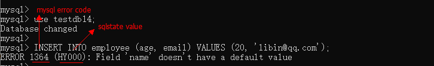
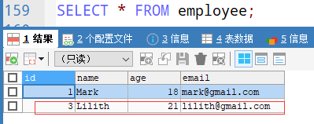

条件处理(异常处理)
==

## Table Of Contents
* [异常处理需求的背景](#异常处理需求的背景)
* [出现异常案例](#出现异常案例)
* [声明错误条件condition变量](#声明错误条件condition变量)
* [condition handler(异常处理器,捕获异常)](#condition-handler异常处理器捕获异常)
    * [异常处理示例](#异常处理示例)


参考 https://dev.mysql.com/doc/refman/8.0/en/condition-handling.html

## 异常处理需求的背景
当在procedure存储过程或用户自定义function函数中出现异常时，面对不同的异常该怎么处理呢。

这时候就需要一种异常处理机制。

默认情况下，在出现异常时，直接退出程序。

## 出现异常案例
* 准备数据
    ```mysql
    CREATE DATABASE testdb14 CHARSET utf8mb4;
    
    USE testdb14;
    
    -- 准备数据
    CREATE TABLE employee (
        id INT PRIMARY KEY AUTO_INCREMENT,
        `name` VARCHAR(32) NOT NULL,
        age TINYINT DEFAULT 0,
        email VARCHAR(32) UNIQUE
    );
    ```

* 示例1
    ```sql
    mysql> use testdb14;
    Database changed
    mysql>
    mysql> INSERT INTO employee (age, email) VALUES (20, 'libin@qq.com');
    ERROR 1364 (HY000): Field 'name' doesn't have a default value
    mysql>
    ```
      
    * name字段的值不能为NULL
    * ERROR 1364 (HY000): ...  
        1364  表示mysql_error_code，是一个整数  
        HY000  表示sqlstate_value，是一个字符串
    * **在SQLyog工具中只显示mysql error code**
        
* 示例2
    ```sql
    mysql> INSERT INTO employee (`name`, age, email) VALUES ('Mark', 18, 'mark@gmail.com');
    Query OK, 1 row affected (0.05 sec)
    
    mysql>
    mysql> INSERT INTO employee (`name`, age, email) VALUES ('Mark', 18, 'mark@gmail.com');
    ERROR 1062 (23000): Duplicate entry 'mark@gmail.com' for key 'email'
    ```
    * email字段的值不能重复。
    * ERROR 1062 (23000): ...  
        1062  表示mysql_error_code，是一个整数  
        23000  表示sqlstate_value，是一个字符串

* 使用存储过程插入记录
    ```mysql
    DELIMITER $$
    
    CREATE PROCEDURE insert_data ()
    BEGIN
        SET @opt_state = -1;
        INSERT INTO employee (`name`, age, email) VALUES (NULL, 20, 'libin@qq.com');
        SET @opt_state = 1;
        INSERT INTO employee (`name`, age, email) VALUES ('Lilith', 21, 'lilith@gmail.com');
        SET @opt_state = 2;
    END $$
    
    DELIMITER ;
    ```
    测试
    ```mysql
    -- 调用存储过程
    CALL insert_data();
    /*
    mysql> CALL insert_data();
    ERROR 1048 (23000): Column 'name' cannot be null  
    */
    
    SELECT @opt_state;  -- 结果为：-1
    SELECT * FROM employee; -- 结果一条记录也没有插入成功
    ```
    
## 声明错误条件condition变量
DECLARE ... CONDITION Statement

将名称 与 错误条件 关联，相当于声明一个变量。

* 语法
    ```sql
    DECLARE condition_name CONDITION FOR condition_value
    
    condition_value: {
        mysql_error_code
      | SQLSTATE [VALUE] sqlstate_value
    }
    ```
    * mysql_error_code  错误代码，是一个整数。
    * SQLSTATE  sql状态码，**是一个字符串**。
    
    两种写法
    ```sql
    DECLARE condition_name CONDITION FOR mysql_error_code
    ```
    或
    ```sql
    DECLARE condition_name CONDITION FOR SQLSTATE sqlstate_value
    ```
    
* 示例：错误提示：ERROR 1048 (23000): Column 'name' cannot be null
    ```sql
    -- 匹配mysql error code的方式
    DECLARE field_cannot_be_null CONDITION FOR 1048;
  
    -- 匹配 sqlstate的方式
    DECLARE field_cannot_be_null CONDITION FOR SQLSTATE '23000';
    ```

## condition handler(异常处理器,捕获异常)
捕获异常，并设置异常后如何处理。

* 语法
    ```sql
    DECLARE handler_action HANDLER
        FOR condition_value [, condition_value] ...
        statement
    
    handler_action: {
        CONTINUE
      | EXIT
      | UNDO
    }
    
    condition_value: {
        mysql_error_code
      | SQLSTATE [VALUE] sqlstate_value
      | condition_name
      | SQLWARNING
      | NOT FOUND
      | SQLEXCEPTION
    }
    ```
    * handler_action处理方式
        * CONTINUE：遇到错误继续执行本程序
        * EXIT：遇到错误马上退出(终止BEGIN...END复合语句的执行)
        * UNDO：遇到错误后撤销之前的操作。mysql不支持。
    * condition_value: 捕获的错误类型
        * mysql_error_code：错误代码
        * SQLSTATE sqlstate_value：sql状态错误码，5个字符的字符串。  
            不要以"00"开头，因为"00"开头的SQLSTATE表示成功。
        * condition_name：用户定义的条件名称
        * SQLWARNING：匹配所有以"01"开头的SQLSTATE值
        * NOT FOUND：匹配所有以"02"开头的SQLSTATE值
        * SQLEXCEPTION：匹配除以'00', '01', 或 '02'开头的SQLSTATE。即除成功、SQLWARNING、NOT FOUND类型外的异常。
        
    * statement：可以是简单的sql语句，也可以是 BEGIN ... END复合语句。

* 示例
    ```sql
    -- mysql_error_code
    DECLARE CONTINUE HANDLER FOR 1051 SET @info='no_such_table';
    
    -- SQLSTATE sqlstate_value
    DECLARE CONTINUE HANDLER FOR SQLSTATE '42S02' SET @info='no_such_table';
    
    -- condition_name
    -- 先定义condition变量，再引用
    DECLARE no_this_table CONDITION FOR 1051;
    DECLARE EXIT HANDLER FOR no_this_table SET @info='no_such_table';
    
    -- SQLWARNING
    DECLARE EXIT HANDLER FOR SQLWARNING SET @info='error';
    
    -- NOT FOUND
    DECLARE EXIT HANDLER FOR NOT FOUND SET @info='not_found';
    
    -- SQLEXCEPTION
    DECLARE CONTINUE HANDLER FOR SQLEXCEPTION @info='has_exception';
    
    -- 同时捕获多个异常类型
    DECLARE CONTINUE HANDLER 
    FOR 1051, SQLSTATE '42S02' 
    BEGIN 
        SET @info='error';
        -- ...
    END;
    ```

### 异常处理示例
还是最开始的案例：使用存储过程向employee表插入记录，当有记录插入失败时跳过，继续插入后面的记录

* 创建存储过程
    ```mysql
    DELIMITER $$
    
    CREATE PROCEDURE insert_data_v2 (OUT opt_code TINYINT)
    /*
    插入记录出错后，继续往下执行程序
    
    IN
    OUT
        opt_code: 操作的状态码
    */
    BEGIN
        DECLARE state TINYINT DEFAULT 0;
        
        -- 定义异常处理器
        -- ERROR 1048 (23000): Column 'name' cannot be null 
        -- 使用下列方式中其中的一种就可以 
        -- 方式1
        DECLARE CONTINUE HANDLER FOR 1048 SET state = -1;
        /*
        -- 方式2
        DECLARE CONTINUE HANDLER FOR SQLSTATE '23000' SET state = -1;
        
        -- 方式3（先声明condition，再引用）
        DECLARE cannot_be_null CONDITION FOR 1048;
        DECLARE CONTINUE HANDLER FOR cannot_be_null SET state = -1;    
        */
        
        INSERT INTO employee (`name`, age, email) VALUES (NULL, 20, 'libin@qq.com');
        SET state = 1;
        INSERT INTO employee (`name`, age, email) VALUES ('Lilith', 21, 'lilith@gmail.com');
        SET state = 2;
        
        SET opt_code = state;
    END $$
    
    DELIMITER ;
    ```

    测试
    ```sql
    mysql> CALL insert_data_v2(@code);
    Query OK, 1 row affected (0.06 sec)
    
    mysql>
    mysql> SELECT @code;
    +-------+
    | @code |
    +-------+
    |     2 |
    +-------+
    1 row in set (0.00 sec)
    ```
    操作状态码为：2，说明执行到了存储过程中最后的SQL。
    
    
    