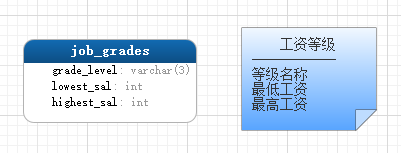

sql__常见规则_测试表模型
==

# 本次测试练习的表关系模型
sql文件位：./sql目录下

* myemployees表  
  


* girls表  
  
  
</details>

# SQL语句的3种类型
* DML数据操作语言
* DDL数据定义语言
* DCL数据控制语言

## 语法常见规则
* 单引号' 和 双引号"
    * 在标准 SQL 中，字符串使用的是单引号
    * 如果字符串本身也包括单引号，可以在在引号前加\进行转义，或使用两个引号来表示一个引号
        ```mysql
        select 'I\'am';  -- I'am
        select 'big''data''';  -- big'data'
        select "big""""data";  -- big""data
  
        -- 单引号包裹双引号字符串，或双引号包裹单引号字符串
        select 'm"oo"n';  -- m"oo"n
        select "m'oo'n";  -- m'oo'n
        ```
    * MySQL对 SQL 的扩展，允许使用单引号和双引号两种

* 反引号 \`
    ```text
    为了区分MySQL的保留字与普通字符，可以包裹字段、表名、数据库等
    ```
    
    ```mysql
    create database desc; -- 报错 
    create database `desc`; -- 成功
    ```
    **一般我们建表时都会将表名，库名都加上反引号来保证语句的执行度。**

* 库名、表名、字段命名规则
    ```text
    不能包含-，建议只包括小写字母、大写字母、数字、_，且以字母开头

    经测试，特殊字符$也可以，以何种类型字符开头没做要求
    ```