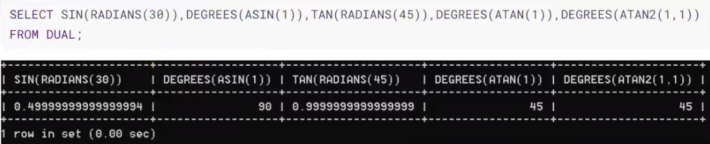
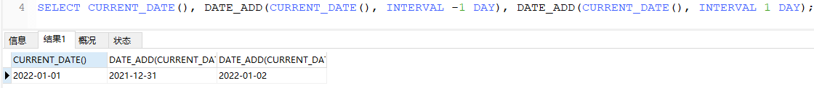
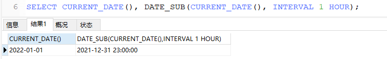
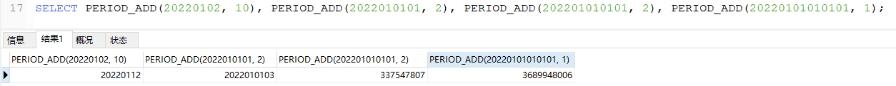

DQL数据查询语言.常见函数
==

## 常见函数

### 函数概念
类似于java中的方法，将一组逻辑语句封装在方法体中，对外暴露方法名

### 函数分类
* 单行函数
    ```text
    这里的单行，指输入一行的数据，返回一个值。
    
    如 concat(str1, str2, ...), length(str), ifnull(expr1, expr2)
    ```
    特点
    * 操作数据对象
    * 接受参数返回一个结果
    * 只对一行进行变换
    * 每行返回一个结果
    * 可以嵌套
    * 参数可以是一列或一个值
    
* 分组函数(多行函数、聚合函数)
    ```text
    分组值，指输入一组(多行)的数据，返回一个值。
    
    功能：用于统计，也称统计函数、聚合函数、组函数
    如SUM(expr)、AVG(expr)、MAX(expr)、MIN(expr)、COUNT(expr)
    ```

### 单行函数
* 字符函数
    ```text
    LENGTH(str) 获取字符串字节长度(在utf8字符集中一个汉字占3个字节, gbk为2字节)
    CONCAT(str1,str2,...) 拼接字符串
    UPPER(str)字符串转大写
    LOWER(str)字符串转小写
    SUBSTR(str,pos)、SUBSTRING(str,pos)
    SUBSTR(str,pos,len)、SUBSTRING(str,pos, len) 截取子字符串
    INSTR(str,substr) 返回子串第一次出现的首地址索引，如果找不到返回0
    TRIM(str) 去掉字符串str首尾的空格
    TRIM(remstr FROM str) 从字符串str中去掉首尾指定的字符remstr
    LPAD(str,len,padstr) 用指定的字符padstr左填充str，保证填充后的字符串长度为len，并返回充后的字符串
    RPAD(str,len,padstr) 用指定的字符padstr右填充str，保证填充后的字符串长度为len，并返回充后的字符串
    REPLACE(str,from_str,to_str) 把字符串str中所有的from_str字符替换成字符to_str
    ```
* 数学函数
    ```text
    ROUND(X) 数X的绝对值做四舍五入运算，精确到个位，符号不变
    ROUND(X,D) 小数X的绝对值做四舍五入运算，精确到第D位小数，符号不变
    CEIL(X) 向上取整，返回>= X的最小整数
    FLOOR(X) 向下取整，返回 <= X的最大整数
    TRUNCATE(X,D) 截断数X小数点后第D位之后所有小数，直接截断(填补0)，不做四舍五入
    MOD(N,M) 取模运算，求余数，数N模以数M
    ```
* 日期、时间函数
    ````text
    NOW()返回服务器当前 日期时间，属于date,也属于time
    CURDATE() 返回服务期系统当前日期，不包括时间
    CURTIME() 返回服务期系统当前时间，不包括日期
    从指定的日期或时间对象中获取年、月、日、时、分、秒，月份名称
    YEAR(date) 从日期date中获取年
    MONTH(date) 从日期date中获取月
    DAY(date) 从日期date中获取日
    HOUR(time) 从时间time中获取时
    MINUTE(time) 从时间time中获取分
    SECOND(time) 从时间time中获取秒
    MONTHNAME(date) 从日期date中获取月份名称
    STR_TO_DATE(str,format) 根据日期格式format将字符创str转成日期，并返回
    DATE_FORMAT(date,format) 格式化date对象，根据日期格式format将日期date转换成字符串，并返回
    DATEDIFF(expr1,expr2) 计算expr1, expr2的天数差值,日期时间expr1 - 日期时间expr2的天数
    ````
* 其他函数
    ```text
    SELECT VERSION(); 查看服务端mysql版本
    SELECT DATABASE(); 查看当前连接的库
    SELECT USER(); 查看当前使用的连接用户
    ```
* 控制函数
    ```text
    IF(expr1,expr2,expr3) 如果逻辑表达式expr1为true,则返回表达式expr2，否则返回表达式expr3
    case用于字段或表达式值枚举处理
    case用于字段或表达式值范围枚举处理
    ```


#### 字符串函数
函数 |功能 
:--- |:--- 
ASCII(s) |把返回字符串s的第一个字符的ASCII码值(0-127的数字) 
CHAR_LENGTH(s), CHARACTER_LENGTH(s) |返回字符串s的字符个数 
LENGTH(s) |返回字符串s的字符数，其结果与服务端设定的字符集有关。 
CONCAT(str1, str2 ,...) |把字符串str1, str2连接为一个字符串
CONCAT_WS(separator, str1, str2,...) |以separator为分隔符，把str1、str2,...连接为一个字符串。<br>效果：str1separatorstr2，与pythond的 'separator'.join([str1、str2,...])作用相同 
`INSERT`(str, pos, len, newstr) |把字符串str，从pos位置开始（包括它），len个字符替换为newstr，并返回替换后的结果。注意这里的索引位置是从1开始的。 
REPLACE(str, from_str, to_str) |把字符串str中所有的from_str都替换为to_str 
UPPER(s), UCASE(s) |把s字符串中所有的字符都转换为大写 
LOWER(s), LCASE(s) |把s字符串中所有的字符都转换为小写 
`LEFT`(str, len) |返回字符串str最左边len个字符 
`RIGHT`(str, len) |返回字符串str最右边len个字符 
LPAD(str, len, padstr) |用字符串padstr对str字符串左边进行填充，直到str字符串的字符个数为len为止 
RPAD(str, len, padstr) |用字符串padstr对str字符串右边进行填充，直到str字符串的字符个数为len为止 
LTRIM(str) |去掉字符串str左边的空格 
RTRIM(str) |去掉字符串str右边的空格 
TRIM(str) |去掉字符串str左、右两边的空格 
TRIM(remstr FROM str), TRIM(BOTH remstr FROM str) |去掉字符串左、右两边的remstr字符串 
TRIM(LEADING remstr FROM str) |去掉字符串str左边的remstr字符串 
TRIM(TRAILING remstr FROM str) |去掉字符串str右边的remstr字符串 
`REPEAT`(str, count) |返回str重复count次连接成的一个字符串 
SPACE(N) |返回N个空格
STRCMP(expr1, expr2) |字符串expr1、expr2的ASCII码值的大小，逐个字符比较，直到有一对相减不为0则直接返回该结果。
SUBSTR(str, pos) |返回字符串str从pos位置开始到结尾的字符，包括pos位置 
SUBSTR(str, pos, len), SUBSTRING(str, pos, len) |返回字符串str从pos位置开始，连续的len个字符 
SUBSTR(str FROM pos) |同SUBSTR(str, pos)  
SUBSTR(str FROM pos FOR len)，SUBSTRING(str FROM pos FOR len) |同SUBSTR(str, pos, len) 
LOCATE(substr, str), POSITION(substr IN str) |返回字符串substr在字符串str中第一次出现的位置索引，索引从1开始 
LOCATE(substr, str, pos) |返回字符串substr在字符串str的从pos位置到结尾，第一次出现的位置索引 
ELT(N, str1, str2, str3, ...) |返回字符串列表(str1, str2, str3, ...)中指定位置的字符串。如果N=1，返回str1; N=2，返回str2，依此类推 
FIELD(str, str1, str2, str3, ...) |返回str在字符串列表(str1, str2, str3, ...)中首次出现的位置 
FIND_IN_SET(str, strlist) |返回str在字符串strlist中首次出现的位置，strlist是一个以逗号(",")分隔的字符串 
REVERSE(str) |返回字符串str反序的字符串。
NULLIF(expr1,expr2) |比较两个字符串，如果expr1 == expr2，则返回NULL，否则返回expr1

注意：mysql中的索引位置是从1开始的。  

* lenght(str) 获取字符串字节长度(在utf8字符集中一个汉字占3个字节, gbk为2字节)
    ```mysql
    SELECT LENGTH('trip');
    SELECT LENGTH('神功盖世'); -- 长度为：12
    
    SHOW VARIABLES LIKE '%char%'; -- 查看服务端使用的字符集
    ```

* CONCAT(str1,str2,...)拼接字符串
    ```mysql
    SELECT CONCAT(first_name, ' ', last_name) AS 姓名
    FROM employees;
    ```

* UPPER(str)字符串转大写
  
>SELECT UPPER('abcdef');

* LOWER(str)字符串转小写
    >SELECT LOWER('Guang Dong');

    * 示例：将姓变大写，名变小写，然后拼接  
        ```mysql
        SELECT CONCAT(UPPER(first_name), ' ',LOWER(last_name)) 姓名
        FROM employees
        ```

* 截取子字符串(SUBSTR、SUBSTRING)
    ```text
    字符串的索引从1开始计数
    
    SUBSTR(str,pos) 截取指定str字符串从第pos个字符开始到结尾的子字符串
    SUBSTR(str,pos,len) 截取str字符串从第pos个字符开始，长度为len的子字符串的子字符串
    SUBSTR(str FROM pos) 与SUBSTR(str,pos)功能相同，截取str字符串从第pos个字符开始到结尾的子字符串
    SUBSTR(str FROM pos FOR len) 与SUBSTR(str,pos,len)功能相同，截取str字符串从第pos个字符开始，长度为len的子字符串
    
    SUBSTRING(str,pos) 对应SUBSTR(str,pos)
    SUBSTRING(str,pos,len) 对应SUBSTR(str,pos,len)
    SUBSTRING(str FROM pos) 对应SUBSTR(str FROM pos)
    SUBSTRING(str FROM pos FOR len) 对应SUBSTR(str FROM pos FOR len)
    ```

    * 截取从指定索引处后面所有字符
      
>SELECT SUBSTR('习近平致信祝贺大庆油田发现60周年全文', 4) out_put; -- 致信祝贺大庆油田发现60周年全文

    * 截取从指定索引处指定字符长度的字符  
        ```mysql
        SELECT SUBSTR('习近平致信祝贺大庆油田发现60周年全文', 4, 2) out_put; -- 致信
        SELECT SUBSTR('abcdef' FROM 2); -- bcdef
        SELECT SUBSTR('abcdef' FROM 2 FOR 3); -- bcd
        
        SELECT SUBSTRING('习近平致信祝贺大庆油田发现60周年全文', 4);
    ```
    
    * 案例：姓名中首字符大写，其他字符小写然后用_拼接，显示出来
        ```mysql
        SELECT
            CONCAT (
                UPPER(SUBSTR(first_name, 1, 1)),
                LOWER(SUBSTR(first_name, 2)),
                ' ',
                LOWER(last_name)
            )
        FROM
            employees;
          
        -- 方法2
        SELECT
            CONCAT (UPPER(SUBSTR(fname, 1, 1)), LOWER(SUBSTR(fname, 2))) AS 姓名
        FROM
            (SELECT CONCAT (first_name, ' ', last_name) AS fname FROM employees) employees;
    ```

* INSTR(str,substr) 返回子串第一次出现的首地址索引，如果找不到返回0
    ```text
    SQL中，0表示false, 1表示true
    ```
    
    >SELECT INSTR('上海自来水来自海上,山西运煤车煤运西山,自来水', '自来水'); -- 结果：3

* TRIM(str) 去掉字符串str首尾的空格
* TRIM(remstr FROM str) 从字符串str中去掉首尾指定的字符remstr
    ```mysql
    SELECT LENGTH(TRIM('    Good    ')); -- 4
    SELECT TRIM('e' FROM 'eeeeeeee张eee教主eeeeeeeeeeeeeeeeeee'); -- 张eee教主
    ```

* LPAD(str,len,padstr) 用指定的字符padstr左填充str，保证填充后的字符串长度为len，并返回充后的字符串
    ```text
    当len小于str的长度时，会截断右边多余的字符 (保留左边的)
    ```

    ```mysql
    SELECT LPAD('2', 3,'0'); -- '002'
    
    SELECT LPAD('中国海军', 2,'c'); -- '中国'
    ```

* RPAD(str,len,padstr) 用指定的字符padstr右填充str，保证填充后的字符串长度为len，并返回充后的字符串
    ```text
    当len小于str的长度时，会截断右边多余的字符 (保留左边的)
    ```
    
    ```mysql
    SELECT RPAD('中国海军', 12,'c'); -- 中国海军cccccccc
    SELECT RPAD('中国海军', 2,'c'); -- '中国'
    ```

* REPLACE(str,from_str,to_str) 把字符串str中所有的from_str字符替换成字符to_str
  
    >SELECT REPLACE('周芷若周芷若周芷若周芷若张无忌爱上了周芷若', '周芷若', '赵敏');

#### 数值函数
##### 数值基本函数

函数 |功能描述 
:--- |:---
ABS(x) | 返回x的绝对值
SIGN(x) |返回x的符号。正数返回1，负数返回-1，0返回0 
PI() |返回π 
CEIL(x), CEILING(x) |返回>= x的最小整数，天花板取整 
FLOOR(x) |返回<= x的最大整数，地板取整 
LEAST(e1, e2, e3...) |返回列表中的最小值 
GREATEST(e1, e2, e3...) |返回列表中的最大值 
MOD(x, y) |求 x 模以 y，即求x除以y的余数 
RAND |返回(0.0, 1.0)范围内的随机小数 
RAND(x) |返回(0.0, 1.0)范围内的随机小数，其中x的值用作随机因子的种子，相同的随机因子种子会产生相同的随机数。
ROUND(x) |返回x四舍五入后的整数  
ROUND(x, y) |返回x四舍五入后的值，精确到y位小数。 
TRUNCATE(x, y) |返回数字x截断为y位小数的结果。  
SQRT(x) |返回x的平方根，当x为负数时，返回NULL  


* ROUND数值做四舍五入运算
    ```text
    ROUND(X) 数X的绝对值做四舍五入运算，精确到个位，符号不变
    ROUND(X,D) 小数X的绝对值做四舍五入运算，精确到第D位小数，符号不变
    ```
    
    ```mysql
    SELECT ROUND(1.55); -- 2
    SELECT ROUND(-1.55); -- 结果：-2
    SELECT ROUND(-3.1415, 3); -- 3.142
    ```

* CEIL(X) 向上取整，返回>= X的最小整数
    ```mysql
    SELECT CEIL(2.11); -- 3
    SELECT CEIL(-2.11); -- -2
    ```

* FLOOR(X) 向下取整，返回 <= X的最大整数
    ```mysql
    SELECT FLOOR(3.11); -- 3
    SELECT FLOOR(-3.11); -- -4
    ```

* TRUNCATE(X,D) 截断数X小数点后第D位之后所有小数，直接截断(填补0)，不做四舍五入
    ```text
    D必须是整数，
    D为0：表示小数点后所以小数截断不要
    D为负数，表示小数点左边D位内的都取0
    ```
    
    ```mysql
    SELECT TRUNCATE(3.333333, 1); -- 3.3
    SELECT TRUNCATE(3.333333, 0); -- 3
    SELECT TRUNCATE(33, 1); -- 33
    SELECT TRUNCATE(3333, -2); -- 3300
    ```

* MOD(N,M) 取模运算，求余数，数N模以数M
    ```text
    MOD(N,M) ==> N - N/M * M
    ```
    
    ```mysql
    SELECT MOD(10, 3); -- 1
    SELECT MOD(10, -3); -- 1
    SELECT MOD(-10, -3); -- -1
    SELECT MOD(-10, 3); -- -1
    SELECT 10 % 3;
    ```
    
* RAND() 返回一个范围在(0.0, 1.0)里的随机小数
    ```mysql
    SELECT RAND();
    ```

##### 角度与弧度互转函数
1弧度：表示在某圆内的一段弧长 = 半径的一倍长

函数 |功能描述 
:--- |:---
RADIANS(x) |将角度值x转化为弧度值，x为角度值 
DEGREES(x) |将弧度值x转化为角度值，x为弧度值  

##### 三角函数
函数 |功能描述 
:--- |:---
SIN(x) |返回sin x(即x的正弦值)，其中参数x为弧度值 
ASIN(x) |返回arcsin x（x的反正弦值），即获取正弦值为x的弧度值，要求-1 <= x <= 1，否则返回NULL <br>反正弦函数（反三角函数之一）为正弦函数y=sinx（x∈[-½π,½π]）的反函数，记作y=arcsinx或siny=x（x∈[-1,1]）。
COS(x) |返回cos x（x的余弦值），x的值为弧度值 
ACOS(x) |返回arccos x（x的反余弦值），x的值为弧度值 
TAN(x) |返回tan x（x的正切值），x的值为弧度值  
ATAN(x) |返回arctan x(x的反正切值) ，即返回正切值为x的弧度值
ATAN2(m, n) |返回两个参数的反正切值 
COT(x) |返回cot x（x的余切值），其中x为弧度值。

示例


##### 指数与对数函数
函数 |功能描述 
:--- |:---
POW(x, y), POWER(x, y) |返回x的y次方 
EXP(x) |返回e的x次方，其中e是常数，2.718281828459045... 
LN(x), LOG(x) |返回以e为底数，真数x的对数（即返回log(e)(x)），当x <= 0时，返回NULL
LOG10(x) |返回以10为底的x的对数，即log(10)(x)， 当x <= 0时，返回NULL
LOG2(x) |返回以2 为底的x的对数，即log(10)(x)， 当x <= 0时，返回NULL 


##### 进制间的转换函数
函数 |功能描述 
:--- |:---
BIN(x) |返回x的二进制编码 
OCT(x) |返回x的八进制编码 
HEX(x) |返回x的十六进制编码 
CONV(N, from_base, to_base) |from_base进制编码的N转换为to_base进制编码的数


#### 日期、时间函数
##### 获取日期、日间
函数 |功能描述 
:--- |:---  
NOW(), SYSDATE(), CURRENT_TIMESTAMP(), LOCALTIME(), LOCALTIMESTAMP() |返回当前系统日期和时间 
CURDATE(), CURRENT_DATE() |返回当前日期，只包含年、月、日 
CURTIME(), CURRENT_TIME() |返回当前时间，只包含时、分、秒 
UTC_DATE() |返回当前UTC日期，对应的0时区的日期 
UTC_TIME() |返回当前UTC时间，对应的0时区的时间 

##### 日期与时间戳的转换
函数 |功能描述 
:--- |:---  
UNIX_TIMESTAMP() |以UNIX时间戳的形式返回当前的时间。<br>SELECT UNIX_TIMESTAMP(); 结果为：1641023234 
UNIX_TIMESTAMP(date) |将时间date以UNIX时间戳的形式返回
FROM_UNIXTIME(unix_timestamp) |UNIX时间戳的时间转换为普通格式的时间。<br>SELECT FROM_UNIXTIME(1641023234); 结果为：2022-01-01 15:47:14 
FROM_UNIXTIME(unix_timestamp, format) |UNIX时间戳的时间转换为指定format格式的时间 

##### 获取月份、星期、星期数、天数等函数
函数 |功能描述 
:--- |:--- 
YEAR(date), MONTH(date), DAY(date) |从date对象中返回具体的日期值 
HOUR(time), MINUTER(time), SECOND(time) |从time对象中返回具体的时间值  
MONTHNAME(date) |返回月份名(英文格式)，January, ... 
DAYNAME(date) |返回星期几：MONDAY, TUESDAY, ... 
WEEKDAY(date) |返回周几：周1是0, 周2是1, ... 周日是6
QUARTER(date) |返回date对应的季度，范围[1, 4]
WEEK(date), WEEKOFYEAR(date) |返回date是这一年中的第几周 
DAYOFYEAR(date) |返回date是这一年中的第几天 
DAYOFMONTH(date) |返回date是这一个月中的第几天 
DAYOFWEEK(date) |返回date是周几，周日:1, 周一:2, ..., 周六:7 

##### 日期的操作函数
函数 |功能描述 
:--- |:--- 
EXTRACT(unit FROM date) |返回date中指定的unit部分。

unit的可选值列表：

unit值 |含义  
:--- |:---  
MICROSECOND |返回毫秒数 
SECOND |返回秒数 
MINUTE |返回分钟数 
HOUR |返回小时数 
DAY |返回天数 
WEEK |返回日期在这一年中的第几个星期 
MONTH |返回日期在这一年中的第几个月  
QUARTRE |返回日期在这一年中的第几个季度  
YEAR |返回日期的年份 
SECOND_MICROSECOND |返回秒和毫秒数 
MINUTE_MICROSECOND |返回分钟和毫秒数 
MINUTE_SECOND |返回分钟和秒数 
HOUR_MICROSECOND |返回小时和毫秒数 
HOUR_SECOND |返回小时和秒数 
HOUR_MINUTER |返回小时和分钟数 
HOUR_MICROSECOND |返回小时和毫秒数 
DAY_MICROSECOND |返回天和毫秒数 
DAY_SECOND |返回天和秒数 
DAY_MINUTER |返回天和分钟数 
DAY_HOUR |返回天和小时数 
YEAR_MONTH |返回年份和月份 
 
##### 时间与秒数转换的函数
函数 |功能描述 
:--- |:--- 
TIME_TO_SEC(time) |返回time时间转换为秒的整数。 
SEC_TO_TIME(seconds) |将秒数seconds转换为包含小时、分钟、秒的时间 

##### 计算日期和时间的函数
函数 |功能描述 
:--- |:--- 
DATE_ADD(date,INTERVAL expr unit), ADDDATE(date,INTERVAL expr unit) |返回与日期date加上expr unit时间段的日期时间。<br>unit的可选单元同EXTRACT(unit FROM date)，<br>示例 DATE_ADD(CURRENT_DATE(), INTERVAL 3 DAY) 
DATE_SUB(date,INTERVAL expr unit), SUBDATE(date,INTERVAL expr unit) |返回与日期date减去expr unit时间段的日期时间。 
ADDTIME(expr1,expr2) |返回时间expr1 + expr2的时间，当expr2为数字时，缺省单位为秒, 可以是负数 
SUBTIME(expr1,expr2) |返回时间expr1 - expr2的时间，当expr2为数字时，缺省单位为秒, 可以是负数 
DATEDIFF(expr1,expr2) |返回日期expr1 - expr2 的天数
TIMEDIFF(expr1,expr2) |返回时间expr1 - expr2 
FROM_DAYS(N) |返回从0000年1月1日起，N天以后的日期 
TO_DAYS(date) |返回日期date距离0000年1月1日的天数。 
LAST_DAY(date) |返回日期date所在月份的最后一天的日期 
MAKEDATE(year, dayofyear) |返回年份year中第dayofyear天对应的日期 
MAKETIME(hour, minute, second) |返回hour时minute分second秒的事件 
PERIOD_ADD(P, N) |返回时期P + N后的时期 


示例
```mysql
SELECT CURRENT_DATE(), DATE_ADD(CURRENT_DATE(), INTERVAL -1 DAY), DATE_ADD(CURRENT_DATE(), INTERVAL 1 DAY);
```
  

```mysql
SELECT CURRENT_DATE(), DATE_SUB(CURRENT_DATE(), INTERVAL 1 HOUR);
```


```mysql
SELECT PERIOD_ADD(20220102, 10), PERIOD_ADD(2022010101, 2), PERIOD_ADD(202201010101, 2), PERIOD_ADD(20220101010101, 1);
```


##### 日期、时间的格式化与解析
函数 |功能描述 
:--- |:--- 
DATE_FORMAT(date, format) |返回以format形式格式化date
TIME_FORMAT(time, format) |返回以format形式格式化time
GET_FORMAT({DATE/TIME/DATETIME}, {'EUR'/'USA'/'JIS'/'ISO'/'INTERNAL'}) |返回日期或时间的指定区域的显示格式(字符串)
STR_TO_DATE(str, format) |以format形式对str尽心解析，解析为一个日期 

注意：format为字符串

[format匹配模式字母定义](#format匹配模式字母定义)
 
[date-and-time-functions](https://dev.mysql.com/doc/refman/8.0/en/date-and-time-functions.html)

* NOW()返回服务器当前 日期时间，属于date,也属于time
  
>SELECT NOW(); -- 2019-09-27 10:31:58

* CURDATE() 返回服务期系统当前日期，不包括时间
  
>SELECT CURDATE(); -- 2019-09-27

* CURTIME() 返回服务期系统当前时间，不包括日期
  
>SELECT CURTIME(); -- 10:34:07

* 从指定的日期或时间对象中获取年、月、日、时、分、秒，月份名称
    ```text
    now() 获取的日期时间对象，属于date和time类型
    
    YEAR(date) 从日期date中获取年
    MONTH(date) 从日期date中获取月
    DAY(date) 从日期date中获取日
    HOUR(time) 从时间time中获取时
    MINUTE(time) 从时间time中获取分
    SECOND(time) 从时间time中获取秒
    MONTHNAME(date) 从日期date中获取月份名称
    DATEDIFF(expr1,expr2) 日期时间expr1 - 日期时间expr2的天数
    ```
    
    ```mysql
    SET @now=NOW(); -- 设置局部变量，引用变量 @变量名
    SELECT @now;
    
    SELECT YEAR(@now);
    SELECT YEAR(NOW());
    SELECT YEAR('2008-01-10'); -- 2008
    SELECT YEAR('2008/01/10'); -- 2008
    SELECT YEAR('2008.1.10'); -- 2008
    SELECT YEAR(hiredate) AS 年 FROM employees;
    
    --
    SELECT MONTH(NOW()); 
    SELECT MONTH('2019-06-01');
    
    --
    SELECT MONTHNAME(@now); -- September
    
    -- 
    SELECT DAY(NOW());
    
    --
    SELECT HOUR(NOW());
    SELECT HOUR(CURTIME());
    
    --
    SELECT MINUTE(NOW());
    
    --
    SELECT SECOND(NOW());
    SELECT SECOND('12:00:13');
    ```

##### format匹配模式字母定义
格式 |定义 
:--- |:---
%Y |4位的年份
%y |2位的年份
%m |2位的月份(01, 02...11, 12)
%c |自然月份(1, 2...11, 12)
%d |2位的日(01, 02...31)
%D |英文后缀月中的天数(1st, 2nd, 3rd, ...) 
%e |月中天数(1, 2...31) 
%H |2位的小时(24小时制, 00, 01...23)
%k |数字形式的小时(0, 1, 2...23)
%h |两位的小时(12小时制, 00, 01...12)
%l |数字形式的小时(12小时制, 0, 1...12)
%i |2位的分钟(01, 02...59)
%s |2位的秒(01, 02...59)
%W |星期名称(Sunday, ...) 
%a |缩写的星期名称(Sun, Mon, ...)

* STR_TO_DATE(str,format) 根据日期格式format将字符创str转成日期，并返回
    >SELECT STR_TO_DATE('1999-12-31', '%Y-%c-%d');

    * 示例：查询入职日期为1992-4-3的员工信息
        ```mysql
        SELECT * 
        FROM employees
        WHERE hiredate = '1992-4-3';
        --
        SELECT * FROM employees
        WHERE hiredate = STR_TO_DATE('4-3 1992', '%c-%d %Y');
        ```

* DATE_FORMAT(date,format) 格式化date对象，根据日期格式format将日期date转换成字符串，并返回
    >SELECT DATE_FORMAT(NOW(), '%Y年%m月%d日'); -- 2019年09月27日

    * 查询有奖金的员工名和入职日期(xx月/xx日 xx年)
        ```mysql
        SELECT first_name, DATE_FORMAT(hiredate, '%m月/%d日 %y年') AS 入职日期
        FROM employees
        WHERE commission_pct IS NOT NULL;
        ```
    


#### 加密/解密函数

加密与解密函数主要用于数据库的数据进行加密和解密处理。以防止他人窃取数据。

| 函数                         | 功能                                                         | 备注                   |
| ---------------------------- | ------------------------------------------------------------ | ---------------------- |
| PASSWORD(str)                | 返回字符串str的加密字符串，长度为41个字符，<br>**加密结果不可逆**，常用于用户的密码加密 | mysql 8弃用            |
| MD5(str)                     | 返回字符串的md5加密后的字符串。<br>若参数为NULL，则结果返回NULL。 |                        |
| SHA(str)                     | 返回str经过SHA加密后的字符串。参数为NULL时，返回为NULL。     | SHA加密比MD5加密更安全 |
| ENCODE(value, password_seed) | 返回使用password_seed作为加密密码 加密value                  | mysql 8弃用            |
| DECODE(value, password_seed) | 返回使用password_seed作为加密密码 解密value                  | mysql 8弃用            |

#### MySql信息函数
函数 |功能描述 
:--- |:--- 
VERSION() |查看服务端mysql版本 
DATABASE(), SCHEMA() |查看当前连接的库 
CONNECTION_ID() |查看当前mysql服务器的连接数 
USER(),CURRENT_USER(), SYSTEM_USER(), SESSION_USER() |返回当前连接mysql的用户用，格式：用户用@主机名 
CHARSET(str) |返回字符串str变量的字符集
`COLLATION`(str) |返回字符串str的比较规则

```mysql
SELECT VERSION();
SELECT DATABASE();
SELECT USER(); -- root@localhost
```

#### 其他函数
函数 |功能描述 
:--- |:--- 
FORMAT(X, D) |返回对数字X格式化后的数字，D表示四舍五入保留的小数位数 
CONV(N, from_base, to_base) |将from_base进制格式的N转换为to_base进制的数 
INET_ATON(expr) |将点分隔的IP expr转换为数字（十进制），expr为字符串，如 '192.168.1.1'
INET_NTOA(expr) |将数字形式的IP expr转换为点分隔的IP，
BENCHMARK(count, expr) |将表达式expr重复执行cont次，expr是一个sql语句。常用于测试MySql处理expr表达式所耗费的时间。 
`CONVERT`(expr USING transcoding_name) |将expr转换为transcoding_name字符集表示

#### 流程分支控制函数
* IF(expr1,expr2,expr3) 如果逻辑表达式expr1为true,则返回表达式expr2，否则返回表达式expr3
    ```text
    功能类似三目运算：expr1 ? expr2 : expr3
    
    expr2,expr3的类型要求相同或能兼容
    ```

    ```mysql
    SELECT IF(2 < 4, '小', '大'); -- 小
    
    SELECT 
        first_name,
        commission_pct,
        IF(commission_pct IS NULL, '无', '有') AS 是否有奖金
    FROM employees;
    ```

* IFNULL(expr1,expr2) 如果表达式expr1为null，则返回expr2, 否则返回expr1
    ```mysql
    SELECT IFNULL(commission_pct, '无奖金')
    FROM employees;
    ```

* case用于字段或表达式值枚举处理
    ```text
    
    功能类似java中的case
    switch(变量或表达式或枚举类) {
        case 常量1:
            语句1;
            break;
        case 常量2:
            语句2;
            break;
        ...
        default:
            语句n;
            break;
    }
    
    
    mysql中的case:
    case 字段或表达式
    when 常量1 then
        返回的值1或语句1
    when 常量2 then
        返回的值2或语句2
    ...
    [else 返回的值n或语句n]
    end
    
    ```

    * 案例：查询员工的工资，要求如下：
        ```text
        部门号=30，显示的工资为1.1倍
        部门号=40，显示的工资为1.2倍
        部门号=50，显示的工资为1.3倍
        其他部门，显示的工资为原工资
        ```

        ```mysql
        SELECT
            department_id,
            salary 原工资,
            CASE department_id
        WHEN 30 THEN
            salary * 1.1
        WHEN 40 THEN
            salary * 1.2
        WHEN 50 THEN
            salary * 1.3
        ELSE salary
        END AS 新工资
        FROM employees;
        ```

* case用于字段或表达式值范围枚举处理
    ```text
    功能类似java中的多重if：
    
    if(逻辑表达式1) {
        语句1;
    } else if(逻辑表达式2) {
        语句2;
    } 
    ...
    else {
        语句n;
    }
    
    
    mysql中:
    case
    when 逻辑表达式1 then 返回的值1或语句1
    when 逻辑表达式2 then 返回的值2或语句2
    ...
    [else 默认返回的值n或语句n]
    end
    ```

    * 案例：查询员工的工资的情况
        ```text
        如果工资>20000,显示A级别
        如果工资>15000,显示B级别
        如果工资>10000，显示C级别
        否则，显示D级别
        ```
    
        ```mysql
        SELECT 
            salary,
            CASE
        WHEN salary > 20000 THEN
            'A'
        WHEN salary > 15000 THEN
            'B'
        WHEN salary > 10000 THEN
            'C'
        ELSE 'D'
        END AS 级别
        FROM employees;
        ```
