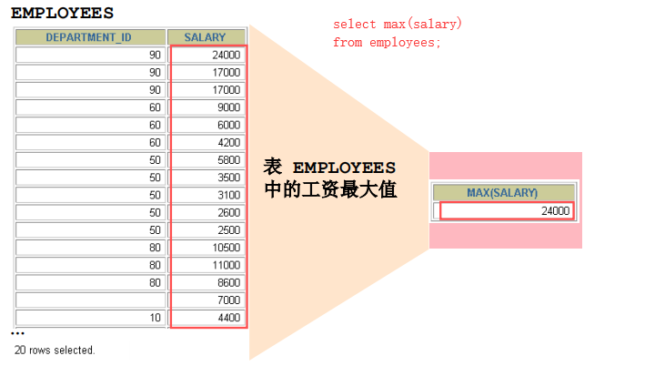

DQL数据查询语言.分组函数
==


## 分组函数
### 分组函数概念与功能
```text
功能：用于统计，有称为聚合函数、统计函数、组函数
输入多个值（多行的值），最后返回一个值，不能与返回多行的组合使用
```

###  分组函数概览与总结
```text
SUM(expr) 求和，
    当统计的数据为空时(没有一条记录)，返回值为NULL
SUM([DISTINCT] expr) 去重后求和

AVG([DISTINCT] expr) 求平均值(或去重后求平均值)，
    当统计的数据为空时(没有一条记录)，返回值为NULL
    
MAX(expr) 求最大值, 
    当统计的数据为空时(没有一条记录)，返回值为NULL
MAX([DISTINCT] expr) 去重后求最大值

MIN(expr) 求最小值，
    当统计的数据为空时(没有一条记录)，返回值为NULL
MIN([DISTINCT] expr) 去重后求最小值

COUNT(expr) 计算非null值的行个数，
    当统计的数据为空时(没有一条记录)，返回值为0
COUNT(DISTINCT expr,[expr...]) 返回列出的字段不全为NULL值的行，再去重的数目, 可以写多个字段，expr不能为*
```

  
  

* 特点
    * sum, avg一般用于处理数值型
    * 以上分组函数都忽略所提供字段全为null的记录
    * count(expr)一般用于统计行数
    * 与分组函数一起查询的字段要求是group by后的字段


* 分组函数基本使用
    ```mysql
    SELECT SUM(salary) FROM employees;
    SELECT AVG(salary) FROM employees;
    SELECT MAX(salary) FROM employees;
    SELECT MIN(salary) FROM employees;
    SELECT COUNT(salary) FROM employees;
    
    SELECT
        SUM(salary) AS 和, AVG(salary) 平均值, MAX(salary) 最大值, MIN(salary) 最小值, COUNT(salary) 计数
    FROM
        employees;
      
    --
    SELECT
        SUM(salary) AS 和, AVG(salary) 平均值, MAX(salary) 最大值, MIN(salary) 最小值, COUNT(salary) 计数
    FROM
        employees
    WHERE salary < 0; -- NULL, NULL, NULL, NULL, 0
  
    ```

* 参数支持的类型
    ```mysql
    SELECT SUM(last_name), AVG(last_name) FROM employees; -- 结果：0， 0，结论SUM(expr), AVG(expr)不支持字符型
    SELECT SUM(hiredate), AVG(hiredate) FROM employees; -- 日期、时间无意义
    ```
    
    * max(expr), min(expr)支持可排序的类型，如字符、数值、日期时间等
        ```mysql
        SELECT MAX(last_name), MIN(last_name) FROM employees; -- 支持字符
        SELECT MAX(hiredate), MIN(hiredate) FROM employees; -- 支持日期、时间
        
        SELECT COUNT(commission_pct) FROM employees; -- 35, 值为null的不计算
        SELECT COUNT(last_name) FROM employees;
        SELECT COUNT(*) FROM employees;
        ```

* 忽略所选字段全为NULL值的记录
    ```mysql
    SELECT SUM(commission_pct), AVG(commission_pct), SUM(commission_pct)/35, SUM(commission_pct)/107  FROM employees;
    
    SELECT MAX(commission_pct), MIN(commission_pct) FROM employees;
    
    SELECT COUNT(commission_pct) FROM employees; -- 35
    SELECT commission_pct FROM employees;
    ```

* 都可以和distinct去重搭配
    ```mysql
    SELECT SUM(DISTINCT salary), SUM(salary) FROM employees;
    
    SELECT COUNT(DISTINCT salary), COUNT(salary) FROM employees;
    ```

* count函数详细介绍
    ```mysql
    SELECT COUNT(salary) FROM employees;
    
    SELECT COUNT(*) FROM employees;
    
    SELECT COUNT(1) FROM employees; -- 相当于SELECT *, 1 FROM employees;的每行后加一列值为1，然后统计新加这列值不为null的行数
    
    SELECT COUNT(NULL) FROM employees; -- 0
    ```

    * count(表达式)
        ```mysql
        SELECT COUNT(DISTINCT last_name, department_id)
        FROM employees;
        
        SELECT (salary = 24000) FROM employees;
        
        SELECT COUNT(DISTINCT salary = 24000) FROM employees; -- 结果：2，因为salary要么等于24000，要么不等于
        ```

    * 效率比较
        ```text
        MYISAM存储引擎下，COUNT(*)的效率高，有个内部计数器变量专门统计行数，直接返回该值
        INNODB存储引擎下，COUNT(*)和COUNT(1)的效率差不多，比COUNT(字段)要高一些，因为COUNT(字段)要排除字段值为NULL的行
        ```

* 分组函数与字段查询有限制
    ```text
    因为分组函数值返回一个值，不能与多行的结果的组合使用
    ```
    
    **错误写法**
    ```mysql
    SELECT AVG(salary), first_name FROM employees; -- 错误
    ```
