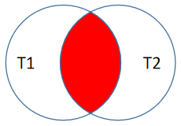
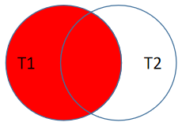
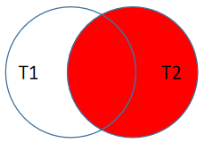
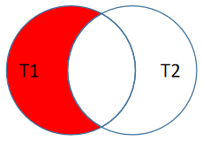
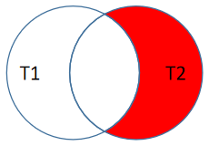
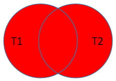
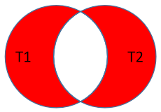

DQL数据查询语言.连接查询
==


## 连接查询

### 连接查询分类
* 按sql标准发布年份分  
    * SQL-92(SQL2)
        ```text
        仅支持内连接，根据连接条件，查询结果集为能在表1、表2中找到互相对应的记录
        ```
      
    * SQL:1999(SQL3)
        ```text
        推荐使用，功能更强，连接条件与筛选条件分离，可读性更好
        支持 内连接、左外连接、右外连接、全外连接(mysql不支持)、交叉连接
        ```
    * ... ...
    * SQL:2016
        ```text
        最新的sql标准，增加行模式匹配、多态表函数、JSON功能
        ```
* 按功能分类
    * 内连接
        * 等值内连接
        * 非等值内连接
        * 自连内连接
    * 外连接
        * 左外连接
        * 右外连接
        * 全外连接
    * 交叉连接
    
### SQL-92连接语法(仅支持内连接)
补充测试库和表，执行girls.sql脚本，创建girls库及相应的表  
  

#### SQL-92语法
```text
select 查询列表
from 表1 别名1, 表2 别名2
where 连接条件
[and 其它筛选条件]
[group by 分组字段]
[having 分组后筛选条件]
[order by 排序字段或表达式 排序方式]


其中表1、表2可以为同一个表，表示自连接，
注意：起了别名后，原来的表名将不可用


select 查询列表
from 表1 别名1, 表2 别名2, 表3 别名3
where 表1与表2连接条件
and 表2与表3连接条件或者是表1与表3连接条件
[and 其它筛选条件]
[group by 分组字段]
[having 分组后筛选条件]
[order by 排序字段或表达式 排序方式]
```

#### 笛卡尔乘积现象(交叉连接)
笛卡尔乘积 也叫 直积
```text
表1 有m行，
表2 有n行，
查询结果集= m * n 行，即表1中的每行与表2中的所有行都连接

* 发生原因：没有指定有效的连接条件
* 避免方法：添加有效的连接条件
```

```mysql
USE girls;

SELECT * FROM beauty; -- 12行
SELECT * FROM boys; -- 4行

SELECT beauty.*, boys.*
FROM beauty, boys; -- 48行
```

#### 等值连接
相当于取两表的连接条件相等的交集记录
* 案例1：查询女神名和对应的男神名
    ```mysql
    SELECT NAME, boyName
    FROM beauty, boys
    WHERE beauty.`boyfriend_id` = boys.`id`;
    
    --
    SELECT *
    FROM beauty, boys
    WHERE beauty.`boyfriend_id` = boys.`id`;
    ```

* 案例2：查询员工名和对应的部门名
    ```mysql
    USE myemployees;
    
    SELECT first_name, department_name
    FROM employees, departments
    WHERE employees.`department_id` = departments.`department_id`;
    ```

* 为表起别名
    * 查询员工名、工种号、工种名
        ```mysql
        SELECT first_name, j.job_id, job_title
        FROM employees AS e, jobs AS j
        WHERE e.`job_id` = j.`job_id`;
        ```

    * 两个表的顺序可以调换，结果完全一样
        ```mysql
        SELECT first_name, j.job_id, job_title
        FROM jobs AS j, employees AS e
        WHERE e.`job_id` = j.`job_id`;
        ```    
        
* 可以添加筛选条件
    * 案例：查询有奖金的员工名、部门名
        ```mysql
        SELECT e.first_name, d.department_name, e.commission_pct
        FROM employees e, departments d
        WHERE e.department_id = d.department_id
        AND commission_pct IS NOT NULL;
        ```

    * 案例2：查询城市名中第二个字符为o的部门名和城市名
        ```mysql
        SELECT city, department_name
        FROM locations l, departments d
        WHERE d.location_id = l.location_id
        AND city LIKE '_o%';
        ```

* 可以加分组
    * 案例1：查询每个城市的部门个数
        ```mysql
        SELECT l.city, COUNT(*)
        FROM locations l, departments d
        WHERE l.location_id = d.location_id
        GROUP BY l.city;
        ```

    * 案例2：查询每个部门的部门名和部门的领导编号和该部门的最低工资,且该有奖金的
        ```mysql
        SELECT d.department_name, d.manager_id, MIN(e.salary)
        FROM departments d, employees e
        WHERE e.department_id = d.department_id
        AND e.commission_pct IS NOT NULL
        GROUP BY d.department_id;
        ```
 
* 可以加排序
    * 案例：查询每个工种的工种名和员工的个数，并且按员工个数降序
        ```mysql
        SELECT j.job_title, COUNT(*)
        FROM jobs j, employees e
        WHERE j.job_id = e.job_id
        GROUP BY j.job_title
        ORDER BY COUNT(*) DESC;
        ```

* 可以实现三表连接(或更多表)
    * 案例：查询员工名、部门名和所在的城市
        ```mysql
        SELECT e.first_name, d.department_name, l.city
        FROM employees e, departments d, locations l
        WHERE e.department_id = d.department_id
        AND d.location_id = l.location_id
        ```

#### 非等值连接
* 案例1：查询员工的工资和工资级别
    ````mysql
    SELECT e.salary, j.grade_level
    FROM employees e, job_grades j 
    WHERE e.salary >= j.lowest_sal 
    AND e.salary <= j.highest_sal;
    
    --
    SELECT e.salary, j.grade_level
    FROM employees e, job_grades j 
    WHERE e.salary BETWEEN j.lowest_sal AND j.highest_sal;
    ````


#### 自连接(自身内连接)
用于表内有自关联，查询时，这个表需要用到两次或两次以上

* 案例：查询 员工名和上级的名称
    ```mysql
    SELECT e.first_name 员工名, m.first_name 上级名 
    FROM employees e, employees m
    WHERE e.manager_id = m.employee_id;
    ```

### SQL:1999连接语法
#### SQL-92与SQL:1999对比
```text
功能：SQL:1999比SQL-92的多
可读性：因为SQL:1999的连接条件与筛选条件分离，所以可读性更高
```

#### SQL:1999连接语法结构
```text
语法：
select 查询列表
from 表1 别名1
连接类型 join 表2 别名2
on 连接条件
[where 筛选条件]
[group by 分组字段或表达式]
[having 分组后筛选条件]
[order by 排序列表];
```

#### SQL:1999连接类型分类
* 内连接: inner join
    ```text
    筛选出的结果为第一张表与第二张表分别对应的记录
    本质: 从笛卡尔乘积中筛选出 满足连接条件的记录
    ```
    * 等值内连接
    * 非等值内连接
    * 自连内连接
* 外连接
    * 左外连接: left [outer] join
        ```text
        左表为主表，右表为从表。显示左表所有记录
        本质：在内连接的基础上 + 左表有但右表没有的结果集
        ```
    * 右外连接: right [outer] join
        ```text
        右表为主表，左表为从表。显示右表所有记录
        本质：在内连接的基础上 + 右表有但左表没有的结果集
        ```
    * 全外连接: full [outer] join
        ```text
        显示左右两个表全部记录，
        本质：在内连接的基础上 + 左表有但右表没有的、+ 右表有但左表没有的结果集

        ```
        ```text
        mysql不支持,Sqlserver、Oracle、PostgreSQL，mysql用 left outer join +  union  + right outer join代替
        ```
* 交叉连接: cross join
    ```text
    即SQL-92的笛卡尔乘积结果集
    本质：左表每条记录分别与右表的所有记录连接，
          左表与右表的组合，结果为m * n，连接记录是最多的一种连接情况
    ```

#### 内连接
应用场景：查询的两个表都有的结果

##### SQL:1999内连接语法
```text
select 查询列表
from 表1 别名1 
[inner] join 表2 别名2
on 连接条件
[inner join 表3 on 连接条件];
```

##### SQL:1999内连接分类
* 等值内连接
* 非等值内连接
* 自连接内连接

##### SQL:1999内连特点
* 可以添加筛选、分组、分组后筛选、排序
* inner关键字可以省略，只有join关键字时，表示为内连接
* inner join内连接与sql-92语法中的连接效果是一样的，都是多表的交集
* 查询结果集与两表顺序无关，调换两表的先后顺序查询结果集仍一样

##### 等值内连接
* 案例1.查询员工名、部门名
    ```mysql
    SELECT e.first_name, d.department_name 
    FROM employees e
    INNER JOIN departments d
    ON e.department_id = d.department_id;
    
    --
    SELECT e.first_name, d.department_name
    FROM departments d
    INNER JOIN employees e 
    ON e.department_id = d.department_id;
    ```

* 案例2.查询名字中包含e的员工名和工种名（添加筛选）
    ```mysql
    SELECT
    e.first_name, j.job_title
    FROM employees e
    INNER JOIN jobs j
    ON e.job_id = j.job_id
    WHERE e.first_name LIKE '%e%';
    
    --
    SELECT
    e.first_name, j.job_title
    FROM employees e
    JOIN jobs j
    ON e.job_id = j.job_id
    WHERE e.first_name LIKE '%e%';
    ```

* 案例3.查询部门个数>3的城市名和部门个数（添加分组+筛选）
    ```mysql
    SELECT l.city, COUNT(*) 部门个数
    FROM locations l
    INNER JOIN departments d
    ON l.location_id = d.location_id
    GROUP BY l.city
    HAVING COUNT(*) > 3;
    ```

* 案例4.查询哪个部门的员工个数>3的部门名和员工个数，并按个数降序（添加排序）
    ```mysql
    SELECT d.department_name, COUNT(*) 员工个数
    FROM departments d
    INNER JOIN employees e
    ON d.department_id = e.department_id
    GROUP BY d.department_id
    HAVING 员工个数 > 3
    ORDER BY 员工个数 DESC;
    ```

* 案例5.查询员工名、部门名、工种名，并按部门名降序（添加三表连接）
    ```mysql
    SELECT e.first_name, d.department_name, j.job_title
    FROM employees e
    INNER JOIN departments d ON e.department_id = d.department_id
    INNER JOIN jobs j ON e.job_id = j.job_id;
    ```

##### 非等值内连接

* 查询员工的工资级别
    ```mysql
    SELECT e.salary, g.grade_level
    FROM employees e
    INNER JOIN job_grades g
    ON e.salary >= g.lowest_sal AND e.salary <= g.highest_sal;
    
    --
    SELECT e.salary, g.grade_level
    FROM employees e
    INNER JOIN job_grades g
    ON e.salary BETWEEN g.lowest_sal AND g.highest_sal;
    ```

* 查询工资级别的员工个数>20的个数，并且按工资级别降序
    ```mysql
    SELECT COUNT(*) 员工个数, g.grade_level
    FROM employees e
    INNER JOIN job_grades g
    ON e.salary BETWEEN g.lowest_sal AND g.highest_sal
    GROUP BY g.grade_level
    HAVING COUNT(*) > 20
    ORDER BY g.grade_level DESC;
    ```

##### 自连接(自连内连接)
* 查询员工的名字、上级的名字
    ```mysql
    SELECT e.first_name, e.employee_id, m.first_name AS 上级, e.manager_id
    FROM employees e
    INNER JOIN employees m
    ON e.manager_id = m.employee_id
    ```

* 查询姓名中包含字符k的员工的名字、上级的名字
    ```mysql
    SELECT e.first_name, m.first_name AS 上级
    FROM employees e
    INNER JOIN employees m
    ON e.manager_id = m.employee_id
    WHERE e.first_name LIKE '%k%';
    ```

#### 外连接
应用场景：用于查询再一个表中(主表)有，另一个表(从表)没有对应的记录

##### 外连接特点
* 外连接的查询结果为主表中的所有记录
* 如果从表中有和它匹配的，则显示匹配的值
* 如果从表中没有和它匹配的，则从表该记录所有字段都显示null
* 外连接查询结果 = 内连接结果 + 主表中有而从表中没有匹配的记录
* 左外链接，left join 左边的是主表
* 右外连接，right join 右边的是主表
* 全外连接 = 内连接结果集 + 表1中有但表2中没有的 + 表2中有但表1中没有的 记录  
或 = 表1 left join 表2结果集 + 表1 right join 表2结果集 的并集去重 （这里会出现重叠的集合：表1 inner join 表2）
* 左外连接、右外连接的主表和从表位置不能调换


* 引入：查询男朋友 不在男神表的的女神名
    ```mysql
    USE girls;
    
    SELECT * FROM beauty;
    
    SELECT * FROM boys;
    
    
    SELECT * 
    FROM beauty, boys;
    
    SELECT * 
    FROM beauty
    WHERE boyfriend_id NOT IN (SELECT id FROM boys);
    ```


##### 左外连接、右外连接
```mysql
SELECT *
FROM beauty b
LEFT OUTER JOIN boys bo
ON b.boyfriend_id = bo.id
WHERE bo.id IS NULL;

--
SELECT *
FROM beauty b
LEFT OUTER JOIN boys bo
ON b.boyfriend_id = bo.id
WHERE NOT (bo.id <=> NULL);
```

* 案例1：查询哪个部门没有员工
    ```mysql
    -- 左外连接
    USE myemployees;
    
    SELECT d.*, ' <--->', e.*
    FROM departments d    
    LEFT JOIN employees e
    ON d.department_id = e.department_id
    
    WHERE e.employee_id IS NULL;
    
    --
    -- 右外连接
    SELECT d.*, ' <--->', e.*
    FROM  employees e
    RIGHT OUTER JOIN departments d
    ON e.department_id = d.department_id
    WHERE e.employee_id IS NULL;
    ```

#### 全外连接
##### 全外连接语法
```text
select 查询列表
from 表1 别名1
full outer join 表2 别名2
on 连接条件
```

* 因为mysql不支持全外连接full outer join语法，系列语句执行时报错语法错误
    ```sql
    USE girls;
    
    SELECT *
    FROM beauty b
    FULL OUTER JOIN boys bo
    ON b.boyfriend_id = bo.id;
    ```

##### full outer join全外连接替代方案
```text
-- 全外连接
select 查询列表
from 表1 别名1
full outer join 表2 别名2
on 连接条件;

-- 全外连接替代方案，两者的查询结果是一样的
(
    select 查询列表
    from 表1 别名1
    left outer join 表2 别名2
    on 连接条件
)
union
(
    select 查询列表
    from 表1 别名1
    right outer join 表2 别名2
    on 连接条件
);

```
    
* 案例：查询所有女神有无男朋友和所有男神有无女朋友的详情信息
    ```mysql
    USE girls;
    
    /*
    全外连接查询，奈何mysql不支持
    SELECT *
    FROM beauty b
    FULL OUTER JOIN boys bo
    ON b.boyfriend_id = bo.id;
    */
    
    -- ①查询beauty表与boys表左外连接，此时主表为beauty
    SELECT *
    FROM beauty b
    LEFT OUTER JOIN boys bo
    ON b.boyfriend_id = bo.id
    ;
    
    -- ②查询beauty表与boys表右外连接，此时主表为boys
    SELECT *
    FROM beauty b
    RIGHT OUTER JOIN boys bo
    ON b.boyfriend_id = bo.id
    ;
    
    -- ③用union把①结果集与②结果集合并，并去重(union默认去重)
    (
        SELECT *
        FROM beauty b
        LEFT OUTER JOIN boys bo
        ON b.boyfriend_id = bo.id
    )
    UNION
    (
        SELECT *
        FROM beauty b
        RIGHT OUTER JOIN boys bo
        ON b.boyfriend_id = bo.id
    );
    ```

#### 交叉连接(即笛卡尔乘积)
```mysql
SELECT * 
FROM beauty b
CROSS JOIN boys bo;


-- 效果等效(SQL-92语法)
SELECT *
FROM beauty, boys;
```

#### NATURAL自然连接
特定ON连接条件情况下的简写形式。

`NATURAL JOIN` 用来表示自然连接，只能配合JOIN一起使用。
自动查询两张表中`所有相同的字段名`，然后进行join等值连接。

* 示例  
    
    ```mysql
    SELECT employee_id, last_name, department_name
    FROM employees e
    INNER JOIN departments d
    ON e.department_id = d.department_id AND e.manager_id = d.manager_id
    ;
    ```
    等价于
    ```mysql
    SELECT employee_id, last_name, department_name
    FROM employees e
    NATURAL JOIN departments d
    ;
    ```

#### USING连接
特定ON连接条件情况下的简写形式。

指定两表中`同名的字段`进行等值连接。只能配合JOIN一起使用。

* 示例
    ```mysql
    SELECT employee_id, last_name, department_name
    FROM employees e
    LEFT OUTER JOIN departments d
    ON e.department_id = d.department_id;
    ```
    等价于
    ```mysql
    SELECT employee_id, last_name, department_name
    FROM employees e
    LEFT OUTER JOIN departments d
    USING (department_id);
    ```


### 连接查询总结
红色块为要查询的结果集。  
INNER、OUTER关键字可省略，为方便，常常给表起别名，这样在连接条件里好用短的别名

1. inner join内连接

      
    ```sql
    SELECT *
    FROM T1
    [INNER] JOIN T2
    ON T1.key = T2.key;
    ```
    当不写`ON 条件时`时则为 交叉链接，
    ```sql
    SELECT *
    FROM T1
    JOIN T2;
    ```
    等价于
    ```sql
    SELECT *
    FROM T1
    CROSS JOIN T2;
    ```
    
2. left outer join左外连接

      
    ```sql
    SELECT *
    FROM table1 t1
    LEFT [OUTER] JOIN table2 t2
    ON t1.key = t2.key;
    ```
    
3. right outer join右外连接

      
    ```sql
    SELECT *
    FROM T1
    RIGHT [OUTER] JOIN T2
    ON T1.key = T2.key;
    ```
    
4. 左外连接仅左

      
    ```sql
    SELECT *
    FROM T1
    LEFT [OUTER] JOIN T2
    ON T1.key = T2.key
    WHERE T2.primary_key is NULL;
    ```
    
5. 右外连接仅右

      
    ```sql
    SELECT *
    FROM T1
    RIGHT [OUTER] JOIN T2
    ON T1.key = T2.key
    WHERE T1.primary_key is NULL;
    ```

6. full outer join全外连接
   
   **全外连接与交叉连接的区别**
   ```text
   * 全外连接的结果集记录数 一定 <= 交叉连接的结果集记录数，因为全外连接的结果集记录数 <= 表1记录数 + 表2记录数，交叉连接的结果集记录数 = 表1记录数 x 表2记录数
   * 全外连接中如果从表中没有和它匹配的，则从表该记录所有字段都显示null，而交叉连接都是用两表的真实字段值
   * 全外连接的结果集与交叉连接的结果集不一定相同
   ```
   
      
    ```sql
    SELECT *
    FROM T1
    FULL [OUTER] JOIN T2
    ON T1.key = T2.key;
    ```
    
    ```mysql
    -- mysql 替代方案
    -- UNION默认去重
    (
        SELECT * 
        FROM T1
        LEFT OUTER JOIN T2
        ON T1.key = T2.key
    )
    UNION 
    (
        SELECT *
        FROM T1
        RIGHT OUTER JOIN T2
        ON T1.key = T2.key
    );
    ```

7. 全外连接仅左+仅右

      
    结果为：情况4 + 情况5
    ```sql
    SELECT *
    FROM T1
    FULL OUTER JOIN T2
    ON T1.key = T2.key
    WHERE T1.primary_key is NULL
    OR T2.primary_key is NULL;
    ```
    
    ```mysql
    -- mysql写法
    (
        SELECT *
        FROM T1
        LEFT OUTER JOIN T2
        ON T1.key = T2.key
        WHERE T2.primary_key is NULL
     )
    UNION
    (
        SELECT *
        FROM T1
        RIGHT OUTER JOIN T2
        ON T1.key = T2.key
        WHERE T1.primary_key is NULL
    );
    ```
