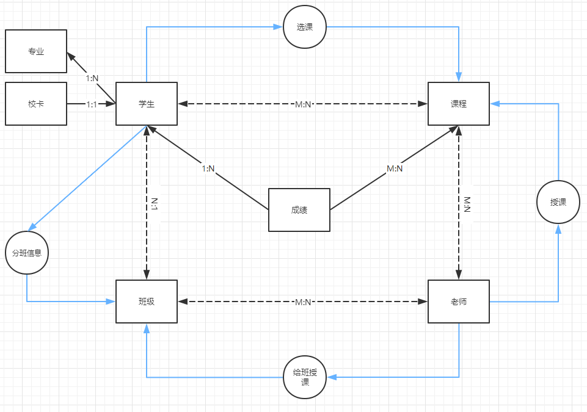
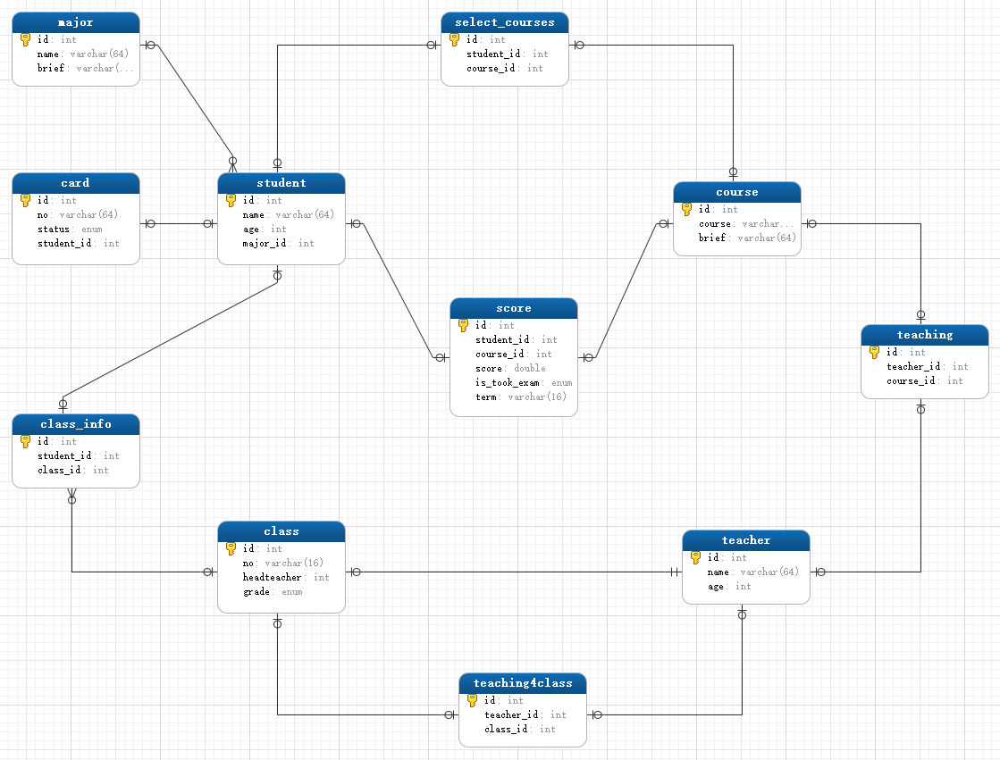
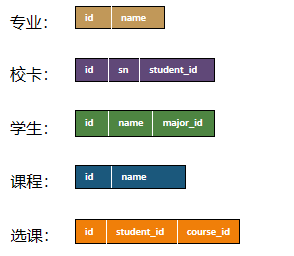
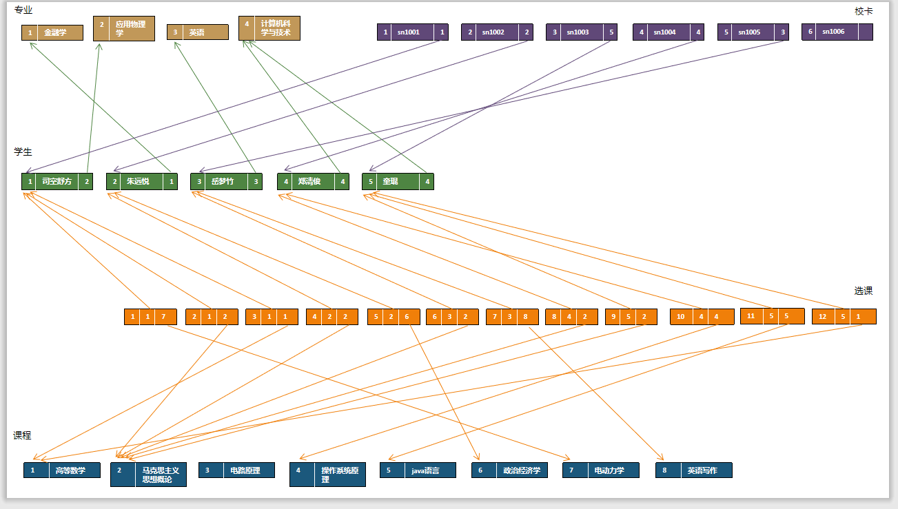

DDL数据定义语言.常见约束
==


## 常见约束
功能：用于限制表中的数据，为了保证表中的数据的准确性和可靠性

### 按功能分类(6大约束)
* not null
    ```text
    非空值约束，限制值不能为null，即必须填入数据。
    没有此约束表示该字段可以填写null，且可以多行都填null
    ```

* default 值
    ```text
    默认值约束， 保证该字段有默认值，插入数据是不填写此值时，自动为默认值
    ```

* primary key
    >主键约束，用于保证该字段的所有行的值都是唯一的，且不能为null值。相当于 唯一约束 + 非null值约束

* unique
    >值唯一约束，用于保证该字段的所有行的值都是唯一的，且最多允许有一个null值。

* check
    ```text
    检查约束约束，用于该字段检查插入的值是否符合check设置的表达式条件
    
   MySQL 8.0.16开始支持此约束，之前的版本虽然语法不报错，但不生效)
    check (表达式)
    
    参考 https://dev.mysql.com/doc/refman/8.0/en/create-table-check-constraints.html
    ```

* foreign key
    ```text
    外键约束，用于限制两个表的关系，用于保证子表该字段的值必须来自于父表关联列的值，引用父表对应列的值，例外之处：可以为null。
    在子表中添加外键约束
    ```

### 按作用范围分类
* 列级约束
    ```text
    6大约束在语法上都支持，但外键约束没有效果。可以多个约束组合使用，多个约束之间无顺序要求。
    不能起约束名
    ```
    

* 表级约束
    ```text
    除了not null、默认值约束外，其他的都可以(主键、唯一、外键、check)，
    可以起约束名，但primary key的不生效，它是默认的PRIMARY不变
    ```

* **通用写法**
    ```text
    便于阅读的写法：
    * primary key、not null、default、unique、check约束用列级，
    * 外键约束用表级
    ```
    ```text
    系统常用写法:
    (通过show create table 表名; 可以查看到，在导致mysql表结构中也能看到)
    
    * not null、default 值约束用列级
    * primary key、unique、check、foreign key用表级
    
    ```
    
### 添加约束的时机
* 创建表时
* 修改表时

### 主键约束、唯一约束、外键约束对比
类型      |保证唯一性   |值是否可为null值      |一个表中可有多少个这类约束   |是否可以多个字段组合 |其他
:--- |:--- |:--- |:--- |:--- |:---
主键约束  |是          |否                  |最多1个  |是，不推荐，组合的每个字段不许为null,组合的值唯一 |自动建立唯一索引。<br>key_name = PRIMARY
唯一约束  |是          |无not null限制情况下，允许多个null值    |可有多个  |是，不推荐，表示多个字段组合后的值是唯一 |会自动创建一个同名的唯一索，<br>该索引不能单独删除，删除约束会自动删除索引。<br>唯一约束是通过唯一索引来实现数据的唯一。
外键约束  |否          |无not null限制情况下，允许多个null值    |可有多个  |是 |


### 约束语法
```text
create table 表名 (
    字段名1 字段类型 列级约束,
    字段名2 字段类型,
    
    表级约束
);
```

### 创建表时添加约束
* 添加列级约束
    ```text
    ## 语法
    
    直接在列类型后追加,约束即可，可有多个约束
    只支持：默认约束、非空not null、主键、唯一、check
    ```

* 示例
    ```mysql
    USE test;
    
    CREATE TABLE major (
        id INT PRIMARY KEY,
        majorName VARCHAR (20)
    );
    
    CREATE TABLE stuinfo (
        id INT PRIMARY KEY, -- 主键
        `name` VARCHAR (32) NOT NULL UNIQUE, -- 非空值、唯一
        gender CHAR (1) CHECK(gender IN ('男', '女')), -- 检查约束
        seat INT UNIQUE, -- 唯一
        age INT DEFAULT 1, # 默认值
        majorId INT REFERENCES major (id) -- 外键
    );
    
    DESC stuinfo;
    
    -- 查看表中所有的约束，包括主键、外键、唯一键等
    SHOW INDEX FROM stuinfo;
    
    ```

* 添加表级约束
    ```text
    ## 语法
    在最后字段下面添加
    [constraint 约束名] 约束类型 (被约束的字段)
    
    * 主键的约束名只能为PRIMARY，即使指定了也不会生效，不会报错
    * 同一个库中的约束名不能重复
    ```

* 示例
    ```mysql
    DROP TABLE IF EXISTS stuinfo;
    CREATE TABLE stuinfo (
        id INT,
        `name` VARCHAR(32),
        gender CHAR(1),
        seat INT,
        age INT,
        majorId INT,
        
        CONSTRAINT pk PRIMARY KEY (id),  -- 主键，主键约束名只能为PRIMARY，所以即使这是约束名也不生效
        CONSTRAINT uq UNIQUE (seat), -- 唯一
        CONSTRAINT ck CHECK (gender = '男' OR gender = '女'), -- 检查约束
        CONSTRAINT stuinfo__majorId_fk_major__id FOREIGN KEY (majorId) REFERENCES major (id), -- 外键
        CONSTRAINT uq_name_seat UNIQUE (`name`, seat) -- 组合的唯一约束
    );
    
    DESC stuinfo;
    SHOW INDEX FROM stuinfo;
    
    INSERT INTO major VALUES
    (1, 'python'),
    (2, 'java')
    ;
    
    INSERT INTO stuinfo VALUES (1, 'lily', '中', 3, 18, 1);
    ```


### 修改表时添加约束
* 添加列级约束语法
    ```text
    alter table 表名 modify column 字段名 字段烈性 约束;
    ```

* 添加表及约束语法
    ```text
    alter table 表名 add [constraint 约束名] 约束类型 (字段名);
    ```

* 添加外键语法
    ```text
    alter table 表名 add [constraint 约束名] foreign key (本表关联的字段名) references 父表名 (父表中关联的列名);
    ```

* 示例
    ```mysql
    DROP TABLE IF EXISTS stuinfo;
    
    CREATE TABLE stuinfo (
        id INT,
        `name` VARCHAR(32),
        gender CHAR(1),
        seat INT,
        age INT,
        majorId INT
    );
    
    DESC stuinfo;
    SHOW INDEX FROM stuinfo;
    ```

* 添加非空值约束
    ```mysql
    ALTER TABLE stuinfo MODIFY COLUMN `name` VARCHAR(32) NOT NULL;
    ```

* 添加默认值约束
    ```mysql
    ALTER TABLE stuinfo MODIFY COLUMN age INT DEFAULT 1;
    ```

* 添加主键约束
    * 列级约束方式
        ```mysql
        ALTER TABLE stuinfo MODIFY COLUMN id INT PRIMARY KEY;
        ```

    * 表级约束方式
        ```mysql
        ALTER TABLE stuinfo ADD PRIMARY KEY (id);
        ```

* 添加值唯一约束
    * 列级约束方式
        ```mysql
        ALTER TABLE stuinfo MODIFY COLUMN seat INT UNIQUE;
        ```

    * 表级约束方式
        ```mysql
        ALTER TABLE stuinfo ADD UNIQUE (seat);
        ```

* 添加外键约束
    ```mysql
    ALTER TABLE stuinfo ADD CONSTRAINT stuinfo__majorId_fk_major__id 
    FOREIGN KEY (majorId) REFERENCES major (id);
    ```

* 添加检查约束
    ```mysql
    ALTER TABLE stuinfo ADD CONSTRAINT stuinfo_ck_gender CHECK (gender IN ('男', '女'));
    ```

### 修改表时删除约束

* 删除非空值约束
    ```mysql
    ALTER TABLE stuinfo MODIFY COLUMN `name` VARCHAR(32);
    ```

* 删除默认值约束
    >ALTER TABLE stuinfo MODIFY COLUMN age INT;

* 删除主键约束
    >ALTER TABLE stuinfo DROP PRIMARY KEY;

* 删除值唯一约束
    >ALTER TABLE stuinfo DROP INDEX seat;

* 删除外键约束
    ```mysql
    ALTER TABLE stuinfo DROP FOREIGN KEY stuinfo__majorId_fk_major__id; -- 执行了这步后，外键已删除，此key:stuinfo__majorId_fk_major__id 还在
    ALTER TABLE stuinfo DROP KEY stuinfo__majorId_fk_major__id; -- 对于取了约束名的还要执行这步
    ```
    
* 删除检查约束
    ```mysql
    ALTER TABLE stuinfo DROP CHECK stuinfo_ck_gender;
    
    
    DESC stuinfo;
    
    SHOW INDEX FROM stuinfo;
    
    SHOW CREATE TABLE stuinfo;
    ```

### 自增长列(标识列)
```text
功能：不用手动插入值，系统提供默认的序列值

关键字：AUTO_INCREMENT

可用alter table table_name AUTO_INCREMENT=n 命令来重设自增的起始值，n ∈ N+
```

* 标识列特点
    * 标识列必须与主键搭配吗？ --不一定，但必须是一个key
    * 一个表最多只能有一个标识列
    * 标识列的类型只能是数值型的，可以是整型、浮点型。当类型为浮点型是当整型来处理序列值
    * 默认的步长值、起始值都为1，是全局的变量
    * 标识列可以通过 `set auto auto_increment_increment = 步长值;` 设置步长
        可以通过 手动插入值来设置起始值
    * 设置为标识列的类自动添加了非null值约束
    * 自动产生的自增序列值为正整数
    
* 创建表示设置自增涨列(标识列)
    ```mysql
    SHOW VARIABLES LIKE '%auto_increment%';
    
    CREATE TABLE tab_increment (
        id INT PRIMARY KEY AUTO_INCREMENT,
        `name` VARCHAR(20),
        seat FLOAT
    );
    
    SHOW CREATE TABLE tab_increment;
    
    INSERT INTO tab_increment VALUES 
    (NULL, 'sary', 1.0),
    (NULL, 'coco', 2.0),
    (NULL, 'eliby', 1.0)
    ;
    
    SELECT * FROM tab_increment;
    
    INSERT INTO tab_increment (`name`, seat) VALUES 
    ('jency', 1.0),
    ('pooker', 2.0),
    ('marry', 1.0);
    
    
    -- float类型的自增长列
    CREATE TABLE tab_increment2 (
        id INT,
        `name` VARCHAR(20),
        seat FLOAT UNIQUE AUTO_INCREMENT
    );
    
    SHOW CREATE TABLE tab_increment2;
    
    INSERT INTO  tab_increment2 (id, NAME) VALUES
    (3, 'gogo'),
    (4, 'bili'),
    (5, 'kiki')
    ;
    INSERT INTO  tab_increment2 VALUES (5, 'kiki', 5.2);
    INSERT INTO  tab_increment2 VALUES (7, 'aa1', NULL);
    
    SELECT * FROM tab_increment2;
    
    
    -- 
    CREATE TABLE tab_increment3 (
        id INT PRIMARY KEY AUTO_INCREMENT,
        cname VARCHAR(32)
    );
    
    SHOW CREATE TABLE tab_increment3;
    
    INSERT INTO tab_increment3 VALUES (-10, 'dada');
    
    SELECT * FROM tab_increment3;
    
    INSERT INTO tab_increment3 VALUES (NULL, 'didi'); -- 1
    
    
    DELETE FROM tab_increment3;
    ALTER TABLE tab_increment3 AUTO_INCREMENT=1; -- 可设置AUTO_INCREMENT的=值
    ```
* 设置表的AUTO_INCREMENT的初始值

    默认情况下，表的 AUTO_INCREMENT 初始值为 1
    * 语法
        ```
        ALTER TABLE 库名.表名 AUTO_INCREMENT=<自增初始值>;
        ```
    * 示例
        ```mysql
        -- 查看当前表的 AUTO_INCREMENT
        use mysql;
        
        SELECT AUTO_INCREMENT
        FROM information_schema.TABLES
        WHERE TABLE_SCHEMA='库名'
        AND TABLE_NAME='表名';
        
        -- 更改表的 AUTO_INCREMENT 初始值
        ALTER TABLE 库名.表名 AUTO_INCREMENT=<自增初始值_Int>;
        ```
* 设置 AUTO_INCREMENT 自增步长
    ```mysql
    ALTER TABLE <table> AUTO_INCREMENT = <your_value>;
    ```
* 禁用表的自增功能

    有时候，我们可能需要禁用自增字段的功能，例如在导入数据时避免自动生成的自增值。在MySQL中，可以使用以下代码禁用自增字段的功能
    ```
    ALTER TABLE 库名.表名 MODIFY <列名> INT NOT NULL;
    ```

### foreign key外键约束
外键的作用：限制子表中该列的值只能在父表的参考列所有记录值集合内，还能是NULL，不能是其他的值，作用：限制子表外键列值的可选值范围。  
功能类似于enum类型的字段的单选

* [语法:](https://dev.mysql.com/doc/refman/8.0/en/create-table-foreign-keys.html)
    ```text
    CONSTRAINT 约束名 FOREIGN KEY (本表关联字段) REFERENCES 父表 (关联的字段)

    key也可以是组合的:
    CONSTRAINT 约束名 FOREIGN KEY (本表关联字段列表) REFERENCES 父表 (关联的字段列表)

    REFERENCES 后面的表为父表(父表)，当前表(本表)为子表，或叫子表
    ```
    
    ```text
    [CONSTRAINT [symbol]] FOREIGN KEY
        [index_name] (col_name, ...)
        REFERENCES tbl_name (col_name,...)
        [ON DELETE reference_option]
        [ON UPDATE reference_option]
    
    reference_option:
        RESTRICT | CASCADE | SET NULL | NO ACTION | SET DEFAULT
    ```

* 外键为组合键示例
    ```mysql
    -- 父表
    CREATE TABLE classes (
        id INT,
        `name` VARCHAR(20),
        number INT,
        PRIMARY KEY (`name`, number)
    );
    
    DESC classes;
    
    -- 子表
    DROP TABLE IF EXISTS student; 
    CREATE TABLE student (
        id INT PRIMARY KEY AUTO_INCREMENT,
        `name` VARCHAR(32),
        classes_name VARCHAR(20),
        classes_number INT,
        
        CONSTRAINT student_fk_classes FOREIGN KEY (classes_name, classes_number)
        REFERENCES classes (`name`, number)
    );
    
    SHOW CREATE TABLE student;
    
    INSERT INTO classes VALUES
    (1, 'c191', 191),
    (2, 'c192', 192),
    (3, 'c193', 193);
    
    
    
    INSERT INTO student (classes_name, classes_number, `name`) VALUES ('c193', 193, '张杨');
    
    INSERT INTO student
    SELECT NULL, '黑蒙', c.name, c.number
    FROM classes c
    WHERE number = 191
    ;
    
    INSERT INTO student (classes_name, classes_number, `name`) VALUES ('c193', 194, '王丰'); -- 插入失败
    
    
    SELECT * FROM student;
    ```
#### 外键特点
* **只能在子表设置外键约束**
* 子表的外键列的类型与父表的关联列的类型要求一致或兼容，列名相同或不同均可
* 父表的关联列必须是一个key(一般是主键或唯一键)
* 插入数据时，先插入父表数据，再插入子表数据
* 删除数据时，先删除子表数据，再删除父表数据
* 子表外键列的值允许为null

#### 表之间的关系与外键约束
* 多对一关系(一对多关系)
    ```text
    子表:父表 = N:1
    
    默认情况
  
    当外键为单列时，子表中该列值只能从父表中的关联列值集合里选一个值，属于单选，但可以为NULL。
    功能类似于enum类型的字段单选。
    ```
* 多对多关系
    ```text
    子表:父表 = M:N
    
    类似多选项效果，但与set类型字段原理不一样，不是在一个字段上填写多个参考列值，而是在关系表中添加多条关系映射记录
    实现方法：在两表中设置主键，再新建一张关系表，设置两个外键，分别关联这两张表的主键
    ```
* 一对一关系
    ```text
    子表:父表 = 1:1
    
    实现方法：
        多对一关系基础上，在子表外键字段上添加一个unique约束
    ```

* 表自关联
    ```text
    子表的外键参考key来自于本表，本表即做父表，也做子表  
  
    如企业为了招人，这时候就给推荐人来的员工奖励，这时候需要记录员工的推荐人。
    如果用一张"员工表"来记员工信息，这时推荐人也是在"员工表"里
    ```
    示例
    ```mysql
    -- 创建表
    CREATE TABLE employee (
        id INT PRIMARY KEY AUTO_INCREMENT,
        `name` VARCHAR(64) NOT NULL COMMENT '姓名',
        age INT COMMENT '年龄',
        base_salary DOUBLE(10, 2) COMMENT '底薪',
        referee_id INT COMMENT '推荐人',
        -- 自关联，REFERENCES 本表名 (本表的字段列表)
        CONSTRAINT employee__referee_id__fk__employee__id FOREIGN KEY (referee_id) REFERENCES employee (id) ON DELETE SET NULL ON UPDATE CASCADE
    ) COMMENT='员工表';
    
    -- 插入无推荐人的员工信息
    INSERT INTO employee (`name`, age, base_salary, referee_id) VALUES
    ('王强', 27, 6000, NULL),
    ('马四', 28, 8000, NULL),
    ('张飞', 28, 8000, NULL)
    ;
    
    -- 插入有推荐人的员工信息
    SELECT * FROM employee;
    INSERT INTO employee (`name`, age, base_salary, referee_id) VALUES
    ('赵君', 25, 10000, 2)
    ;
    
    -- 查询员工信息，并把推荐人姓名查询出来
    SELECT em.*, ref.name '推荐人'
    FROM employee AS em
    LEFT OUTER JOIN employee ref
    ON em.referee_id = ref.id
    WHERE em.referee_id IS NOT NULL
    ;
    ```
    
* 总结
    ```text
    其实表与表之间的关系是多对一、一对多、多对多，是由子表上的UNIQUE唯一约束控制的。
    
    子表中的一个外键就，相当于一个由此指向父表记录的指针
    
    使用连接查询来查询数据
    ```

* shool示例

    表关系设计图  
      
    
    表关系模型图_navicat premium  
      
    
    [创建表、插入数据sql脚本](../sql/shool.sql)
    
    图示：  
    
    


#### sql外键on delete和on update
```text
on delete：表示当删除父表中一条记录时，关联了此记录的子表中的记录的外键列值如何处理

on update：表示当更新父表中一条记录的子表参考列的值时，关联了此记录的子表中的记录的外键列值如何处理

子表参的key，一般是父表的主键或唯一key。
当父表中的一条记录被子表中的记录了关联了，默认情况下，父表中该记录不能被删除、也不能更新该记录的外键参考列的值
```

on delete和on update后面可以加5个动作(实际就3中：默认、级联、置空操作)
* RESTRICT
    ```text
    阻止父表的删除或更新操作
    父表在要删除记录或更新记录参考列值的时候，若子表中有记录关联到此记录，则阻止删除或更新，反之才可删除或更新。
    与不写on delete 或on update子句的效果相同。mysql的默认情况
    
    显示指定 RESTRICT或NO ACTION，在SHOW CREATE TABLE或mysqldump导出sql是不会显示此关键字，因为是默认的情况
    ```

* CASCADE
    ```text
    表示级联操作，父表中被参考字段更新了，子表中也更新;父表中该记录删除了，子表中关联的记录也自动删除
    
    语法示例：
    CONSTRAINT 约束名 FOREIGN KEY (本表关联字段) REFERENCES 父表 (关联的字段) ON DELETE CASCADE
    ```

* SET NULL
    ```text
    子表中该记录的外键列值 设置为NULL，要求：该外键允许为NULL值，即没有NOT NULL限制
    
    语法示例：
    CONSTRAINT 约束名 FOREIGN KEY (本表关联字段) REFERENCES 父表 (关联的字段) ON DELETE SET NULL
    ```
    
* NO ACTION
    >同RESTRICT，sql标准的关键字

* SET DEFAULT
    >设置默认值。此操作由mysql的解析器识别， InnoDB 和 NDB引擎不支持此操作

**示例**  
* 级联删除(ON DELETE CASCADE)
    当删除父表中的记录时，子表中关联此记录的相关记录也被自动同时删除
    ```mysql
    DROP TABLE IF EXISTS major;
    CREATE TABLE major1 ( -- 父表
        id INT PRIMARY KEY,
        `name` VARCHAR(20)
    );
    
    DROP TABLE IF EXISTS stu1;
    CREATE TABLE stu1 (
        id INT PRIMARY KEY AUTO_INCREMENT,
        `name` VARCHAR(32),
        major_id INT,
        CONSTRAINT stu1__major_id_fk_major1__id FOREIGN KEY (major_id) REFERENCES major1 (id) ON DELETE CASCADE
    );
    
    SHOW CREATE TABLE stu1;
    
    INSERT INTO major1 VALUES
    (1, 'java'),
    (2, 'GO'),
    (3, 'python');
    
    SELECT * FROM major1;
    
    
    INSERT INTO stu1 VALUES
    (NULL, 'jacy1', 1),
    (NULL, 'jacy2', 1),
    (NULL, 'jacy3', 2),
    (NULL, 'jacy4', 2),
    (NULL, 'jacy5', 1),
    (NULL, 'jacy6', 1),
    (NULL, 'jacy7', 3),
    (NULL, 'jacy8', 1),
    (NULL, 'jacy9', 1),
    (NULL, 'jacy10', 3),
    (NULL, 'jacy11', 1);
    
    SELECT * FROM stu1;
    
    DELETE FROM major1 WHERE id = 3;
    SELECT * FROM stu1;
    ```

* 置空ON DELETE SET NULL  
    当删除父表中的记录时，子表中关联此记录的相关记录外键列值也被自动同时设置为null值，子表记录不会被删除
    ```mysql
    DROP TABLE IF EXISTS stu1;
    CREATE TABLE stu1 (
        id INT PRIMARY KEY AUTO_INCREMENT,
        `name` VARCHAR(32),
        major_id INT DEFAULT 1,
        CONSTRAINT stu1__major_id_fk_major1__id FOREIGN KEY (major_id) REFERENCES major1 (id) ON DELETE SET NULL
    );
    
    SHOW CREATE TABLE stu1;
    INSERT INTO stu1 VALUES
    (NULL, 'jacy1', 1),
    (NULL, 'jacy2', 1),
    (NULL, 'jacy3', 2),
    (NULL, 'jacy4', 2),
    (NULL, 'jacy5', 1),
    (NULL, 'jacy6', 1),
    (NULL, 'jacy8', 1),
    (NULL, 'jacy9', 1),
    (NULL, 'jacy11', 1);
    
    SELECT * FROM stu1;
    
    DELETE FROM major1 WHERE id = 1;
    
    SELECT * FROM stu1;
    ```

#### 删除被关联的父表或修改其表结构方法
```text
Mysql中如果表和表之间建立了外键约束，则无法删除表及修改表结构

解决方法：
=======

1. 在Mysql中取消外键约束: SET FOREIGN_KEY_CHECKS = 0;

2. 将父表原来的数据导出到sql语句，重新创建此表后，再把数据使用sql导入。

3. 再开启外键约束: SET FOREIGN_KEY_CHECKS = 1;
```
