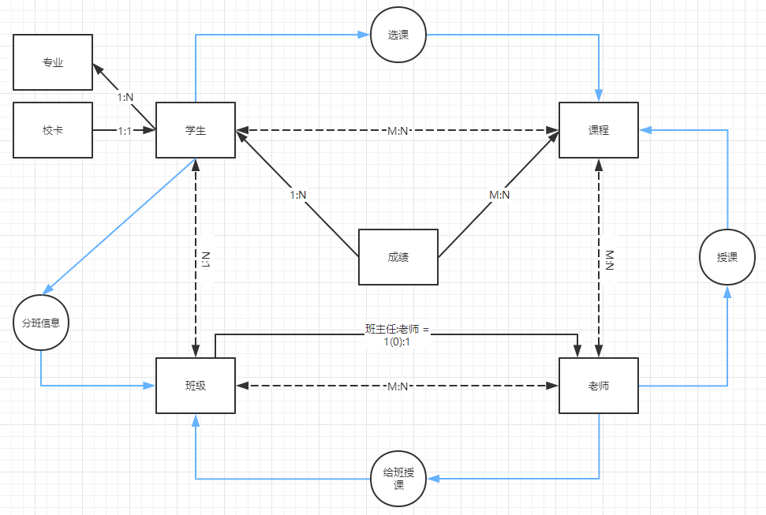

DDL数据定义语言.常见约束
==


## 常见约束
功能：用于限制表中的数据，为了保证表中的数据的准确性和可靠性

### 按功能分类(6大约束)
* not null
    ```text
    非空值约束，限制值不能为null，即必须填入数据。
    没有此约束表示该字段可以填写null，且可以多行都填null
    ```

* default 值
    ```text
    默认值约束， 保证该字段有默认值，插入数据是不填写此值时，自动为默认值
    ```

* primary key
    >主键约束，用于保证该字段的所有行的值都是唯一的，且不能为null值。相当于 唯一约束 + 非null值约束

* unique
    >值唯一约束，用于保证该字段的所有行的值都是唯一的，且最多允许有一个null值。

* check
    ```text
    检查约束约束，用于该字段检查插入的值是否符合check设置的表达式条件
    
   MySQL 8.0.16开始支持此约束，之前的版本虽然语法不报错，但不生效)
    check (表达式)
    
    参考 https://dev.mysql.com/doc/refman/8.0/en/create-table-check-constraints.html
    ```

* foreign key
    ```text
    外键约束，用于限制两个表的关系，用于保证子表该字段的值必须来自于父表关联列的值，引用父表对应列的值，例外支出：可以为null。
    在子表中添加外键约束
    ```

### 按作用范围分类
* 列级约束
    ```text
    6大约束在语法上都支持，但外键约束没有效果。可以多个约束组合使用，多个约束之间无顺序要求。
    不能起约束名
    ```
    

* 表级约束
    ```text
    除了not null、默认值约束外，其他的都可以(主键、唯一、外键、check)，
    可以起约束名，但primary key的不生效，它是默认的PRIMARY不变
    ```

* **通用写法**
    ```text
    便于阅读的写法：
    * primary key、not null、default、unique、check约束用列级，
    * 外键约束用表级
    ```
    ```text
    系统常用写法:
    (通过show create table 表名; 可以查看到，在导致mysql表结构中也能看到)
    
    * not null、default 值约束用列级
    * primary key、unique、check、foreign key用表级
    
    ```
    
### 添加约束的时机
* 创建表时
* 修改表时

### 主键约束、唯一约束、外键约束对比
类型      |保证唯一性   |值是否可为null值      |一个表中可有多少个这类约束   |是否可以多个字段组合
:--- |:--- |:--- |:--- |:---
主键约束  |是          |否                  |最多1个  |是，不推荐，组合的每个字段不许为null,组合的值唯一
唯一约束  |是          |无not null限制情况下，允许多个null值    |可有多个  |是，不推荐，表示多个字段组合后的值是唯一
外键约束  |否          |无not null限制情况下，允许多个null值    |可有多个  |是


### 约束语法
```text
create table 表名 (
    字段名1 字段类型 列级约束,
    字段名2 字段类型,
    
    表级约束
);
```

### 创建表时添加约束
* 添加列级约束
    ```text
    ## 语法
    
    直接在列类型后追加,约束即可，可有多个约束
    只支持：默认约束、非空not null、主键、唯一、check
    ```

* 示例
    ```mysql
    USE test;
    
    CREATE TABLE major (
        id INT PRIMARY KEY,
        majorName VARCHAR (20)
    );
    
    CREATE TABLE stuinfo (
        id INT PRIMARY KEY, -- 主键
        `name` VARCHAR (32) NOT NULL UNIQUE, -- 非空值、唯一
        gender CHAR (1) CHECK(gender IN ('男', '女')), -- 检查约束
        seat INT UNIQUE, -- 唯一
        age INT DEFAULT 1, # 默认值
        majorId INT REFERENCES major (id) -- 外键
    );
    
    DESC stuinfo;
    
    -- 查看表中所有的约束，包括主键、外键、唯一键等
    SHOW INDEX FROM stuinfo;
    
    ```

* 添加表级约束
    ```text
    ## 语法
    在最后字段下面添加
    [constraint 约束名] 约束类型 (被约束的字段)
    
    * 主键的约束名只能为PRIMARY，即使指定了也不会生效，不会报错
    * 同一个表中的约束名不能重复
    ```

* 示例
    ```mysql
    DROP TABLE IF EXISTS stuinfo;
    CREATE TABLE stuinfo (
        id INT,
        `name` VARCHAR(32),
        gender CHAR(1),
        seat INT,
        age INT,
        majorId INT,
        
        CONSTRAINT pk PRIMARY KEY (id),  -- 主键，主键约束名只能为PRIMARY，所以即使这是约束名也不生效
        CONSTRAINT uq UNIQUE (seat), -- 唯一
        CONSTRAINT ck CHECK (gender = '男' OR gender = '女'), -- 检查约束
        CONSTRAINT stuinfo__majorId_fk_major__id FOREIGN KEY (majorId) REFERENCES major (id), -- 外键
        CONSTRAINT uq_name_seat UNIQUE (`name`, seat) -- 组合的唯一约束
    );
    
    DESC stuinfo;
    SHOW INDEX FROM stuinfo;
    
    INSERT INTO major VALUES
    (1, 'python'),
    (2, 'java')
    ;
    
    INSERT INTO stuinfo VALUES (1, 'lily', '中', 3, 18, 1);
    ```


### 修改表时添加约束
* 添加列级约束语法
    ```text
    alter table 表名 modify column 字段名 字段烈性 约束;
    ```

* 添加表及约束语法
    ```text
    alter table 表名 add [constraint 约束名] 约束类型 (字段名);
    ```

* 添加外键语法
    ```text
    alter table 表名 add [constraint 约束名] foreign key (本表关联的字段名) references 父表名 (父表中关联的列名);
    ```

* 示例
    ```mysql
    DROP TABLE IF EXISTS stuinfo;
    
    CREATE TABLE stuinfo (
        id INT,
        `name` VARCHAR(32),
        gender CHAR(1),
        seat INT,
        age INT,
        majorId INT
    );
    
    DESC stuinfo;
    SHOW INDEX FROM stuinfo;
    ```

* 添加非空值约束
    ```mysql
    ALTER TABLE stuinfo MODIFY COLUMN `name` VARCHAR(32) NOT NULL;
    ```

* 添加默认值约束
    ```mysql
    ALTER TABLE stuinfo MODIFY COLUMN age INT DEFAULT 1;
    ```

* 添加主键约束
    * 列级约束方式
        ```mysql
        ALTER TABLE stuinfo MODIFY COLUMN id INT PRIMARY KEY;
        ```

    * 表级约束方式
        ```mysql
        ALTER TABLE stuinfo ADD PRIMARY KEY (id);
        ```

* 添加值唯一约束
    * 列级约束方式
        ```mysql
        ALTER TABLE stuinfo MODIFY COLUMN seat INT UNIQUE;
        ```

    * 表级约束方式
        ```mysql
        ALTER TABLE stuinfo ADD UNIQUE (seat);
        ```

* 添加外键约束
    ```mysql
    ALTER TABLE stuinfo ADD CONSTRAINT stuinfo__majorId_fk_major__id 
    FOREIGN KEY (majorId) REFERENCES major (id);
    ```

* 添加检查约束
    ```mysql
    ALTER TABLE stuinfo ADD CONSTRAINT stuinfo_ck_gender CHECK (gender IN ('男', '女'));
    ```

### 修改表时删除约束

* 删除非空值约束
    ```mysql
    ALTER TABLE stuinfo MODIFY COLUMN `name` VARCHAR(32);
    ```

* 删除默认值约束
    >ALTER TABLE stuinfo MODIFY COLUMN age INT;

* 删除主键约束
    >ALTER TABLE stuinfo DROP PRIMARY KEY;

* 删除值唯一约束
    >ALTER TABLE stuinfo DROP INDEX seat;

* 删除外键约束
    ```mysql
    ALTER TABLE stuinfo DROP FOREIGN KEY stuinfo__majorId_fk_major__id; -- 执行了这步后，外键已删除，此key:stuinfo__majorId_fk_major__id 还在
    ALTER TABLE stuinfo DROP KEY stuinfo__majorId_fk_major__id; -- 对于取了约束名的还要执行这步
    ```
    
* 删除检查约束
    ```mysql
    ALTER TABLE stuinfo DROP CHECK stuinfo_ck_gender;
    
    
    DESC stuinfo;
    
    SHOW INDEX FROM stuinfo;
    
    SHOW CREATE TABLE stuinfo;
    ```

### 自增长列(标识列)
```text
功能：不用手动插入值，系统提供默认的序列值

关键字：AUTO_INCREMENT

可用alter table table_name AUTO_INCREMENT=n 命令来重设自增的起始值，n ∈ N+
```

* 标识列特点
    * 标识列必须与主键搭配吗？ --不一定，但必须是一个key
    * 一个表最多只能有一个标识列
    * 标识列的类型只能是数值型的，可以是整型、浮点型。当类型为浮点型是当整型来处理序列值
    * 默认的步长值、起始值都为1，是全局的变量
    * 表示列可以通过 set auto auto_increment_increment = 步长值; 设置步长
        可以通过 手动插入值来设置起始值
    * 设置为标识列的类自动添加了非null值约束
    * 自动产生的自增序列值为正整数

* 创建表示设置自增涨列(标识列)
    ```mysql
    SHOW VARIABLES LIKE '%auto_increment%';
    
    CREATE TABLE tab_increment (
        id INT PRIMARY KEY AUTO_INCREMENT,
        `name` VARCHAR(20),
        seat FLOAT
    );
    
    SHOW CREATE TABLE tab_increment;
    
    INSERT INTO tab_increment VALUES 
    (NULL, 'sary', 1.0),
    (NULL, 'coco', 2.0),
    (NULL, 'eliby', 1.0)
    ;
    
    SELECT * FROM tab_increment;
    
    INSERT INTO tab_increment (`name`, seat) VALUES 
    ('jency', 1.0),
    ('pooker', 2.0),
    ('marry', 1.0);
    
    
    -- float类型的自增长列
    CREATE TABLE tab_increment2 (
        id INT,
        `name` VARCHAR(20),
        seat FLOAT UNIQUE AUTO_INCREMENT
    );
    
    SHOW CREATE TABLE tab_increment2;
    
    INSERT INTO  tab_increment2 (id, NAME) VALUES
    (3, 'gogo'),
    (4, 'bili'),
    (5, 'kiki')
    ;
    INSERT INTO  tab_increment2 VALUES (5, 'kiki', 5.2);
    INSERT INTO  tab_increment2 VALUES (7, 'aa1', NULL);
    
    SELECT * FROM tab_increment2;
    
    
    -- 
    CREATE TABLE tab_increment3 (
        id INT PRIMARY KEY AUTO_INCREMENT,
        cname VARCHAR(32)
    );
    
    SHOW CREATE TABLE tab_increment3;
    
    INSERT INTO tab_increment3 VALUES (-10, 'dada');
    
    SELECT * FROM tab_increment3;
    
    INSERT INTO tab_increment3 VALUES (NULL, 'didi'); -- 1
    
    
    DELETE FROM tab_increment3;
    ALTER TABLE tab_increment3 AUTO_INCREMENT=1; -- 可设置AUTO_INCREMENT的=值
    ```

### 外键特点
外键的作用：限制子表中该列的值只能在父表的参考列所有记录值集合内，还能是NULL，不能是其他的值，作用：限制子表外键列值的可选值范围。  
功能类似于enum类型的字段的单选

* 语法
    ```text
    CONSTRAINT 约束名 FOREIGN KEY (本表关联字段) REFERENCES 父表 (关联的字段)

    也可以是组合的:
    CONSTRAINT 约束名 FOREIGN KEY (本表关联字段列表) REFERENCES 父表 (关联的字段列表)

    REFERENCES 后面的表为父表(父表)，当前表(本表)为子表，或叫子表
    ```
* **只能在子表设置外键约束**
* 子表的外键列的类型与父表的关联列的类型要求一致或兼容，列名相同或不同均可
* 父表的关联列必须是一个key(一般是主键或唯一键)
* 插入数据时，先插入父表数据，再插入子表数据
* 删除数据时，先删除子表数据，再删除父表数据
* 子表外键列的值允许为null

#### 表与表之间的关系与外键约束
* 多对一关系(一对多关系)
    ```text
    子表:父表 = N:1
    
    默认情况
  
    当外键为单列时，子表中该列值只能从父表中的关联列值集合里选一个值，属于单选，但可以为NULL。
    功能类似于enum类型的字段单选。
    ```
* 多对多关系
    ```text
    子表:父表 = M:N
    
    类似多选项效果，但与set类型字段原理不一样，不是在一个字段上填写多个参考列值，而是在关系表中添加多条关系映射记录
    实现方法：在两表中设置主键，再新建一张关系表，设置两个外键，分别关联这两张表的主键
    ```
* 一对一关系
    ```text
    子表:父表 = 1:1
    
    实现方法：
        多对一关系基础上，在子表外键字段上添加一个unique约束
    ```

**示例**

表关系设计图  
  

表关系模型图_navicat premium  
  


sql脚本示例  
```sql
CREATE TABLE major (
    id INT PRIMARY KEY AUTO_INCREMENT,
    `name` VARCHAR(64) NOT NULL COMMENT '专业名称',
    brief VARCHAR(255) NOT NULL COMMENT '专业简介'
) COMMENT '专业表';

-- [学生]与[专业]为多对一关系
CREATE TABLE student (
    id INT PRIMARY KEY AUTO_INCREMENT,
    `name` VARCHAR(64) NOT NULL COMMENT '姓名',
    age INT COMMENT '年龄',
    major_id INT COMMENT '所选专业ID', -- 一个学生只能选择一个专业
    CONSTRAINT student__major_id__fk__major__id FOREIGN KEY (major_id) REFERENCES major (id) ON DELETE SET NULL ON UPDATE CASCADE
);

CREATE TABLE course (
    id INT PRIMARY KEY AUTO_INCREMENT,
    course VARCHAR(64) NOT NULL COMMENT '课程名',
    brief VARCHAR(64) NOT NULL COMMENT '简介'
) COMMENT '课程表';

CREATE TABLE teacher (
    id INT PRIMARY KEY AUTO_INCREMENT,
    `name` VARCHAR(64) NOT NULL COMMENT '姓名',
    age INT COMMENT '年龄'
);


-- 校卡表, [校卡]与[学生]为一对一关系
CREATE TABLE card (
    id INT PRIMARY KEY AUTO_INCREMENT,
    `no` VARCHAR(64) NOT NULL UNIQUE COMMENT '卡编号',
    `status` ENUM ('on', 'off', 'deprecated') COMMENT '卡状态',
    -- 一张卡只能绑定一个学生。为了卡可以回收利用，所以要允许卡不绑定学生ID，也就是student_id要允许为NULL。UNIQUE约束列可以有多个NULL值
    -- 因为id唯一、student_id唯一(排除NULL值)，所以[校卡]与[学生]关系为 一对一关系
    student_id INT UNIQUE COMMENT '学生ID', 
    
    CONSTRAINT card__student_id__fk__student__id FOREIGN KEY (student_id) REFERENCES student (id) ON DELETE SET NULL ON UPDATE CASCADE
) COMMENT '校卡表';

CREATE TABLE class (
    id INT PRIMARY KEY AUTO_INCREMENT,
    `no` VARCHAR(16) NOT NULL COMMENT '班级编号',
    headteacher INT NOT NULL COMMENT '班主任', -- 每个班必须有班主任
    grade ENUM('g1', 'g2', 'g3', 'g4', 'g5', 'g6', 'g7', 'g8', 'g9', 'g10', 'g11', 'g12'),
    -- 一个老师只能带一个班，或不带班，所以不能重复。(班级 与 班主任的关系：一对一关系)
    UNIQUE KEY headteacher__uniq (headteacher),
    CONSTRAINT class__headteacher__fk__teacher__id FOREIGN KEY (headteacher) REFERENCES teacher (id) ON UPDATE CASCADE
) COMMENT '班级表';


-- 选课表：[学生]与[课程]为多对多关系
CREATE TABLE select_courses (
    id INT PRIMARY KEY AUTO_INCREMENT,
    student_id INT COMMENT '学生ID',
    course_id INT COMMENT '课程ID',
    -- 同一个学生选择同一门课程的记录不能重复。如果其他一些业务需求是可重复的，则不加unique约束
    UNIQUE KEY student_id__uniq__course_id (student_id, course_id),
    /*
    ON DELETE SET NULL：当删除了此记录关联的student记录时，此记录的student_id 设置为NULL
    ON UPDATE CASCADE：当更新了此记录关联的student记录的id值时，此记录的student_id 自动更新为相应的新值
    
    下面的作用类似
    */
    CONSTRAINT select_courses__student_id__fk__teacher__id FOREIGN KEY (student_id) REFERENCES student (id) ON DELETE SET NULL ON UPDATE CASCADE,
    CONSTRAINT select_courses__course_id__fk__course__id FOREIGN KEY (course_id) REFERENCES course (id) ON DELETE SET NULL ON UPDATE CASCADE
) COMMENT '学生选课关系表';

-- 老师授课表：[老师]与[课程]的多对多关系
CREATE TABLE teaching (
    id INT PRIMARY KEY AUTO_INCREMENT,
    teacher_id INT COMMENT '老师ID',
    course_id INT COMMENT '授课的课程ID',
    -- 同一个老师教同一门课的记录不能重复
    UNIQUE KEY teacher_id__uniq__course_id (teacher_id, course_id),
    CONSTRAINT teaching__teacher_id__fk__teacher__id FOREIGN KEY (teacher_id) REFERENCES teacher (id) ON DELETE SET NULL ON UPDATE CASCADE,
    CONSTRAINT teaching__course_id__fk__course__id FOREIGN KEY (course_id) REFERENCES course (id) ON DELETE SET NULL ON UPDATE CASCADE
) COMMENT '老师授课表';

-- 教师给班级授课表: [老师]与[班级]的多对多关系
CREATE TABLE teaching4class (
    id INT PRIMARY KEY AUTO_INCREMENT,
    teacher_id INT COMMENT '老师ID',
    class_id INT COMMENT '班级ID',
    -- 同一个老师教同一班级的记录不能重复
    UNIQUE KEY teacher_id__uniq__class_id (teacher_id, class_id),
    CONSTRAINT teaching4class__teacher_id__fk__teacher__id FOREIGN KEY (teacher_id) REFERENCES teacher (id) ON DELETE SET NULL ON UPDATE CASCADE,
    CONSTRAINT teaching4class__class_id__fk__class__id FOREIGN KEY (class_id) REFERENCES class (id) ON DELETE SET NULL ON UPDATE CASCADE
) COMMENT '教师给班级授课表';

-- 分班信息表: [班级]与[学生]的一对多关系
CREATE TABLE class_info (
    id INT PRIMARY KEY AUTO_INCREMENT,
    student_id INT COMMENT '学生ID',
    class_id INT COMMENT '班级ID',
    -- 一个学生只能分在一个班，所以学生不能重复。
    UNIQUE KEY student_id__uniq (student_id), -- 也可以直接在student_id字段上加 UNIQUE 关键字
    CONSTRAINT class_info__student_id__fk__student__id FOREIGN KEY (student_id) REFERENCES student (id) ON DELETE SET NULL ON UPDATE CASCADE,
    CONSTRAINT class_info__class_id__fk__class__id FOREIGN KEY (class_id) REFERENCES class (id) ON DELETE SET NULL ON UPDATE CASCADE
) COMMENT '分班信息表';


-- 成绩表: [成绩]与[学生]为多对一关系
CREATE TABLE score (
    id INT PRIMARY KEY AUTO_INCREMENT,
    student_id INT COMMENT '学生ID', -- 这里不加NOT NULL限制，主要是为了在删除学生记录时方便，直接删除学生时，此值允许设置为NULL
                                     -- 副作用：会导致多出一些无实际业务意义的记录
    course_id INT COMMENT '课程ID',
    score DOUBLE(5, 1) DEFAULT 0 COMMENT '得分',
    is_took_exam ENUM('true', 'false') DEFAULT 'true' COMMENT '是否参加了考试',
    term VARCHAR(16) COMMENT '学期，例：2020first，2020next',
    -- 同一学期，同一学生的同一课程成绩记录不能重复
    UNIQUE KEY term__uniq__student_id__course_id (term, student_id, course_id),
    CONSTRAINT score__student_id__fk__student__id FOREIGN KEY (student_id) REFERENCES student (id) ON DELETE SET NULL ON UPDATE CASCADE,
    CONSTRAINT score__course_id__fk__course__id FOREIGN KEY (course_id) REFERENCES course (id) ON DELETE SET NULL ON UPDATE CASCADE
)COMMENT '成绩表';

```


### 外键约束
[语法:](https://dev.mysql.com/doc/refman/8.0/en/create-table-foreign-keys.html)
```text
[CONSTRAINT [symbol]] FOREIGN KEY
    [index_name] (col_name, ...)
    REFERENCES tbl_name (col_name,...)
    [ON DELETE reference_option]
    [ON UPDATE reference_option]

reference_option:
    RESTRICT | CASCADE | SET NULL | NO ACTION | SET DEFAULT
```


* 多列外键组合
    ```mysql
    -- 父表
    CREATE TABLE classes (
        id INT,
        `name` VARCHAR(20),
        number INT,
        PRIMARY KEY (`name`, number)
    );
    
    DESC classes;
    
    -- 子表
    DROP TABLE IF EXISTS student; 
    CREATE TABLE student (
        id INT PRIMARY KEY AUTO_INCREMENT,
        `name` VARCHAR(32),
        classes_name VARCHAR(20),
        classes_number INT,
        
        CONSTRAINT student_fk_classes FOREIGN KEY (classes_name, classes_number)
        REFERENCES classes (`name`, number)
    );
    
    SHOW CREATE TABLE student;
    
    INSERT INTO classes VALUES
    (1, 'c191', 191),
    (2, 'c192', 192),
    (3, 'c193', 193);
    
    
    
    INSERT INTO student (classes_name, classes_number, `name`) VALUES ('c193', 193, '张杨');
    
    INSERT INTO student
    SELECT NULL, '黑蒙', c.name, c.number
    FROM classes c
    WHERE number = 191
    ;
    
    INSERT INTO student (classes_name, classes_number, `name`) VALUES ('c193', 194, '王丰'); -- 插入失败
    
    
    SELECT * FROM student;
    ```

#### sql外键on delete和on update
```text
on delete：表示当删除父表中一条记录时，关联了此记录的子表中的记录的外键列值如何处理

on update：表示当更新父表中一条记录的子表参考列的值时，关联了此记录的子表中的记录的外键列值如何处理

子表参的考列，一般是父表的主键或key。
当父表中的一条记录被子表中的记录了关联了，默认情况下，父表中该记录不能被删除、也不能更新该记录的外键参考列的值
```

on delete和on update后面可以加5个动作(实际就3中：默认、级联、置空操作)
* CASCADE
    ```text
    表示级联操作，父表中被参考字段更新了，子表中也更新;父表中该记录删除了，子表中关联的记录也自动删除
    
    语法示例：
    CONSTRAINT 约束名 FOREIGN KEY (本表关联字段) REFERENCES 父表 (关联的字段) ON DELETE CASCADE
    ```

* SET NULL
    ```text
    子表中该记录的外键列值 设置为NULL，要求：该外键允许为NULL值，即没有NOT NULL限制
    
    语法示例：
    CONSTRAINT 约束名 FOREIGN KEY (本表关联字段) REFERENCES 父表 (关联的字段) ON DELETE SET NULL
    ```

* RESTRICT
    ```text
    阻止父表的删除或更新操作
    父表在要删除记录或更新记录参考列值的时候，若子表中有记录关联到此记录，则阻止删除或更新，反之才可删除或更新。
    与不写on delete 或on update子句的效果相同。mysql的默认情况
    
    显示指定 RESTRICT或NO ACTION，在SHOW CREATE TABLE或mysqldump导出sql是不会显示此关键字，因为是默认的情况
    ```
* NO ACTION
    >同RESTRICT，sql标准的关键字

* SET DEFAULT
    >设置默认值。此操作由mysql的解析器识别， InnoDB 和 NDB引擎不支持此操作

#### 级联删除(ON DELETE CASCADE)
当删除父表中的记录时，子表中关联此记录的相关记录也被自动同时删除
```mysql
DROP TABLE IF EXISTS major;
CREATE TABLE major1 ( -- 父表
    id INT PRIMARY KEY,
    `name` VARCHAR(20)
);

DROP TABLE IF EXISTS stu1;
CREATE TABLE stu1 (
    id INT PRIMARY KEY AUTO_INCREMENT,
    `name` VARCHAR(32),
    major_id INT,
    CONSTRAINT stu1__major_id_fk_major1__id FOREIGN KEY (major_id) REFERENCES major1 (id) ON DELETE CASCADE
);

SHOW CREATE TABLE stu1;

INSERT INTO major1 VALUES
(1, 'java'),
(2, 'GO'),
(3, 'python');

SELECT * FROM major1;


INSERT INTO stu1 VALUES
(NULL, 'jacy1', 1),
(NULL, 'jacy2', 1),
(NULL, 'jacy3', 2),
(NULL, 'jacy4', 2),
(NULL, 'jacy5', 1),
(NULL, 'jacy6', 1),
(NULL, 'jacy7', 3),
(NULL, 'jacy8', 1),
(NULL, 'jacy9', 1),
(NULL, 'jacy10', 3),
(NULL, 'jacy11', 1);

SELECT * FROM stu1;

DELETE FROM major1 WHERE id = 3;
SELECT * FROM stu1;
```

#### 级联置空(ON DELETE SET NULL)
当删除父表中的记录时，子表中关联此记录的相关记录外键列值也被自动同时设置为null值，子表记录不会被删除
```mysql
DROP TABLE IF EXISTS stu1;
CREATE TABLE stu1 (
    id INT PRIMARY KEY AUTO_INCREMENT,
    `name` VARCHAR(32),
    major_id INT DEFAULT 1,
    CONSTRAINT stu1__major_id_fk_major1__id FOREIGN KEY (major_id) REFERENCES major1 (id) ON DELETE SET NULL
);

SHOW CREATE TABLE stu1;
INSERT INTO stu1 VALUES
(NULL, 'jacy1', 1),
(NULL, 'jacy2', 1),
(NULL, 'jacy3', 2),
(NULL, 'jacy4', 2),
(NULL, 'jacy5', 1),
(NULL, 'jacy6', 1),
(NULL, 'jacy8', 1),
(NULL, 'jacy9', 1),
(NULL, 'jacy11', 1);

SELECT * FROM stu1;

DELETE FROM major1 WHERE id = 1;

SELECT * FROM stu1;
```

#### 删除被关联的父表或修改其表结构方法
```text
Mysql中如果表和表之间建立了外键约束，则无法删除表及修改表结构

解决方法：
=======

1. 在Mysql中取消外键约束: SET FOREIGN_KEY_CHECKS = 0;

2. 将父表原来的数据导出到sql语句，重新创建此表后，再把数据使用sql导入。

3. 再开启外键约束: SET FOREIGN_KEY_CHECKS = 1;
```


## COMMENT注释
```text
创建表时，给列或字段添加注释，
也可以给表添加注释
```

* 格式
```mysql
create table table_name (
    field_name int comment 'id编号'
) comment='加工表';
```

* 查看表所有字段的注释
```mysql
show full columns from table_name;
```