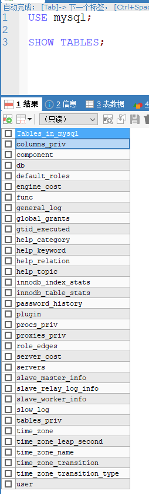

mysql用户与权限管理
==


## 用户管理
### 用户帐号
* 用户帐号组成
```text
用户帐号由两部分组成
用户名@主机名

示例：
'username'@'host'

其中：
host主机名可以是一个IP或是一个网络
如：wxlinux@192.168.30.10
wxlinux@172.20.%.%


```

* 库mysql相关表介绍
    ```text
    mysql中所有的用户信息都是保存在mysql数据库下的user表中，该表采用复合主键(host + user)
    库mysql主要负责存储数据库的用户、权限设置、关键字等
    ```
    * 系统授权表
    
          
        ```text
        user表：该表决定是否允许用户连接到服务器。如果允许连接，权限字段则
              为该用户的全局权限。
        db表：用于决定哪些用户可以从哪些主机访问哪些数据库。包含在db表中的
              权限适用于这个表标识的数据库。
        host表：当您想在db表的范围之内扩展一个条目时，就会用到这个表。
              举例：如果某个db允许通过多个主机访问的话，那么超级用户就可
              以让db表内将host列为空，然后用必要的主机名填充host表。
        tables_priv表：该表与db表相似，不同之处是它用于表而不是数据库。这个
              表还包含一个其他字段类型，包括timestamp和grantor两个字段，用
              于存储时间戳和授权方。在本文后面我们会对这个表做进一步的讲解。
        columns_priv：该表作用几乎与db和tables_priv表一样，不同之处是它提供
              的是针对某些表的特定列的权限。这个表也多 出了一个字段类型，即
              其他字段，包括了一个timestamp列，用于存放时间戳。
        ```  
        
### 创建用户
MySQL 8.0开始将`caching_sha2_password`作为默认的身份验证插件。
如果你升级了数据库至8.0版本，对应用程序jdbc驱动兼容性不友好，让应用程序跑起来最快的方法需要将默认的`caching_sha2_password`改为之前的`mysql_native_password`。

* 设置全局的身份验证插件

    /etc/my.cnf 添加下面的配置，重启mysqld服务
    ```bash
    default_authentication_plugin = mysql_native_password
    ```

* create式语法
    ```text
    CREATE USER 'USERNAME'@'HOST' [IDENTIFIED BY '明文密码字符串'];
    CREATE USER 'USERNAME'@'HOST' [IDENTIFIED WITH auth_plugin BY '明文密码字符串'];
    
    auth_plugin  // 可选项：caching_sha2_password, mysql_native_password
    
    默认权限：USAGE，只能连接数据库，无法查看、更改、删除
    ```
    
    示例
    ```bash
    -- 新建只读用户
    CREATE USER 'read_only_user'@'%' IDENTIFIED BY 'Admin123456!';
    GRANT SELECT ON *.* TO 'read_only_user'@'%';
    FLUSH PRIVILEGES;
    
    -- 新建管理用户
    CREATE USER 'admin'@'%' IDENTIFIED BY 'Admin123456!';  -- 默认使用 caching_sha2_password 身份认证插件
    CREATE USER 'admin'@'%' IDENTIFIED WITH mysql_native_password BY 'Admin123456!';  -- 使用 mysql_native_password 身份认证插件
    ```

* grant授权式语法
    ```text
    GRANT 权限列表 ON 表 TO 'repluser'@'%' IDENTIFIED BY '明文密码字符串';
    
    权限列表  // 使用逗号(,) 分隔多个权限
    表  // 格式：库名.表名，使用逗号(,) 分隔多个表，
        // *.* 表示所有库的所有表
    mysql 8不支持授权并创建用户，只支持授权，即IDENTIFIED不能写
    ```

### 用户重命名
```text
RENAME USER 旧用户帐号 TO 新用户帐号;
```

### 锁定、解锁用户
```text
ALTER USER 用户帐号 account LOCK;

ALTER USER 用户帐号 account UNLOCK;
```

### 删除用户
```text
DROP USER 'usernmae'@'host'
```


### 修改密码
* mysql 8修改用户密码
    ```mysql
    -- mysql_native_password
    ALTER USER 'root'@'localhost' IDENTIFIED WITH mysql_native_password BY 'password_str';
    
    -- caching_sha2_password
    ALTER USER 'root'@'localhost' IDENTIFIED BY 'password_str!';
    ```
* mysql 8之前版本修改用户密码
    ```mysql
    
    SET PASSWORD FOR 'user'@'host' = PASSWORD('password');
    
    -- 或
    UPDATE mysql.user SET password=PASSWORD('password') WHERE user = 'username'

    FLUSH PRIVILEGES;
    ```
    如果修改密码时报下列错误
    ```
    ERROR 1290 (HY000): The MySQL server is running with the --skip-grant-tables option so it cannot execute this statement
    ```
    处理方法：刷新权限列表
    ```
    flush privileges;
    ```


## 权限管理
* 官方文档
```text
mysql 8
https://dev.mysql.com/doc/refman/8.0/en/grant.html

mysql 5.7
https://dev.mysql.com/doc/refman/5.7/en/grant.html
```

### grant授权语法
```text
GRANT 权限列表/all privileges ON 数据库.表名 TO 用户帐号;


GRANT
    priv_type [(column_list)]
      [, priv_type [(column_list)]] ...
    ON [object_type] priv_level
    TO user_or_role [, user_or_role] ...
    [WITH GRANT OPTION]
    [AS user
        [WITH ROLE
            DEFAULT
          | NONE
          | ALL
          | ALL EXCEPT role [, role ] ...
          | role [, role ] ...
        ]
    ]
}

GRANT PROXY ON user_or_role
    TO user_or_role [, user_or_role] ...
    [WITH GRANT OPTION]

GRANT role [, role] ...
    TO user_or_role [, user_or_role] ...
    [WITH ADMIN OPTION]


object_type: {
    TABLE
  | FUNCTION
  | PROCEDURE
}

priv_level: {
    *
  | *.*
  | db_name.*
  | db_name.tbl_name
  | tbl_name
  | db_name.routine_name
}

user_or_role: {
    user
  | role
}
```

#### 权限类别
* 数据库级别
* 表级别
* 字段级别
* 管理类
* 程序类


* 数据操作
    ```text
    SELECT
    INSERT
    DELETE
    UPDATE
    ```

* 库和表级别
    ```text
    ALTER
    CREATE
    CREATE VIEW
    DROP
    INDEX
    SHOW VIEW
    GRANT OPTION：能将自己获得的权限转赠给其他用户
    ```

* 字段级别
```text
SELECT(col1, col2, …)
UPDATE(col1, col2, …)
INSERT(col1, col2, …)
```

* 管理类
```text
CREATE TEMPORARY TABLES
CREATE USER
FILE
SUPER
SHOW DATABASES
RELOAD
SHUTDOWN
REPLICATION SLAVE
REPLICATION CLIENT
LOCK TABLES
PROCESS
```

* 程序类： FUNCTION、PROCEDURE、TRIGGER
```text
CREATE
ALTER
DROP
EXCUTE
```

* 所有权限：ALL PRIVILEGES 或 ALL

```text
all/all privileges权限代表全局或者全数据库对象级别的所有权限

alter权限代表允许修改表结构的权限，但必须要求有create和insert权限配合。如果是rename表名，则要求有alter和drop原表， create和insert新表的权限

alter routine权限代表允许修改或者删除存储过程、函数的权限

create权限代表允许创建新的数据库和表的权限

create routine权限代表允许创建存储过程、函数的权限

create tablespace权限代表允许创建、修改、删除表空间和日志组的权限

create temporary tables权限代表允许创建临时表的权限

create user权限代表允许创建、修改、删除、重命名user的权限

create view权限代表允许创建视图的权限

delete权限代表允许删除行数据的权限

drop权限代表允许删除数据库、表、视图的权限，包括truncate table命令

event权限代表允许查询，创建，修改，删除mysql事件

execute权限代表允许执行存储过程和函数的权限

file权限代表允许在mysql可以访问的目录进行读写磁盘文件操作，可使用的命令包括load data infile,select … into outfile,load file()函数

grant option权限代表是否允许此用户授权或者收回给其他用户你给予的权限,重新付给管理员的时候需要加上这个权限

index权限代表是否允许创建和删除索引

insert权限代表是否允许在表里插入数据，同时在执行analyze table,optimize table,repair table语句的时候也需要insert权限

lock权限代表允许对拥有select权限的表进行锁定，以防止其他链接对此表的读或写

process权限代表允许查看mysql中的进程信息，比如执行show processlist, mysqladmin processlist, show engine等命令

reference权限是在5.7.6版本之后引入，代表是否允许创建外键

reload权限代表允许执行flush命令，指明重新加载权限表到系统内存中，refresh命令代表关闭和重新开启日志文件并刷新所有的表

replication client权限代表允许执行show master status,show slave status,show binary logs命令

replication slave权限代表允许slave主机通过此用户连接master以便建立主从复制关系

select权限代表允许从表中查看数据，某些不查询表数据的select执行则不需要此权限，如select 1+1， select pi()+2；而且select权限在执行update/delete语句中含有where条件的情况下也是需要的

show databases权限代表通过执行show databases命令查看所有的数据库名

show view权限代表通过执行show create view命令查看视图创建的语句

shutdown权限代表允许关闭数据库实例，执行语句包括mysqladmin shutdown

super权限代表允许执行一系列数据库管理命令，包括kill强制关闭某个连接命令， change master to创建复制关系命令，以及create/alter/drop server等命令

trigger权限代表允许创建，删除，执行，显示触发器的权限

update权限代表允许修改表中的数据的权限

usage权限是创建一个用户之后的默认权限，其本身代表连接登录权限
```

### revoke回收授权
```text
REVOKE 权限列表/all privileges ON 数据库.表名 FROM 用户帐号[, user2];

```
### 查看指定用户的授权信息
```text
Help SHOW GRANTS

SHOW GRANTS FOR 'user'@'host';

-- 查看当前用户的权限
SHOW GRANTS FOR CURRENT_USER();
```

## 其他
### 破解数据库密码
1. 编辑my.cnf配置文件，忽略授权表
    ```text
    [mysqld]
    
    skip-grant-tables             #忽略授权表
    ```
 
1. 重启mysql服务
    ```text
    systemctl restart mysqld
    ```

1. [修改密码](#修改密码)

1. 修改完密码后，再把配置文件中的忽略授权表注释掉，重启mysql服务

