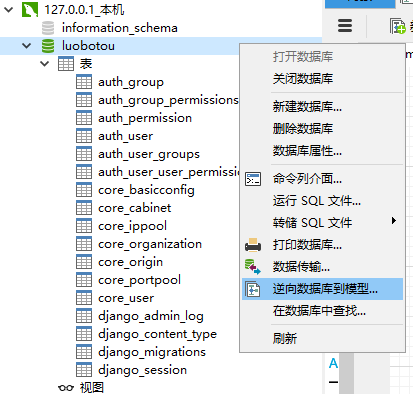
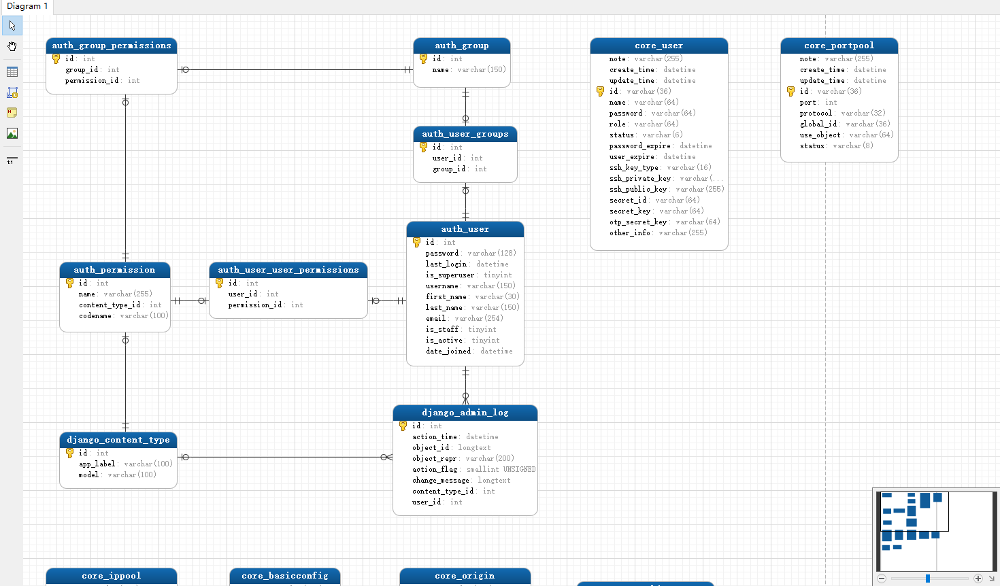

Navicat Premium
==

# 简介
```text
Navicat Premium 出品于香港PremiumSoft公司(卓软数码科技)，是一套数据库开发工具，让你从单一应用程序中同时连接 
MySQL、MariaDB、MongoDB、SQL Server、Oracle、PostgreSQL 和 SQLite 数据库。
它与 Amazon RDS、Amazon Aurora、Amazon Redshift、Microsoft Azure、Oracle Cloud、
MongoDB Atlas、阿里云、腾讯云和华为云等云数据库兼容。你可以快速轻松地创建、管理和维护数据库

是否收费：收费
```

# Navicat Premium常用快捷键
1. 运行当前查询窗口的所有sql语句
    >Ctrl + R 
* 只运行选中的sql语句
    >Ctrl + Shift + R 
* 注释sql语句
    >Ctrl + / 
* 解除注释
    >Ctrl + Shift + / 
* 打开查询窗口
    >Ctrl + Q 
* 打开一个新的查询窗口
    >Ctrl + N 
* 关闭当前查询窗口
    >ctrl + W
* 删除一行
    >Ctrl + L 

* 鼠标在当前一行末尾，按快捷选中当前一行
    >Shift + Home 
* 打开一个mysql命令行窗口
    >F6  
* 运行从光标当前位置开始的一条完整sql语句
    >F7
* 停止运行
    >Ctrl + T
    
    
# 生成表关系模型图
选择已经连接的数据库，右键，逆向数据库到模型，即可生成表模型  
  

生成结果
  

## 符号
* 0个：O
* 0个或1个：|O 
* 唯一1个（有且仅1个）：| |
* 0个或多个：O<
* 1个或多个：|<
* 多个：< 

## 表创建语句
<details>
<summary>表创建语句</summary>

* auth_group_permissions
    ```mysql
    SET FOREIGN_KEY_CHECKS=0;
    
    -- ----------------------------
    -- Table structure for auth_group_permissions
    -- ----------------------------
    DROP TABLE IF EXISTS `auth_group_permissions`;
    CREATE TABLE `auth_group_permissions` (
        `id` int(11) NOT NULL AUTO_INCREMENT,
        `group_id` int(11) NOT NULL,
        `permission_id` int(11) NOT NULL,
        PRIMARY KEY (`id`),
        UNIQUE KEY `auth_group_permissions_group_id_permission_id_0cd325b0_uniq` (`group_id`,`permission_id`),
        KEY `auth_group_permissio_permission_id_84c5c92e_fk_auth_perm` (`permission_id`),
        CONSTRAINT `auth_group_permissio_permission_id_84c5c92e_fk_auth_perm` FOREIGN KEY (`permission_id`) REFERENCES `auth_permission` (`id`),
        CONSTRAINT `auth_group_permissions_group_id_b120cbf9_fk_auth_group_id` FOREIGN KEY (`group_id`) REFERENCES `auth_group` (`id`)
    ) ENGINE=InnoDB DEFAULT CHARSET=utf8;
    ```
    
* auth_group
```mysql
SET FOREIGN_KEY_CHECKS=0;

-- ----------------------------
-- Table structure for auth_group
-- ----------------------------
DROP TABLE IF EXISTS `auth_group`;
CREATE TABLE `auth_group` (
    `id` int(11) NOT NULL AUTO_INCREMENT,
    `name` varchar(150) NOT NULL,
    PRIMARY KEY (`id`),
    UNIQUE KEY `name` (`name`)
) ENGINE=InnoDB DEFAULT CHARSET=utf8;
```

* auth_permission
```mysql
SET FOREIGN_KEY_CHECKS=0;

-- ----------------------------
-- Table structure for auth_permission
-- ----------------------------
DROP TABLE IF EXISTS `auth_permission`;
CREATE TABLE `auth_permission` (
    `id` int(11) NOT NULL AUTO_INCREMENT,
    `name` varchar(255) NOT NULL,
    `content_type_id` int(11) NOT NULL,
    `codename` varchar(100) NOT NULL,
    PRIMARY KEY (`id`),
    UNIQUE KEY `auth_permission_content_type_id_codename_01ab375a_uniq` (`content_type_id`,`codename`),
    CONSTRAINT `auth_permission_content_type_id_2f476e4b_fk_django_co` FOREIGN KEY (`content_type_id`) REFERENCES `django_content_type` (`id`)
) ENGINE=InnoDB AUTO_INCREMENT=53 DEFAULT CHARSET=utf8;
```
</details>