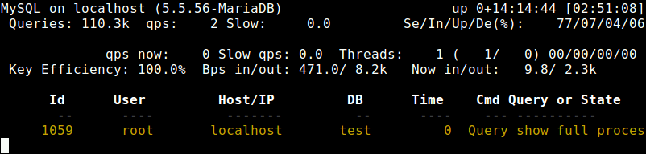
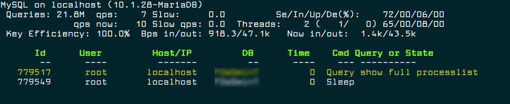

MySQL DBA技能
==

## 查看mysql进程使用CPU详情
* 先找出mysql进程id
    ```bash
    ps -aux |grep mysql |grep -v "grep"
    ```
      
* pidstat查看mysql进程的详情
    ```bash
    pidstat -u -t -p 7065
    
    # pidstat是sysstat软件套件的一部分，需要安装sysstat
    ```
      


## mysql shell命令补齐
* mysql自带的命令补齐功能
    在mysql>下执行 `rehash`
    或
    ```bash
    mysql -uroot -p --auto-rehash
    ```
    mysql 5.7以后的都是默认开启的。
    
    mysql命令关键字需要大写才会出现命令提示

* mycli工具
    
    [reference](https://www.mycli.net/)
    * 安装
        ```bash
        yum install -y python-pip python-devel
        
        pip install mycli
        ```
    * 使用
        ```bash
        mycli my_database
        mycli -u my_user -h my_host.com my_database
        mycli mysql://my_user@my_host.com:3306/my_database
        ```
    
## MySQL利用多核处理器
    ```text
    mysql innodb引擎默认最多使用4个线程
    
    查看innodb_read_io_threads、innodb_write_io_threads系统变量可知，这两个是只读变量，不能直接set修改
    
    ## 查看方法
    SHOW GLOBAL VARIABLES LIKE '%_io_threads';
    ```

* 修改innodb引擎IO线程数
    ```text
    在my.cnf配置文件的[mysqld]块内添加如下内容
    然后重启mysql服务
    
    innodb_read_io_threads = 16
    innodb_read_write_threads = 16
    ```

## 查看mysql状态

### mytop
Mytop runs in a terminal and displays statistics about threads, queries, slow queries, uptime, load, etc.

[reference](https://www.tecmint.com/mytop-mysql-mariadb-database-performance-monitoring-in-linux/)

* How to install
    ```bash
    $ sudo apt install mytop	#Debian/Ubuntu
    yum install mytop	        #RHEL/CentOS
    dnf install mytop	        #Fedora 22+
    pacman -S mytop	            #Arch Linux 
    zypper in mytop	            #openSUSE
    ```
* How to use Mytop to Monitor MySQL/MariaD
    ```bash
    mytop --prompt
    ```
    
    
    ```bash
    mytop --prompt -d <database_name>
    ```
    
    

## mysqladmin命令
[reference](https://www.tecmint.com/mysqladmin-commands-for-database-administration-in-linux/)

* How to view mysqladmin options and usage
    ```bash
    mysqladmin --help
    ```

* How to set MySQL Root password
    ```bash
    mysqladmin -u root password YOURNEWPASSWORD
    ```
* How to Change MySQL Root password
    ```bash
    mysqladmin -u root -p123456 password 'xyz123'
    ```

* How to check MySQL Server is running
    ```bash
    mysqladmin -u root -p ping
    
    Enter password:
    mysqld is alive
    ```
* How to Check which MySQL version I am running
    ```bash
    mysqladmin -u root -p version
    ```
* How to Find out current Status of MySQL server
    ```bash
    mysqladmin -u root -ptmppassword status
    ```
* How to check status of all MySQL Server Variable’s and value’s
    ```bash
    mysqladmin -u root -p extended-status
    ```
* How to see all MySQL server Variables and Values
    ```bash
    mysqladmin  -u root -p variables
    ```
* How to check all the running Process of MySQL server
    ```bash
    mysqladmin -u root -p processlist
    ```
* How to create a Database in MySQL server
    ```bash
    mysqladmin -u root -p create databasename
    ```

* How to drop a Database in MySQL server
    ```bash
    mysqladmin -u root -p drop databasename
    ```

* How to reload/refresh MySQL Privileges
    ```bash
    mysqladmin -u root -p reload;
    mysqladmin -u root -p refresh;
    ```

* How to shutdown MySQL server Safely
    ```bash
    mysqladmin -u root -p shutdown
    ```
    or
    ```bash
    systemctl stop mysqld
    ```
* Some useful MySQL Flush commands
    ```bash
    flush-hosts: Flush all host information from host cache.
    flush-tables: Flush all tables.
    flush-threads: Flush all threads cache.
    flush-logs: Flush all information logs.
    flush-privileges: Reload the grant tables (same as reload).
    flush-status: Clear status variables.
    
    ## mysqladmin command
    mysqladmin -u root -p flush-hosts
    mysqladmin -u root -p flush-tables
    mysqladmin -u root -p flush-threads
    mysqladmin -u root -p flush-logs
    mysqladmin -u root -p flush-privileges
    mysqladmin -u root -p flush-status
    ```
* How to kill Sleeping MySQL Client Process
    ```bash
    mysqladmin -u root -p processlist;
    
    Enter password:
    +----+------+-----------+----+---------+------+-------+------------------+
    | Id | User | Host      | db | Command | Time | State | Info             |
    +----+------+-----------+----+---------+------+-------+------------------+
    | 5  | root | localhost |    | Sleep   | 14   |       |					 |
    | 8  | root | localhost |    | Query   | 0    |       | show processlist |
    +----+------+-----------+----+---------+------+-------+------------------+
    
    mysqladmin -u root -p kill 5;
    ```
    If you like to kill multiple process
    ```bash
    mysqladmin -u root -p kill 5,10
    ```
* How to run multiple mysqladmin commands together
    ```bash
    mysqladmin  -u root -p processlist status version
    ```
* How to Connect remote mysql server
    ```bash
    mysqladmin  -h 172.16.25.126 -u root -p
    ```

* How to execute command on remote MySQL server
    ```bash
    mysqladmin  -h 172.16.25.126 -u root -p status
    ```
* How to start/stop MySQL replication on a slave server
    ```bash
    mysqladmin  -u root -p start-slave
    
    mysqladmin  -u root -p stop-slave
    ```

* How to store MySQL server Debug Information to logs
    ```bash
    mysqladmin  -u root -p debug
    ```