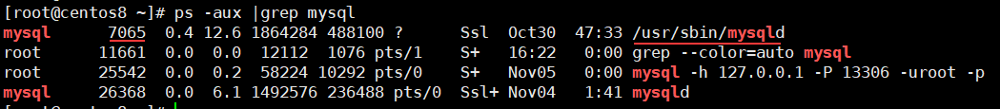
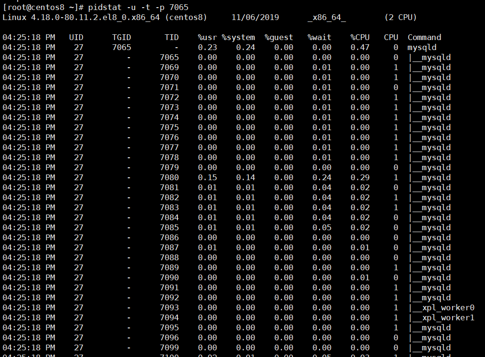

MySQL DBA技能
==

## 查看mysql进程使用CPU详情
* 先找出mysql进程id
    ```bash
    ps -aux |grep mysql |grep -v "grep"
    ```
      
* pidstat查看mysql进程的详情
    ```bash
    pidstat -u -t -p 7065
    
    # pidstat是sysstat软件套件的一部分，需要安装sysstat
    ```
      


## MySQL利用多核处理器
    ```text
    mysql innodb引擎默认最多使用4个线程
    
    查看innodb_read_io_threads、innodb_write_io_threads系统变量可知，这两个是只读变量，不能直接set修改
    
    ## 查看方法
    SHOW GLOBAL VARIABLES LIKE '%_io_threads';
    ```

* 修改innodb引擎IO线程数
    ```text
    在my.cnf配置文件的[mysqld]块内添加如下内容
    然后重启mysql服务
    
    innodb_read_io_threads = 16
    innodb_read_write_threads = 16
    ```