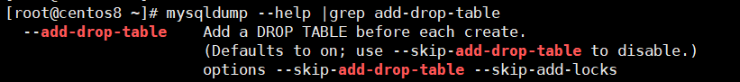

mysql备份与还原
==

# Table Of Contents
* [备份常用操作](#备份常用操作)
* [还原常用操作](#还原常用操作)
* [增量备份](#增量备份)
* [增量备份后的还原操作](#增量备份后的还原操作)


## 备份常用操作
* 备份命令mysqldump格式
    ```text
    格式：mysqldump -h主机名  -P端口 -u用户名 -p密码 --no-defaults 数据库名 > 文件名.sql 
    ```

* **备份MySQL数据库为带不删除表的格式**
    ```text
    备份MySQL数据库为带删除表的格式，能够让该备份覆盖已有数据库而不需要手动删除原有数据库
    
    注意：默认是开启的
    也就是备份出来的sql文件中，在创建表前添加了删除表操作语句，这在用测试库备份的sql文件用到生产还原是要特别注意！！！
    DROP TABLE IF EXISTS `表名`; 
    
    加--skip-add-drop-table 选项可以在建表前不加删表语句
    ```
    ```bash
    mysqldump --skip-add-drop-table -uusername -ppassword databasename > backupfile.sql
    ```
      

* 直接将MySQL数据库压缩备份
    ```bash
    mysqldump -hhostname -uusername -ppassword databasename | gzip > backupfile.sql.gz
    ```

* 备份指定数据库的部分表
    ```bash
    mysqldump -hhostname -uusername -ppassword 数据库名 specific_table1 specific_table2 > backupfile.sql
    ```

* 同时备份多个库
    ```bash
    mysqldump -hhostname -uusername -ppassword --databases databasename1 databasename2 databasename3 > multibackupfile.sql
    ```
* 仅备份数据库结构
    ```bash
    mysqldump --no-data --databases databasename1 databasename2 databasename3 > structurebackupfile.sql
    ```

* 备份服务器上所有数据库
    ```bash
    mysqldump -A > allbackupfile.sql
    或
    mysqldump --all-databases > allbackupfile.sql
    ```
    
* 将指定的数据库转移到新服务器(远程服务器)
    ```bash
    mysqldump -uusername -ppassword databasename |mysql -h远程Host -uUser -p -C 目标服务器上的databasename
    ```
    

## 还原常用操作
* 还原指定的数据库
    ```bash
    mysql -hhostname -uusername -ppassword databasename < backupfile.sql
    ```

* 还原压缩的MySQL数据库
    ```bash
    gunzip < backupfile.sql.gz | mysql -uusername -ppassword databasename
    ```

* 导入数据库
    ```text
    常用source命令，用use进入到某个数据库，后面的参数为脚本文件。
    ```
    ```bash
    mysql>source /data/test.sql;
    ```

## 增量备份
```text
优点：没有重复数据，备份量不大，时间短。
缺点：需要上次全备份及全备份之后所有的增量备份才能恢复。
MySQL没有提供直接的增量备份方法，但是可以通过mysql的二进制文件(binary logs)间接实现增量备份

增量备份的原理就是使用了mysql的bin log志。mysql增量备份必修开启二进制日志。

二进制日志对备份的作用
======================
* 二进制日志文件保存了所有更新或者可能更新数据库的操作
* 二进制日志在启动MySQL服务器后开始记录，
    并在文件达到max_binlog_size所设置的大小或者接收到flush logs命令后重新创建新的日志文件。
* 只需要定时执行flush logs方法重新创建新的日志，生成二进制文件序列，
    并及时把这些日志保存到安全的地方就完成了一个时间段的增量备份
```

* --master-data和--single-transaction
    ```text
    在mysqldump中使用--master-data=2，会记录binlog文件和position的信息。
    --single-transaction会将隔离级别设置成repeatable-commited
    ```

1. 首先做一次完整备份
    ```bash
    mysql -hHost -uUser -p --single-transaction  --master-data=2  test > test.sql
    ```
    ```text
    这时候就会得到一个全备文件test.sql
    在sql文件中我们会看到：
    -- CHANGE MASTER TO MASTER_LOG_FILE='bin-log.000002', MASTER_LOG_POS=107;
    是指备份后所有的更改将会保存到bin-log.000002二进制文件中。
    ```

2. 切割bin-log
    ```mysql
    -- mysql命令
    flush logs;
    ```
    ```text
    在test库的t_student表中增加两条记录，
    然后执行flush logs命令。
    这时将会产生一个新的二进制日志文件bin-log.000003，
    bin-log.000002则保存了全备过后的所有更改，
    既增加记录的操作也保存在了bin-log.00002中。
    ```

3. 更新数据
    ```text
    再在test库中的a表中增加两条记录，然后误删除t_student表和a表。
    a中增加记录的操作和删除表a和t_student的操作都记录在bin-log.000003中。
    ```

4. 查看binlog日志
    ```bash  
    mysqlbinlog --no-defaults binlog日志名称 |more
    
    # --no-defaults: 不读取选项文件，如my.cnf配置了default_character_set，无法识别而参数报错
    ```
    **bin log示例**  
    ```text
    #at 数字: 表示position位置
    #191112 11:48:50  表示时间2019-11-12 11:48:50
    ```
    ```bash
    mysqlbinlog --no-defaults binlog.000004
    /*!50530 SET @@SESSION.PSEUDO_SLAVE_MODE=1*/;
    /*!50003 SET @OLD_COMPLETION_TYPE=@@COMPLETION_TYPE,COMPLETION_TYPE=0*/;
    DELIMITER /*!*/;
    # at 4
    #191112 11:48:50 server id 1  end_log_pos 124 CRC32 0xe76a8edd 	Start: binlog v 4, server v 8.0.18 created 191112 11:48:50 at startup
    # Warning: this binlog is either in use or was not closed properly.
    ROLLBACK/*!*/;
    BINLOG '
    oivKXQ8BAAAAeAAAAHwAAAABAAQAOC4wLjE4AAAAAAAAAAAAAAAAAAAAAAAAAAAAAAAAAAAAAAAA
    AAAAAAAAAAAAAAAAAACiK8pdEwANAAgAAAAABAAEAAAAYAAEGggAAAAICAgCAAAACgoKKioAEjQA
    CgHdjmrn
    '/*!*/;
    # at 124
    #191112 11:48:50 server id 1  end_log_pos 155 CRC32 0xf3ed079c 	Previous-GTIDs
    # [empty]
    SET @@SESSION.GTID_NEXT= 'AUTOMATIC' /* added by mysqlbinlog */ /*!*/;
    DELIMITER ;
    # End of log file
    /*!50003 SET COMPLETION_TYPE=@OLD_COMPLETION_TYPE*/;
    /*!50530 SET @@SESSION.PSEUDO_SLAVE_MODE=0*/;
    ```

## 增量备份后的还原操作
1. 首先导入全备数据
    ```bash
    mysql -hHost -uUser -p < test.sql
    ```
    ```mysql
    -- 也可以直接在mysql命令行下面用source导入
    source test.sql;
    ```
2. 恢复增量bin log
    ```text
    增量二进制日志恢复的顺序，要先恢复最先生成的二进制文件，然后依次执行
    ```
    1. 恢复bin-log.000002
        ```bash
        mysqlbinlog --no-defaults bin-log.000002 |mysql -hHost -uUser -p
        ```

    2. 恢复部分 bin-log.000003
        ```text
        查看binlog日志找到误删除的时间点，
        然后更加对应的时间点到bin-log.000003中找到相应的position点，
        需要恢复到误删除的前面一个position点。找到恢复点后，既可以开始恢复
        
        * 可以用如下参数来控制bin log的区间
            --start-position 开始点
            --stop-position 结束点
            或
            --start-date 开始时间  
            --stop-date  结束时间
        ```
        ```bash
        mysqlbinlog --no-defaults /var/lib/mysql/mysql-bin.000003 --stop-position=208 |mysql -hHost -uUser -p
        ```
