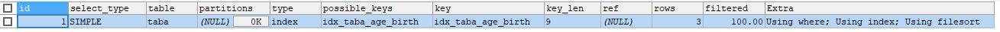

mysql高级.查询截取分析
==


## 查询优化
* 永远小表驱动大表，相当于让外层循环的次数更少
* 优化原则：小表驱动大表，即少的数据集驱动多的数据集

### 小表驱动大表示例
```mysql
-- 示例：A表、B表
CREATE TABLE A (
    id INT,
    cname VARCHAR(32)
);

CREATE TABLE B (
    id INT,
    score INT
);

ALTER TABLE A ADD INDEX idx_a_id (id);
ALTER TABLE B ADD INDEX idx_b_id (id);
```

* 用in优于exists情况
    ```sql
    SELECT * FROM A WHERE id IN (SELECT id FROM B)
    
    -- 等价于：
    FOR (SELECT id FROM B) {
        SELECT * FROM A WHERE A.id = B.id
    }
        
    /*
    当B表的数据集小于A表的数据集时，用in优于exists
    */
    ```

* 用exists优于in情况
    ```sql
    SELECT * FROM A WHERE EXISTS (SELECT 1 FROM B WHERE B.id = A.id)
    
    -- 等价于
    FOR (SELECT * FROM A) {
        SELECT 1 FROM B WHERE B.id = A.id
    }
    
    /*
    当A表的数据集小于B表的数据集时，用exists优于in
    
    注意：
    A表与B表的id字段应建立索引
    
    EXISTS子句理解：
    将主查询的数据，放到子查询中做条件验证，只保留验证结果为true的主数据
    */
    ```

### order by排序优化
* order by子句尽量使用index方式排序，避免使用filesort方式排序
* 尽可能在左营列上完成排序操作，满足索引最佳左前缀法则


### order by排序方式案例
```text
order by的两种排序方式：index、filesort
index效率 > filesort效率

因为
index: 只扫描索引完成排序 
filesort: 通过扫描表数据完成排序
```

* 表结构
    ```mysql
    CREATE TABLE taba (
        age INT,
        birth TIMESTAMP NOT NULL
    );
    
    
    INSERT INTO taba (age, birth) VALUES
    (22, NOW()),
    (23, NOW()),
    (24, NOW());
    
    -- 建立索引
    CREATE INDEX idx_taba_age_birth ON taba (age, birth);
    
    SHOW INDEX FROM taba;
    ```
* 情况1_0
    ```mysql
    -- 1_0
    EXPLAIN
    SELECT * FROM taba
    WHERE age = 20;
    ```
      
    **观察与分析**  
    ```text
    用到了索引age一个字段
    ```
* 情况1_1
    ```mysql
    -- 1_1
    EXPLAIN
    SELECT * FROM taba 
    WHERE age > 20
    ORDER BY age;
    ```
      
    **观察与分析**  
    ```text
    排序方式：index
    Extra为Using where; Using index
    用到了索引age,birth
    ```
* 情况1_2
    ```mysql
    -- 1_2
    EXPLAIN
    SELECT * FROM taba
    WHERE age > 20
    ORDER BY age, birth;
    ```
      
    **观察与分析**  
    ```text
    排序方式：index
    Extra为Using where; Using index
    用到了索引age,birth
    ```
<span id = "order_by_1_3"></span>
* 情况1_3
    ```mysql
    -- 1_3
    EXPLAIN
    SELECT * FROM taba
    WHERE age > 20
    ORDER BY birth;
    ```
      
    **观察与分析**  
    ```text
    排序方式：index、filesort
    Extra为Using where; Using index; Using filesort
    用到了索引age,birth
    ```
* 情况1_4
    ```mysql
    -- 1_4
    EXPLAIN
    SELECT * FROM taba
    WHERE age > 20
    ORDER BY birth, age;
    ```
      
    **观察与分析**  
    ```text
    排序方式：index、filesort
    Extra为Using where; Using index; Using filesort
    用到了索引age,birth
    ```
* 情况2_1
    ```mysql
    -- 2_1
    EXPLAIN
    SELECT * FROM taba 
    ORDER BY birth;
    ```
      
    **观察与分析**  
    ```text
    排序方式：index、filesort
    Extra为Using index; Using filesort
    用到了索引age,birth
    ```
* 情况2_2
    ```mysql
    -- 2_2
    EXPLAIN
    SELECT * FROM taba
    WHERE birth > '2019-11-06 00:00:00'
    ORDER BY birth;
    ```
      
    **观察与分析**  
    ```text
    排序方式：index、filesort
    Extra为Using where; Using index; Using filesort
    用到了索引age,birth
    ```

* 情况2_3
    ```mysql
    -- 2_3
    EXPLAIN
    SELECT * FROM taba
    WHERE birth > '2019-11-06 00:00:00'
    ORDER BY age;
    ```
      
    
    **观察与分析**  
    ```text
    排序方式：index
    Extra为Using where; Using index
    用到了索引age,birth
    ```
    [与1_3的比较，把where条件与order by字段调换](#order_by_1_3)  
    
* 情况2_4
    ```mysql
    -- 2_4
    EXPLAIN
    SELECT * FROM taba
    ORDER BY age ASC, birth DESC;
    ```
      
    
    **观察与分析**  
    ```text
    排序方式同时使用了：index、filesort
    Extra为Using index; Using filesort
    用到了索引age,birth
    ①先用索引age排序(index)，在①基础上，再对birth读表数据排序(filesort)
    ```
    
#### 如何让order by使用index方式排序
```text
以下任意一种情况
```
* order by语句满足索引最佳左前缀法则(索引最左前列)
* order by子句条件与where子句字段组合满足索引最佳左前缀法则

### filesort排序的两种算法
* 双路排序算法
* 单路排序算法

#### 双路排序算法
```text
MySQL 4.1之前是使用双路排序，需要两次扫描磁盘，最终得到数据。
读取行指针和order by列，对他们进行排序，然后扫描已经排序好的列表，
按照列表中的值重新从列表中读取对应的数据传输
```

```text
第一次IO：从磁盘取排序字段，在buffer进行排序，
第二次IO：然后以buffer中的顺序，再从磁盘取其他字段。
IO是比较耗时的
```

#### 单路算法
```text
从磁盘读取查询需要的所有列，按照order by列在buffer对它们进行排序，然后扫描buffer中排序后的列表进行输出，
它的效率更快一些，避免了第二次读取数据，并且把随机IO变成顺序IO，
但是它会使用更多的内存空间，因为它把每一行都保存在内存中了。
```

* 单路排序的弊端
    ```text
    由于单路是后出来的，总体而言好过双路
    
    但是用单路有问题
    当从磁盘读取查询需要的所有列的数据总大小超过sort_buffer容量时，
    导致每次只能取sort_buffer容量大小的数据，进行排序(创建tmp文件，多路合并)，
    排完序在重复取，再排...
    多次从磁盘取数据，即多次IO
    ```

### order by相关的优化策略
* 增大sort_buffer_size参数的设置
* 增大max_length_for_sort_data参数的设置
* 尽量只select需要的列

```text
有order by子句时尽量避免用select *

* 当查询的字段大小总和小于max_length_for_sort_data，并且order by
字段不是TEXT或IBLOB类型时，会用单路排序算法，否则用多路排序算法

* 两种算法的数据都有可能超出sort_buffer容量(sort_buffer_size值)，
超出后，会创建tmp文件进行合并排序，导致多次IO。
当时单路算法的风险更大些，所以要提高sort_buffer_size

* sort_buffer_size是针对每个进程的

* 尝试提高max_length_for_sort_data
提高这个参数会增加使用单路排序算法的概率。
但是设置得太高，数据总容量超出sort_buffer_size值的概率会增大，超过了这种情况也不好，提高了IO次数
```

## 慢查询日志


## 指数据脚本


## show profiles


## 全局查询日志

