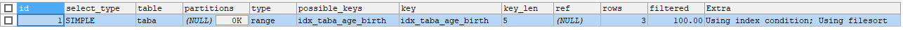
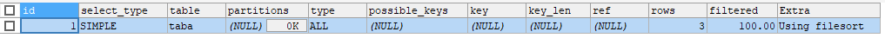
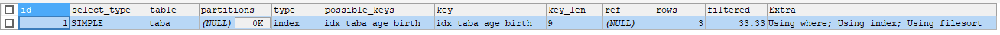
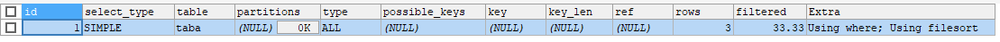
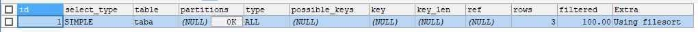
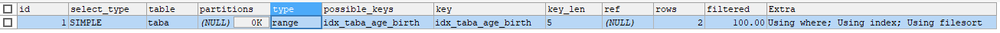

mysql高级.查询截取分析
==


## 查询优化
* 永远小表驱动大表，相当于让外层循环的次数更少
* 优化原则：小表驱动大表，即少的数据集驱动多的数据集

### 小表驱动大表示例
```mysql
-- 示例：A表、B表
CREATE TABLE A (
    id INT,
    cname VARCHAR(32)
);

CREATE TABLE B (
    id INT,
    score INT
);

ALTER TABLE A ADD INDEX idx_a_id (id);
ALTER TABLE B ADD INDEX idx_b_id (id);
```

* 用in优于exists情况
    ```sql
    SELECT * FROM A WHERE id IN (SELECT id FROM B)
    
    -- 等价于：
    FOR (SELECT id FROM B) {
        SELECT * FROM A WHERE A.id = B.id
    }
        
    /*
    当B表的数据集小于A表的数据集时，用in优于exists
    */
    ```

* 用exists优于in情况
    ```sql
    SELECT * FROM A WHERE EXISTS (SELECT 1 FROM B WHERE B.id = A.id)
    
    -- 等价于
    FOR (SELECT * FROM A) {
        SELECT 1 FROM B WHERE B.id = A.id
    }
    
    /*
    当A表的数据集小于B表的数据集时，用exists优于in
    
    注意：
    A表与B表的id字段应建立索引
    
    EXISTS子句理解：
    将主查询的数据，放到子查询中做条件验证，只保留验证结果为true的主数据
    */
    ```
### order by关键字优化

#### order by排序方式案例
```text
order by的两种排序方式：index、filesort
index效率 > filesort效率

因为
index: 只扫描索引完成排序 
filesort: 通过扫描表数据完成排序

=================================
## 如何确定order by用了哪种方式排序?
可以先用explain 执行到where子句，
再explain 执行到order by子句
通过对比两次的分析结果，就可以看出order by使用的排序方式
```

* 表结构
    ```mysql
    CREATE TABLE taba (
        age INT,
        birth TIMESTAMP NOT NULL,
        `comment` VARCHAR(255)
    );
    
    
    INSERT INTO taba (age, birth, `comment`) VALUES
    (22, NOW(), '22岁'),
    (23, NOW(), '23岁'),
    (24, NOW(), '24岁');
    
    SELECT * FROM taba;
    
    -- 建立索引
    CREATE INDEX idx_taba_age_birth ON taba (age, birth);
    
    SHOW INDEX FROM taba;
    ```
    
* 情况1_0
    ```mysql
    -- 1_0
    EXPLAIN
    SELECT age, birth FROM taba 
    WHERE age > 20
    ORDER BY age;
    ```
      
    **观察与分析**  
    ```text
    order by排序方式：index
    用到索引age,birth
    type为index
    Extra为Using where; Using index
    ```
        
* 情况1_1
    ```mysql
    -- 1_1
    EXPLAIN
    SELECT age, birth FROM taba 
    WHERE age > 20
    ORDER BY age;
    ```
      
    **观察与分析**  
    ```text
    order by排序方式：index
    用到索引age,birth
    type为index
    Extra为Using where; Using index
    ```
    -- vs
    ```mysql
    EXPLAIN
    SELECT * FROM taba 
    WHERE age > 20
    ORDER BY age;
    /*
    order by排序方式：index
    用到索引age
    type为range
    Extra为Using index condition
    */
    ```
      
    
* 情况1_2
    ```mysql
    -- 1_2
    EXPLAIN
    SELECT age, birth FROM taba
    WHERE age > 20
    ORDER BY age, birth;
    ```
      
    **观察与分析**  
    ```text
    order by排序方式：index
    用到索引age,birth
    type为index
    Extra为Using where; Using index
    ```
    -- vs
    ```mysql
    EXPLAIN
    SELECT * FROM taba
    WHERE age > 20
    ORDER BY age, birth;
    /*
    order by排序方式：index
    用到索引age
    type为range
    Extra为Using index condition
    */
    ```
      
    
<span id = "order_by_1_3"></span>
* 情况1_3
    ```mysql
    -- 1_3
    EXPLAIN
    SELECT age, birth FROM taba
    WHERE age > 20
    ORDER BY birth;
    ```
      
    **观察与分析**  
    ```text
    order by排序方式：filesort
    用到索引age,birth
    type为index
    Extra为Using where; Using index; Using filesort
    ```
    -- vs
    ```mysql
    EXPLAIN
    SELECT * FROM taba
    WHERE age > 20
    ORDER BY birth;
    /*
    order by排序方式：filesort
    用到索引age
    type为range
    Extra为Using index condition; Using filesort
    */
    ```
      
    
* 情况1_4
    ```mysql
    -- 1_4
    EXPLAIN
    SELECT age, birth FROM taba
    WHERE age > 20
    ORDER BY birth, age;
    ```
      
    **观察与分析**  
    ```text
    order by排序方式：filesort
    用到索引age,birth
    type为index
    Extra为Using where; Using index; Using filesort
    ```
    -- vs
    ```mysql
    EXPLAIN
    SELECT * FROM taba
    WHERE age > 20
    ORDER BY birth, age;
    /*
    order by排序方式：filesort
    用到索引age
    type为range
    Extra为Using index condition; Using filesort
    */
    ```
      
    
    -- vs
    ```mysql
    EXPLAIN
    SELECT age, birth FROM taba
    WHERE age = 20
    ORDER BY birth, age;
    /*
    order by排序方式：index
    用到索引age
    type为ref
    Extra为Using index
    */
    ```
      
    
* 情况2_1
    ```mysql
    -- 2_1
    EXPLAIN
    SELECT age, birth FROM taba 
    ORDER BY birth;
    ```
      
    **观察与分析**  
    ```text
    order by排序方式：filesort
    用到索引age,birth
    type为index
    Extra为Using index; Using filesort
    ```
    -- vs
    ```mysql
    EXPLAIN
    SELECT * FROM taba 
    ORDER BY birth;
    /*
    order by排序方式：filesort
    没有用到索引
    type为ALL，全表扫描
    Extra为Using filesort
    */
    ```
      
    
* 情况2_2
    ```mysql
    -- 2_2
    EXPLAIN
    SELECT age, birth FROM taba
    WHERE birth > '2019-11-06 00:00:00'
    ORDER BY birth;
    ```
      
    **观察与分析**  
    ```text
    order by排序方式：filesort
    用到索引age,birth
    type为index
    Extra为Using where; Using index; Using filesort
    ```
    -- vs
    ```mysql
    EXPLAIN
    SELECT * FROM taba
    WHERE birth > '2019-11-06 00:00:00'
    ORDER BY birth;
    /*
    order by排序方式：filesort
    没有用到索引
    type为ALL，全表扫描
    Extra为Using where; Using filesort
    */
    ```
      

* 情况2_3
    ```mysql
    -- 2_3
    EXPLAIN
    SELECT age, birth FROM taba
    WHERE birth > '2019-11-06 00:00:00'
    ORDER BY age;
    ```
      
    
    **观察与分析**  
    ```text
    -- 与1_3的比较
    
    order by排序方式：index
    用到索引age,birth
    type为index
    Extra为Using where; Using index
    
    这里为什么只用到了index排序，而没有产生filesort排序呢？
    这主要是因为使用到了覆盖索引，因为idx_taba_age_birth (age, birth) 而select * 即为 select age, birth
    ```
    [与1_3的比较，把where条件与order by字段调换](#order_by_1_3)  
    
    -- vs
    ```mysql
    EXPLAIN
    SELECT * FROM taba
    WHERE birth > '2019-11-06 00:00:00'
    ORDER BY age;
    /*
    order by排序方式：filesort
    没有用到索引
    type为ALL，全表扫描
    Extra为Using where; Using filesort
    */
    ```
      
    
* 情况2_4
    ```mysql
    -- 2_4
    EXPLAIN
    SELECT age, birth FROM taba
    ORDER BY age ASC, birth DESC;
    ```
      
    
    **观察与分析**  
    ```text
    order by排序方式：filesort
    用到索引age,birth
    type为index
    Extra为Using index; Using filesort
    ```
    -- vs
    ```mysql
    EXPLAIN
    SELECT * FROM taba
    ORDER BY age ASC, birth DESC;
    /*
    order by排序方式：filesort
    没有用到索引
    type为ALL，全表扫描
    Extra为Using filesort
    */
    ```
      
    
* 情况2_5
    ```mysql
    EXPLAIN
    SELECT age, birth FROM taba
    ORDER BY age DESC, birth DESC;
    ```
      
    
    **观察与分析**  
    ```text
    order by排序方式：index
    用到索引age,birth
    type为index
    Extra为Backward index scan; Using index
    
    为什么没有产生filesort
    这是因为ORDER BY排序的字段的排序方向一致，
    默认索引字段的排序是asc升序，所以这里出现了反向索引扫描(Backward index scan)
    ```
    -- vs
    ```mysql
    EXPLAIN
    SELECT * FROM taba
    ORDER BY age DESC, birth DESC;
    /*
    order by排序方式：filesort
    没有用到索引
    type为ALL，全表扫描
    Extra为Using filesort
    */
    ```
      

* 情况2_6
    ```mysql
    EXPLAIN
    SELECT age, birth FROM taba
    WHERE age IN (20, 22) ORDER BY birth;
    /*
    
    */
    ```
      
        
    **观察与分析**  
    ```text
    order by排序方式：filesort
    用到了索引age
    type为range
    Extra为Using where; Using index; Using filesort
    ```


#### 如何让order by使用index方式排序
```text
以下任意一种情况
```
* order by语句满足索引最佳左前缀法则(索引最左前列)
* where子句条件与order by子句字段组合满足索引最佳左前缀法则

#### filesort排序的两种算法
* 双路排序算法
* 单路排序算法

##### 双路排序算法
```text
MySQL 4.1之前是使用双路排序，需要两次扫描磁盘，最终得到数据。
读取行指针和order by列，对他们进行排序，然后扫描已经排序好的列表，
按照列表中的值重新从列表中读取对应的数据传输
```

```text
第一次IO：从磁盘取排序字段，在buffer进行排序，
第二次IO：然后以buffer中的顺序，再从磁盘取其他字段。
IO是比较耗时的
```

##### 单路算法
```text
从磁盘读取查询需要的所有列，按照order by列在buffer对它们进行排序，然后扫描buffer中排序后的列表进行输出，
它的效率更快一些，避免了第二次读取数据，并且把随机IO变成顺序IO，
但是它会使用更多的内存空间，因为它把每一行都保存在内存中了。
```

* 单路排序的弊端
    ```text
    由于单路是后出来的，总体而言好过双路
    
    但是用单路有问题
    当从磁盘读取查询需要的所有列的数据总大小超过sort_buffer容量时，
    导致每次只能取sort_buffer容量大小的数据，进行排序(创建tmp文件，多路合并)，
    排完序在重复取，再排...
    多次从磁盘取数据，即多次IO
    ```

#### order by相关的优化策略
* 增大sort_buffer_size参数的设置
* 增大max_length_for_sort_data参数的设置
* 尽量只select需要的列
* order by子句尽量使用index方式排序，避免使用filesort方式排序
* 尽可能在左前列上完成排序操作，满足索引最佳左前缀法则

```text
有order by子句时尽量避免用select *

* 当查询的字段大小总和小于max_length_for_sort_data，并且order by
字段不是TEXT或IBLOB类型时，会用单路排序算法，否则用多路排序算法

* 两种算法的数据都有可能超出sort_buffer容量(sort_buffer_size值)，
超出后，会创建tmp文件进行合并排序，导致多次IO。
当时单路算法的风险更大些，所以要提高sort_buffer_size

* sort_buffer_size是针对每个进程的

* 尝试提高max_length_for_sort_data
提高这个参数会增加使用单路排序算法的概率。
但是设置得太高，数据总容量超出sort_buffer_size值的概率会增大，超过了这种情况也不好，提高了IO次数
```

#### order by关键字小结
```text
mysql有两种排序方式：filesort、index

mysql能为排序和查询使用相同的索引

注意 ...表示覆盖索引，下面的示例也相同
```

* order by符合最佳左前缀法则，则order by能用到index排序
    ```sql
    ... ORDER BY a;
    ... ORDER BY a, b;
    ... ORDER BY a, b, c;
    ... ORDER BY a, DESC, b DESC, c DESC; -- 排序字段的排序方向都一致，所以能用到index排序
    ```

* 如果where使用索引的最左前缀定义为常量，则order by能使用索引排序
    ```sql
    ... WHERE a = const ORDER BY b, c;
    ... WHERE a = const AND b = const ORDER BY c;
    ... WHERE a = const ORDER BY b, c;
    ... WHERE a = const AND b > const ORDER BY b, c;
    ```

* 不能使用索引进行排序情况
    ```sql
    ... ORDER BY a ASC, b DESC, c DESCl;  -- order by排序字段的排序方向不一致
    ... WHERE g = const ORDER BY b, c;  -- 丢失索引a字段
    ... WHERE a = const ORDER BY c;  -- 丢失索引b字段
    ... WHERE a = const ORDER BY a, d;  -- 字段d不是索引字段
    ... WHERE a IN (...) ORDER BY b, c;  -- 对于排序来说，多个相等条件也是范围
    ```

### group by关键字优化
* group by实质是先排序后进行分组，遵照使用索引的最佳左前缀法则
* 当无法使用索引列，增大max_length_for_sort_data参数的值、增大sort_buffer_size参数的值
* where优先于having，能用where筛选胡就不要用having筛选
* 其他同order by关键字优化方法


## 慢查询日志
```text
具体指运行时间大于 long_query_time 值的SQL语句，则会被记录到慢査询日志中。
long_query_time 的默认值为10，即10秒。

默认情况下，mysql数据库没有开启慢查询日志。
如果不是调优需求，一般不建议开启慢查询日志，因为开启会带来一定的性能影响。
```

### 临时开启慢查询日志
mysql服务重启后失效

* 开启慢查询日志
    ```mysql
    # 查看慢查询日志开启状态
    SHOW GLOBAL VARIABLES LIKE '%slow_query_log%';
    
    # 开启慢查询日志
    SET GLOBAL slow_query_log = 1;
    ```

* 设置慢查询sql的时间阈值
    ```mysql
    # 查看慢查询sql的阈值
    SHOW VARIABLES LIKE 'long_query_time%';
    
    # 设置设置慢查询sql阈值，单位为秒
    SET GLOBAL long_query_time = 3;
    ```

**在修改了全局的long_query_time时间之后建立的会话才会生效，因为每个会话都一个会话级的long_query_time**
```text
SHOW SESSION VARIABLES LIKE 'long_query_time';
```

* 其他相关参数
    ```text
    log_output  # 慢查询日志输出类型
    slow_query_log_file  # 存放慢查询日志文件
    log_queries_not_using_indexes  # 是否记录未使用索引的SQL语句
    ```

### 永久开启慢查询日志
向my.cnf配置文件的[mysqld]块内添加下面内容
```text
# slow query log
log_output = file
slow_query_log = on
slow_query_log_file = /var/lib/mysql/mysql_slow.log
log_queries_not_using_indexes = on  # 如果值设置为ON,则会记录所有没有利用索引的查询(性能优化时开启此项,平时不要开启)
long_query_time = 5  # 超过多少秒的查询就写入日志
```

### 查看慢查询日志
```bash
在mysql服务器上，可以直接查看慢查询日志文件，shell命令：
more /var/lib/mysql/centos8-slow.log

格式
====
# Time: 执行此sql的时刻
# User@Host: 用户  Id:    会话id
# Query_time: 查询用时  Lock_time: 锁定时间 Rows_sent: 结果集行数  Rows_examined: 查检行数
use testdb;
SET timestamp=1573115172; # 执行此sql的时间戳
SELECT SLEEP(8); SQL语句
```
  

* 查看当前系统中有多少条慢查询日志
```mysql
SHOW GLOBAL STATUS LIKE '%Slow_queries%';
```


### mysqldumpshow慢查询日志分析工具
```test
使用方法(shell命令)：
mysqldumpslow [ OPTS... ] 日志文件路径

相关选项：
  --help       打印帮助信息

  -v/--verbose 输入详细信息
  -d/--debug   debug调度调试
  -s ORDER     排序方式，可选项：(al, at, ar, c, l, r, t), 不写-s项，默认为at
                al: average lock time 平均锁定时间
                ar: average rows sent 平均返回记录的行数
                at: average query time 平均查询时间
                 c: count 访问次数
                 l: lock time 锁定时间
                 r: rows sent 返回记录集的行数
                 t: query time 查询用时
  -r           反转排序结果，原来第一个排最后一个
  -t NUM       显示top NUM个
  -a           don't abstract all numbers to N and strings to 'S' 数字不抽象为N，字符串不抽象为'S'
  -n NUM       abstract numbers with at least n digits within names 名称中至少有n位的抽象
  -g PATTERN   过虑模式，类似过虑grep过滤，忽略大小写。注意：只包含匹配关系
  -h HOSTNAME  hostname of db server for *-slow.log filename (can be wildcard),
               default is '*', i.e. match all
  -i NAME      name of server instance (if using mysql.server startup script) mysql服务实例名
  -l           don't subtract lock time from total time 不从总时间中减去锁定时间
```

#### mysqldumpshow工作常用参考
* 查询返回记录集行数最多的前10个SQL语句
    ```bash
    mysqldumpslow -s r -t 10 -a /var/lib/mysql/centos8-slow.log
    ```
* 查询访问次数最多的前10个SQL语句
    ```bash
    mysqldumpslow -s c -t 10 /var/lib/mysql/centos8-slow.log
    ```
* 查询 查询用时最多，且SQL语句含有左连接的前10个SQL，
    ```bash
    mysqldumpslow -s t -t 10 -g "left join" /var/lib/mysql/centos8-slow.log
    ```
* 另外当查询的结果过多时，可用管道加more参数查看
    ```bash
    mysqldumpslow -s t -t 100 /var/lib/mysql/centos8-slow.log |more
    ```


## 批量插入数据脚本
如插入1000万行数据，可以分批次插入，每批插入50万行，以减少数据库压力

* 表结构
```mysql

```

## show profiles


## 全局查询日志

