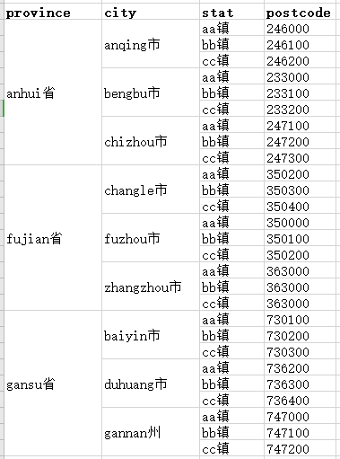
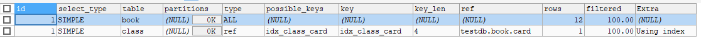
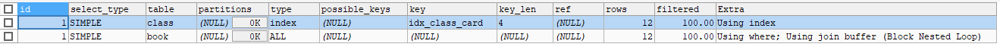
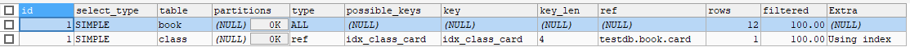

mysql高级.索引优化分析
==


## 引入索引话题
### mysql性能下降、sql慢可能原因
* 查询语句写得烂
* 索引失效(单值索引、复合索引)
* 连接太多表进行查询
* 服务器、mysql参数设置不优(缓冲、线程数等)

### sql的执行顺序
  

依次从左往右


## [7种join连接查询](./2_07_DQL数据查询语言.连接查询.md#连接查询总结)


## 索引简介
```
索引(index)帮助mysql高效获取数据的数据结构。
索引是一种数据结构。

索引作用：给数据排好序、快速查找数据
索引可简单理解为：排好序的快速查找数据的数据结构

mysql索引一般使用的是Btree索引
```

* 索引优化
    ```text
    * 类似图书馆书目索引，提高数据检索效率，降低数据库的磁盘IO成本
  
    * 通过索引对数据进行排序，降低数据排序成本，降低了CPU的消耗，
        实际数据不动，通过索引与实际数据的映射
    ```

* 索引劣势
    ```text
    * 索引也是一张表，该表保存了主键和索引字段，并指向了实体表的记录。索引需要占用磁盘空间
  
    * 降低了更新表数据的速度，如insert、update、delete，因为索引也需要相应的进行更新
  
    * 需要根据业务情况建立优秀的索引、优化SQL语句
    ```

### 索引分类
* 单值索引
    >一个索引只包含一个列，一个表可以有多个交单值索引
* 唯一索引
    >索引列的值必须唯一，但允许有一个null值。唯一键会创建唯一索引
* 复合索引
    >一个索引包含多个列

**复合索引示意图**  
  



### 索引类型
* BTree索引
* Hash索引
* FullText全文索引
* RTree索引

### 增查改删索引
* 创建索引
    ```text
    可以在创建表时创建，
    也可以表创建后，再创建索引
    ```
    ```text
    简化版：CREATE INDEX 索引名 ON 表名 (字段列表);
  
    CREATE [UNIQUE | FULLTEXT | SPATIAL] INDEX index_name
        [index_type]
        ON tbl_name (key_part,...)
        [index_option]
        [algorithm_option | lock_option] ...
    
    #######################################################  
    ## 说明
    { }: 必填项
    [ ]: 选填项
    
    索引类别: [UNIQUE | FULLTEXT | SPATIAL]
        UNIQUE: 唯一索引
        FULLTEXT: 全文索引
        SPATIAL: 空间索引
    
    key_part: {col_name [(length)] | (expr)} [ASC | DESC]}
        默认为ASC升序排序
        如果是CHAR,VARCHAR类型，length可以小于字段实际长度；
        如果是BLOB和TEXT类型，必须指定length
    
    index_option:
        KEY_BLOCK_SIZE [=] value
      | index_type
      | WITH PARSER parser_name
      | COMMENT 'string'
      | {VISIBLE | INVISIBLE}
    
    index_type:
        USING {BTREE | HASH}
        默认为BTREE
        
    algorithm_option:
        ALGORITHM [=] {DEFAULT | INPLACE | COPY}
    
    lock_option:
        LOCK [=] {DEFAULT | NONE | SHARED | EXCLUSIVE}
    
    ```

    * alter方式
    ```text
    ALTER TABLE 表名 ADD PRIMARY KEY (column_list);
    
    ALTER TABLE 表名 ADD UNIQUE INDEX 索引名 (column_list);
    
    ALTER TABLE 表名 ADD INDEX 索引名 (column_list);
    
    ALTER TABLE 表名 ADD FULLTEXT 索引名 (column_list); -- 全文索引
    ```
* 查看索引
    ```text
    SHOW INDEX FROM 表名;
    ```
    
* 删除索引
    ```text
    DROP INDEX 索引名 ON 表名;
    或
    ALTER TABLE 表名 DROP INDEX 索引名;
    ```

### 需要创建索引情况
* 主键自动建立唯一索引
* 频繁作为查询条件的字段、经常排序的字段，该字段应该创建索引
* 查询中与其它表关联的字段，外键关系建立索引
* 在高并发下，倾向建复合索引
* 用于排序的字段
* 查询中用于统计、分组的字段
* 表数据行数300万以上，适合开始建索引
* 索引不宜少建，也不宜多建，根据业务查询需求做相应的调整。有时候甚至重建原来的索引。

### 不适合建索引的情况
* 表行数不多，表行数<300万
* 频繁增删改的表
* 数据重复且分布比较平均的字段。如性别
    ```text
    字段的值重复率低的字段建索引效果更高
    ```


## mysql性能分析
* 内置的Optimizer优化器
    ```text
    mysql内置有Optimizer sql优化器，主要功能：通过计算分析系统中收集到的统计信息，
    为客户端请求的Query查询提供它认为最有的执行计划，但有时可能不是DBA认为最有的
    ```
* mysql常见瓶颈
    * CPU资源不足，持续使用过高，一般发生在数据载入内存或从磁盘读取数据时
    * IO过载，磁盘IO瓶颈发生在载入数据远大于内存容量时
    * 服务器硬件性能瓶颈：top, free, iostat，vmstat, dstat查看性能

### explain + sql语句 分析
```text
使用explain sql语句，可以模拟优化器执行sql语句，
从而知道mysql是如何解析优化该sql语句的，分析sql语句、结构，进而找出可能的瓶颈
```    

* explain的功能
    * 查看表的读取顺序
    * 查看数据操作的操作类型
    * 查看可用的索引
    * 查看实际使用的索引
    * 查看表之间的引用
    * 查看每张表有多少行被优化器查询了

* 使用方法
```text
explain sql语句;

再查看相关的信息
```

### explain查询结果各字段含义列表
[explain输入格式 官方说明](https://dev.mysql.com/doc/refman/8.0/en/explain-output.html)

字段 |JSON Name |含义 |备注
:--- |:--- |:--- |:---
id |select_id |select标识符，在查询中该值是执行顺序的数字 | 
select_type |无 |查询类型 | 
table |table_name |表名 | 
partitions |partitions |查询匹配到的分区 | 
type |access_type |join类型 | 
possible_keys |possible_keys |可选的索引 | 
key |key |实际选择的索引 |
key_len |key_length |所选索引的长度(字节数) | 
ref |ref |显示哪些列或常量被索引使用了 | 
rows |rows |mysql认为执行查询必须检查的行数(估值) | 
filtered |filtered |按表条件将被筛选的行占读到的行(rows列的值)的百分比估值 |最大值100，表示没有发生行过滤
Extra |无 |mysql执行查询的其他信息 |


### explain查询结果各字段含义详解
#### id
select标识符，在查询中该值是顺序的数字。如果该行是其它行union的结果，该值可以为null
    1. id值越大越先执行
    2. id相同的，执行顺序由上往下执行
    3. id为NULL，最后执行 表示union并集结果
#### select_type

select类型 |含义 |备注
:--- |:--- |:---
SIMPLE |简单的select查询(没有union、没有子查询) |
PRIMARY |最外层查询 |查询中若包含任何复杂的子部分，最外层查询则被标记为PRIMARY
UNION |union查询，union中的第二个或后面的select语句 |
DEPENDENT UNION |union中的第二个或后面的select语句，对外查询有依赖 |
UNION RESULT |union的结果集 |从UNION表获取结果的SELECT
SUBQUERY |子查询中的第一个select语句 |在SELECT或者WHERE列表中包含了子查询
DEPENDENT SUBQUERY |子查询中的第一个查询，对外层查询有依赖 |
DERIVED |派生表的select(from子句的子查询) |在FROM列表中包含的子查询, MySQL会递归执行这些子查询，把结果放在临时表里
DEPENDENT DERIVED |依赖于另一个表的派生表 |
MATERIALIZED |物化的子查询 |
UNCACHEABLE SUBQUERY |结果不能被缓存的子查询，外层查询需要使用的时候都要重新执行一次 |
UNCACHEABLE UNION |union中的第二个或者后面的不能被缓存的子查询 |


#### table
* 表名
* `<unionM,N>`: M行和N行结果的union
* `<derivedN>`: 派生自N行的结果
* `<subqueryN>`: 引用N行的物化的子查询
#### partitions
#### type
* system
    ```text
    表只有一行记录（等于系统表），这是const类型的特例，
    平时不会出现，这个也可以忽略不计
    ```
* const
    ```text
    通过索引一次就找到。表最多有一个匹配行，该行结果被优化器当作常量来用
    
    SELECT * FROM tbl_name WHERE primary_key=1;
    
    SELECT * FROM tbl_name
        WHERE primary_key_part1=1
        AND primary_key_part2=2;
    ```
* eq_ref
    ```text
    唯一性索引，对于每个索引键，表中只有一条记录与之匹配，常见于主键或唯一索引扫描
    
    连接查询所有字段，连接条件为主键或非NULL唯一键，则会使用eq_ref
    
    SELECT * FROM ref_table,other_table
        WHERE ref_table.key_column=other_table.column;
    
    SELECT * FROM ref_table,other_table
        WHERE ref_table.key_column_part1=other_table.column
        AND ref_table.key_column_part2=1;
    ```
* ref
    ```text
    非唯一索引扫描，返回匹配某个单独值的所有行。
    本质上也是一种索引访问，它返回所有匹配某个单独值的行，
    然而，它可能会找到多个符合条件的行，
    所以它应该属于查找和扫描的混合体
    SELECT * FROM ref_table WHERE key_column=expr;
    
    SELECT * FROM ref_table,other_table
        WHERE ref_table.key_column=other_table.column;
    
    SELECT * FROM ref_table,other_table
        WHERE ref_table.key_column_part1=other_table.column
        AND ref_table.key_column_part2=1;
    ```
* fulltext
    ```text
    使用全文索引执行连接
    ```
* ref_or_null
    ```text
    包含NULL值的ref，与ref类似

    SELECT * FROM ref_table
        WHERE key_column=expr OR key_column IS NULL;
    ```
* index_merge
    ```
    此连接查询使用了索引合并优化
    ```
* unique_subquery
    ```text
    子查询替换为非唯一索引查找的eq_ref
    value IN (SELECT primary_key FROM single_table WHERE some_expr)
    ```
* index_subquery
    ```text
    子查询替换为非唯一索引扫描ref
    value IN (SELECT key_column FROM single_table WHERE some_expr)
    ```
* range
    ```text
    只检索给定范围内的行，使用索引选择行
    一般是where语句中包含=, <>, >, >=, <, <=, IS NULL, <=>, BETWEEN, LIKE, or IN() 表示范围的查询
    这种范围扫描索引扫描比全表扫描要好，只因只扫描部分索引

    SELECT * FROM tbl_name
        WHERE key_column = 10;
    
    SELECT * FROM tbl_name
        WHERE key_column BETWEEN 10 and 20;
    
    SELECT * FROM tbl_name
        WHERE key_column IN (10, 20, 30);
    
    SELECT * FROM tbl_name
        WHERE key_part1 = 10 AND key_part2 IN (10, 20, 30);
    ```
* index
    ```text
    遍历整个索引树，来找到匹配的行
    ALL、index都读全表，通过index比ALL快，因为索引文件通常比数据文件小
    index从索引中读取，ALL从硬盘中读取
    ```
* ALL
    ```text
    全表扫描，来找到匹配的行
    ```
**性能从好到差：system > const > eq_ref > ref > range > index > ALL**  
**一般来说，把查询优化到range级别，最好达到ref**

#### possible_keys
    ```text
    显示可能应用在这张表中的索引,一个或多个。
    查询涉及的字段上若存在索引，则该索引将被列出，
    但不一定被查询实际使用
    ```
#### key
```text
实际使用的索引。
NULL：没有使用索引

索引字段包含(覆盖)查询select的所有字段，则使用了覆盖索引

要想强制MySQL使用或不使用possible_keys列中的索引，
在查询中使用FORCE INDEX、USE INDEX或者IGNORE INDEX。
```

#### key_len
```text
索引使用的字节数，索引长度
在不损失精确性的情况下，长度越短越好

如果键是NULL，则长度为NULL。

key_len显示的值为索引最大可能长度，并非实际使用长度，
即key_len是根据表定义计算而得，不是通过表内检索出的
```

#### Extra 
1. Using temporary
    ```text
    使用了临时表来保存中间操作的结果，mysql在对查询结果排序时使用临时表。
    常发生在GROUP BY分组查询和ORDER BY排序查询的情况下
    
    发生Using temporary情况，性能是相当相当差的！！
    ```

1. Using filesort
    ```text
    未使用表内的索引进行排序，而是使用索引外的字段进行排序
    
    发生Using filesort情况，性能是相当的！
    ```

1. Using index
    ```text
    只使用索引树中的信息从表中检索列信息，而不必执行额外的查找来读取表的实际行。
    表示使用了覆盖索引
 
    此情况的性能不错
    ```
    * covering index覆盖索引
        ```text
        select的数据只用从索引中就能够得到，不必去读取数据行。
        一个索引字段包含(覆盖)需要查询的所有字段，只需扫描索引而无须查表      
        一个索引字段 与 查询的所有字段顺序可以不一样
        一个索引字段：主键 + 复合索引 的字段   
        
        注意：
        如果要使用covering index，select 字段列表与索引字段重叠，且排序相同，不可select *
        ```
    * 如果同时又出现了Using where，表明索引被用来执行索引键值的查找
    *  如果同时没有出现了Using where，表明索引用来读取数据，而非执行查找数据
1. Using where
    ```text
    使用了WHERE子句过滤行
    ```
1. Using join buffer
    ```text
    使用了连接缓存
    ```
1. Impossible WHERE
    ```text
    WHERE子句始终为false，不能选择任何行
    ```
1. Select tables optimized away
    ```text
    在没有GROUP BY子句的情况下，基于索引优化MIN、MAX操作

    对于MyISAM存储引擎的表，在没有GROUP BY子句且无WHERE子句，或者在没有GROUP BY子句且WHERE子句总是为true的情况下：
    COUNT(*) 查询操作会出现Select tables optimized away
    
    示例index (c1), index(c2)：
    SELECT MIN(c1), MIN(c2) FROM t1;
    
    失效例子：
    SELECT MIN(c2) FROM t1 WHERE c1 <= 10;
    改进版：
    SELECT MIN(c2) FROM t1 WHERE c1 = 10;
    ```   
     
1. Distinct
    ```text
    优化Distinct，在找到第一个匹配的行之后，它将停止搜索与当前行相同的值
        ```  

### explain示例
* 表结构
    ```mysql
    CREATE TABLE t1 (
        id INT PRIMARY KEY,
        `name` VARCHAR(32),
        score INT
    );
    
    CREATE TABLE t2 (
        id INT PRIMARY KEY,
        `name` VARCHAR(32),
        height INT
    );
    
    CREATE TABLE t3 (
        id INT PRIMARY KEY,
        `name` VARCHAR(32),
        income DOUBLE
    );
    
    
    INSERT INTO t1 VALUES
    (1, '张衡', 96),
    (2, '蔡伦', 80),
    (3, '严复', 98),
    (4, '沈括', NULL);
    
    INSERT INTO t2 VALUES
    (1, '张衡', 170),
    (2, '蔡伦', 163),
    (3, '严复', 177);
    
    INSERT INTO t3 VALUES
    (1, '张衡', 2300),
    (2, '蔡伦', 5300),
    (3, '严复', 4800);
    
    
    EXPLAIN
    SELECT d1.name, (SELECT id FROM t3) d2
    FROM (SELECT id, `name` FROM t1 WHERE score = 98) AS d1
    UNION
    (SELECT `name`, id FROM t2);
    ```

* explain分析
    ```mysql
    EXPLAIN
    SELECT d1.name, (SELECT id FROM t3) d2
    FROM (SELECT id, `name` FROM t1 WHERE score = 98) AS d1
    UNION
    (SELECT `name`, id FROM t2)
    ;
    ```
    
      
    1. id:4 第1执行(SELECT `name`, id FROM t2)，类型为UNION
    2. id:2 第2执行(SELECT id FROM t3), 类型为SUBQUERY
    3. id:1 第3执行(SELECT id, `name` FROM t1 WHERE score = 98)，类型为PRIMARY
    4. id:(NULL) 最后执行，合并id 1 与id 4的结果集，类型为UNION RESULT


## 索引优化
### 单表查询分析
* 表结构
    ```mysql
    CREATE TABLE IF NOT EXISTS article (
        id INT UNSIGNED PRIMARY KEY AUTO_INCREMENT,
        author_id INT NOT NULL,
        category_id INT NOT NULL,
        views INT NOT NULL,
        comments INT NOT NULL,
        title VARCHAR(255) NOT NULL,
        content TEXT NOT NULL
    );
    
    
    INSERT INTO article VALUES
    (NULL, 1, 1, 10, 10, '三体', '用前沿科学对《三体》世界进行支撑，用烧脑理论让《三体》的意义进一步延伸。'),
    (NULL, 2, 2, 20, 20, '登月使命', '这本书用文字、图片结合AR技术复现了人类登上月球的伟大旅程。'),
    (NULL, 3, 3, 30, 30, '人类的未来', '大宇宙时代的到来，是我们人类必然会走的一个康庄大道，也是科技发展的一个重要的领域。');
    
    SELECT * FROM article;
    ```
* 查询需求：查询category_id为1，且comments >1的情况下，views最多的article_id, author_id
* 未建索引情况下的查询
    ```mysql
    EXPLAIN
    SELECT id, author_id
    FROM article
    WHERE category_id = 1
        AND comments > 1
    ORDER BY views DESC
    LIMIT 0, 1;
    ```
    
      
    
    **观察与分析**  
    ```text
    type为ALL，最坏情况。
    Extra中出现了Using filesort，也最坏的情况
    ```

* 优化1：创建复合索引index (category_id, comments, views)
    ```mysql
    CREATE INDEX  idx_article_category_id_comments_views ON article (category_id, comments, views);
    
    SHOW INDEX FROM article;
    
    -- case 1
    EXPLAIN
    SELECT id, author_id
    FROM article
    WHERE category_id = 1
        AND comments > 1
    ORDER BY views DESC
    LIMIT 0, 1;
    ```
    
      
    
    **观察与分析**  
    ```text
    type变成了range,这时可以忍受的。
    但是Extra为Using filesort，这个情况任然很坏
    
    ## 问题：为什么建了索引没什么用呢
    1. 这是因为表行数据先按category_id排序，
    2. 在步骤1基础上，category_id相同的再按comments排序
    3. 在步骤2基础上，comments相同的再按views排序
    
    但comments字段在符合索引里处于中间位置是，因为comments > 1 条件是一个范围(即range)
    所以mysql无法利用索引再对后面的views进行检索，即range类型对应的查询字段后面的索引失效
    ```
    ```mysql
    -- case 2
    EXPLAIN
    SELECT id, author_id
    FROM article
    WHERE category_id = 1
    AND comments = 1
    ORDER BY views DESC
    LIMIT 0, 1;
    /*
    type为ref，
    ref为const, const常量, 
    rows为1
    Extra为Backward index scan
    这种情况下效果却非常好
    */
    ```
    
      


* 优化2：删除前面建的索引，新建复合索引index (category_id, views)
    ```mysql
    DROP INDEX idx_article_category_id_comments_views ON article;
    ALTER TABLE article ADD INDEX (category_id, views);
    
    SHOW INDEX FROM article;
    
    EXPLAIN
    SELECT id, author_id
    FROM article
    WHERE category_id = 1
        AND comments > 1
    ORDER BY views DESC
    LIMIT 0, 1;
    ```
    
      
    
    **观察与分析**  
    ```text
    type为ref
    Extra为Using where; Backward index scan，已经没有Using filesort情况了
    
    这是一种非常理想的情况
    ```

### 两表连接查询分析
* 表结构
    ```mysql
    DROP TABLE IF EXISTS class;
    CREATE TABLE class (  -- 书类别表
        id INT PRIMARY KEY AUTO_INCREMENT,
        card INT NOT NULL
    );
    
    DROP TABLE IF EXISTS book;
    CREATE TABLE book (  -- 书记录表
        bookid INT PRIMARY KEY AUTO_INCREMENT,
        card INT NOT NULL
    );
    
    INSERT INTO class (card) VALUES
    (CEIL(RAND() * 20)),
    (CEIL(RAND() * 20)),
    (CEIL(RAND() * 20)),
    (CEIL(RAND() * 20)),
    (CEIL(RAND() * 20)),
    (CEIL(RAND() * 20)),
    (CEIL(RAND() * 20)),
    (CEIL(RAND() * 20)),
    (CEIL(RAND() * 20)),
    (CEIL(RAND() * 20)),
    (CEIL(RAND() * 20)),
    (CEIL(RAND() * 20));
    
    INSERT INTO book (card) VALUES
    (CEIL(RAND() * 20)),
    (CEIL(RAND() * 20)),
    (CEIL(RAND() * 20)),
    (CEIL(RAND() * 20)),
    (CEIL(RAND() * 20)),
    (CEIL(RAND() * 20)),
    (CEIL(RAND() * 20)),
    (CEIL(RAND() * 20)),
    (CEIL(RAND() * 20)),
    (CEIL(RAND() * 20)),
    (CEIL(RAND() * 20)),
    (CEIL(RAND() * 20));
    ```

* 查询需求：查询所有书对应的类别及其他信息
* 未建索引情况下的查询
    ```mysql
    EXPLAIN
    SELECT *
    FROM book
    LEFT OUTER JOIN class
    ON class.card = book.card;
    ```
    
      
    
    **观察与分析**
    ```text
    type均为ALL，不好
    ```
* 优化1：book表添加索引index (card)
    ```mysql
    ALTER TABLE book ADD INDEX idx_book_card(card);
    SHOW INDEX FROM book;
    
    -- case1_1：book表左外连接class表
    EXPLAIN
    SELECT *
    FROM book
    LEFT OUTER JOIN class
    ON class.card = book.card;
    ```
    
      
    
    **观察与分析**  
    ```text
    book表的类型为index，Extra为Using index，rows为12行
    class表的为ALL，Extra为Using where; Using join buffer (Block Nested Loop)
    ```
    
    ```mysql
    -- case1_2：book表右外连接class表
    EXPLAIN
    SELECT *
    FROM book
    RIGHT OUTER JOIN class
    ON class.card = book.card;
    ```
    
      
    
    **观察与分析**
    ```text
    book表的类型为ref，比上面的查询更好一些，Extra为Using index，rows为1行
    class表的为ALL，Extra为NULL
    ```  

    ```mysql
    -- 内连接
    EXPLAIN
    SELECT *
    FROM class
    INNER JOIN book
    ON class.card = book.card;
    
    EXPLAIN
    SELECT *
    FROM book
    INNER JOIN class
    ON class.card = book.card;
    ```
    
      
    
    **观察与分析**  
    ```text
    book表的type为ref，Extra为Using index，rows为1行，key为idx_book_card，ref为testdb.class.card
    class表的为ALL，rows为12行，其他为NULL
    ```
    
* 优化2：只在class表添加索引
    ```mysql
    DROP INDEX idx_book_card ON book;
    
    ALTER TABLE class ADD INDEX idx_class_card (card);
    SHOW INDEX FROM book;
    SHOW INDEX FROM class;
    
    -- case2_1：book表左外连接class表
    EXPLAIN
    SELECT *
    FROM book
    LEFT OUTER JOIN class
    ON class.card = book.card;
    ```
    
      
    
    **观察与分析**  
    ```text
    class表的类型为ref，Extra为Using index，rows为1行
    book表的为ALL，Extra为NULL
    ```
    
    ```mysql
    -- case2_2：book表右外连接class表
    EXPLAIN
    SELECT *
    FROM book
    RIGHT OUTER JOIN class
    ON class.card = book.card;
    ```
    
      

    **观察与分析**  
    ```text
    class表的类型为index，Extra为Using index，rows为12行
    book表的为ALL，Extra为Using where; Using join buffer (Block Nested Loop)
    ```
    
    ```mysql
    -- case2_3：内连接
    --
    EXPLAIN
    SELECT *
    FROM class
    INNER JOIN book
    ON class.card = book.card;
    
    -- 
    EXPLAIN
    SELECT *
    FROM book
    INNER JOIN class
    ON class.card = book.card;
    ```
    
      
    
    **观察与分析**  
    ```text
    class表的type为ref，Extra为Using index，rows为1行，key为idx_class_card，ref为testdb.book.card
    book表的为ALL，rows为12行，其他为NULL
    ```

#### 两表join连接查询优化总结
```text
对于左外连接、右外连接查询，把连接条件的字段建为索引，且把索引建在从表上性能更好。对于内连接无此差别
因为从表值只查询两表相同部分的行，主表查询所有行。
用行数少的表驱动大表，即在行数少的表上建索引效果更好
```

### 三表连接查询分析
* 表结构
    ```mysql
    -- 两表连接查询分析的表结构下，再加一张表，删除class、book表建的索引
    CREATE TABLE phone (
        phoneid INT PRIMARY KEY AUTO_INCREMENT,
        card INT NOT NULL
    );
    
    INSERT INTO phone (card) VALUES
    (CEIL(RAND() * 20)),
    (CEIL(RAND() * 20)),
    (CEIL(RAND() * 20)),
    (CEIL(RAND() * 20)),
    (CEIL(RAND() * 20)),
    (CEIL(RAND() * 20)),
    (CEIL(RAND() * 20)),
    (CEIL(RAND() * 20)),
    (CEIL(RAND() * 20)),
    (CEIL(RAND() * 20)),
    (CEIL(RAND() * 20)),
    (CEIL(RAND() * 20));
    
    -- 把 class、book表的索引都删除
    DROP INDEX idx_class_card ON class;
    DROP INDEX idx_book_card ON book;
    ```

* 查询需求：查询所有书对应的类别、手机号对应类别的所有连接信息
* 未建索引情况下的查询
    ```mysql
    EXPLAIN
    SELECT *
    FROM class c
    LEFT OUTER JOIN book b
    ON c.card = b.card
    LEFT OUTER JOIN phone p
    ON c.card = p.card;
    ```
    
      
    
    **观察与分析**  
    ```text
    class、book、phone三张表的type均为ALL，非常差
    ```
    
    ```mysql
    EXPLAIN
    SELECT *
    FROM class c
    INNER JOIN book b
    ON c.card = b.card
    INNER JOIN phone p
    ON c.card = p.card;
    ```
    
      
    
* 优化1：根据两表连接查询的分析结论，在从表上建索引
    ```mysql
    ALTER TABLE book ADD INDEX idx_book_card (card);
    ALTER TABLE phone ADD INDEX idx_phone_card (card);
    
    EXPLAIN
    SELECT *
    FROM class c
    LEFT OUTER JOIN book b
    ON c.card = b.card
    LEFT OUTER JOIN phone p
    ON c.card = p.card;
    ```
    
      
    
    **观察与分析**  
    ```text
    表book、phone的type都为ref,rows都为1, Extra都为Using index
    优化良好，效果不错。
    
    索引要建在经常查询的字段中
    ```

#### 三表join连接查询优化总结
```text
* 尽可能减少join语句中的嵌套循环总次数

* 永远用小结果集驱动大结果集，即在小结果集表的字段中建索引

* 优先优化嵌套循环的内层循环

* 保证join语句中被驱动表上join条件字段已经被索引，被驱动的表为从表(结果集行数大的表)

* 当无法保证被驱动表的join条件字段被索引且内存资源充足的情况下，把my.cnf配置文件中join_buffer_size设置大点
```

## 索引失效


