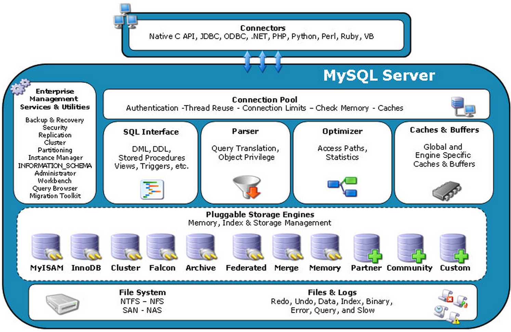

mysql高级.mysql架构介绍
==


## mysql架构介绍
### 高级mysql主要工作内容
* mysql内核
* sql优化工程师
* mysql服务器的优化
* 查询语句优化
* 主从复制
* 软硬件的升级
* 容灾备份
* sql编程

### 修改mysql.cnf配置文件
```text
[client]
port = 3306
socket = /var/lib/mysql/mysql.sock

default_character_set = utf8

[mysqld]
port = 3306
socket = /var/lib/mysql/mysql.sock

character_set_server = utf8
collation_server = utf8_general_ci
log_bin_trust_function_creators = 1

max_connections = 1000

[mysql]
default_character_set = utf8

```

* 当设置的最大连接数不生效解决方法
    * 设置mysqld system服务打开文件够本限制
        ```text
        echo "LimitNOFILE = 65535" >>  /usr/lib/systemd/system/mysqld.service
        
        systemctl  daemon-reload
        ```
    * 修改limits.conf配置  
        /etc/security/limits.conf文件添加如下内容，
        ```text      
        * soft nofile 65535
        * hard nofile 65535
        * soft nproc 65535
        * hard nproc 65535
        ```

### 主要配置文件
#### 主要日志文件
* log-bin 二进制日志
    >用于主从复制
* log-error 错误日志
    >默认是关闭的，记录严重的警告和错误信息、每次启动和关闭详细信息等
* general_log通用日志
    ```text
    默认关闭，
    记录所有执行过的sql，用于排查分析sql性能，但记录log会增加系统负担，
    可以暂时开启，分析完之后再关闭general_log
    ```
* slow-log慢日志
    ```text
    默认关闭
    记录超过一定时间的SQL语句
    ```

#### 数据文件
* .frm文件，存放表结构
* .myd文件，存放表数据
* .myi文件，存放表索引

### mysql逻辑架构
<details>
<summary>mysql逻辑架构</summary>

  
1. 连接层
    >客户端与服务器的连接
1. 服务层
    >完成核心服务，sql接口、sql解析、sql优化、缓存查询等
1. 引擎层
    >负责数据的存储和读取
1. 存储层
    >数据存储于文件系统上，完成与存储引擎的交互


**相关概念**  
```text
1. Connectors
    指的是不同语言中与SQL的交互

2. Management Serveices & Utilities
    系统管理和控制工具

3.Connection Pool
    连接池，管理缓冲用户连接，线程处理等需要缓存的需求。
    负责监听对 MySQL Server 的各种请求，接收连接请求，转发所有连接请求到线程管理模块。每一个连接上 MySQL Server 的客户端请求都会被分配（或创建）一个连接线程为其单独服务。而连接线程的主要工作就是负责 MySQL Server 与客户端的通信，
    接受客户端的命令请求，传递 Server 端的结果信息等。线程管理模块则负责管理维护这些连接线程。包括线程的创建，线程的 cache 等。

4. SQL Interface
    SQL接口
    接受用户的SQL命令，并且返回用户需要查询的结果。比如select from就是调用SQL Interface

5. Parser 
    解析器
    SQL命令传递到解析器的时候会被解析器验证和解析。解析器是由Lex和YACC实现的，是一个很长的脚本。
    在 MySQL中我们习惯将所有 Client 端发送给 Server 端的命令都称为 query ，在 MySQL Server 里面，连接线程接收到客户端的一个 Query 后，会直接将该 query 传递给专门负责将各种 Query 进行分类然后转发给各个对应的处理模块。

    主要功能：
        a . 将SQL语句进行语义和语法的分析，分解成数据结构，
            然后按照不同的操作类型进行分类，然后做出针对性的转发到后续步骤，以后SQL语句的传递和处理就是基于这个结构的。
        b.  如果在分解构成中遇到错误，那么就说明这个sql语句是不合理的

6. Optimizer
    查询优化器
    SQL语句在查询之前会使用查询优化器对查询进行优化。就是优化客户端请求的 query（sql语句） ，
    根据客户端请求的 query 语句，和数据库中的一些统计信息，在一系列算法的基础上进行分析，得出一个最优的策略，
    告诉后面的程序如何取得这个 query 语句的结果
    它使用的是“选取-投影-联接”策略进行查询。
    用一个例子就可以理解： select uid,name from user where gender = 1;
       这个select 查询先根据where 语句进行选取，而不是先将表全部查询出来以后再进行gender过滤
       这个select查询先根据uid和name进行属性投影，而不是将属性全部取出以后再进行过滤
       将这两个查询条件联接起来生成最终查询结果

7. Cache和Buffer
    查询缓存
    它的主要功能是将客户端提交 给MySQL 的 Select 类 query 请求的返回结果集 cache 到内存中，
    与该 query 的一个 hash 值 做一个对应。该 Query 所取数据的基表发生任何数据的变化之后， 
    MySQL 会自动使该 query 的Cache 失效。在读写比例非常高的应用系统中， Query Cache 对性能的提高是非常显著的。
    当然它对内存的消耗也是非常大的。

    如果查询缓存有命中的查询结果，查询语句就可以直接去查询缓存中取数据。这个缓存机制是由一系列小缓存组成的。
    比如表缓存，记录缓存，key缓存，权限缓存等

8. 存储引擎接口
    存储引擎接口模块可以说是 MySQL 数据库中最有特色的一点了。目前各种数据库产品中，
    基本上只有 MySQL 可以实现其底层数据存储引擎的插件式管理。
    这个模块实际上只是 一个抽象类，但正是因为它成功地将各种数据处理高度抽象化，
    才成就了今天 MySQL 可插拔存储引擎的特色。
    从图2还可以看出，MySQL区别于其他数据库的最重要的特点就是其插件式的表存储引擎。MySQL插件式的存储引擎架构提供了一系列标准的管理和服务支持，这些标准与存储引擎本身无关，可能是每个数据库系统本身都必需的，如SQL分析器和优化器等，而存储引擎是底层物理结构的实现，每个存储引擎开发者都可以按照自己的意愿来进行开发。

    注意：存储引擎是基于表的，而不是数据库。
```
</details>

### MyiSAM与InnoDB引擎对比
对比项 |MyiSAM [ˈmɪsʌn] |InnoDB [ˈɪnoʊ db]
:--- |:--- |:---
主键、外键 |不支持 |支持 
事务 |不支持 |支持 
行锁/表锁 |表锁，即使操作一条记录也会锁住整个表，不适合高并发的操作 |行锁，操作时只锁一行，不影响其它行，适合高并发，特殊情况下产生表锁 
缓存 |只缓存索引，不缓存真实数据 |缓存索引及真实数据，<br>对内存要求高，内存大小对性能有决定性影响
表空间 |小 |大 
关注点 |性能，适合读取 |事务 
默认安装 |是 |是 

