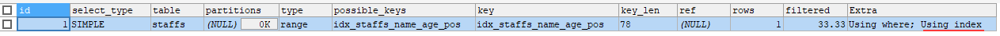
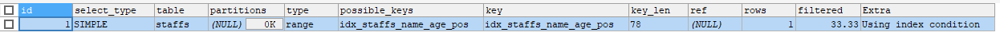
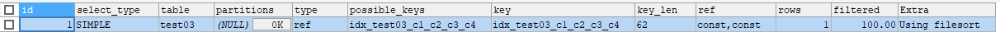

mysql高级.索引优化分析
==


## 引入索引话题
### mysql性能下降、sql慢可能原因
* 查询语句写得烂
* 索引失效(单值索引、复合索引)
* 连接太多表进行查询
* 服务器、mysql参数设置不优(缓存、线程数等)

### sql的执行顺序


依次从左往右


## [7种join连接查询](./2_07_DQL数据查询语言.连接查询.md#连接查询总结)


## 索引简介
```
索引(index)帮助mysql高效获取数据的数据结构。
索引是一种数据结构。

索引作用：给数据排好序、快速查找数据
索引可简单理解为：排好序的快速查找数据的数据结构

mysql索引一般使用的是Btree索引
```

* 索引优化
    ```text
    * 类似图书馆书目索引，提高数据检索效率，降低数据库的磁盘IO成本
  
    * 通过索引对数据进行排序，降低数据排序成本，降低了CPU的消耗，
        实际数据不动，通过索引与实际数据的映射
    ```

* 索引劣势
    ```text
    * 索引也是一张表，该表保存了主键和索引字段，并指向了实体表的记录。索引需要占用磁盘空间
  
    * 降低了更新表数据的速度，如insert、update、delete，因为索引也需要相应的进行更新
  
    * 需要根据业务情况建立优秀的索引、优化SQL语句
    ```

### 索引分类
* 单值索引
  >一个索引只包含一个列，一个表可以有多个单值索引
* 唯一索引
  >索引列的值必须唯一，但允许有一个null值。唯一键会创建唯一索引
* 复合索引
  >一个索引包含多个列

**复合索引示意图**
```text
ALTER TABLE area_map ADD INDEX idx_area_map__province_city_stat (province, city, stat); 
idx_area_map__province_city_stat (province, city, stat)
province 为索引主要字段
city 为索引次要字段2
stat 为索引次要字段3
```
  
  


### 索引类型
* BTree索引
* Hash索引
* FullText全文索引
* RTree索引

### 索引名的命名规范
```test
（primary key）主键索引名：PK_<table>_<column>_<column>
（index）普通索引名：IDX_<table>_<column>_<column>
（unique key）唯一索引名：UN_<table>_<column>_<column>

其中<table>是建立索引的表名，<column>是建立索引的字段名
索引名限制在30个字符内。当索引名超过30字符时，可用缩写来减少索引名的长度，如description –> desc；information –> info；address –> addr等

```

### 增查改删索引
* 创建索引
    ```text
    可以在创建表时创建，
    也可以表创建后，再创建索引
    ```
    ```text
    简化版：CREATE INDEX 索引名 ON 表名 (字段列表);
  
    CREATE [UNIQUE | FULLTEXT | SPATIAL] INDEX index_name
        [index_type]
        ON tbl_name (key_part,...)
        [index_option]
        [algorithm_option | lock_option] ...
    
    #######################################################  
    ## 说明
    { }: 必填项
    [ ]: 选填项
    
    索引类别: [UNIQUE | FULLTEXT | SPATIAL]
        UNIQUE: 唯一索引
        FULLTEXT: 全文索引
        SPATIAL: 空间索引
    
    key_part: {col_name [(length)] | (expr)} [ASC | DESC]}
        默认为ASC升序排序
        如果是CHAR,VARCHAR类型，length可以小于字段实际长度；
        如果是BLOB和TEXT类型，必须指定length
    
    index_option:
        KEY_BLOCK_SIZE [=] value
      | index_type
      | WITH PARSER parser_name
      | COMMENT 'string'
      | {VISIBLE | INVISIBLE}
    
    index_type:
        USING {BTREE | HASH}
        默认为BTREE
        
    algorithm_option:
        ALGORITHM [=] {DEFAULT | INPLACE | COPY}
    
    lock_option:
        LOCK [=] {DEFAULT | NONE | SHARED | EXCLUSIVE}
    
    ```

    * alter方式
    ```text
    ALTER TABLE 表名 ADD PRIMARY KEY (column_list);
    
    ALTER TABLE 表名 ADD UNIQUE INDEX 索引名 (column_list);
    
    ALTER TABLE 表名 ADD INDEX 索引名 (column_list);
    
    ALTER TABLE 表名 ADD FULLTEXT 索引名 (column_list); -- 全文索引
    ```
* 查看索引
    ```text
    SHOW INDEX FROM <表名>;
    
    // 查看指定数据库的所有索引
    SELECT * FROM mysql.`innodb_index_stats` t
    WHERE t.`database_name` = '数据名';
    
    // 查看指定表的所有索引
    SELECT * FROM mysql.`innodb_index_stats` t
    WHERE t.`database_name` = '数据名'
        AND t.table_name LIKE '%表名%';
    ```
    示例
    ```mysql
    $ SELECT * FROM mysql.`innodb_index_stats` t
    WHERE t.`database_name` = 'mylab'
      AND t.table_name LIKE '%book%'
    ;
    
    database_name  table_name  index_name     last_update          stat_name     stat_value  sample_size  stat_description                   
    -------------  ----------  -------------  -------------------  ------------  ----------  -----------  -----------------------------------
    mylab          book        PRIMARY        2024-07-06 17:45:30  n_diff_pfx01          12            1  bookid                             
    mylab          book        PRIMARY        2024-07-06 17:45:30  n_leaf_pages           1       (NULL)  Number of leaf pages in the index  
    mylab          book        PRIMARY        2024-07-06 17:45:30  size                   1       (NULL)  Number of pages in the index       
    mylab          book        idx_book_card  2024-07-06 17:45:30  n_diff_pfx01           8            1  card                               
    mylab          book        idx_book_card  2024-07-06 17:45:30  n_diff_pfx02          12            1  card,bookid                        
    mylab          book        idx_book_card  2024-07-06 17:45:30  n_leaf_pages           1       (NULL)  Number of leaf pages in the index  
    mylab          book        idx_book_card  2024-07-06 17:45:30  size                   1       (NULL)  Number of pages in the index  
    ```

* 删除索引
    ```text
    DROP INDEX 索引名 ON 表名;
    或
    ALTER TABLE 表名 DROP INDEX 索引名;
    ```

### 需要创建索引情况
* 主键自动建立唯一索引
* 频繁作为查询条件的字段、经常排序的字段，该字段应该创建索引
* 查询中与其它表关联的字段，外键关系建立索引
* 在高并发下，倾向建复合索引
* 用于排序的字段
* 查询中用于统计、分组的字段
* 表数据行数300万以上，适合开始建索引
* 索引不宜少建，也不宜多建，根据业务查询需求做相应的调整。有时候甚至重建原来的索引。

### 不适合建索引的情况
* 表行数不多，表行数<300万
* 频繁增删改的表
* 数据重复且分布比较平均的字段。如性别
    ```text
    字段的值重复率低的字段建索引效果更高
    ```


## mysql性能分析和相关指标
* 内置的Optimizer优化器
    ```text
    mysql内置有Optimizer sql优化器，主要功能：通过计算分析系统中收集到的统计信息，
    为客户端请求的Query查询提供它认为最优的执行计划，但有时可能不是DBA认为最优的
    ```
* mysql常见瓶颈
    * CPU资源不足，持续使用过高，一般发生在数据载入内存或从磁盘读取数据时
    * IO过载，磁盘IO瓶颈发生在载入数据远大于内存容量时
    * 服务器硬件性能瓶颈：top, free, iostat，vmstat, dstat查看性能

### explain + sql语句 分析
```text
使用explain sql语句，可以模拟优化器执行sql语句，
从而知道mysql是如何解析优化该sql语句的，分析sql语句、结构，进而找出可能的瓶颈
```    

* explain的功能
    * 查看表的读取顺序
    * 查看数据操作的操作类型
    * 查看可用的索引
    * 查看实际使用的索引
    * 查看表之间的引用
    * 查看每张表有多少行被优化器查询了

* 使用方法
```text
explain sql语句;

再查看相关的信息
```

### explain查询结果各字段含义列表
[explain输出格式 官方说明](https://dev.mysql.com/doc/refman/8.0/en/explain-output.html)

字段 |JSON Name |含义 |备注
:--- |:--- |:--- |:---
id |select_id |select标识符，在查询中该值是执行顺序的数字 |
select_type |无 |查询类型 |
table |table_name |表名 |
partitions |partitions |查询匹配到的分区 |
type |access_type |join类型 |
possible_keys |possible_keys |可选的索引 |
key |key |实际选择的索引 |
key_len |key_length |所选索引的长度(字节数) |
ref |ref |显示哪些列或常量被索引使用了 |
rows |rows |mysql认为执行查询必须检查的行数(估值) |
filtered |filtered |按表条件将被筛选的行占读到的行(rows列的值)的百分比估值 |最大值100，表示没有发生行过滤
Extra |无 |mysql执行查询的其他信息 |


### explain查询结果各字段含义详解
#### id
select标识符，在查询中该值是顺序的数字。如果该行是其它行union的结果，该值可以为null

1. id值越大越先执行
2. id相同的，执行顺序由上往下执行
3. id为NULL，最后执行，表示union并集结果
#### select_type

select类型 |含义 |备注
:--- |:--- |:---
SIMPLE |简单的select查询(没有union、没有子查询) |
PRIMARY |最外层查询 |查询中若包含任何复杂的子部分，最外层查询则被标记为PRIMARY
UNION |union查询，union中的第二个或后面的select语句 |
DEPENDENT UNION |union中的第二个或后面的select语句，对外查询有依赖 |
UNION RESULT |union的结果集 |从UNION表获取结果的SELECT
SUBQUERY |子查询中的第一个select语句 |在SELECT或者WHERE列表中包含了子查询
DEPENDENT SUBQUERY |子查询中的第一个查询，对外层查询有依赖 |
DERIVED |派生表的select(from子句的子查询) |在FROM列表中包含的子查询, MySQL会递归执行这些子查询，把结果放在临时表里
DEPENDENT DERIVED |依赖于另一个表的派生表 |
MATERIALIZED |物化的子查询 |
UNCACHEABLE SUBQUERY |结果不能被缓存的子查询，外层查询需要使用的时候都要重新执行一次 |
UNCACHEABLE UNION |union中的第二个或者后面的不能被缓存的子查询 |


#### table
* 表名
* `<unionM,N>`: M行和N行结果的union
* `<derivedN>`: 派生自N行的结果
* `<subqueryN>`: 引用N行的物化的子查询

#### type
* system
    ```text
    表只有一行记录（等于系统表），这是const类型的特例，
    平时不会出现，这个也可以忽略不计
    ```
* const
    ```text
    通过索引一次就找到。表最多有一个匹配行，该行结果被优化器当作常量来用
    
    SELECT * FROM tbl_name WHERE primary_key=1;
    
    SELECT * FROM tbl_name
        WHERE primary_key_part1=1
        AND primary_key_part2=2;
    ```
* eq_ref
    ```text
    唯一性索引，对于每个索引键，表中只有一条记录与之匹配，常见于主键或唯一索引扫描
    
    连接查询所有字段，连接条件为主键或非NULL唯一键，则会使用eq_ref
    
    SELECT * FROM ref_table,other_table
        WHERE ref_table.key_column=other_table.column;
    
    SELECT * FROM ref_table,other_table
        WHERE ref_table.key_column_part1=other_table.column
        AND ref_table.key_column_part2=1;
    ```
* ref
    ```text
    非唯一索引扫描，返回匹配某个单独值的所有行。
    本质上也是一种索引访问，它返回所有匹配某个单独值的行，
    然而，它可能会找到多个符合条件的行，
    所以它应该属于查找和扫描的混合体
    SELECT * FROM ref_table WHERE key_column=expr;
    
    SELECT * FROM ref_table,other_table
        WHERE ref_table.key_column=other_table.column;
    
    SELECT * FROM ref_table,other_table
        WHERE ref_table.key_column_part1=other_table.column
        AND ref_table.key_column_part2=1;
    ```
* fulltext
    ```text
    使用全文索引执行连接
    ```
* ref_or_null
    ```text
    包含NULL值的ref，与ref类似

    SELECT * FROM ref_table
        WHERE key_column=expr OR key_column IS NULL;
    ```
* index_merge
    ```
    此连接查询使用了索引合并优化
    ```
* unique_subquery
    ```text
    子查询替换为非唯一索引查找的eq_ref
    value IN (SELECT primary_key FROM single_table WHERE some_expr)
    ```
* index_subquery
    ```text
    子查询替换为非唯一索引扫描ref
    value IN (SELECT key_column FROM single_table WHERE some_expr)
    ```
* range
    ```text
    只检索给定范围内的行，使用索引选择行
    一般是where语句中包含=, <>, >, >=, <, <=, IS NULL, <=>, BETWEEN, LIKE, or IN() 表示范围的查询
    这种范围扫描索引扫描比全表扫描要好，只因只扫描部分索引

    SELECT * FROM tbl_name
        WHERE key_column = 10;
    
    SELECT * FROM tbl_name
        WHERE key_column BETWEEN 10 and 20;
    
    SELECT * FROM tbl_name
        WHERE key_column IN (10, 20, 30);
    
    SELECT * FROM tbl_name
        WHERE key_part1 = 10 AND key_part2 IN (10, 20, 30);
    ```
* index
    ```text
    遍历整个索引树，来找到匹配的行
    ALL、index都读全表，通过index比ALL快，因为索引文件通常比数据文件小
    index从索引中读取，ALL从硬盘中读取
    ```
* ALL
    ```text
    全表扫描，来找到匹配的行
    ```
##### type性能比较
* 性能从好到差
```text
system > const > eq_ref > ref > range > index > ALL
```
* 一般来说，把查询优化到range级别，最好达到ref

#### possible_keys
```text
显示可能应用在这张表中的索引,一个或多个。
查询涉及的字段上若存在索引，则该索引将被列出，
但不一定被查询实际使用
```

#### key
```text
实际使用的索引。
NULL：没有使用索引

要想强制MySQL使用或不使用possible_keys列中的索引，
在查询中使用FORCE INDEX、USE INDEX或者IGNORE INDEX。
```
索引字段包含(覆盖)查询select的所有字段，则使用了[覆盖索引](#covering_index)

#### key_len
```text
索引使用的字节数，索引长度
在不损失精确性的情况下，长度越短越好

如果键是NULL，则长度为NULL。

key_len显示的值为索引最大可能长度，并非实际使用长度，
即key_len是根据表定义计算而得，不是通过表内检索出的
```

#### Extra
1. Using temporary
    ```text
    使用了临时表来保存中间操作的结果，mysql在对查询结果排序时使用临时表。
    常发生在GROUP BY分组查询和ORDER BY排序查询的情况下
    
    发生Using temporary情况，性能是相当相当差的！！
    ```

1. Using filesort
    ```text
    未使用表内的索引进行排序。
    索引是已经对表数据排好序，正是因为使用不到索引，所以只好另外再对表数据进行一次临时排序
    
    发生Using filesort情况，性能是相当差的！
    ```

1. Using index
    ```text
    只使用索引树中的信息从表中检索列信息，而不必执行额外的查找来读取表的实际行。
    表示使用了覆盖索引
 
    此情况的性能不错
    ```
   <span id = "covering_index"></span>

    * covering index覆盖索引
        ```text
        select的数据只用从索引中就能够得到，不必去读取数据行。
        一个索引字段包含(覆盖)需要查询的所有字段，只需扫描索引而无须查表      
        一个索引字段 与 查询的所有字段顺序可以不一样
        一个索引字段：主键 + 复合索引 的字段   
        
        注意：
        如果要使用covering index，select 字段列表与索引字段重叠，且排序相同，不可select *
        ```
    * 如果同时又出现了Using where，表明索引被用来执行索引键值的查找
    *  如果同时没有出现了Using where，表明索引用来读取数据，而非执行查找数据
1. Using where
    ```text
    使用了WHERE子句过滤行
    ```
1. Using join buffer
    ```text
    使用了连接缓存
    ```
1. Impossible WHERE
    ```text
    WHERE子句始终为false，不能选择任何行
    ```
1. Select tables optimized away
    ```text
    在没有GROUP BY子句的情况下，基于索引优化MIN、MAX操作

    对于MyISAM存储引擎的表，在没有GROUP BY子句且无WHERE子句，或者在没有GROUP BY子句且WHERE子句总是为true的情况下：
    COUNT(*) 查询操作会出现Select tables optimized away
    
    示例index (c1), index(c2)：
    SELECT MIN(c1), MIN(c2) FROM t1;
    
    失效例子：
    SELECT MIN(c2) FROM t1 WHERE c1 <= 10;
    改进版：
    SELECT MIN(c2) FROM t1 WHERE c1 = 10;
    ```   

1. Distinct
    ```text
    优化Distinct，在找到第一个匹配的行之后，它将停止搜索与当前行相同的值
    ```

##### Extra性能比较
```text
优先比较type性能。
在type值相同的情况下，从上往下，性能由差到好，最差的为Using temporary，

一般出现Using temporary、Using filesort需要特别注意，考虑优化
```

### explain示例
* 表结构
    ```mysql
    CREATE TABLE t1 (
        id INT PRIMARY KEY,
        `name` VARCHAR(32),
        score INT
    );
    
    CREATE TABLE t2 (
        id INT PRIMARY KEY,
        `name` VARCHAR(32),
        height INT
    );
    
    CREATE TABLE t3 (
        id INT PRIMARY KEY,
        `name` VARCHAR(32),
        income DOUBLE
    );
    
    
    INSERT INTO t1 VALUES
    (1, '张衡', 96),
    (2, '蔡伦', 80),
    (3, '严复', 98),
    (4, '沈括', NULL);
    
    INSERT INTO t2 VALUES
    (1, '张衡', 170),
    (2, '蔡伦', 163),
    (3, '严复', 177);
    
    INSERT INTO t3 VALUES
    (1, '张衡', 2300),
    (2, '蔡伦', 5300),
    (3, '严复', 4800);
    
    
    EXPLAIN
    SELECT d1.name, (SELECT id FROM t3) d2
    FROM (SELECT id, `name` FROM t1 WHERE score = 98) AS d1
    UNION
    (SELECT `name`, id FROM t2);
    ```

* explain分析
    ```mysql
    EXPLAIN
    SELECT d1.name, (SELECT id FROM t3) d2
    FROM (SELECT id, `name` FROM t1 WHERE score = 98) AS d1
    UNION
    (SELECT `name`, id FROM t2)
    ;
    ```

  
    1. id:4 第1执行(SELECT `name`, id FROM t2)，类型为UNION
    2. id:2 第2执行(SELECT id FROM t3), 类型为SUBQUERY
    3. id:1 第3执行(SELECT id, `name` FROM t1 WHERE score = 98)，类型为PRIMARY
    4. id:(NULL) 最后执行，合并id 1 与id 4的结果集，类型为UNION RESULT


## 连接查询索引优化
### 单表查询分析
* 表结构
    ```mysql
    CREATE TABLE IF NOT EXISTS article (
        id INT UNSIGNED PRIMARY KEY AUTO_INCREMENT,
        author_id INT NOT NULL,
        category_id INT NOT NULL,
        views INT NOT NULL,
        comments INT NOT NULL,
        title VARCHAR(255) NOT NULL,
        content TEXT NOT NULL
    );
    
    
    INSERT INTO article VALUES
    (NULL, 1, 1, 10, 10, '三体', '用前沿科学对《三体》世界进行支撑，用烧脑理论让《三体》的意义进一步延伸。'),
    (NULL, 2, 2, 20, 20, '登月使命', '这本书用文字、图片结合AR技术复现了人类登上月球的伟大旅程。'),
    (NULL, 3, 3, 30, 30, '人类的未来', '大宇宙时代的到来，是我们人类必然会走的一个康庄大道，也是科技发展的一个重要的领域。');
    
    SELECT * FROM article;
    ```
* 查询需求：查询category_id为1，且comments >1的情况下，views最多的article_id, author_id
* 未建索引情况下的查询
    ```mysql
    EXPLAIN
    SELECT id, author_id
    FROM article
    WHERE category_id = 1
        AND comments > 1
    ORDER BY views DESC
    LIMIT 0, 1;
    ```

  

  **观察与分析**
    ```text
    type为ALL，最坏情况。
    Extra中出现了Using filesort，也最坏的情况
    ```

* 优化1：创建复合索引index (category_id, comments, views)
    ```mysql
    CREATE INDEX  idx_article_category_id_comments_views ON article (category_id, comments, views);
    
    SHOW INDEX FROM article;
    
    -- case 1
    EXPLAIN
    SELECT id, author_id
    FROM article
    WHERE category_id = 1
        AND comments > 1
    ORDER BY views DESC
    LIMIT 0, 1;
    ```

  

  **观察与分析**
    ```text
    type变成了range，这是可以忍受的。
    但是Extra为Using filesort，这个情况任然很坏
    
    ## 问题：为什么建了索引没什么用呢
    1. 这是因为表行数据先按category_id排序，
    2. 在步骤1基础上，category_id相同的再按comments排序
    3. 在步骤2基础上，comments相同的再按views排序
    
    但comments字段在符合索引里处于中间位置是，因为comments > 1 条件是一个范围(即range)
    所以mysql无法利用索引再对后面的views进行检索，即range类型对应的查询字段后面的索引失效
    ```
    ```mysql
    -- case 2
    EXPLAIN
    SELECT id, author_id
    FROM article
    WHERE category_id = 1
    AND comments = 1
    ORDER BY views DESC
    LIMIT 0, 1;
    /*
    type为ref，
    ref为const, const常量, 
    rows为1
    Extra为Backward index scan
    这种情况下效果却非常好
    */
    ```

  


* 优化2：删除前面建的索引，新建复合索引index (category_id, views)
    ```mysql
    DROP INDEX idx_article_category_id_comments_views ON article;
    ALTER TABLE article ADD INDEX (category_id, views);
    
    SHOW INDEX FROM article;
    
    EXPLAIN
    SELECT id, author_id
    FROM article
    WHERE category_id = 1
        AND comments > 1
    ORDER BY views DESC
    LIMIT 0, 1;
    ```

  

  **观察与分析**
    ```text
    type为ref
    Extra为Using where; Backward index scan，已经没有Using filesort情况了
    
    这是一种非常理想的情况
    ```

### 两表连接查询分析
* 表结构
    ```mysql
    DROP TABLE IF EXISTS class;
    CREATE TABLE class (  -- 书类别表
        id INT PRIMARY KEY AUTO_INCREMENT,
        card INT NOT NULL
    );
    
    DROP TABLE IF EXISTS book;
    CREATE TABLE book (  -- 书记录表
        bookid INT PRIMARY KEY AUTO_INCREMENT,
        card INT NOT NULL
    );
    
    INSERT INTO class (card) VALUES
    (CEIL(RAND() * 20)),
    (CEIL(RAND() * 20)),
    (CEIL(RAND() * 20)),
    (CEIL(RAND() * 20)),
    (CEIL(RAND() * 20)),
    (CEIL(RAND() * 20)),
    (CEIL(RAND() * 20)),
    (CEIL(RAND() * 20)),
    (CEIL(RAND() * 20)),
    (CEIL(RAND() * 20)),
    (CEIL(RAND() * 20)),
    (CEIL(RAND() * 20));
    
    INSERT INTO book (card) VALUES
    (CEIL(RAND() * 20)),
    (CEIL(RAND() * 20)),
    (CEIL(RAND() * 20)),
    (CEIL(RAND() * 20)),
    (CEIL(RAND() * 20)),
    (CEIL(RAND() * 20)),
    (CEIL(RAND() * 20)),
    (CEIL(RAND() * 20)),
    (CEIL(RAND() * 20)),
    (CEIL(RAND() * 20)),
    (CEIL(RAND() * 20)),
    (CEIL(RAND() * 20));
    ```

* 查询需求：查询所有书对应的类别及其他信息
* 未建索引情况下的查询
    ```mysql
    EXPLAIN
    SELECT *
    FROM book
    LEFT OUTER JOIN class
    ON class.card = book.card;
    ```

  

  **观察与分析**
    ```text
    type均为ALL，不好
    ```
* 优化1：book表添加索引index (card)
    ```mysql
    ALTER TABLE book ADD INDEX idx_book_card(card);
    SHOW INDEX FROM book;
    
    -- case1_1：book表左外连接class表
    EXPLAIN
    SELECT *
    FROM book
    LEFT OUTER JOIN class
    ON class.card = book.card;
    ```

  

  **观察与分析**
    ```text
    book表的类型为index，Extra为Using index，rows为12行
    class表的为ALL，Extra为Using where; Using join buffer (Block Nested Loop)
    ```

    ```mysql
    -- case1_2：book表右外连接class表
    EXPLAIN
    SELECT *
    FROM book
    RIGHT OUTER JOIN class
    ON class.card = book.card;
    ```

  

  **观察与分析**
    ```text
    book表的类型为ref，比上面的查询更好一些，Extra为Using index，rows为1行
    class表的为ALL，Extra为NULL
    ```  

    ```mysql
    -- 内连接
    EXPLAIN
    SELECT *
    FROM class
    INNER JOIN book
    ON class.card = book.card;
    
    EXPLAIN
    SELECT *
    FROM book
    INNER JOIN class
    ON class.card = book.card;
    ```

  

  **观察与分析**
    ```text
    book表的type为ref，Extra为Using index，rows为1行，key为idx_book_card，ref为testdb.class.card
    class表的为ALL，rows为12行，其他为NULL
    ```

* 优化2：只在class表添加索引
    ```mysql
    DROP INDEX idx_book_card ON book;
    
    ALTER TABLE class ADD INDEX idx_class_card (card);
    SHOW INDEX FROM book;
    SHOW INDEX FROM class;
    
    -- case2_1：book表左外连接class表
    EXPLAIN
    SELECT *
    FROM book
    LEFT OUTER JOIN class
    ON class.card = book.card;
    ```

  

  **观察与分析**
    ```text
    class表的类型为ref，Extra为Using index，rows为1行
    book表的为ALL，Extra为NULL
    ```

    ```mysql
    -- case2_2：book表右外连接class表
    EXPLAIN
    SELECT *
    FROM book
    RIGHT OUTER JOIN class
    ON class.card = book.card;
    ```

  

  **观察与分析**
    ```text
    class表的类型为index，Extra为Using index，rows为12行
    book表的为ALL，Extra为Using where; Using join buffer (Block Nested Loop)
    ```

    ```mysql
    -- case2_3：内连接
    --
    EXPLAIN
    SELECT *
    FROM class
    INNER JOIN book
    ON class.card = book.card;
    
    -- 
    EXPLAIN
    SELECT *
    FROM book
    INNER JOIN class
    ON class.card = book.card;
    ```

  

  **观察与分析**
    ```text
    class表的type为ref，Extra为Using index，rows为1行，key为idx_class_card，ref为testdb.book.card
    book表的为ALL，rows为12行，其他为NULL
    ```

#### 两表join连接查询优化总结
```text
对于左外连接、右外连接查询，把连接条件的字段建为索引，且把索引建在从表上性能更好。对于内连接无此差别
因为从表值只查询两表相同部分的行，主表查询所有行。
用行数少的表驱动大表，即在行数少的表上建索引效果更好
```

### 三表连接查询分析
* 表结构
    ```mysql
    -- 两表连接查询分析的表结构下，再加一张表，删除class、book表建的索引
    CREATE TABLE phone (
        phoneid INT PRIMARY KEY AUTO_INCREMENT,
        card INT NOT NULL
    );
    
    INSERT INTO phone (card) VALUES
    (CEIL(RAND() * 20)),
    (CEIL(RAND() * 20)),
    (CEIL(RAND() * 20)),
    (CEIL(RAND() * 20)),
    (CEIL(RAND() * 20)),
    (CEIL(RAND() * 20)),
    (CEIL(RAND() * 20)),
    (CEIL(RAND() * 20)),
    (CEIL(RAND() * 20)),
    (CEIL(RAND() * 20)),
    (CEIL(RAND() * 20)),
    (CEIL(RAND() * 20));
    
    -- 把 class、book表的索引都删除
    DROP INDEX idx_class_card ON class;
    DROP INDEX idx_book_card ON book;
    ```

* 查询需求：查询所有书对应的类别、手机号对应类别的所有连接信息
* 未建索引情况下的查询
    ```mysql
    EXPLAIN
    SELECT *
    FROM class c
    LEFT OUTER JOIN book b
    ON c.card = b.card
    LEFT OUTER JOIN phone p
    ON c.card = p.card;
    ```

  

  **观察与分析**
    ```text
    class、book、phone三张表的type均为ALL，非常差
    ```

    ```mysql
    EXPLAIN
    SELECT *
    FROM class c
    INNER JOIN book b
    ON c.card = b.card
    INNER JOIN phone p
    ON c.card = p.card;
    ```

  

* 优化1：根据两表连接查询的分析结论，在从表上建索引
    ```mysql
    ALTER TABLE book ADD INDEX idx_book_card (card);
    ALTER TABLE phone ADD INDEX idx_phone_card (card);
    
    EXPLAIN
    SELECT *
    FROM class c
    LEFT OUTER JOIN book b
    ON c.card = b.card
    LEFT OUTER JOIN phone p
    ON c.card = p.card;
    ```

  

  **观察与分析**
    ```text
    表book、phone的type都为ref,rows都为1, Extra都为Using index
    优化良好，效果不错。
    
    索引要建在经常查询的字段中
    ```

#### 三表join连接查询优化总结
```text
* 尽可能减少join语句中的嵌套循环总次数

* 永远用小结果集驱动大结果集，即在小结果集表的字段中建索引

* 优先优化嵌套循环的内层循环

* 保证join语句中被驱动表上join条件字段已经被索引，被驱动的表为从表(结果集行数大的表)

* 当无法保证被驱动表的join条件字段被索引且内存资源充足的情况下，把my.cnf配置文件中join_buffer_size设置大点
```

## 索引失效案例
测试示例表结构如下，添加数据，并建立索引 idx_staffs_name_age_pos (name, age ,pos)

```mysql
-- 员工表
CREATE TABLE staffs (
                        id INT PRIMARY KEY AUTO_INCREMENT,
                        `name` VARCHAR(24) NOT NULL DEFAULT '' COMMENT '姓名',
                        age INT NOT NULL DEFAULT 1 COMMENT '年龄',
                        pos VARCHAR(20) NOT NULL DEFAULT '' COMMENT '职位',
                        add_time TIMESTAMP NOT NULL DEFAULT CURRENT_TIMESTAMP COMMENT '入职时间'
) CHARSET utf8 COMMENT '员工表';


INSERT INTO staffs (`name`, age, pos, add_time) VALUES
                                                    ('z3', 22, 'manager', NOW()),
                                                    ('July', 23,'dev', NOW()),
                                                    ('2000', 23,'dev', NOW());

SELECT * FROM staffs;


-- 建索引
ALTER TABLE staffs ADD INDEX idx_staffs_name_age_pos (`name`, age ,pos);

SHOW INDEX FROM staffs;
```

### 全值匹配我最爱
* 情况1_1
    ```mysql
    -- 情况1_1
    EXPLAIN
    SELECT * FROM staffs WHERE `name` = 'July';
    ```
    
  使用到索引name字段

* 情况1_2
    ```mysql
    -- 情况1_2
    EXPLAIN
    SELECT * 
    FROM staffs 
    WHERE `name` = 'July'
    AND age = 23
    ;
    ```
    
  使用到索引name,age字段

<span id = "情况1_3"></span>
* 情况1_3
    ```mysql
    -- 情况1_3
    EXPLAIN
    SELECT * FROM staffs
    WHERE `name` = 'July'
    AND age = 23
    AND pos = 'dev'
    ;
    ```
    
  使用到索引name,age,pos字段

### 最佳左前缀法则
```text
如果索引了多例，要遵守最左前缀法则。
指的是查询从索引的最左前列开始并且不跳过索引中的列。
```

* 情况2_1
    ```mysql
    -- 情况2_1
    EXPLAIN
    SELECT *
    FROM staffs
    WHERE age = 23
    AND pos = 'dev'
    ;
    ```
    
  **观察与分析**
    ```
    type为ALL，key为NULL，全表扫描，未使用到索引，因为没有用索引的主要字段name
    ```

* 情况2_2
    ```mysql
    -- 情况2_2
    EXPLAIN
    SELECT *
    FROM staffs
    WHERE pos = 'dev'
    ;
    ``` 
    
  **观察与分析**
    ```
    type为ALL，key为NULL，全表扫描，未使用到索引，因为没有用索引的主要字段name
    ```

* 情况2_3
    ```mysql
    -- 情况2_3
    EXPLAIN
    SELECT *
    FROM staffs
    WHERE `name` = 'July'
    AND pos = 'dev'
    ;
    ``` 
    
  **观察与分析**
    ```
    使用了索引的name字段，age、pos字段没有使用到
    ```

### 不在索引列上做任何操作
```text
在索引列上做操作如：计算、函数、类型转换(自动or手动)，
会导致索引失效而转向全表扫描
```

* 情况3_1
  [同情况1_1](#全值匹配我最爱)
    ```mysql
    -- 情况3_1
    EXPLAIN
    SELECT *
    FROM staffs
    WHERE `name` = 'July'
    ;
    ```

* 情况3_2
    ```mysql
    -- 情况3_2
    EXPLAIN
    SELECT *
    FROM staffs
    WHERE LEFT(`name`, 4) = 'July'
    ;
    ```
    
  **观察与分析**
    ```text
    LEFT(str, len)
    取字符串str左边len个字符
    
    函数导致索引失效
    ```

* 情况3_3
    ```mysql
    -- 情况3_3
    -- 数值转字符串
    EXPLAIN
    SELECT *
    FROM staffs
    WHERE `name` = '2000'
    AND age = 23
    ;
    ```
    
  使用上了索引

    * 字符型值没有加引号，类型转换后，索引失效
      <span id = "类型转换索引失效"></span>
        ```text
        EXPLAIN
        SELECT *
        FROM staffs
        WHERE `name` = 2000
        AND age = 23
        ;
        ```
      

      **观察与分析**
        ```text
        `name` = 2000中，name字段为字符型，2000数值转换成字符串
        索引失效
        ```

    ```mysql
    EXPLAIN
    SELECT *
    FROM staffs
    WHERE `name` = 'July'
    AND age = '23'
    ;
    ```
  

  **观察与分析**
    ```text
    age = '23'，'23'字符串转数值，仍使用上了索引name、age字段
    ```

### 索引范围条件右边的索引列失效
```mysql
-- 情况4_1
EXPLAIN
SELECT *
FROM staffs
WHERE `name` = 'z3'
  AND age = 11
  AND pos = 'manager'
;

-- vs
EXPLAIN
SELECT *
FROM staffs
WHERE `name` = 'z3'
  AND age > 11
  AND pos = 'manager'
;
```

**观察与分析**
```text
索引用到了name、age字段
没有用到pos字段
```

### 尽量使用覆盖索引
查询字段尽量使用索引的字段，多使用[覆盖索引](#covering_index)，少用select *

* 情况5_1
    ```mysql
    -- 情况5
    EXPLAIN
    SELECT *
    FROM staffs
    WHERE `name` = 'July'
    AND age = 23
    AND pos = 'dev'
    ;
    ```
  [同情况1_3](#情况1_3)

* 情况5_2
    ```mysql
    -- 5_2
    EXPLAIN
    SELECT `name`, age, pos
    FROM staffs
    WHERE `name` = 'July'
    AND age = 23
    AND pos = 'dev'
    ;
    ```
    
  **观察与分析**
    ```text
    相对于情况1_3更好，使用到了索引，type为ref，关键是Extra为Using index
    ```

* 情况5_3
    ```mysql
    -- 5_3
    EXPLAIN
    SELECT `name`, age, pos
    FROM staffs
    WHERE `name` = 'July'
    AND age > 23
    AND pos = 'dev'
    ;
    
    -- vs
    EXPLAIN
    SELECT *
    FROM staffs
    WHERE `name` = 'July'
    AND age > 23
    AND pos = 'dev'
    ;
    ```
    
  -- vs  
    
  **观察与分析**
    ```text
    前者更优，因为Extra为Using index
    ```

* 情况5_4
    ```mysql
    -- 5_4
    EXPLAIN
    SELECT `name`, age, pos
    FROM staffs
    WHERE `name` = 'July'
    AND age = 23
    ;
    
    --
    EXPLAIN
    SELECT pos
    FROM staffs
    WHERE `name` = 'July'
    AND age = 23
    ;
    
    EXPLAIN
    SELECT pos, age
    FROM staffs
    WHERE `name` = 'July'
    AND age = 23
    ;
    
    EXPLAIN
    SELECT `name`
    FROM staffs
    WHERE `name` = 'July'
    AND age = 23
    ;
    ```
  以上均使用了覆盖索引，计划分析结果均为：
  


### 使用不等于(!=或者<>)时索引失效导致全表扫描
* 情况6_1
    ```text
    -- 6_1
    EXPLAIN
    SELECT *
    FROM staffs
    WHERE `name` = 'July'
    ;
    ```
  [同情况1_1](全值匹配我最爱)

* 情况6_2
    ```mysql
    EXPLAIN
    SELECT *
    FROM staffs
    WHERE `name` != 'July'
    ;
    
    --
    EXPLAIN
    SELECT *
    FROM staffs
    WHERE `name` <> 'July'
    ;
    ```
  mysql 8  
  .png)

  mysql 5.7  
  .png)

  **观察与分析**
    ```text
    两种写法是一个意思
    
    mysql 8: 
    type为range, rows为2行，Extra为Using index condition
    
    mysql 5.7: 
    type为ALL，key为NULL，没有使用到索引
    ```


### is null、is not null无法使用索引
* 情况7_1
    ```mysql
    -- 7_1
    EXPLAIN
    SELECT *
    FROM staffs
    WHERE `name` IS NULL
    ;
    ```
  

* 情况7_2
    ```mysql
    -- 7_2
    EXPLAIN
    SELECT *
    FROM staffs
    WHERE `name` IS NOT NULL
    ;
    ```
  


### like以通配符开头，索引失效导致全表扫描
* 情况8_1
    ```mysql
    -- 8_1
    EXPLAIN
    SELECT *
    FROM staffs
    WHERE `name` = 'July'
    ;
    ```
  [同情况1_1](全值匹配我最爱)

* 情况8_2
    ```mysql
    -- 8_2
    EXPLAIN
    SELECT *
    FROM staffs
    WHERE `name` LIKE '%July%'
    ;
    --
    EXPLAIN
    SELECT *
    FROM staffs
    WHERE `name` LIKE '_July_'
    ;
    ```

* 情况8_3
    ```mysql
    -- 8_3
    EXPLAIN
    SELECT *
    FROM staffs
    WHERE `name` LIKE '%July'
    ;
    
    --
    EXPLAIN
    SELECT *
    FROM staffs
    WHERE `name` LIKE '_July'
    ;
    ```
  

  **观察与分析**
    ```text
    情况8_2、情况8_3结果相同
    type为ALL，全表扫描，key为NULL没有使用索引，Extra为Using where
    ```

* 情况8_4
    ```mysql
    -- 8_4
    EXPLAIN
    SELECT *
    FROM staffs
    WHERE `name` LIKE 'July%'
    ;
    --
    EXPLAIN
    SELECT *
    FROM staffs
    WHERE `name` LIKE 'July_'
    ;
    ```
  

  **观察与分析**
    ```text
    type为range，使用到了索引，Extra为Using index condition
    ```

### 解决like '%字符串%' 索引失效方法:覆盖索引
表结果
```mysql
-- 8_5
CREATE TABLE tbl_user (
                          id INT PRIMARY KEY AUTO_INCREMENT,
                          `name` VARCHAR(20),
                          age INT DEFAULT 1,
                          email VARCHAR(20)
);


INSERT INTO tbl_user(`name`, age, email) VALUES
                                             ('1aa1', 21, 'a@163.com'),
                                             ('2aa2', 22, 'b@163.com'),
                                             ('3aa3', 23, 'c@163.com'),
                                             ('4aa4', 21, 'd@163.com');
```


#### 情况8_5_1: 未建索引
```mysql
-- 8_5_1_1
EXPLAIN
SELECT id
FROM tbl_user
WHERE `name` LIKE '%aa%'
;

-- 8_5_1_2
EXPLAIN
SELECT `name`
FROM tbl_user
WHERE `name` LIKE '%aa%'
;

-- 8_5_1_3
EXPLAIN
SELECT age
FROM tbl_user
WHERE `name` LIKE '%aa%'
;

-- 
-- 8_5_1_4
EXPLAIN
SELECT id, `name`
FROM tbl_user
WHERE `name` LIKE '%aa%'
;

-- 8_5_1_5
EXPLAIN
SELECT id, `name`, age
FROM tbl_user
WHERE `name` LIKE '%aa%'
;

-- 8_5_1_6
EXPLAIN
SELECT `name`, age
FROM tbl_user
WHERE `name` LIKE '%aa%'
;

-- 
-- 8_5_1_7
EXPLAIN
SELECT *
FROM tbl_user
WHERE `name` LIKE '%aa%'
;

-- 8_5_1_8
EXPLAIN
SELECT id, `name`, age, email
FROM tbl_user
WHERE `name` LIKE '%aa%'
;
```
  
**观察与分析**  
以上查询的分析结果相同，均为全表扫描，无索引

#### 情况8_5_2: 建立索引，index (name, age)
```mysql
-- 8_5_2: 建立索引，index (name, age)
ALTER TABLE tbl_user ADD INDEX idx_tbl_user__name_age(`name`, age);
SHOW INDEX FROM tbl_user;
```

* 覆盖索引
    ```mysql
    -- 8_5_2_1
    EXPLAIN
    SELECT id
    FROM tbl_user
    WHERE `name` LIKE '%aa%'
    ;
    
    -- 8_5_2_2
    EXPLAIN
    SELECT `name`
    FROM tbl_user
    WHERE `name` LIKE '%aa%'
    ;
    
    -- 8_5_2_3
    EXPLAIN
    SELECT age
    FROM tbl_user
    WHERE `name` LIKE '%aa%'
    ;
    
    -- 
    -- 8_5_2_4
    EXPLAIN
    SELECT id, `name`
    FROM tbl_user
    WHERE `name` LIKE '%aa%'
    ;
    
    -- 8_5_2_5
    EXPLAIN
    SELECT id, `name`, age
    FROM tbl_user
    WHERE `name` LIKE '%aa%'
    ;
    
    -- 8_5_2_6
    EXPLAIN
    SELECT `name`, age
    FROM tbl_user
    WHERE `name` LIKE '%aa%'
    ;
    
    -- 补充
    EXPLAIN
    SELECT `name`, age, id
    FROM tbl_user
    WHERE `name` LIKE '%aa%'
    ;
    
    EXPLAIN
    SELECT `name`, id, age
    FROM tbl_user
    WHERE `name` LIKE '%aa%'
    ;
    
    
    EXPLAIN
    SELECT age, id, `name`
    FROM tbl_user
    WHERE `name` LIKE '%aa%'
    ;
    ```
  
    ```text
    8_5_2_1 至 8_5_2_6以及后面补充的示例
    
    以上皆为覆盖索引的应用
    type为index，key为idx_tbl_user__name_age，Extra为Using where; Using index
    
    为什么查询中包含id字段，也使用到了覆盖索引，因为id为primary key，可以通过索引查找到
    ```

* 超出覆盖索引
    ```mysql
    -- 8_5_2_7
    EXPLAIN
    SELECT *
    FROM tbl_user
    WHERE `name` LIKE '%aa%'
    ;
    
    -- 8_5_2_8
    EXPLAIN
    SELECT id, `name`, age, email
    FROM tbl_user
    WHERE `name` LIKE '%aa%'
    ;
    ```
  

  **观察分析**
    ```text
    8_5_2_7, 8_5_2_8
    type为ALL，key为NULL，Extra为Using where
    没有使用到索引，因为查询的字段多出了email字段
    ```


#### 解决like'%字符串%'索引不被使用问题的方法小结
```text
1、可以使用主键索引
2、使用覆盖索引，查询字段必须是建立覆盖索引字段
3、当覆盖索引指向的字段是varchar(380)及380以上的字段时，覆盖索引会失效！
```


### 字符串不加单引号索引失效
[见情况3_3](#类型转换索引失效)


### 少用or，用它连接时索引失效
* 情况10_1
    ```mysql
    -- 情况10
    EXPLAIN
    SELECT *
    FROM staffs
    WHERE `name` = 'July'
    OR `name` = 'z3'
    ;

    -- 
    EXPLAIN
    SELECT *
    FROM staffs
    WHERE `name` IN ('July', 'z3')
    ;
    ```
  mysql 8  
  .png)

  -- mysql 5.7
  .png)

  **观察与分析**  
  -- 与情况1_1对比  
  [情况1_1](#全值匹配我最爱)：type为ref
    ```text
    以上两语句在mysql 8、mysql 5.7中的分析结果一样  
  
    mysql 8中
    type为range，Extra为Using index condition，使用到了索引，比情况1_1要稍差
    
    在mysql 5.7 及以下版中
    type为ALL，key为NULL，说明为全表扫描，没有使用到索引
    ```

* 情况10_2
    ```mysql
    EXPLAIN
    SELECT *
    FROM staffs
    WHERE `name` = 'July'
    OR `name` = 'z3' 
    AND age > 18
    ;
    ```
  mysql 8
  .png)

  mysql 5.7
  .png)  
  **观察与分析**
    ```text
    mysql 8:
    type为range，Extra为Using index condition，使用到了索引(name,age字段)
    
    mysql 5.7
    type为ALL，key为NULL，说明为全表扫描，没有使用到索引
    ```

* 情况10_3
```mysql
EXPLAIN
SELECT `name`, age
FROM staffs
WHERE `name` = 'July'
   OR `name` = 'z3'
;

-- 
EXPLAIN
SELECT `name`, age
FROM staffs
WHERE `name` IN ('July', 'z3')
;
```
  
**观察与分析**
```text
mysql 8、mysql 5.7结果相同
type为range，key为idx_staffs_name_age_pos，Extra为Using where; Using index

所有使用OR或IN的情况下，使用覆盖索引来避免索引失效
```

### 索引案例小结
```text
假设为表创建了索引index (a, b, c)
```

where语句 |索引是否有被使用 |备注 
:--- |:--- |:--- 
where a = 3 | 是，使用到a |
where a = 3 and b = 5 | 是，使用到了a,b |
where a = 3 and b = 5 and c = 4 | 是，使用到了a,b,c |
where b = 3 <br>或where b = 3 and c = 4 <br>或where c = 4 | 否，都没有使用到索引 |
where a  = 3 and c = 5 | 是，使用部分索引字段，使用到了a，<br>字段b中断了 |
where a = 3 and b > 4 and c = 5 | 是，使用部分索引字段，使用到了a,b， <br>到字段b这中断了，因为b为范围 |`>, <, <=, >=, between A and B为范围`
where a = 3 and b like 'kk%' and c = 4 | 是，使用到了a,b,c |kk% 相当于 常量
where a = 3 and b like '%kk' and c = 4 | 是，只用到了a |%kk 相当于 范围
where a = 3 and b like '%kk%' and c = 4 | 是，只用到了a |%kk% 相当于 范围
where a = 3 and b like 'k%kk%' and c = 4 | 是，使用到了a,b,c |k%kk% 相当于 常量

### 索引优化小总结口诀
```text
全值匹配我最爱，最左前缀要遵守；
带头大哥不能死，中间兄弟不能断；
索引列上少计算，范围之后全失效；
like % 写最右，覆盖索引不写星；
不等、null值、还有or，索引失效要少用；
字符类型引号不可丢，SQL高级也不难！
```


## 索引使用示例
* 表结构和索引
```mysql
-- 表结构
CREATE TABLE test03 (
                        id INT PRIMARY KEY AUTO_INCREMENT,
                        c1 CHAR(10),
                        c2 CHAR(10),
                        c3 CHAR(10),
                        c4 CHAR(10),
                        c5 CHAR(10)
);

INSERT INTO test03 (c1, c2, c3, c4, c5) VALUES
                                            ('a1', 'a2', 'a3', 'a4', 'a5'),
                                            ('b1', 'b2', 'b3', 'b4', 'b5'),
                                            ('c1', 'c2', 'c3', 'c4', 'c5'),
                                            ('d1', 'd2', 'd3', 'd4', 'd5'),
                                            ('e1', 'e2', 'e3', 'e4', 'e5');

SELECT * FROM test03;

-- 创建索引
ALTER TABLE test03 ADD INDEX idx_test03_c1_c2_c3_c4 (c1, c2, c3, c4);
SHOW INDEX FROM test03;
```

### 根据上面创建的索引idx_test03_c1_c2_c3_c4 (c1, c2, c3, c4), 分析以下SQL语句使用索引的情况
* 情况1
    ```mysql
    -- 1
    EXPLAIN SELECT * FROM test03 WHERE c1 = 'a1';
    -- 用到了索引c1
    
    EXPLAIN SELECT * FROM test03 WHERE c1 = 'a1' AND c2 = 'a2';
    -- 用到了索引c1,c2
    
    EXPLAIN SELECT * FROM test03 WHERE c1 = 'a1' AND c2 = 'a2' AND c3 = 'a3';
    -- 用到了索引c1,c2,c3
    
    EXPLAIN SELECT * FROM test03 WHERE c1 = 'a1' AND c2 = 'a2' AND c3 = 'a3' AND c4 = 'a4';
    -- 用到了索引c1,c2,c3,c4
    ```
  


* 情况2
    ```mysql
    -- 2
    EXPLAIN 
    SELECT * FROM test03
    WHERE c1 = 'a1' AND c2 = 'a2' AND c4 = 'a4' AND c3 = 'a3';
    
    -- 
    EXPLAIN 
    SELECT * FROM test03
    WHERE c4 = 'a4' AND c3 = 'a3' AND c2 = 'a2' AND c1 = 'a1';
    ```
  

  **观察与分析**
    ```text
    以上两个SQL语句，会被mysql的Optimizer优化器优化，把顺序调整为与索引字段顺序一致的查询语句
    ```

* 情况3
    ```mysql
    -- 3
    EXPLAIN 
    SELECT * FROM test03
    WHERE c1 = 'a1' AND c2 = 'a2' AND c3 > 'a3' AND c4 = 'a4';
    ```
  

  **观察与分析**
    ```text
    使用到了索引c1,c2,c3
    ```
* 情况4
    ```mysql
    -- 4
    EXPLAIN SELECT * FROM test03
    WHERE c1 = 'a1' AND c2 = 'a2' AND c4 > 'a4' AND c3 = 'a3';
    /*
    使用到了索引c1,c2,c3,c4，Optimizer优化器进行了SQL优化
    */
    ```
  

  **观察与分析**
    ```text
    使用到了索引c1,c2,c3,c4，Optimizer优化器进行了SQL优化
    c3 = 'a3'是一常量，这样c1 = 'a1' AND c2 = 'a2' AND c4 > 'a4' AND c3 = 'a3' 等价于
    c1 = 'a1' AND c2 = 'a2' AND c3 = 'a3' AND c4 > 'a4';
    ```

* 情况5
    ```mysql
    -- 5
    EXPLAIN 
    SELECT * FROM test03
    WHERE c1 = 'a1' AND c2 = 'a2' AND c4 = 'a4'
    ORDER BY c3;
    ```
  

  **观察与分析**
    ```text
    使用到了索引c1,c2,另外c3用于排序而非查找, Extra为Using index condition
    ```

* 情况6
    ```mysql
    -- 6
    EXPLAIN SELECT * FROM test03
    WHERE c1 = 'a1' AND c2 = 'a2'
    ORDER BY c3;
    /*
    使用到了索引c1,c2,另外c3用于排序而非查找
    */
    ```
  

  **观察与分析**
    ```text
    使用到了索引c1,c2,另外c3用于排序而非查找
    ```

* 情况7
    ```mysql
    -- 7
    EXPLAIN 
    SELECT * FROM test03
    WHERE c1 = 'a1' AND c2 = 'a2'
    ORDER BY c4;
    ```
  

  **观察与分析**
    ```text
    type为ref,使用到了索引c1,c2，
    Extra为Using filesort
    ```
* 情况8_1
    ```mysql
    -- 8_1
    EXPLAIN SELECT * FROM test03
    WHERE c1 = 'a1' AND c5 = 'a5'
    ORDER BY c2, c3;
    ```
  

  **观察与分析**
    ```text
    用到了索引c1，另外c2, c3使用索引排序，
    type为ref，ref为const，Extra为Using where
    ```

<span id = "索引使用示例情况8_2"></span>
* 情况8_2
    ```mysql
    -- 8_2
    EXPLAIN 
    SELECT * FROM test03
    WHERE c1 = 'a1' AND c5 = 'a5'
    ORDER BY c3, c2;
    ```
  

  **观察与分析**
    ```text
    使用到了索引c1，另外c3, c2排序没有用到索引，因为索引列的顺序为c1,c2,c3,c4，而ORDER BY c2, c3没有按照索引列顺序，所以排序时索引失效了
    type为ref，ref为const，Extra为Using where; Using filesort，做了一次临时排序(filesort)
    ```

* 情况9_1
    ```mysql
    -- 9_1
    EXPLAIN SELECT * FROM test03
    WHERE c1 = 'a1' AND c2 = 'a2'
    ORDER BY c2, c3;
    ``` 
  

* 情况9_2
    ```mysql
    -- 9_2
    EXPLAIN
    SELECT * FROM test03
    WHERE c1 = 'a1' AND c2 = 'a2' AND c5 = 'c5'
    ORDER BY c2, c3;
    /*
    都用到了c1,c2索引，c2, c3用于排序，没有出现Using filesort
    */
    ```
  

  **观察与分析**
    ```text
    情况9_1、情况9_2，都用到了c1,c2索引，c2, c3用于排序，没有出现Using filesort
    ```

* 情况10_1
    ```mysql
    -- 10_1
    EXPLAIN
    SELECT * FROM test03
    WHERE c1 = 'a1' AND c2 = 'a2' AND c5 = 'c5'
    ORDER BY c3, c2;
    ```
  

  **观察与分析**
    ```text
    用到了索引c1,c2，
    type为ref，ref为const,const，Extra为Using where
    
    这里为什么没有出现Using filesort呢？
    ==================================
    这里主要是因为 c2 = 'a2'是一个const常量，既然只有一个常量，那么c2就无需排序了
    ORDER BY c3, c2最终优化为ORDER BY c3
    如果c2不是常量，如下面的示例
    ```

* 情况10_2
    ```mysql
    -- 10_2
    EXPLAIN
    SELECT * FROM test03
    WHERE c1 = 'a1' AND c2 > 'a2' AND c5 = 'c5'
    ORDER BY c3, c2;
    ```
  

  **观察与分析**
    ```text
    用了索引c1,c2
    type为range，Extra为Using index condition; Using where; Using filesort
    这种情况下生产了Using filesort
    ```
  [与8_2的对比](#索引使用示例情况8_2)

* 情况11_1
    ```mysql
    -- 11_1
    EXPLAIN
    SELECT COUNT(*) FROM test03
    WHERE c1 = 'a1' AND c4 = 'a4'
    GROUP BY c2, c3;
    ```
  

  **观察与分析**
    ```text
    用到了索引c1，
    type为ref，Extra为Using where; Using index
    ```    

* 情况11_2
    ```mysql
    -- 11_2
    EXPLAIN
    SELECT COUNT(*) FROM test03
    WHERE c1 = 'a1' AND c4 = 'a4'
    GROUP BY c3, c2;
    ```
  mysql 8
  .png)

  mysql 5.7
  .png)

  **观察与分析**
    ```text
    mysql 8
    用到了索引c1，
    type为ref，Extra为Using where; Using index; Using temporary
    产生了Using temporary临时表
    
    mysql 5.7
    用到了索引c1，
    type为ref，Extra为Using where; Using index; Using temporary; Using filesort
    产生了Using temporary临时表、Using filesort排序
    ``` 

### 小结
* where定值或范围条件，order by指定按哪些字段排序
* group by大多需要进行排序，会产生临时表

## 索引优化一般性建议
* 对于单键索引，尽量选择针对当前query过滤性更好的索引
* 使用择组合索引的时，索引字段顺序中越靠左越好的字段过滤性能越好
* 使用择组合索引的时，尽量使用覆盖索引，即尽量都用索引中的字段作变查询字段
* 尽可能通过分析统计信息和调整query的写法来达到选择合适索引的目的
