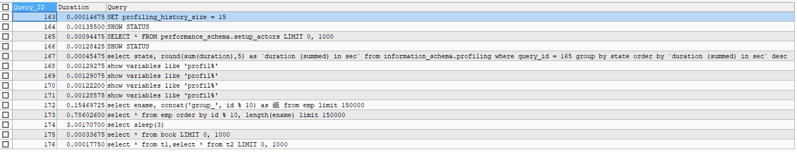

mysql高级.查询截取分析
==


## 查询优化
* 永远小表驱动大表，相当于让外层循环的次数更少
* 优化原则：小表驱动大表，即少的数据集驱动多的数据集

### 小表驱动大表示例
```mysql
-- 示例：A表、B表
CREATE TABLE A (
    id INT,
    cname VARCHAR(32)
);

CREATE TABLE B (
    id INT,
    score INT
);

ALTER TABLE A ADD INDEX idx_a_id (id);
ALTER TABLE B ADD INDEX idx_b_id (id);
```

* 用in优于exists情况
    ```sql
    SELECT * FROM A WHERE id IN (SELECT id FROM B)
    
    -- 等价于：
    FOR (SELECT id FROM B) {
        SELECT * FROM A WHERE A.id = B.id
    }
        
    /*
    当B表的数据集小于A表的数据集时，用in优于exists
    */
    ```

* 用exists优于in情况
    ```sql
    SELECT * FROM A WHERE EXISTS (SELECT 1 FROM B WHERE B.id = A.id)
    
    -- 等价于
    FOR (SELECT * FROM A) {
        SELECT 1 FROM B WHERE B.id = A.id
    }
    
    /*
    当A表的数据集小于B表的数据集时，用exists优于in
    
    注意：
    A表与B表的id字段应建立索引
    
    EXISTS子句理解：
    将主查询的数据，放到子查询中做条件验证，只保留验证结果为true的主数据
    */
    ```
### order by关键字优化

#### order by排序方式案例
```text
order by的两种排序方式：index、filesort
index效率 > filesort效率

因为
index: 只扫描索引完成排序 
filesort: 通过扫描表数据完成排序

=================================
## 如何确定order by用了哪种方式排序?
可以先用explain 执行到where子句，
再explain 执行到order by子句
通过对比两次的分析结果，就可以看出order by使用的排序方式
```

* 表结构
    ```mysql
    CREATE TABLE taba (
        age INT,
        birth TIMESTAMP NOT NULL,
        `comment` VARCHAR(255)
    );
    
    
    INSERT INTO taba (age, birth, `comment`) VALUES
    (22, NOW(), '22岁'),
    (23, NOW(), '23岁'),
    (24, NOW(), '24岁');
    
    SELECT * FROM taba;
    
    -- 建立索引
    CREATE INDEX idx_taba_age_birth ON taba (age, birth);
    
    SHOW INDEX FROM taba;
    ```
    
* 情况1_0
    ```mysql
    -- 1_0
    EXPLAIN
    SELECT age, birth FROM taba 
    WHERE age = 20
    ORDER BY age;
    ```
      
    **观察与分析**  
    ```text
    order by排序方式：index
    用到索引age,birth
    type为ref
    Extra为null
    ```
        
* 情况1_1
    ```mysql
    -- 1_1
    EXPLAIN
    SELECT age, birth FROM taba 
    WHERE age > 20
    ORDER BY age;
    ```
      
    **观察与分析**  
    ```text
    order by排序方式：index
    用到索引age,birth
    type为index
    Extra为Using where; Using index
    ```
    -- vs
    ```mysql
    EXPLAIN
    SELECT * FROM taba 
    WHERE age > 20
    ORDER BY age;
    /*
    order by排序方式：index
    用到索引age
    type为range
    Extra为Using index condition
    */
    ```
      
    
* 情况1_2
    ```mysql
    -- 1_2
    EXPLAIN
    SELECT age, birth FROM taba
    WHERE age > 20
    ORDER BY age, birth;
    ```
      
    **观察与分析**  
    ```text
    order by排序方式：index
    用到索引age,birth
    type为index
    Extra为Using where; Using index
    ```
    -- vs
    ```mysql
    EXPLAIN
    SELECT * FROM taba
    WHERE age > 20
    ORDER BY age, birth;
    /*
    order by排序方式：index
    用到索引age
    type为range
    Extra为Using index condition
    */
    ```
      
    
<span id = "order_by_1_3"></span>
* 情况1_3
    ```mysql
    -- 1_3
    EXPLAIN
    SELECT age, birth FROM taba
    WHERE age > 20
    ORDER BY birth;
    ```
      
    **观察与分析**  
    ```text
    order by排序方式：filesort
    用到索引age,birth
    type为index
    Extra为Using where; Using index; Using filesort
    ```
    -- vs
    ```mysql
    EXPLAIN
    SELECT * FROM taba
    WHERE age > 20
    ORDER BY birth;
    /*
    order by排序方式：filesort
    用到索引age
    type为range
    Extra为Using index condition; Using filesort
    */
    ```
      
    
* 情况1_4
    ```mysql
    -- 1_4
    EXPLAIN
    SELECT age, birth FROM taba
    WHERE age > 20
    ORDER BY birth, age;
    ```
      
    **观察与分析**  
    ```text
    order by排序方式：filesort
    用到索引age,birth
    type为index
    Extra为Using where; Using index; Using filesort
    ```
    -- vs
    ```mysql
    EXPLAIN
    SELECT * FROM taba
    WHERE age > 20
    ORDER BY birth, age;
    /*
    order by排序方式：filesort
    用到索引age
    type为range
    Extra为Using index condition; Using filesort
    */
    ```
      
    
    -- vs
    ```mysql
    EXPLAIN
    SELECT age, birth FROM taba
    WHERE age = 20
    ORDER BY birth, age;
    /*
    order by排序方式：index
    用到索引age
    type为ref
    Extra为Using index
    */
    ```
      
    
* 情况2_1
    ```mysql
    -- 2_1
    EXPLAIN
    SELECT age, birth FROM taba 
    ORDER BY birth;
    ```
      
    **观察与分析**  
    ```text
    order by排序方式：filesort
    用到索引age,birth
    type为index
    Extra为Using index; Using filesort
    ```
    -- vs
    ```mysql
    EXPLAIN
    SELECT * FROM taba 
    ORDER BY birth;
    /*
    order by排序方式：filesort
    没有用到索引
    type为ALL，全表扫描
    Extra为Using filesort
    */
    ```
      
    
* 情况2_2
    ```mysql
    -- 2_2
    EXPLAIN
    SELECT age, birth FROM taba
    WHERE birth > '2019-11-06 00:00:00'
    ORDER BY birth;
    ```
      
    **观察与分析**  
    ```text
    order by排序方式：filesort
    用到索引age,birth
    type为index
    Extra为Using where; Using index; Using filesort
    ```
    -- vs
    ```mysql
    EXPLAIN
    SELECT * FROM taba
    WHERE birth > '2019-11-06 00:00:00'
    ORDER BY birth;
    /*
    order by排序方式：filesort
    没有用到索引
    type为ALL，全表扫描
    Extra为Using where; Using filesort
    */
    ```
      

* 情况2_3
    ```mysql
    -- 2_3
    EXPLAIN
    SELECT age, birth FROM taba
    WHERE birth > '2019-11-06 00:00:00'
    ORDER BY age;
    ```
      
    
    **观察与分析**  
    ```text
    -- 与1_3的比较
    
    order by排序方式：index
    用到索引age,birth
    type为index
    Extra为Using where; Using index
    
    这里为什么只用到了index排序，而没有产生filesort排序呢？
    这主要是因为使用到了覆盖索引，因为idx_taba_age_birth (age, birth) 而select * 即为 select age, birth
    ```
    [与1_3的比较，把where条件与order by字段调换](#order_by_1_3)  
    
    -- vs
    ```mysql
    EXPLAIN
    SELECT * FROM taba
    WHERE birth > '2019-11-06 00:00:00'
    ORDER BY age;
    /*
    order by排序方式：filesort
    没有用到索引
    type为ALL，全表扫描
    Extra为Using where; Using filesort
    */
    ```
      
    
* 情况2_4
    ```mysql
    -- 2_4
    EXPLAIN
    SELECT age, birth FROM taba
    ORDER BY age ASC, birth DESC;
    ```
      
    
    **观察与分析**  
    ```text
    order by排序方式：filesort
    用到索引age,birth
    type为index
    Extra为Using index; Using filesort
    ```
    -- vs
    ```mysql
    EXPLAIN
    SELECT * FROM taba
    ORDER BY age ASC, birth DESC;
    /*
    order by排序方式：filesort
    没有用到索引
    type为ALL，全表扫描
    Extra为Using filesort
    */
    ```
      
    
* 情况2_5
    ```mysql
    EXPLAIN
    SELECT age, birth FROM taba
    ORDER BY age DESC, birth DESC;
    ```
      
    
    **观察与分析**  
    ```text
    order by排序方式：index
    用到索引age,birth
    type为index
    Extra为Backward index scan; Using index
    
    为什么没有产生filesort
    这是因为ORDER BY排序的字段的排序方向一致，
    默认索引字段的排序是asc升序，所以这里出现了反向索引扫描(Backward index scan)
    ```
    -- vs
    ```mysql
    EXPLAIN
    SELECT * FROM taba
    ORDER BY age DESC, birth DESC;
    /*
    order by排序方式：filesort
    没有用到索引
    type为ALL，全表扫描
    Extra为Using filesort
    */
    ```
      

* 情况2_6
    ```mysql
    EXPLAIN
    SELECT age, birth FROM taba
    WHERE age IN (20, 22) ORDER BY birth;
    /*
    
    */
    ```
      
        
    **观察与分析**  
    ```text
    order by排序方式：filesort
    用到了索引age
    type为range
    Extra为Using where; Using index; Using filesort
    ```


#### 如何让order by使用index方式排序
```text
以下任意一种情况
```
* order by语句满足索引最佳左前缀法则(索引最左前列)
* where子句条件与order by子句字段组合满足索引最佳左前缀法则

#### filesort排序的两种算法
* 双路排序算法
* 单路排序算法

##### 双路排序算法
```text
MySQL 4.1之前是使用双路排序，需要两次扫描磁盘，最终得到数据。
读取行指针和order by列，对他们进行排序，然后扫描已经排序好的列表，
按照列表中的值重新从列表中读取对应的数据传输
```

```text
第一次IO：从磁盘取排序字段，在buffer进行排序，
第二次IO：然后以buffer中的顺序，再从磁盘取其他字段。
IO是比较耗时的
```

##### 单路算法
```text
从磁盘读取查询需要的所有列，按照order by列在buffer对它们进行排序，然后扫描buffer中排序后的列表进行输出，
它的效率更快一些，避免了第二次读取数据，并且把随机IO变成顺序IO，
但是它会使用更多的内存空间，因为它把每一行都保存在内存中了。
```

* 单路排序的弊端
    ```text
    由于单路是后出来的，总体而言好过双路
    
    但是用单路有问题
    当从磁盘读取查询需要的所有列的数据总大小超过sort_buffer容量时，
    导致每次只能取sort_buffer容量大小的数据，进行排序(创建tmp文件，多路合并)，
    排完序在重复取，再排...
    多次从磁盘取数据，即多次IO
    ```

#### order by相关的优化策略
* 增大sort_buffer_size参数的设置
* 增大max_length_for_sort_data参数的设置
* 尽量只select需要的列
* order by子句尽量使用index方式排序，避免使用filesort方式排序
* 尽可能在左前列上完成排序操作，满足索引最佳左前缀法则

```text
有order by子句时尽量避免用select *

* 当查询的字段大小总和小于max_length_for_sort_data，并且order by
字段不是TEXT或IBLOB类型时，会用单路排序算法，否则用多路排序算法

* 两种算法的数据都有可能超出sort_buffer容量(sort_buffer_size值)，
超出后，会创建tmp文件进行合并排序，导致多次IO。
这时单路算法的风险更大些，所以要提高sort_buffer_size

* sort_buffer_size是针对每个进程的

* 尝试提高max_length_for_sort_data
提高这个参数会增加使用单路排序算法的概率。
但是设置得太高，数据总容量超出sort_buffer_size值的概率会增大，超过了这种情况也不好，提高了IO次数
```

#### order by关键字小结
```text
mysql有两种排序方式：filesort、index

mysql能为排序和查询使用相同的索引

注意 ...表示覆盖索引，下面的示例也相同
```

* order by符合最佳左前缀法则，则order by能用到index排序
    ```sql
    ... ORDER BY a;
    ... ORDER BY a, b;
    ... ORDER BY a, b, c;
    ... ORDER BY a, DESC, b DESC, c DESC; -- 排序字段的排序方向都一致，所以能用到index排序
    ```

* 如果where使用索引的最左前缀定义为常量，则order by能使用索引排序
    ```sql
    ... WHERE a = const ORDER BY b, c;
    ... WHERE a = const AND b = const ORDER BY c;
    ... WHERE a = const ORDER BY b, c;
    ... WHERE a = const AND b > const ORDER BY b, c;
    ```

* 不能使用索引进行排序情况
    ```sql
    ... ORDER BY a ASC, b DESC, c DESCl;  -- order by排序字段的排序方向不一致
    ... WHERE g = const ORDER BY b, c;  -- 丢失索引a字段
    ... WHERE a = const ORDER BY c;  -- 丢失索引b字段
    ... WHERE a = const ORDER BY a, d;  -- 字段d不是索引字段
    ... WHERE a IN (...) ORDER BY b, c;  -- 对于排序来说，多个相等条件也是范围
    ```

### group by关键字优化
* group by实质是先排序后进行分组，遵照使用索引的最佳左前缀法则
* 当无法使用索引列，增大max_length_for_sort_data参数的值、增大sort_buffer_size参数的值
* where优先于having，能用where筛选就不要用having筛选
* 其他同order by关键字优化方法


## 慢查询日志
```text
具体指运行时间大于 long_query_time 值的SQL语句，则会被记录到慢査询日志中。
long_query_time 的默认值为10，即10秒。

默认情况下，mysql数据库没有开启慢查询日志。
如果不是调优需求，一般不建议开启慢查询日志，因为开启会带来一定的性能影响。
```

### 临时开启慢查询日志
mysql服务重启后失效

* 开启慢查询日志
    ```mysql
    # 查看慢查询日志开启状态
    SHOW GLOBAL VARIABLES LIKE '%slow_query_log%';
    
    # 开启慢查询日志
    SET GLOBAL slow_query_log = 1;
    ```

* 设置慢查询sql的时间阈值
    ```mysql
    # 查看慢查询sql的阈值
    SHOW VARIABLES LIKE 'long_query_time%';
    
    # 设置慢查询sql阈值，单位为秒
    SET GLOBAL long_query_time = 3;
    ```

**在修改了全局的long_query_time时间之后建立的会话才会生效，因为每个会话都一个会话级的long_query_time**
```text
SHOW SESSION VARIABLES LIKE 'long_query_time';
```

* 其他相关参数
    ```text
    log_output  # 慢查询日志输出类型
    slow_query_log_file  # 存放慢查询日志文件
    log_queries_not_using_indexes  # 是否记录未使用索引的SQL语句
    ```

### 永久开启慢查询日志
向my.cnf配置文件的[mysqld]块内添加下面内容
```text
# slow query log
log_output = file
slow_query_log = on
slow_query_log_file = /var/lib/mysql/mysql_slow.log
log_queries_not_using_indexes = on  # 如果值设置为ON,则会记录所有没有利用索引的查询(性能优化时开启此项,平时不要开启)
long_query_time = 5  # 超过多少秒的查询就写入日志
```

### 查看慢查询日志
```bash
在mysql服务器上，可以直接查看慢查询日志文件，shell命令：
more /var/lib/mysql/centos8-slow.log

格式
====
# Time: 执行此sql的时刻
# User@Host: 用户  Id:    会话id
# Query_time: 查询用时  Lock_time: 锁定时间 Rows_sent: 结果集行数  Rows_examined: 查检行数
use testdb;
SET timestamp=1573115172; # 执行此sql的时间戳
SELECT SLEEP(8); SQL语句
```
  

* 查看当前系统中有多少条慢查询日志
```mysql
SHOW GLOBAL STATUS LIKE '%Slow_queries%';
```


### mysqldumpshow慢查询日志分析工具
```test
使用方法(shell命令)：
mysqldumpslow [ OPTS... ] 日志文件路径

相关选项：
  --help       打印帮助信息

  -v/--verbose 输入详细信息
  -d/--debug   debug调度调试
  -s ORDER     排序方式，可选项：(al, at, ar, c, l, r, t), 不写-s项，默认为at
                al: average lock time 平均锁定时间
                ar: average rows sent 平均返回记录的行数
                at: average query time 平均查询时间
                 c: count 访问次数
                 l: lock time 锁定时间
                 r: rows sent 返回记录集的行数
                 t: query time 查询用时
  -r           反转排序结果，原来第一个排最后一个
  -t NUM       显示top NUM个
  -a           don't abstract all numbers to N and strings to 'S' SQL语句中的数字替换为为N、字符串不替换为为'S'
  -n NUM       abstract numbers with at least n digits within names 名称中至少有n位的抽象
  -g PATTERN   过虑模式，类似过虑grep过滤，忽略大小写。注意：只包含匹配关系
  -h HOSTNAME  hostname of db server for *-slow.log filename (can be wildcard),
               default is '*', i.e. match all
  -i NAME      name of server instance (if using mysql.server startup script) mysql服务实例名
  -l           don't subtract lock time from total time 不从总时间中减去锁定时间
```

#### mysqldumpshow工作常用参考
* 查询返回记录集行数最多的前10个SQL语句
    ```bash
    mysqldumpslow -s r -t 10 -a /var/lib/mysql/centos8-slow.log
    ```
* 查询访问次数最多的前10个SQL语句
    ```bash
    mysqldumpslow -s c -t 10 /var/lib/mysql/centos8-slow.log
    ```
* 查询用时最多，且SQL语句含有左连接的前10个SQL，
    ```bash
    mysqldumpslow -s t -t 10 -g "left join" /var/lib/mysql/centos8-slow.log
    ```
* 另外当查询的结果过多时，可用管道加more参数查看
    ```bash
    mysqldumpslow -s t -t 100 /var/lib/mysql/centos8-slow.log |more
    ```


## 批量插入数据脚本
```text
如插入1000万行数据，可以分批次插入，每批插入50万行，以减少数据库压力
这里是通过在mysql创建函数跟存储过程，然后调用存储过程来插入数据的

另外也可以通过程序来批量插入数据，如python等
```

* 表结构
    ```mysql
    CREATE TABLE dept (  -- 部门表
        id INT UNSIGNED PRIMARY KEY AUTO_INCREMENT,
        deptno MEDIUMINT UNSIGNED NOT NULL DEFAULT 0 COMMENT '部门编号',
        dname VARCHAR(20) NOT NULL DEFAULT '' '部门名称',
        loc VARCHAR(13) NOT NULL DEFAULT '' COMMENT '楼层'  -- 楼层
    ) COMMENT='部门表';
    
    CREATE TABLE emp (  -- 员工表
        id INT UNSIGNED PRIMARY KEY AUTO_INCREMENT,
        empno MEDIUMINT UNSIGNED NOT NULL DEFAULT 0 COMMENT '员工编号',  -- 编号
        ename VARCHAR(20) NOT NULL DEFAULT '' COMMENT '员工编号',  -- 姓名
        job VARCHAR(9) NOT NULL DEFAULT '' COMMENT '职位',  -- 职位
        mgr MEDIUMINT UNSIGNED NOT NULL DEFAULT 0 COMMENT '上级领导编号',  -- 上级领导编号
        hirdate DATE NOT NULL COMMENT '入职时间',  -- 入职时间
        sal DECIMAL(7, 2) NOT NULL COMMENT '薪水',  -- 薪水
        comm DECIMAL(7, 2) NOT NULL COMMENT '分红',  -- 分红
        deptno MEDIUMINT UNSIGNED NOT NULL DEFAULT 0 COMMENT '所在部门编号'  -- 所在部门编号
    ) COMMENT='员工表';
    ```

* 创建产生指定长度的随机字符串函数

在 SQLyog、Navicat MySQL 上不支持`DELIMITER`，要执行`DELIMITER`直接在 MySQL 客户端的 CLI 中去执行 下面的命令。  
那当然也可以在 SQLyog、Navicat MySQL 的 函数、存储过程等项中直接创建 函数、存储过程。
    ```mysql
    DELIMITER $
    CREATE FUNCTION rand_string(n INT) RETURNS VARCHAR(255)
    /*产生指定长度的随机字符串函数
    in
    ---
        n: 要生成的字符串长度
    return:  指定长度的随机字符串
    */
    BEGIN
        DECLARE chars_str VARCHAR(100) DEFAULT 'abcdefghijklmnopqrstuvwxyzABCDEFGHIJKLMNOPQRSTUVWXYZ';
        DECLARE return_str VARCHAR(255) DEFAULT '';
        DECLARE i INT DEFAULT 0;
        
        WHILE i < n DO
            SET return_str = CONCAT(return_str, SUBSTR(chars_str, CEIL(RAND() * 52), 1));
            SET i = i + 1;
        END WHILE;
        
        RETURN return_str;
    END$
    
    DELIMITER ;
    ```

* 创建产生随机部门编号函数
    ```mysql
    DELIMITER $
    CREATE FUNCTION rand_num() RETURNS INT
    /*产生随机部门编号函数
    
    in
    --
    
    return: 部门编号
    */
    BEGIN
        DECLARE i INT DEFAULT 0;
        SET i = CEIL(100 + RAND() * 10);  -- 让部门编号从100起
        RETURN i;
    END $
    
    DELIMITER ;
    ```
    如果 MySQL 开启了 bin-log 日志，则可能报下面的错误
    ```bash
    错误代码： 1418
    This function has none of DETERMINISTIC, NO SQL, or READS SQL DATA in its declaration and binary logging is enabled (you *might* want to use the less safe log_bin_trust_function_creators variable)
    ```
    解决方法1
    ```mysql
    -- 开启 log_bin_trust_function_creators
    set global log_bin_trust_function_creators = 1;
    ```
    解决方法2，指定 FUNCTION 的影响：  
    可选项：DETERMINISTIC  // 不确定的  
    NO SQL  // 没有SQL语句，所以是不修改数据  
    READS SQL DATA  // 只读取SQL数据，所以是不修改数据  
    不被 FUNCTION 支持的 还有：  
    MODIFIES SQL DATA  // 要修改数据  
    CONTAINS SQL  // 包含了SQL语句
    ```mysql
    DELIMITER $
    
    CREATE FUNCTION rand_num() RETURNS INT
    DETERMINISTIC
    BEGIN
        DECLARE i INT DEFAULT 0;
        SET i = CEIL(100 + RAND() * 10);  -- 让部门编号从100起
        RETURN i;
    END $
    
    DELIMITER ;
    ```

* 创建往emp表中插入数据的存储过程
    ```mysql
    DELIMITER $
    CREATE PROCEDURE insert_emp(IN s INT, IN len INT)
    /*向emp表中插入数据
    
    in
    ---
        s: 员工编号起始值
        len: 要添加的员工个数
    out
    ---
       
    */
    BEGIN
        DECLARE i INT DEFAULT 0;
        SET autocommit = 0;  -- 关闭事务自动提交
        
        WHILE i < len DO
            INSERT INTO emp (empno, ename, job, mgr, hirdate, sal, comm, deptno)
            VALUES ((s + i), rand_string(6), 'SALESMAN', 0001, CURDATE(), 2000, 400, rand_num());
            SET i = i + 1;
        END WHILE;
        
        COMMIT;  -- 提交事务
    END$
    
    DELIMITER ;
    ```
* 创建往dept表中插入数据的存储过程
    ```mysql
    DELIMITER $
    CREATE PROCEDURE insert_dept(IN s INT, IN len INT)
    /*向dept表中插入数据
    
    in
    ---
        s: 部门编号起始值
        len: 要添加的部门个数
    out
    ---
       
    */
    BEGIN
        DECLARE i INT DEFAULT 0;
        SET autocommit = 0;
        
        WHILE i < len DO
            INSERT INTO dept (deptno, dname, loc)
            VALUES ((s + i), rand_string(10), rand_string(8));
            SET i = i + 1;
        END WHILE;
        
        COMMIT;
    END$
    
    DELIMITER ;
    ```

* 调用存储过程批量插入数据
    ```mysql
    CALL insert_dept(100, 10);
    SELECT * FROM dept;
    
    CALL insert_emp(1001, 500000);
    
    USE testdb;
    SELECT * FROM emp LIMIT 0, 100;
    ```

* 其他
    ```mysql
    -- 查看创建的函数
    SELECT * FROM information_schema.routines
    WHERE routine_schema = 'testdb' AND routine_type = 'FUNCTION';
    
    -- 查看创建的存储过程
    SELECT * FROM information_schema.routines
    WHERE routine_schema = 'testdb' AND routine_type = 'PROCEDURE';
    ```

## show profiles、show profile性能查看与分析
```text
show profiles、show profile可以分析当前会话中SQL语句执行的各阶段用时、CPU、IO等资源消耗情况等，可用于SQL的调优测量。
默认情况下profiling功能是关闭的

从mysql 5.6.7开始show profiles、show profile被deprecated弃用，建议使用Performance Schema
```
[show profile官网说明](https://dev.mysql.com/doc/refman/8.0/en/show-profile.html)  


### 开启性能收集功能
```mysql
-- 查看profiling性能信息收集功能是否开启
SHOW VARIABLES LIKE 'profiling';

-- 开启性能信息收集。会话级变量
SET profiling = 1;


-- 查看profiling历史容量，默认为15
SHOW VARIABLES LIKE 'profiling_history_size';

-- 设置profiling历史容量
SET profiling_history_size = 100;

SHOW VARIABLES LIKE 'profil%';
```

### show profiles
```text
显示当前会话最近执行的SQL语句列表
```
```mysql
SHOW PROFILES;
```
  

### show profile
查看单条SQL语句各个阶段的用时、CPU、IO等详情。诊断SQL语句

* show profile语法
    ```text  
    SHOW PROFILE [type [, type] ... ]
        [FOR QUERY n]
        [LIMIT row_count [OFFSET offset]]
    
    ## 注意
    FOR QUERY n 这里的n为：show profiles显示的Query_ID值
    
    默认只显示Status、Duration列 
        Status：sql执行的阶段
        Duration：此阶段用时，单位为秒
        
    type: {
        ALL  显示所有下列所有类型的信息
      | BLOCK IO  显示块IO输入、输出操作计数
      | CONTEXT SWITCHES  显示上下文切换计数
      | CPU  显示用户、系统CPU使用时间
      | IPC  显示信息接收、发送的计数
      | MEMORY  内存使用信息，此功能暂未实现
      | PAGE FAULTS  显示主要页面、次要页面错误的计数
      | SOURCE  显示源代码中函数的名称，以及函数所在文件的名称、行号
      | SWAPS  显示交换计数
    }
    ```
* 示例
    ```mysql
    SHOW PROFILE FOR QUERY 173;
    ```
      
    
    ```mysql
    SHOW PROFILE CPU, BLOCK IO FOR QUERY 173;
    ```
      

    ```mysql
    SHOW PROFILE ALL FOR QUERY 173;
    ```

### 日常开发需要注意的事项
Status中出现下列情况
* converting HEAP to MyISAM：查询结果太大，内存不够用了往磁盘上搬了。
* Creating tmp table：创建临时表，拷贝数据到临时表，用完再删除
* Copying to tmp table on disk：把内存中临时表复制到磁盘，危险！！！
* locked


## Performance Schema性能查看与分析
```text
比show profiles、show profile更强大的性能查看与分析工具。
它是把收集的数据保存于performance_schema库中
```
[Performance Schema官方说明](https://dev.mysql.com/doc/refman/8.0/en/performance-schema-query-profiling.html)

### 使用Performance Schema准备工作
* 默认setup_actors设置器对所有前台线程(所有会话)进行监听、收集历史sql语句，如下
    ```mysql
    SELECT * FROM performance_schema.setup_actors;
    ```
      

* 设置对特定用户进行监听、收集历史sql语句
    ```mysql
    -- 关闭所有前台线程(所有会话)进行监听、收集历史sql语句
    UPDATE performance_schema.setup_actors
    SET ENABLED = 'NO', HISTORY = 'NO'
    WHERE HOST = '%'
    AND USER = '%';

    -- 开启对特定用户进行监听、收集历史sql语句
    INSERT INTO performance_schema.setup_actors
    (HOST, USER, ROLE, ENABLED, HISTORY) VALUES
    ('%','root','%','YES','YES');

    -- 
    SELECT * FROM performance_schema.setup_actors;
    ```
      

* 开启statement、stage生产者(instruments)
    ```mysql
    -- performance_schema.setup_instruments表中的name like '%statement/%'的记录的ENABLED字段为'YES', TIMED字段为'YES'
    SELECT * FROM performance_schema.setup_instruments
    WHERE NAME LIKE '%statement/%';
    
    UPDATE performance_schema.setup_instruments
    SET ENABLED = 'YES', TIMED = 'YES'
    WHERE NAME LIKE '%statement/%';
    
    
    -- performance_schema.setup_instruments表中的name like'%stage/%'的记录的ENABLED字段为'YES', TIMED字段为'YES'
    SELECT * FROM performance_schema.setup_instruments
    WHERE NAME LIKE '%stage/%';
    
    UPDATE performance_schema.setup_instruments
    SET ENABLED = 'YES', TIMED = 'YES'
    WHERE NAME LIKE '%stage/%';
    ```

* 开启events_statements_*、events_stages_*消费者(consumers)
    ```mysql
    SELECT * FROM performance_schema.setup_consumers
    WHERE NAME LIKE '%events_statements_%';
    
    UPDATE performance_schema.setup_consumers
    SET ENABLED = 'YES'
    WHERE NAME LIKE '%events_statements_%';
    
    --
    SELECT * FROM performance_schema.setup_consumers
    WHERE NAME LIKE '%events_stages_%';
    
    UPDATE performance_schema.setup_consumers
    SET ENABLED = 'YES'
    WHERE NAME LIKE '%events_stages_%';
    ```

### 执行要分析性能的SQL语句
```mysql
-- 如
SELECT * FROM emp ORDER BY id % 10, LENGTH(ename) LIMIT 150000;
```

### Performance Schema查看性能与分析
* 查看历史SQL语句列表
    ```mysql
    -- TIMER_WAIT时间需要装换，其值除以1000000000000即为秒 (除以 10^12)
    -- 可以用SQL_TEXT字段筛选
    SELECT EVENT_ID, TRUNCATE(TIMER_WAIT/1000000000000,6) AS "Duration (s)", SQL_TEXT
    FROM performance_schema.events_statements_history_long;
    ```
      
    
* 查看单条SQL性能
    ```mysql
    SELECT event_name AS Stage, TRUNCATE(TIMER_WAIT/1000000000000,6) AS "Duration (s)"
    FROM performance_schema.events_stages_history_long 
    WHERE NESTING_EVENT_ID = 1094;
    /*
    NESTING_EVENT_ID 为上面查询到的 EVENT_ID
    */
    ```
      


## sys Schema性能查看与分析
```text
通过 sys 数据库 查看性能
sys 数据库 下有很多内置的view视图、存储过程、函数、触发器

在 MySQL5.7 中新增了sys Schema。
MySQL sys Schema是一个由一系列对象(视图、存储过程、存储方法、表和触发器) 组成的database schema，
它本身不采集和存储什么信息，而是将 performance_schema 和 information_schema 数据库中的数据以更容易理解的方式总结出来归纳为“视图”。
DBA 和 开发人员 可以通过 sys Schema 方便、快速地读取 Performance Schema 收集的数据。
```
[sys Schema官网使用说明](https://dev.mysql.com/doc/refman/8.0/en/sys-schema-usage.html)  

* 查看表的访问量(可以监控每张表访问量的情况，或者监控某个库的访问量的变化)
    ```mysql
    SELECT table_schema, table_name, SUM(io_read_requests + io_write_requests)
    FROM sys.schema_table_statistics
    GROUP BY table_schema, table_name;
    
    -- 或
    SELECT table_schema,table_name, io_read_requests + io_write_requests AS io_total 
    FROM sys.schema_table_statistics;
    ```

* 查询冗余索引
    ```mysql
    SELECT * FROM sys.schema_redundant_indexes;
    ```

* 查询未使用索引
    ```mysql
    SELECT * FROM sys.schema_unused_indexes;
    ```
    
* 查看表自增ID使用情况
    ```mysql
    SELECT * FROM sys.schema_auto_increment_columns;
    ```


* 查询全表扫描的sql语句
    ```mysql
    SELECT * FROM sys.statements_with_full_table_scans
    WHERE db = '库名';
    ```

* 查看实例消耗的磁盘IO情况，单位为：bytes
    ```mysql
    -- 查看io_global_by_file_by_bytes视图可以检查磁盘IO消耗过大的原因，定位问题
    SELECT FILE, avg_read + avg_write AS avg_io 
    FROM sys.io_global_by_file_by_bytes 
    ORDER BY avg_io DESC LIMIT 10;
    ```

### sys 库内置的 view
```mysql
$> USE sys;
$> SHOW TABLE STATUS WHERE COMMENT='view';

Name                                           Engine  Version  Row_format    Rows  Avg_row_length  Data_length  Max_data_length  Index_length  Data_free  Auto_increment  Create_time          Update_time  Check_time  Collation  Checksum  Create_options  Comment  
---------------------------------------------  ------  -------  ----------  ------  --------------  -----------  ---------------  ------------  ---------  --------------  -------------------  -----------  ----------  ---------  --------  --------------  ---------
host_summary                                   (NULL)   (NULL)  (NULL)      (NULL)          (NULL)       (NULL)           (NULL)        (NULL)     (NULL)          (NULL)  2024-07-05 12:04:30  (NULL)       (NULL)      (NULL)       (NULL)  (NULL)          VIEW     
host_summary_by_file_io                        (NULL)   (NULL)  (NULL)      (NULL)          (NULL)       (NULL)           (NULL)        (NULL)     (NULL)          (NULL)  2024-07-05 12:04:30  (NULL)       (NULL)      (NULL)       (NULL)  (NULL)          VIEW     
host_summary_by_file_io_type                   (NULL)   (NULL)  (NULL)      (NULL)          (NULL)       (NULL)           (NULL)        (NULL)     (NULL)          (NULL)  2024-07-05 12:04:30  (NULL)       (NULL)      (NULL)       (NULL)  (NULL)          VIEW     
host_summary_by_stages                         (NULL)   (NULL)  (NULL)      (NULL)          (NULL)       (NULL)           (NULL)        (NULL)     (NULL)          (NULL)  2024-07-05 12:04:30  (NULL)       (NULL)      (NULL)       (NULL)  (NULL)          VIEW     
host_summary_by_statement_latency              (NULL)   (NULL)  (NULL)      (NULL)          (NULL)       (NULL)           (NULL)        (NULL)     (NULL)          (NULL)  2024-07-05 12:04:30  (NULL)       (NULL)      (NULL)       (NULL)  (NULL)          VIEW     
host_summary_by_statement_type                 (NULL)   (NULL)  (NULL)      (NULL)          (NULL)       (NULL)           (NULL)        (NULL)     (NULL)          (NULL)  2024-07-05 12:04:30  (NULL)       (NULL)      (NULL)       (NULL)  (NULL)          VIEW     
innodb_buffer_stats_by_schema                  (NULL)   (NULL)  (NULL)      (NULL)          (NULL)       (NULL)           (NULL)        (NULL)     (NULL)          (NULL)  2024-07-05 12:04:30  (NULL)       (NULL)      (NULL)       (NULL)  (NULL)          VIEW     
innodb_buffer_stats_by_table                   (NULL)   (NULL)  (NULL)      (NULL)          (NULL)       (NULL)           (NULL)        (NULL)     (NULL)          (NULL)  2024-07-05 12:04:30  (NULL)       (NULL)      (NULL)       (NULL)  (NULL)          VIEW     
innodb_lock_waits                              (NULL)   (NULL)  (NULL)      (NULL)          (NULL)       (NULL)           (NULL)        (NULL)     (NULL)          (NULL)  2024-07-05 12:04:30  (NULL)       (NULL)      (NULL)       (NULL)  (NULL)          VIEW     
io_by_thread_by_latency                        (NULL)   (NULL)  (NULL)      (NULL)          (NULL)       (NULL)           (NULL)        (NULL)     (NULL)          (NULL)  2024-07-05 12:04:30  (NULL)       (NULL)      (NULL)       (NULL)  (NULL)          VIEW     
io_global_by_file_by_bytes                     (NULL)   (NULL)  (NULL)      (NULL)          (NULL)       (NULL)           (NULL)        (NULL)     (NULL)          (NULL)  2024-07-05 12:04:30  (NULL)       (NULL)      (NULL)       (NULL)  (NULL)          VIEW     
io_global_by_file_by_latency                   (NULL)   (NULL)  (NULL)      (NULL)          (NULL)       (NULL)           (NULL)        (NULL)     (NULL)          (NULL)  2024-07-05 12:04:30  (NULL)       (NULL)      (NULL)       (NULL)  (NULL)          VIEW     
io_global_by_wait_by_bytes                     (NULL)   (NULL)  (NULL)      (NULL)          (NULL)       (NULL)           (NULL)        (NULL)     (NULL)          (NULL)  2024-07-05 12:04:30  (NULL)       (NULL)      (NULL)       (NULL)  (NULL)          VIEW     
io_global_by_wait_by_latency                   (NULL)   (NULL)  (NULL)      (NULL)          (NULL)       (NULL)           (NULL)        (NULL)     (NULL)          (NULL)  2024-07-05 12:04:30  (NULL)       (NULL)      (NULL)       (NULL)  (NULL)          VIEW     
latest_file_io                                 (NULL)   (NULL)  (NULL)      (NULL)          (NULL)       (NULL)           (NULL)        (NULL)     (NULL)          (NULL)  2024-07-05 12:04:30  (NULL)       (NULL)      (NULL)       (NULL)  (NULL)          VIEW     
memory_by_host_by_current_bytes                (NULL)   (NULL)  (NULL)      (NULL)          (NULL)       (NULL)           (NULL)        (NULL)     (NULL)          (NULL)  2024-07-05 12:04:30  (NULL)       (NULL)      (NULL)       (NULL)  (NULL)          VIEW     
memory_by_thread_by_current_bytes              (NULL)   (NULL)  (NULL)      (NULL)          (NULL)       (NULL)           (NULL)        (NULL)     (NULL)          (NULL)  2024-07-05 12:04:30  (NULL)       (NULL)      (NULL)       (NULL)  (NULL)          VIEW     
memory_by_user_by_current_bytes                (NULL)   (NULL)  (NULL)      (NULL)          (NULL)       (NULL)           (NULL)        (NULL)     (NULL)          (NULL)  2024-07-05 12:04:30  (NULL)       (NULL)      (NULL)       (NULL)  (NULL)          VIEW     
memory_global_by_current_bytes                 (NULL)   (NULL)  (NULL)      (NULL)          (NULL)       (NULL)           (NULL)        (NULL)     (NULL)          (NULL)  2024-07-05 12:04:30  (NULL)       (NULL)      (NULL)       (NULL)  (NULL)          VIEW     
memory_global_total                            (NULL)   (NULL)  (NULL)      (NULL)          (NULL)       (NULL)           (NULL)        (NULL)     (NULL)          (NULL)  2024-07-05 12:04:30  (NULL)       (NULL)      (NULL)       (NULL)  (NULL)          VIEW     
metrics                                        (NULL)   (NULL)  (NULL)      (NULL)          (NULL)       (NULL)           (NULL)        (NULL)     (NULL)          (NULL)  2024-07-05 12:04:30  (NULL)       (NULL)      (NULL)       (NULL)  (NULL)          VIEW     
processlist                                    (NULL)   (NULL)  (NULL)      (NULL)          (NULL)       (NULL)           (NULL)        (NULL)     (NULL)          (NULL)  2024-07-05 12:04:30  (NULL)       (NULL)      (NULL)       (NULL)  (NULL)          VIEW     
ps_check_lost_instrumentation                  (NULL)   (NULL)  (NULL)      (NULL)          (NULL)       (NULL)           (NULL)        (NULL)     (NULL)          (NULL)  2024-07-05 12:04:30  (NULL)       (NULL)      (NULL)       (NULL)  (NULL)          VIEW     
schema_auto_increment_columns                  (NULL)   (NULL)  (NULL)      (NULL)          (NULL)       (NULL)           (NULL)        (NULL)     (NULL)          (NULL)  2024-07-05 12:04:30  (NULL)       (NULL)      (NULL)       (NULL)  (NULL)          VIEW     
schema_index_statistics                        (NULL)   (NULL)  (NULL)      (NULL)          (NULL)       (NULL)           (NULL)        (NULL)     (NULL)          (NULL)  2024-07-05 12:04:30  (NULL)       (NULL)      (NULL)       (NULL)  (NULL)          VIEW     
schema_object_overview                         (NULL)   (NULL)  (NULL)      (NULL)          (NULL)       (NULL)           (NULL)        (NULL)     (NULL)          (NULL)  2024-07-05 12:04:30  (NULL)       (NULL)      (NULL)       (NULL)  (NULL)          VIEW     
schema_redundant_indexes                       (NULL)   (NULL)  (NULL)      (NULL)          (NULL)       (NULL)           (NULL)        (NULL)     (NULL)          (NULL)  2024-07-05 12:04:30  (NULL)       (NULL)      (NULL)       (NULL)  (NULL)          VIEW     
schema_table_lock_waits                        (NULL)   (NULL)  (NULL)      (NULL)          (NULL)       (NULL)           (NULL)        (NULL)     (NULL)          (NULL)  2024-07-05 12:04:30  (NULL)       (NULL)      (NULL)       (NULL)  (NULL)          VIEW     
schema_table_statistics                        (NULL)   (NULL)  (NULL)      (NULL)          (NULL)       (NULL)           (NULL)        (NULL)     (NULL)          (NULL)  2024-07-05 12:04:30  (NULL)       (NULL)      (NULL)       (NULL)  (NULL)          VIEW     
schema_table_statistics_with_buffer            (NULL)   (NULL)  (NULL)      (NULL)          (NULL)       (NULL)           (NULL)        (NULL)     (NULL)          (NULL)  2024-07-05 12:04:30  (NULL)       (NULL)      (NULL)       (NULL)  (NULL)          VIEW     
schema_tables_with_full_table_scans            (NULL)   (NULL)  (NULL)      (NULL)          (NULL)       (NULL)           (NULL)        (NULL)     (NULL)          (NULL)  2024-07-05 12:04:30  (NULL)       (NULL)      (NULL)       (NULL)  (NULL)          VIEW     
schema_unused_indexes                          (NULL)   (NULL)  (NULL)      (NULL)          (NULL)       (NULL)           (NULL)        (NULL)     (NULL)          (NULL)  2024-07-05 12:04:30  (NULL)       (NULL)      (NULL)       (NULL)  (NULL)          VIEW     
session                                        (NULL)   (NULL)  (NULL)      (NULL)          (NULL)       (NULL)           (NULL)        (NULL)     (NULL)          (NULL)  2024-07-05 12:04:30  (NULL)       (NULL)      (NULL)       (NULL)  (NULL)          VIEW     
session_ssl_status                             (NULL)   (NULL)  (NULL)      (NULL)          (NULL)       (NULL)           (NULL)        (NULL)     (NULL)          (NULL)  2024-07-05 12:04:30  (NULL)       (NULL)      (NULL)       (NULL)  (NULL)          VIEW     
statement_analysis                             (NULL)   (NULL)  (NULL)      (NULL)          (NULL)       (NULL)           (NULL)        (NULL)     (NULL)          (NULL)  2024-07-05 12:04:30  (NULL)       (NULL)      (NULL)       (NULL)  (NULL)          VIEW     
statements_with_errors_or_warnings             (NULL)   (NULL)  (NULL)      (NULL)          (NULL)       (NULL)           (NULL)        (NULL)     (NULL)          (NULL)  2024-07-05 12:04:30  (NULL)       (NULL)      (NULL)       (NULL)  (NULL)          VIEW     
statements_with_full_table_scans               (NULL)   (NULL)  (NULL)      (NULL)          (NULL)       (NULL)           (NULL)        (NULL)     (NULL)          (NULL)  2024-07-05 12:04:30  (NULL)       (NULL)      (NULL)       (NULL)  (NULL)          VIEW     
statements_with_runtimes_in_95th_percentile    (NULL)   (NULL)  (NULL)      (NULL)          (NULL)       (NULL)           (NULL)        (NULL)     (NULL)          (NULL)  2024-07-05 12:04:30  (NULL)       (NULL)      (NULL)       (NULL)  (NULL)          VIEW     
statements_with_sorting                        (NULL)   (NULL)  (NULL)      (NULL)          (NULL)       (NULL)           (NULL)        (NULL)     (NULL)          (NULL)  2024-07-05 12:04:30  (NULL)       (NULL)      (NULL)       (NULL)  (NULL)          VIEW     
statements_with_temp_tables                    (NULL)   (NULL)  (NULL)      (NULL)          (NULL)       (NULL)           (NULL)        (NULL)     (NULL)          (NULL)  2024-07-05 12:04:30  (NULL)       (NULL)      (NULL)       (NULL)  (NULL)          VIEW     
user_summary                                   (NULL)   (NULL)  (NULL)      (NULL)          (NULL)       (NULL)           (NULL)        (NULL)     (NULL)          (NULL)  2024-07-05 12:04:30  (NULL)       (NULL)      (NULL)       (NULL)  (NULL)          VIEW     
user_summary_by_file_io                        (NULL)   (NULL)  (NULL)      (NULL)          (NULL)       (NULL)           (NULL)        (NULL)     (NULL)          (NULL)  2024-07-05 12:04:30  (NULL)       (NULL)      (NULL)       (NULL)  (NULL)          VIEW     
user_summary_by_file_io_type                   (NULL)   (NULL)  (NULL)      (NULL)          (NULL)       (NULL)           (NULL)        (NULL)     (NULL)          (NULL)  2024-07-05 12:04:30  (NULL)       (NULL)      (NULL)       (NULL)  (NULL)          VIEW     
user_summary_by_stages                         (NULL)   (NULL)  (NULL)      (NULL)          (NULL)       (NULL)           (NULL)        (NULL)     (NULL)          (NULL)  2024-07-05 12:04:30  (NULL)       (NULL)      (NULL)       (NULL)  (NULL)          VIEW     
user_summary_by_statement_latency              (NULL)   (NULL)  (NULL)      (NULL)          (NULL)       (NULL)           (NULL)        (NULL)     (NULL)          (NULL)  2024-07-05 12:04:30  (NULL)       (NULL)      (NULL)       (NULL)  (NULL)          VIEW     
user_summary_by_statement_type                 (NULL)   (NULL)  (NULL)      (NULL)          (NULL)       (NULL)           (NULL)        (NULL)     (NULL)          (NULL)  2024-07-05 12:04:30  (NULL)       (NULL)      (NULL)       (NULL)  (NULL)          VIEW     
version                                        (NULL)   (NULL)  (NULL)      (NULL)          (NULL)       (NULL)           (NULL)        (NULL)     (NULL)          (NULL)  2024-07-05 12:04:30  (NULL)       (NULL)      (NULL)       (NULL)  (NULL)          VIEW     
wait_classes_global_by_avg_latency             (NULL)   (NULL)  (NULL)      (NULL)          (NULL)       (NULL)           (NULL)        (NULL)     (NULL)          (NULL)  2024-07-05 12:04:30  (NULL)       (NULL)      (NULL)       (NULL)  (NULL)          VIEW     
wait_classes_global_by_latency                 (NULL)   (NULL)  (NULL)      (NULL)          (NULL)       (NULL)           (NULL)        (NULL)     (NULL)          (NULL)  2024-07-05 12:04:30  (NULL)       (NULL)      (NULL)       (NULL)  (NULL)          VIEW     
waits_by_host_by_latency                       (NULL)   (NULL)  (NULL)      (NULL)          (NULL)       (NULL)           (NULL)        (NULL)     (NULL)          (NULL)  2024-07-05 12:04:30  (NULL)       (NULL)      (NULL)       (NULL)  (NULL)          VIEW     
waits_by_user_by_latency                       (NULL)   (NULL)  (NULL)      (NULL)          (NULL)       (NULL)           (NULL)        (NULL)     (NULL)          (NULL)  2024-07-05 12:04:30  (NULL)       (NULL)      (NULL)       (NULL)  (NULL)          VIEW     
waits_global_by_latency                        (NULL)   (NULL)  (NULL)      (NULL)          (NULL)       (NULL)           (NULL)        (NULL)     (NULL)          (NULL)  2024-07-05 12:04:30  (NULL)       (NULL)      (NULL)       (NULL)  (NULL)          VIEW     
x$host_summary                                 (NULL)   (NULL)  (NULL)      (NULL)          (NULL)       (NULL)           (NULL)        (NULL)     (NULL)          (NULL)  2024-07-05 12:04:30  (NULL)       (NULL)      (NULL)       (NULL)  (NULL)          VIEW     
x$host_summary_by_file_io                      (NULL)   (NULL)  (NULL)      (NULL)          (NULL)       (NULL)           (NULL)        (NULL)     (NULL)          (NULL)  2024-07-05 12:04:30  (NULL)       (NULL)      (NULL)       (NULL)  (NULL)          VIEW     
x$host_summary_by_file_io_type                 (NULL)   (NULL)  (NULL)      (NULL)          (NULL)       (NULL)           (NULL)        (NULL)     (NULL)          (NULL)  2024-07-05 12:04:30  (NULL)       (NULL)      (NULL)       (NULL)  (NULL)          VIEW     
x$host_summary_by_stages                       (NULL)   (NULL)  (NULL)      (NULL)          (NULL)       (NULL)           (NULL)        (NULL)     (NULL)          (NULL)  2024-07-05 12:04:30  (NULL)       (NULL)      (NULL)       (NULL)  (NULL)          VIEW     
x$host_summary_by_statement_latency            (NULL)   (NULL)  (NULL)      (NULL)          (NULL)       (NULL)           (NULL)        (NULL)     (NULL)          (NULL)  2024-07-05 12:04:30  (NULL)       (NULL)      (NULL)       (NULL)  (NULL)          VIEW     
x$host_summary_by_statement_type               (NULL)   (NULL)  (NULL)      (NULL)          (NULL)       (NULL)           (NULL)        (NULL)     (NULL)          (NULL)  2024-07-05 12:04:30  (NULL)       (NULL)      (NULL)       (NULL)  (NULL)          VIEW     
x$innodb_buffer_stats_by_schema                (NULL)   (NULL)  (NULL)      (NULL)          (NULL)       (NULL)           (NULL)        (NULL)     (NULL)          (NULL)  2024-07-05 12:04:30  (NULL)       (NULL)      (NULL)       (NULL)  (NULL)          VIEW     
x$innodb_buffer_stats_by_table                 (NULL)   (NULL)  (NULL)      (NULL)          (NULL)       (NULL)           (NULL)        (NULL)     (NULL)          (NULL)  2024-07-05 12:04:30  (NULL)       (NULL)      (NULL)       (NULL)  (NULL)          VIEW     
x$innodb_lock_waits                            (NULL)   (NULL)  (NULL)      (NULL)          (NULL)       (NULL)           (NULL)        (NULL)     (NULL)          (NULL)  2024-07-05 12:04:30  (NULL)       (NULL)      (NULL)       (NULL)  (NULL)          VIEW     
x$io_by_thread_by_latency                      (NULL)   (NULL)  (NULL)      (NULL)          (NULL)       (NULL)           (NULL)        (NULL)     (NULL)          (NULL)  2024-07-05 12:04:30  (NULL)       (NULL)      (NULL)       (NULL)  (NULL)          VIEW     
x$io_global_by_file_by_bytes                   (NULL)   (NULL)  (NULL)      (NULL)          (NULL)       (NULL)           (NULL)        (NULL)     (NULL)          (NULL)  2024-07-05 12:04:30  (NULL)       (NULL)      (NULL)       (NULL)  (NULL)          VIEW     
x$io_global_by_file_by_latency                 (NULL)   (NULL)  (NULL)      (NULL)          (NULL)       (NULL)           (NULL)        (NULL)     (NULL)          (NULL)  2024-07-05 12:04:30  (NULL)       (NULL)      (NULL)       (NULL)  (NULL)          VIEW     
x$io_global_by_wait_by_bytes                   (NULL)   (NULL)  (NULL)      (NULL)          (NULL)       (NULL)           (NULL)        (NULL)     (NULL)          (NULL)  2024-07-05 12:04:30  (NULL)       (NULL)      (NULL)       (NULL)  (NULL)          VIEW     
x$io_global_by_wait_by_latency                 (NULL)   (NULL)  (NULL)      (NULL)          (NULL)       (NULL)           (NULL)        (NULL)     (NULL)          (NULL)  2024-07-05 12:04:30  (NULL)       (NULL)      (NULL)       (NULL)  (NULL)          VIEW     
x$latest_file_io                               (NULL)   (NULL)  (NULL)      (NULL)          (NULL)       (NULL)           (NULL)        (NULL)     (NULL)          (NULL)  2024-07-05 12:04:30  (NULL)       (NULL)      (NULL)       (NULL)  (NULL)          VIEW     
x$memory_by_host_by_current_bytes              (NULL)   (NULL)  (NULL)      (NULL)          (NULL)       (NULL)           (NULL)        (NULL)     (NULL)          (NULL)  2024-07-05 12:04:30  (NULL)       (NULL)      (NULL)       (NULL)  (NULL)          VIEW     
x$memory_by_thread_by_current_bytes            (NULL)   (NULL)  (NULL)      (NULL)          (NULL)       (NULL)           (NULL)        (NULL)     (NULL)          (NULL)  2024-07-05 12:04:30  (NULL)       (NULL)      (NULL)       (NULL)  (NULL)          VIEW     
x$memory_by_user_by_current_bytes              (NULL)   (NULL)  (NULL)      (NULL)          (NULL)       (NULL)           (NULL)        (NULL)     (NULL)          (NULL)  2024-07-05 12:04:30  (NULL)       (NULL)      (NULL)       (NULL)  (NULL)          VIEW     
x$memory_global_by_current_bytes               (NULL)   (NULL)  (NULL)      (NULL)          (NULL)       (NULL)           (NULL)        (NULL)     (NULL)          (NULL)  2024-07-05 12:04:30  (NULL)       (NULL)      (NULL)       (NULL)  (NULL)          VIEW     
x$memory_global_total                          (NULL)   (NULL)  (NULL)      (NULL)          (NULL)       (NULL)           (NULL)        (NULL)     (NULL)          (NULL)  2024-07-05 12:04:30  (NULL)       (NULL)      (NULL)       (NULL)  (NULL)          VIEW     
x$processlist                                  (NULL)   (NULL)  (NULL)      (NULL)          (NULL)       (NULL)           (NULL)        (NULL)     (NULL)          (NULL)  2024-07-05 12:04:30  (NULL)       (NULL)      (NULL)       (NULL)  (NULL)          VIEW     
x$ps_digest_95th_percentile_by_avg_us          (NULL)   (NULL)  (NULL)      (NULL)          (NULL)       (NULL)           (NULL)        (NULL)     (NULL)          (NULL)  2024-07-05 12:04:30  (NULL)       (NULL)      (NULL)       (NULL)  (NULL)          VIEW     
x$ps_digest_avg_latency_distribution           (NULL)   (NULL)  (NULL)      (NULL)          (NULL)       (NULL)           (NULL)        (NULL)     (NULL)          (NULL)  2024-07-05 12:04:30  (NULL)       (NULL)      (NULL)       (NULL)  (NULL)          VIEW     
x$ps_schema_table_statistics_io                (NULL)   (NULL)  (NULL)      (NULL)          (NULL)       (NULL)           (NULL)        (NULL)     (NULL)          (NULL)  2024-07-05 12:04:30  (NULL)       (NULL)      (NULL)       (NULL)  (NULL)          VIEW     
x$schema_flattened_keys                        (NULL)   (NULL)  (NULL)      (NULL)          (NULL)       (NULL)           (NULL)        (NULL)     (NULL)          (NULL)  2024-07-05 12:04:30  (NULL)       (NULL)      (NULL)       (NULL)  (NULL)          VIEW     
x$schema_index_statistics                      (NULL)   (NULL)  (NULL)      (NULL)          (NULL)       (NULL)           (NULL)        (NULL)     (NULL)          (NULL)  2024-07-05 12:04:30  (NULL)       (NULL)      (NULL)       (NULL)  (NULL)          VIEW     
x$schema_table_lock_waits                      (NULL)   (NULL)  (NULL)      (NULL)          (NULL)       (NULL)           (NULL)        (NULL)     (NULL)          (NULL)  2024-07-05 12:04:30  (NULL)       (NULL)      (NULL)       (NULL)  (NULL)          VIEW     
x$schema_table_statistics                      (NULL)   (NULL)  (NULL)      (NULL)          (NULL)       (NULL)           (NULL)        (NULL)     (NULL)          (NULL)  2024-07-05 12:04:30  (NULL)       (NULL)      (NULL)       (NULL)  (NULL)          VIEW     
x$schema_table_statistics_with_buffer          (NULL)   (NULL)  (NULL)      (NULL)          (NULL)       (NULL)           (NULL)        (NULL)     (NULL)          (NULL)  2024-07-05 12:04:30  (NULL)       (NULL)      (NULL)       (NULL)  (NULL)          VIEW     
x$schema_tables_with_full_table_scans          (NULL)   (NULL)  (NULL)      (NULL)          (NULL)       (NULL)           (NULL)        (NULL)     (NULL)          (NULL)  2024-07-05 12:04:30  (NULL)       (NULL)      (NULL)       (NULL)  (NULL)          VIEW     
x$session                                      (NULL)   (NULL)  (NULL)      (NULL)          (NULL)       (NULL)           (NULL)        (NULL)     (NULL)          (NULL)  2024-07-05 12:04:30  (NULL)       (NULL)      (NULL)       (NULL)  (NULL)          VIEW     
x$statement_analysis                           (NULL)   (NULL)  (NULL)      (NULL)          (NULL)       (NULL)           (NULL)        (NULL)     (NULL)          (NULL)  2024-07-05 12:04:30  (NULL)       (NULL)      (NULL)       (NULL)  (NULL)          VIEW     
x$statements_with_errors_or_warnings           (NULL)   (NULL)  (NULL)      (NULL)          (NULL)       (NULL)           (NULL)        (NULL)     (NULL)          (NULL)  2024-07-05 12:04:30  (NULL)       (NULL)      (NULL)       (NULL)  (NULL)          VIEW     
x$statements_with_full_table_scans             (NULL)   (NULL)  (NULL)      (NULL)          (NULL)       (NULL)           (NULL)        (NULL)     (NULL)          (NULL)  2024-07-05 12:04:30  (NULL)       (NULL)      (NULL)       (NULL)  (NULL)          VIEW     
x$statements_with_runtimes_in_95th_percentile  (NULL)   (NULL)  (NULL)      (NULL)          (NULL)       (NULL)           (NULL)        (NULL)     (NULL)          (NULL)  2024-07-05 12:04:30  (NULL)       (NULL)      (NULL)       (NULL)  (NULL)          VIEW     
x$statements_with_sorting                      (NULL)   (NULL)  (NULL)      (NULL)          (NULL)       (NULL)           (NULL)        (NULL)     (NULL)          (NULL)  2024-07-05 12:04:30  (NULL)       (NULL)      (NULL)       (NULL)  (NULL)          VIEW     
x$statements_with_temp_tables                  (NULL)   (NULL)  (NULL)      (NULL)          (NULL)       (NULL)           (NULL)        (NULL)     (NULL)          (NULL)  2024-07-05 12:04:30  (NULL)       (NULL)      (NULL)       (NULL)  (NULL)          VIEW     
x$user_summary                                 (NULL)   (NULL)  (NULL)      (NULL)          (NULL)       (NULL)           (NULL)        (NULL)     (NULL)          (NULL)  2024-07-05 12:04:30  (NULL)       (NULL)      (NULL)       (NULL)  (NULL)          VIEW     
x$user_summary_by_file_io                      (NULL)   (NULL)  (NULL)      (NULL)          (NULL)       (NULL)           (NULL)        (NULL)     (NULL)          (NULL)  2024-07-05 12:04:30  (NULL)       (NULL)      (NULL)       (NULL)  (NULL)          VIEW     
x$user_summary_by_file_io_type                 (NULL)   (NULL)  (NULL)      (NULL)          (NULL)       (NULL)           (NULL)        (NULL)     (NULL)          (NULL)  2024-07-05 12:04:30  (NULL)       (NULL)      (NULL)       (NULL)  (NULL)          VIEW     
x$user_summary_by_stages                       (NULL)   (NULL)  (NULL)      (NULL)          (NULL)       (NULL)           (NULL)        (NULL)     (NULL)          (NULL)  2024-07-05 12:04:30  (NULL)       (NULL)      (NULL)       (NULL)  (NULL)          VIEW     
x$user_summary_by_statement_latency            (NULL)   (NULL)  (NULL)      (NULL)          (NULL)       (NULL)           (NULL)        (NULL)     (NULL)          (NULL)  2024-07-05 12:04:30  (NULL)       (NULL)      (NULL)       (NULL)  (NULL)          VIEW     
x$user_summary_by_statement_type               (NULL)   (NULL)  (NULL)      (NULL)          (NULL)       (NULL)           (NULL)        (NULL)     (NULL)          (NULL)  2024-07-05 12:04:30  (NULL)       (NULL)      (NULL)       (NULL)  (NULL)          VIEW     
x$wait_classes_global_by_avg_latency           (NULL)   (NULL)  (NULL)      (NULL)          (NULL)       (NULL)           (NULL)        (NULL)     (NULL)          (NULL)  2024-07-05 12:04:30  (NULL)       (NULL)      (NULL)       (NULL)  (NULL)          VIEW     
x$wait_classes_global_by_latency               (NULL)   (NULL)  (NULL)      (NULL)          (NULL)       (NULL)           (NULL)        (NULL)     (NULL)          (NULL)  2024-07-05 12:04:30  (NULL)       (NULL)      (NULL)       (NULL)  (NULL)          VIEW     
x$waits_by_host_by_latency                     (NULL)   (NULL)  (NULL)      (NULL)          (NULL)       (NULL)           (NULL)        (NULL)     (NULL)          (NULL)  2024-07-05 12:04:30  (NULL)       (NULL)      (NULL)       (NULL)  (NULL)          VIEW     
x$waits_by_user_by_latency                     (NULL)   (NULL)  (NULL)      (NULL)          (NULL)       (NULL)           (NULL)        (NULL)     (NULL)          (NULL)  2024-07-05 12:04:30  (NULL)       (NULL)      (NULL)       (NULL)  (NULL)          VIEW     
x$waits_global_by_latency                      (NULL)   (NULL)  (NULL)      (NULL)          (NULL)       (NULL)           (NULL)        (NULL)     (NULL)          (NULL)  2024-07-05 12:04:30  (NULL)       (NULL)      (NULL)       (NULL)  (NULL)          VIEW     
```

### sys 库内置的 存储过程
```mysql
$> SELECT * FROM information_schema.routines
   WHERE routine_schema = 'sys' AND routine_type = 'PROCEDURE';

$> SELECT SPECIFIC_NAME FROM information_schema.routines
   WHERE routine_schema = 'sys' AND routine_type = 'PROCEDURE';
                     
-------------------------------------
create_synonym_db                    
diagnostics                          
execute_prepared_stmt                
ps_setup_disable_background_threads  
ps_setup_disable_consumer            
ps_setup_disable_instrument          
ps_setup_disable_thread              
ps_setup_enable_background_threads   
ps_setup_enable_consumer             
ps_setup_enable_instrument           
ps_setup_enable_thread               
ps_setup_reload_saved                
ps_setup_reset_to_default            
ps_setup_save                        
ps_setup_show_disabled               
ps_setup_show_disabled_consumers     
ps_setup_show_disabled_instruments   
ps_setup_show_enabled                
ps_setup_show_enabled_consumers      
ps_setup_show_enabled_instruments    
ps_statement_avg_latency_histogram   
ps_trace_statement_digest            
ps_trace_thread                      
ps_truncate_all_tables               
statement_performance_analyzer       
table_exists                                               
```

### sys 库内置的 函数
```mysql
$> SELECT SPECIFIC_NAME FROM information_schema.routines
   WHERE routine_schema = 'sys' AND routine_type = 'FUNCTION';

SPECIFIC_NAME                     
----------------------------------
extract_schema_from_file_name     
extract_table_from_file_name      
format_bytes                      
format_path                       
format_statement                  
format_time                       
list_add                          
list_drop                         
ps_is_account_enabled             
ps_is_consumer_enabled            
ps_is_instrument_default_enabled  
ps_is_instrument_default_timed    
ps_is_thread_instrumented         
ps_thread_account                 
ps_thread_id                      
ps_thread_stack                   
ps_thread_trx_info                
quote_identifier                  
sys_get_config                    
version_major                     
version_minor                     
version_patch                     
```

### sys 库内置的 触发器
```mysql
$> USE sys;
$> SHOW TRIGGERS;
Trigger                     Event   Table        ...
--------------------------  ------  ----------   ...
sys_config_insert_set_user  INSERT  sys_config   ...
sys_config_update_set_user  UPDATE  sys_config   ...
```

## 全局日志
```text
全局查询日志用于保存所有的sql语句执行记录，记录到 mysql.general_log 库里
该功能非常影响性能

该功能主要用于测试环境，
在生产环境中永远不要开启该功能！！！
```

* 命令方式开启全局日志
    ```text
    SHOW GLOBAL VARIABLES LIKE 'general_log';
    SET GLOBAL general_log = 1;
    
    SHOW GLOBAL VARIABLES LIKE 'log_output';
    SET GLOBAL log_output = 'TABLE';
    ```
* 配置文件方式开启全局日志  
    my.cnf文件的[mysqld]块中添加如下配置，然后重启mysql服务
    ```mysql
    [mysqld]
    general_log = 1
    general_log_file = /var/lib/mysql/general_log.log
    log_output = FILE
    ```
* 全局日志格式
    ```mysql
    SELECT * FROM mysql.general_log;
    ```
      
    
    ```bash
    more /var/lib/mysql/general_log.log
    ```
      