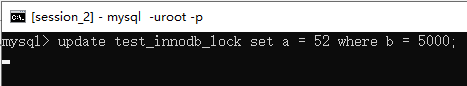
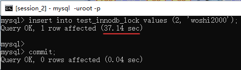

mysql高级.锁机制
==


## mysql锁定义
```text
锁是计算机协调多个进程或线程并发访问同一个资源的机制，防止对资源的争抢。
```

## 锁的分类
[LOCK TABLES、UNLOCK TABLES语法](https://dev.mysql.com/doc/refman/8.0/en/lock-tables.html)

* 从数据操作的类型分类
    * 读锁(共享锁)
        ```text
        针对同一份数据，当前线程加了读锁，其他线程可以读取此数据，但不能写此数据
        ```
    * 写锁(排它锁)
        ```text
        针对同一份数据，当前线程加了写锁，其他线程不能读、写此数据
        ```


* 从对数据操作的颗粒度分类
    * 表锁
    * 页锁
    * 行锁

## MyISAM表锁
```text
MyISAM引擎表的锁：表共享读锁(Table Read Lock)、表独占写锁(Table Write Lock)
MyISAM在执行查询语句(SELECT)前，会自动给涉及的所有表加读锁，
在执行更新操作(UPDATE、DELETE、INSERT等)前，会自动给涉及的表加写锁

特点：偏向MyISAM存储引擎，开销小，加锁快，无死锁，锁定粒度大，
发生锁冲突的概率最高，并发最低
```

### 手动加表锁语法
* 锁定指定的表
    ```text
    LOCK TABLES
        tbl_name [[AS] alias] lock_type
        [, tbl_name [[AS] alias] lock_type] ...

    －－－－－
    lock_type: {
        READ [LOCAL]
      | [LOW_PRIORITY] WRITE
    }

    常用：lock tables 表名1 read/write, 表名2  read/write;
    ```
* 锁定所有库的所有表为只读，加全局读锁（适用于事务引擎、MyISAM引擎表）
    ```
    FLUSH TABLES WITH READ LOCK;
    ```

### 查看表上加过的锁
```mysql
SHOW OPEN TABLES [WHERE `database` = '库名'[ AND `table` = '表名']];
```

### FLUSH语句
https://dev.mysql.com/doc/refman/8.0/en/flush.html#flush-tables-with-read-lock
```
FLUSH [NO_WRITE_TO_BINLOG | LOCAL] {
    flush_option [, flush_option] ...
  | tables_option
}

flush_option: {
    BINARY LOGS
  | ENGINE LOGS
  | ERROR LOGS
  | GENERAL LOGS
  | HOSTS
  | LOGS
  | PRIVILEGES
  | OPTIMIZER_COSTS
  | RELAY LOGS [FOR CHANNEL channel]
  | SLOW LOGS
  | STATUS
  | USER_RESOURCES
}

tables_option: {
    TABLES
  | TABLES tbl_name [, tbl_name] ...
  | TABLES WITH READ LOCK
  | TABLES tbl_name [, tbl_name] ... WITH READ LOCK
  | TABLES tbl_name [, tbl_name] ... FOR EXPORT
}
``` 

### 释放表锁(所有表)
```mysql
unlock tables;
```

### 表读锁案例
* 表结构
    ```mysql
    -- 表
    CREATE TABLE mylock (
        id INT PRIMARY KEY AUTO_INCREMENT,
        `name` VARCHAR(20)
    ) ENGINE MYISAM;
    
    INSERT INTO mylock (`name`) VALUES
    ('a'),
    ('b'),
    ('c'),
    ('d'),
    ('e'),
    ('f');
    
    SHOW CREATE TABLE mylock;
    
    SELECT * FROM mylock;
    ```

* 测试
```text
两个连接会话：session_1、session_2
两个会话都把事务自动提交关闭，
set autocommit = 0;

```

case |session_1 |session_2 |备注
:--- |:--- |:--- |:--- 
session_1对mylock表加读锁，<br>此为表级锁 |lock table mylock read; <br>![][tread_0_s1_1] | | 
对当前定锁的表查询<br>当前锁定表:mylock |结论：<br>可查询 <br><br>![][tread_1_s1_1] |结论：<br>可查询 <br><br>![][tread_1_s2_1] | 
对其他未锁定表 |结论：<br>不能增、删、改、查 <br><br>![][tread_2_s1_1]|结论：<br>可查、增、改、删<br><br>![][tread_2_s2_1] <br><br>![][tread_2_s2_2] | 
对当前定锁的表更新 |结论：<br>不能增、改、删 <br><br>![][tread_3_s1_1] |结论：<br>增、改、删等更新操作将阻塞，直到该表锁被释放才能完成执行 <br><br>![][tread_3_s2_1] | 
释放当前锁定表的锁 |unlock tables; <br>![][tread_4_s1_1] |结论：<br>等到表锁释放后，才能被执行<br><br>![][tread_4_s2_1] |释放锁的操作<br>在任意的会话中执行都可以 

* MyISAM表读锁总结
    ```text
    当一个会话对表加了表级读锁，
    ## 当前会话
    对该表，只能进行查询操作，不能有更新操作(增删改)
    对其他表，不能进行任何操作(增删改查)
    
    ## 其他会话
    对该表，只能进行查询操作，更新操作(增删改等)会被阻塞，直到表锁被释放后才能被执行
    对其他表，可进行任何操作(增删改查)
    ```

### 表写锁案例
* 测试
```text
两个连接会话：session_1、session_2
两个会话都把事务自动提交关闭，
set autocommit = 0;
```

case |session_1 |session_2 |备注
:--- |:--- |:--- |:--- 
session_1对mylock表加写锁，<br>此为表级锁 |lock table mylock write; <br>![][twirte_s1_0] | | 
对其他表 |结论：<br>不能增、删、改、查等任何操作 <br><br>![][twirte_s1_1] |结论：<br>可增、删、改、查等任何操作 <br><br>![][twirte_s2_1] | 
对该表 |结论：<br>可增、删、改、查等任何操作 <br><br>![][twirte_s1_2] |结论：<br>任何操作都被会阻塞，直到表锁释放后，才能被执行 <br><br>![][twirte_s2_2] | 
释放当前锁定表的锁 |unlock tables;  <br>![][twirte_s1_3] |结论：等到表锁释放后，才能被执行<br>![][twirte_s2_3] | 


* MyISAM表写锁总结
    ```text
    当一个会话对表加了表级写锁，
    ## 当前会话
    对该表，可进行任何操作(增删改查)
    对其他表，不能进行任何操作(增删改查)
    
    ## 其他会话
    对该表，任何操作(增删改查)都会被阻塞，直到表锁被释放后才能被执行
    对其他表，可进行任何操作(增删改查)
    ```

```text
读锁会阻塞其他会话的写，当前会话也不能写，都允许读；
写锁会阻塞其他会话的读写，允许当前会话所有操作
```

### 表锁分析
* 查看哪些表被锁了
    ```mysql
    show open tables;
    ```

* 分析表锁定情况
    ```mysql
    SHOW STATUS LIKE 'table%';
    ```
      
    ```text
    Table_locks_immediate: 产生表级锁的次数，表示立即获取锁的查询次数。每次立即获取锁，值加1
    Table_locks_waited: 出现表级锁争用而发生等待的次数，不能立即获取锁的次数，每等待一次值加1
    
    mysql服务重启后，以上各项数据全部重置为0
    ```
* 另外
    ```text
    MyISAM的是写锁优先的，这也是MyISAM不适合做写为主的业务。
    写锁后，其他线程不能做任务操作，大量的写操作会使查询很难得到锁，从而造成永远阻塞
    ```

## InnoDB行锁
```text
InnoDB引擎的表支持行锁，同时也存在表锁。

与Oracle不同，mysql的行锁是通过索引加载的，
要是对应的SQL语句没有走索引，则会全表扫描，
这时行锁则无法实现，取而代之的是表锁！

```

### innodb表的表锁、行锁
```text
表锁：不会出现死锁，发生锁冲突几率高，并发低
行锁：会出现死锁，发生锁冲突几率低，并发高

锁冲突：例如说事务A将某几行上锁后，事务B又对其上锁，锁不能共存否则会出现锁冲突。
    共享锁(读锁)可以共存，共享锁和排它锁(写锁)不能共存，排它锁和排他锁也不可以
    
死锁：例如说两个事务，事务A锁住了1~5行，同时事务B锁住了6~10行，
此时事务A请求锁住6~10行，就会阻塞直到事务B施放6~10行的锁，
而随后事务B又请求锁住1~5行，事务B也阻塞直到事务A释放1~5行的锁。
死锁发生时，会产生Deadlock错误
```

* 表结构
    ```mysql
    CREATE TABLE test_innodb_lock (
        a INT,
        b VARCHAR(16)
    ) ENGINE = INNODB;
    
    TRUNCATE TABLE test_innodb_lock;
    INSERT INTO test_innodb_lock VALUES
    (1, 'b2'),
    (3, '3'),
    (4, '4000'),
    (5, '5000'),
    (6, '6000'),
    (7, '7000'),
    (8, '8000'),
    (9, '9000'),
    (1, 'b1');
    
    SELECT * FROM test_innodb_lock;
    
    -- 创建索引
    CREATE INDEX idx_test_innodb_lock__a ON test_innodb_lock (a);
    
    CREATE INDEX idx_test_innodb_lock__b ON test_innodb_lock (b);
    ```

### 准备工作
```text
两个连接会话：session_1、session_2
两个会话都把事务自动提交关闭，
set autocommit = 0;
```
  

  

###  行锁对于操作同一行将会阻塞
1. session_1
    ```mysql
    update test_innodb_lock set b = '4001' where a = 4;  -- 这时锁定了a = 4 这行
    
    select * from test_innodb_lock;
    ```
      

2. session_2
    ```mysql
    select * from test_innodb_lock where a = 4;  -- 查询是正常的
    ```
      
3. session_2
    ```mysql
    
    
    update set test_innodb_lock set b = '4002' where a = 4;
    -- 这时候出现阻塞，一直等待行锁的释放，时间过久了会超时
    -- 第二张图因等待行锁的释放，用时48.41秒
    ``` 
      
    
4. session_1
    ```mysql
    commit;
    -- 提交事务
    ```
      
5. session_2
    ```text
    session_1事务一提交(行锁释放了)，阻塞的语句马上得到了执行
    ```
      

6. session_1,session_2
      
    
      

### 行锁对操作不同的行互不影响
```text
筛选查找用不索引或没有建的索引的情况
```
1. session_1
    ```mysql
    update test_innodb_lock set b = '4004' where a = 4;
    -- 然后下面的先不执行，在session_2窗口执行更新a = 9，
    -- 在使用到了索引的情况下，更新不同的行，互不影响
    -- 观察了session_2的结果后再执行commit;
    ```
      

2. session_2
    ```mysql
    update test_innodb_lock set b = '9003' where a = 9;
    ```
     

### 无索引行锁升级为表锁
1. session_1
    ```mysql
    update test_innodb_lock set a = 51 where b = 5000;
    /*
    注意：b字段为varchar字符型，这里的筛选条件为 B = 5000，值是一个数值型，
    mysql会将数值的转成字符，但索引会失效，这时出现全表扫描，这是一个写操作，于是就使用了表锁
    可以用下面的语句来分析筛选条件是否用到索引
    EXPLAIN SELECT * FROM test_innodb_lock WHERE b = 5000;
    */
    ```
      

2. session_2
    ```mysql
    select * from test_innodb_lock where b = 5000;
    select * from test_innodb_lock where a = 9;
    -- 不影响查询
    ```
     

3. session_2
    ```mysql
    update test_innodb_lock set b = '9004' where a = 9;
    -- 出现阻塞，等待表锁的释放
    ```
     
4. session_1
    ```mysql
    commit;
    -- 提交事务
    ```
      
5. session_2
    ```text
    session_1事务一提交(表锁释放了)，阻塞的语句马上得到了执行
    ```
     


### 表中存在了一个行锁，其他会话再上表锁将被阻塞
1. session_1
    ```mysql
    update test_innodb_lock set b = '9005' where a = 9;
    ```
      
2. session_2
    ```mysql
    update test_innodb_lock set a = 52 where b = 5000;
    -- 这里将要使用表锁，因为没使用到索引
    -- 上面的操作使test_innodb_lock存在一个行锁了，当前操作又需要给这表上表锁，于是阻塞，等待行锁的释放
    ```
      
3. session_1
    ```mysql
    commit;
    -- 提交事务
    ```
      
4. session_2
    ```text
    session_1事务一提交(表锁释放了)，阻塞的语句马上得到了执行
    ```
      

### 间隙锁危害
```text
间隙锁定义：

当我们用范围条件而不是相等条件检索数据,并请求共享或排他锁时, 
Innodb会给符合条件的已有数据记录的索引项加锁;
对于键值在条件范围内但并不存在的记录,叫做“间隙(GAP)”，Innodb也会对这个“间隙”加锁,
这种锁机制姚是所谓的间隙锁(Nextκey锁
```
1. session_1
    ```mysql
    update test_innodb_lock set b = 'ok' where a >= 1 and a <=6;
    -- 已经包含了 a = 2的情况
    ```
      
2. session_2
    ```mysql
    insert into test_innodb_lock values (2, 'woshi2000');
    ```
      
3. session_1
    ```mysql
    commit;
    -- 提交事务
    ```
      
4. session_2
    ```text
    session_1事务一提交(表锁释放了)，阻塞的语句马上得到了执行
    ```
     
    

### innodb表手动锁定行
手动给行上了update排它锁后，其他会话的可查询，但写操作会被阻塞
* 语法
    ```mysql
    set autocommit = 0;
    
    begin;  -- 或start transaction; 表示开始一个新事务
    select 索引列 from 表名 where 索引列 = 值 for update;
    ... ... -- 需要进行的操作
    commit;
    
    SET autocommit = 1;
    
    /*
    注意：FOR关键字之前的查询能用上索引，才会写锁这行，
    如果未用上索引，而是ALL全表扫描，则会锁定整个表
    
    锁定前可以分析索引使用情况: explain SELECT 索引列 FROM 表名 WHERE 索引列 = 值; 
    再执行行锁定操作
    */
    ```

### 行锁分析
```mysql
SHOW STATUS LIKE 'innodb_row_lock%';
```
```text
Innodb_row_lock_current_waits：当前正在等待的锁的数量
Innodb_row_lock_time：从mysql服务启动到现在，锁定的总时间长度。时间单位：毫秒ms，下同
Innodb_row_lock_time_avg：每次等待的平均时间
Innodb_row_lock_time_max：从mysql服务启动到现在，等待最长的一次所花的时间
Innodb_row_lock_waits：从mysql服务启动到现在，总共等待的次数

mysql服务重启后，以上各项数据全部重置为0
```
  

### 补充
* 表结构
    ```mysql
    CREATE TABLE test_innodb_lock2 (
        a INT,
        b VARCHAR(16),
        note VARCHAR(64)
    ) ENGINE = INNODB;
    
    TRUNCATE TABLE test_innodb_lock2;
    INSERT INTO test_innodb_lock2 VALUES
    (1, 'b1', 'n1'),
    (3, 'b3', 'n3'),
    (4, 'b4', 'n4'),
    (5, 'b5', 'n5'),
    (6, 'b6', 'n6'),
    (7, 'b7', 'n7'),
    (8, 'b8', 'n8');
    
    
    -- 创建索引
    CREATE INDEX idx_test_innodb_lock2__a ON test_innodb_lock2 (a);
    CREATE INDEX idx_test_innodb_lock2__b ON test_innodb_lock2 (b);
    
    SHOW INDEX FROM test_innodb_lock2;
    
    SELECT * FROM test_innodb_lock2;
    ```

#### 充实示例1
1. session_1
  

2. session_2
  


#### 充实示例2
1. session_1
    ```mysql
    update test_innodb_lock2 set b = 'b55' where note = 'n5';
    -- where筛选条件没有能够用到索引，这时候使用表锁
    select * from test_innodb_lock2;
    ```
      
2. session_2
    ```mysql
    update test_innodb_lock2 set b = 'b66' where note = 'n6';
    -- 出现了阻塞
    ```
      

3. session_1
    ```mysql
    commit;
    -- 提交事务
    ```
     

4. session_2
    ```text
    session_1事务一提交(表锁释放了)，阻塞的语句马上得到了执行
    ```
    
    

### InnoDB表优化建议
* 合理设计索引，尽量缩小锁的范围
* 尽可能较少检索条件，避免间隙锁
* 尽量控制事务大小，减少锁定资源量和时间长度
* 尽可能低级别事务隔离(基本都采用默认的repeatable read)


## BDB页锁

```text
BDB引擎，一次锁定相邻的一组记录
开销和加锁时间界于表锁和行锁之间：会出现死锁；锁定粒度界于表锁和行锁之间，并发度一般。
```

***
<!--
定义URL变量
-->
[tread_0_s1_1]:../images/表读锁_0_s1_1.png
[tread_1_s1_1]:../images/表读锁_1_s1_1.png
[tread_1_s2_1]:../images/表读锁_1_s2_1.png
[tread_2_s1_1]:../images/表读锁_2_s1_1.png
[tread_2_s2_1]:../images/表读锁_2_s2_1.png
[tread_2_s2_2]:../images/表读锁_2_s2_2.png
[tread_3_s1_1]:../images/表读锁_3_s1_1.png
[tread_3_s2_1]:../images/表读锁_3_s2_1.png
[tread_4_s1_1]:../images/表读锁_4_s1_1.png
[tread_4_s2_1]:../images/表读锁_4_s2_1.png

[twirte_s1_0]:../images/表写锁_s1_0.png
[twirte_s1_1]:../images/表写锁_s1_1.png
[twirte_s1_2]:../images/表写锁_s1_2.png
[twirte_s1_3]:../images/表写锁_s1_3.png
[twirte_s2_1]:../images/表写锁_s2_1.png
[twirte_s2_2]:../images/表写锁_s2_2.png
[twirte_s2_3]:../images/表写锁_s2_3.png